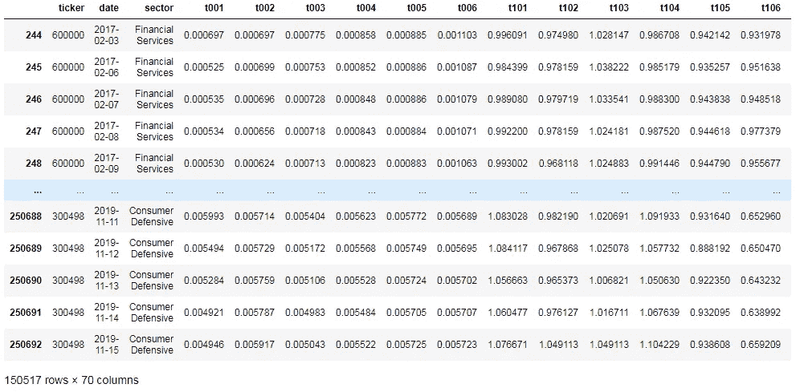
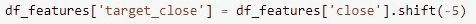
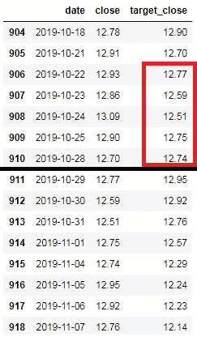
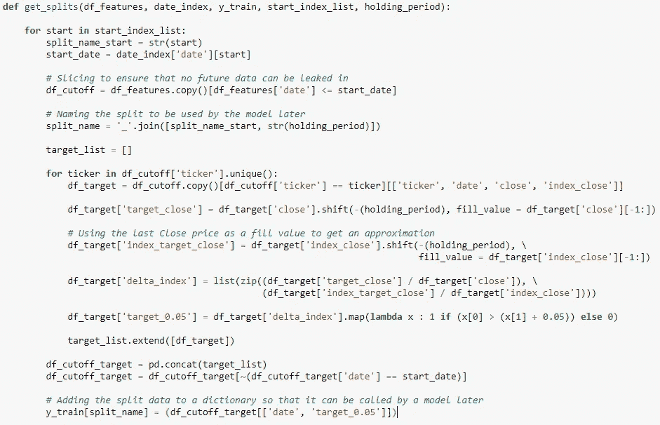
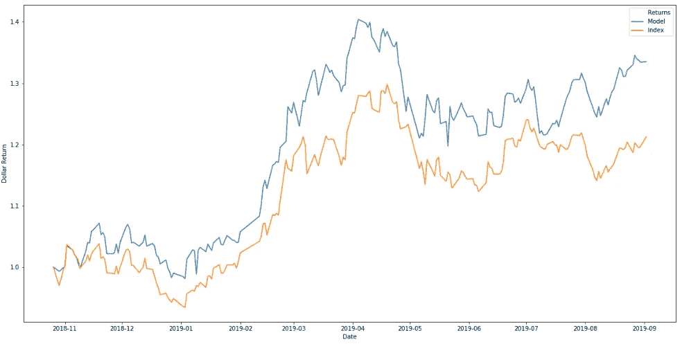

# 使用机器学习进行股票投资组合选择的冒险经历

> 原文：<https://towardsdatascience.com/mis-adventures-in-utilising-machine-learning-for-stock-predictions-a5b16199b857?source=collection_archive---------20----------------------->

## 多期远期预测中防止数据泄漏的痛苦

# 前言

作为一名初出茅庐的数据科学家，我最近建立了一个机器学习模型，以预测和选择沪深 300 指数(上海和深圳证券交易所市值排名前 300 的股票)中表现出色的股票组合。

结果很有希望，但还不够好。我的模型成功地选择了一个股票投资组合，该投资组合的表现一直优于基准指数(在 200 天的时间内累计超额收益至少为 5%)，但是如果将经纪费用和滑点计算在内的话…好吧，我只能说我现在不会把钱押在我的模型的预测上！

那么我为什么要写这篇文章呢？嗯，因为我徒劳地试图搜索关于我在构建这个模型的过程中所面临的一些挑战的文章/建议，因此有了(错误的)冒险，我真诚地希望在某个地方，有一天，处于相同情况的人可以从这篇文章中得到一些用处。或者我发现我真的不擅长网上搜索。无论哪种方式，学习都会发生！

# 问题陈述

使用机器学习模型，结合基本面和技术指标，预测和选择由沪深 300 指数股票组成的投资组合，其表现将优于基准指数。

# **数据**

数据的主要来源是对[晨星](https://www.morningstar.com/)的试用订阅。

使用的技术特征是:

1.  两个周期之间收盘价的百分比变化
2.  两个周期之间收盘价的指数加权移动平均值的百分比变化
3.  每日收盘价的差异
4.  平均营业额
5.  两个周期之间每日交易量的指数加权移动平均值的百分比变化
6.  每日交易量的差异

> 这些都是为不同时期或不同时期的排列计算的。

使用的基本特征是:

1.  股本回报率
2.  利润率
3.  利润变化
4.  收入变化
5.  价格收益比
6.  市净率
7.  价格销售比

> 这些数据都来自季度财务报告，并根据其行业名称进行了标准化(使用晨星的行业名称)
> 
> 为防止数据泄露，季度财务报表数据将仅在该季度结束后一个月使用，因为这将是上市公司发布季度财务报表的最后日期。

此外，使用的主要经济指标有:

1.  中国财新制造业 PMI
2.  中国财新服务业 PMI
3.  中国国家统计局制造业采购经理人指数
4.  中国国家统计局非制造业采购经理人指数
5.  中国消费价格指数
6.  中国 GDP 同比

> 为了防止数据泄露，经济指标数字只在公布后的下一个交易日使用。

Quick peek at the feature space

由于只有 10 个季度的财务报表，我可以用来建模的数据时间范围只有 2017 年 10 月至 2019 年 11 月。

此外，由于一些公司的财务报表中缺少一些字段，我原本打算投资 300 只股票，但现在只投资了 225 只。

尽管如此，这仍然是一个不错的数据块。没问题！然而…

# (错误的)冒险开始了…

## 挑战:防止多期远期预测中的数据泄漏

我设法找到的关于股票预测的大部分(如果不是全部的话)倾向于一个时期的前瞻性预测。那些展望未来多个时期的通常属于自回归类型。

这也不是我对这个模型的想法。

我真的不希望为这个模型创建一个高/中频算法策略，因为我通常采取基本的交易方法。该模型的主要目的是识别股票的实际交易价格和假定内在价值之间的重大差异，这些修正将需要多个周期(至少几天)才能实现，如果它们真的发生的话。

因此，假设持有期为 5 期，将目标变量建立在未来 5 期的收盘价上是有意义的，对吗…？

All done!

唉，事实并非如此。

例如，如果培训拆分于 2019 年 10 月 28 日结束，则 2019 年 10 月 22 日至 2019 年 10 月 28 日的 5 期提前收盘价格实际上仍然未知。

The target Close prices boxed in red cannot be used!

虽然我使用 240 个周期进行训练，并且我的 X 变量实际上不包括日期，但这个看似很小的泄漏实际上导致了我的预测结果的巨大(并且完全没有根据的)超越。

为什么不直接去掉 X 变量的最后 5 个周期呢？因为这导致了我的预测结果表现严重不佳(这一次，完全有理由)。

## 解决方案:在一个训练周期的每个可能的截止日期对数据进行切片，并在移位时使用该周期的最后收盘价作为填充值。

对每个训练期的数据进行切片，可以确保“未来”的收盘价不会被包含在内。然后，我们可以继续向前移动收盘价，并使用该期间的最后收盘价作为填充值。

If it’s stupid but it works… it might still be stupid.

在这里，如果股票在 5 天持有期结束时的表现超出基准指数 5%以上，则观察值被标记为正 1 级。

然后，将这些目标变量的切片集添加到字典中，该字典可以由模型针对每个特定的训练期调用。

我不认为这是一个优雅的解决方案，因为在使用这些填充值时，目标变量可能会被贴错标签。但是将这一考虑与训练期最后几天获得的信息进行权衡，我认为这是值得的，因为它确实提高了我的模型的结果。

当然，如果有人能想到更优雅的解决方案，请分享！

# 结论

这似乎是一个很好的休息的地方，现在结束这篇文章，并衡量这是否对任何人都有帮助或感兴趣。如果是这样的话，我很乐意享受我在这个项目过程中遇到的后续不幸，例如尝试使用 GridSearch 来调整分类模型的超参数，其中模型的(离散)预测的准确性并不能真正反映股票投资组合的实际(连续)价格。甚至是一些有效的方法。

因为最终每一个股票选择模型都是根据它的表现来评估的，所以这是我的模型。该模型的预测(蓝线)在 200 个交易日内产生了高于基准指数(橙线)10%的累积超额收益，但这是假设没有经纪成本和交易滑点…所以，是的，还有很长的路要走。

The model’s portfolio generates 10+% of accumulated excess returns over the benchmark index for a 200 trading day period

再说一次，我只是一个初出茅庐的数据科学家，我总是渴望听到并向在座的各位学习。这仍然是一项正在进行的工作，我绝对欢迎社区的任何意见或建议！

感谢您的阅读，欢迎随时通过 [Linkedin](http://www.linkedin.com/in/raphael-lee-cher-hern) 联系我！