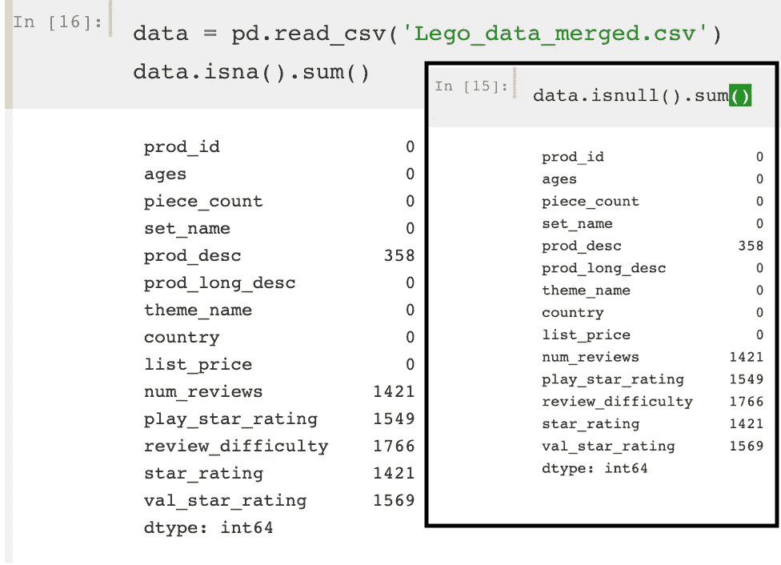
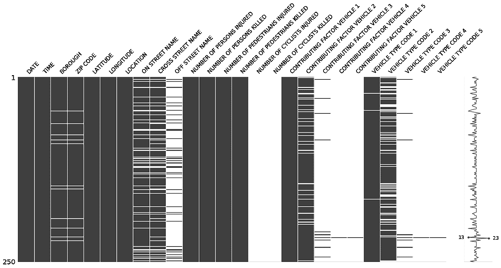
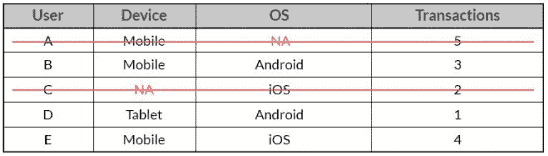
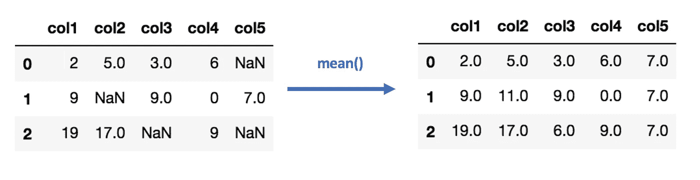
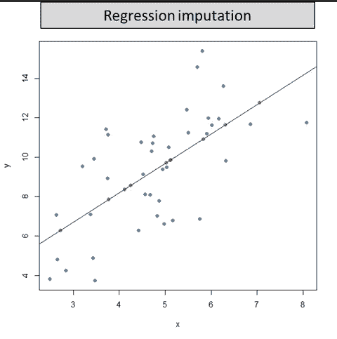
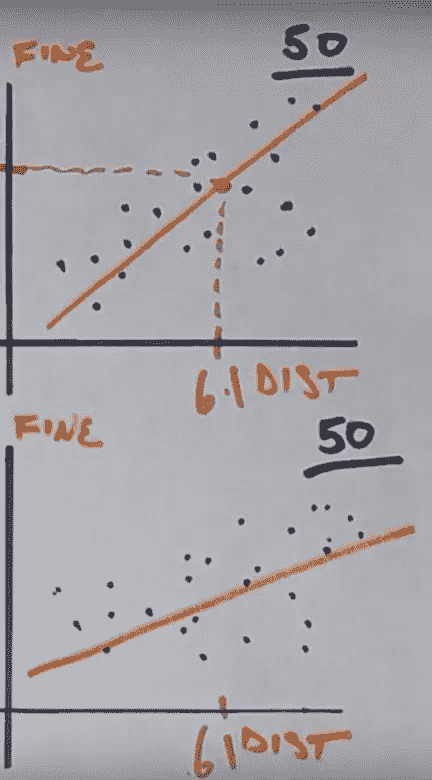

# 缺失数据和插补

> 原文：<https://towardsdatascience.com/missing-data-and-imputation-89e9889268c8?source=collection_archive---------12----------------------->

缺失的数据会扭曲研究结果，增加计算费用，并使研究人员感到沮丧。近年来，处理缺失数据在生物和生命科学等领域变得越来越普遍，因为我们看到了管理不当的空值  的非常直接的后果。对此，有更多样的方法来处理出现的缺失数据。

这对于提高研究的有效性来说是非常好的，但是对于那些积极主动的数据科学家来说却有点棘手。这篇博客文章将向您介绍一些处理缺失数据的有用概念，并让您开始使用一些现在就可以尝试的切实可行的方法来清理 Python 中的数据。

Photo by [Carlos Muza](https://unsplash.com/@kmuza?utm_source=medium&utm_medium=referral) on [Unsplash](https://unsplash.com?utm_source=medium&utm_medium=referral)

# 为什么要做任何事？

您可能会问自己—为什么我需要处理丢失的数据？为什么不让睡觉的狗躺着？首先，缺失值(称为 NaN、Null 或 NA)会带来计算上的挑战，因为。想一想——如果你要对一列数值求和，发现少了一个，那么 5 + NA 是多少？如果我们不知道等式中的第二项，我们的结果本身就是 NA。所以我们真的不能从丢失的值中得到任何有意义的东西，而且它混淆了大多数期望处理非空情况的程序。

除此之外，丢失数据还会导致三个主要问题:

1.  偏见
2.  更费力的处理
3.  结果效率降低

这些都是丢失数据的非常严重的副作用(如果不仅仅是恼人的话),所以我们想找些事情来处理我们的空单元格。这就是“归罪”的由来。

# **插补**

《韦氏词典》分享了“估算”一词的“金融”定义，即“**通过对其贡献的产品或过程的价值进行推断，为某物分配一个价值**这绝对是我们在这里要思考的——我们如何才能推断出与缺失的真实值最接近的值？

作为一个题外话——思考和考虑这个术语可能来源于它的神学背景是很有趣的。在这里，它的意思是“归因于正义、罪恶等的行为或过程”。对一个与另一个人有相似品质的人，"如"使徒们的著作告诉我们，如果我们接受基督，基督的义的诋毁是给我们的。"只是我们前进时的一些思考。

# 缺失数据机制

在研究插补时，您可能会发现数据缺失有不同的原因。这些原因是基于它们在*缺失数据机制*和*缺失和观察值*之间的关系而给出的术语。它们帮助我们找到合适的数据处理方法，因此对有一个基本的了解真的很有帮助。以下是 4 个最典型的 3 个，你可以在“[分析因素](https://www.theanalysisfactor.com/missing-data-mechanism/)”上了解更多。

1.  **完全随机失踪(MCAR)**

这可能是最容易想到的—在这种情况下，数据以完全一致的速度丢失。例如，一个缺少 5%来自青年调查的响应的数据集。这是因为在进行调查的那一天，所有学生中有 5%请了病假，所以在整个数据集中，这些值的缺失率是一致的。

**2。随机失踪(三月)**

尽管名字相似，但 MAR 值比 MCAR 值更复杂，也更容易找到。这些例子表明，如果我们知道另一个变量，丢失数据的比率就可以得到完美的解释。例如，想象上面的数据集缺少 10%的女生回答和 5%的男生回答。这是因为在学校传播的疾病影响年轻女性的可能性是年轻男性的两倍。这变得更加复杂，也更加现实，因为多个变量会影响数据集中缺失值的比率。

**3。非随机缺失(MNAR)**

在这种情况下，某个值的缺失取决于真实值本身。这是一个非常循环的例子，但是我喜欢这个视频中给出的例子，在一项图书馆调查中丢失价值的比率，该调查收集了他们的名字和未归还图书馆书籍的数量。随着囤积书籍数量的增加，这个调查问题中缺失值的百分比也在增加。这个方法的问题是，因为丢失的值依赖于值本身，我们很难推导出它丢失的比率。

# **Python 中的实用探索与可视化**

在用 Python 处理数据时，Pandas 是一个强大的数据管理库，用于组织和操作数据集。它的一些术语来源于 R，并且是建立在 numpy 包之上的。因此，它有一些令人困惑的方面，值得在丢失数据管理方面指出。

[内置两个功能，熊猫。DataFrame.isna()](https://pandas.pydata.org/pandas-docs/stable/generated/pandas.DataFrame.isna.html) 和[熊猫。DataFrame.isnull()](https://pandas.pydata.org/pandas-docs/stable/generated/pandas.DataFrame.isnull.html#pandas.DataFrame.isnull) 实际上做**完全**同样的事情！甚至他们的文件都是一样的。你甚至可以在熊猫的[代号](https://github.com/pandas-dev/pandas/blob/537b65cb0fd2aa318e089c5e38f09e81d1a3fe35/pandas/core/dtypes/missing.py#L109)中确认这一点。

这是因为熊猫的数据框架是基于 R 的数据框架。在 R 中，na 和 null 是两回事。阅读[这篇文章](https://www.r-bloggers.com/r-na-vs-null/)了解更多信息。然而，在 python 中，pandas 构建在 numpy 之上，numpy 既没有**na 值，也没有空值**。相反，numpy 有 **NaN** 值(代表“不是一个数字”)。因此，pandas 也使用 NaN 值  。

此外，名为`missingno`的 Python 包是一个非常灵活的、用 matplotlib 构建的缺失数据可视化工具，它适用于任何 pandas 数据框架。只需`pip install missingno`开始，查看[这个 Github repo](https://github.com/ResidentMario/missingno) 了解更多。

A “missingno” visualization of cyclist dataset — with Sparkline on the side

充分可视化丢失的数据是理解您正在处理的丢失数据机制以及丢失数据的规模和要处理的热点的第一步。

# 单一插补方法:

从最简单的开始，向更复杂的方向发展，下面描述了处理缺失值的一些最常见的方法及其相关的优缺点。

(请注意，数据集中的一项或一行被称为“观察值”)

1.  **行(列表式)删除**:去掉整个观察。

*   简单，但是会引入很多偏差。

An example of listwise deletion

2.**均值/中值/众数插补:**对于所有非缺失的观测值，计算该变量观测值的均值、中值或众数，并用其填充缺失值。数据的分布是决定使用哪个描述符的必要信息。

*   如果缺失数据少于 3%,可以使用，否则会引入太多偏差，并人为降低数据的可变性

3.**热卡或冷卡插补**

**“热卡插补”**:找出所有其他变量相似的样本对象，然后*随机*选择其中一个值填写。

*   很好，因为受到预先存在的值的约束，但是随机性引入了隐藏的可变性，并且计算量很大

**“冷板插补”**:系统地从在其他变量上具有相似值的个体中选择值(例如，每个集合的第三个项目)。该选项消除了热卡插补的随机性。

*   受到预先存在的值的积极约束，但是随机性引入了隐藏的可变性，并且在计算上是昂贵的

Example of basic hot deck imputation using mean values

4.**回归插补**

**“回归插补”**:填写缺失变量在其他变量上回归得到的预测值；你不是只取平均值，而是根据其他变量取*预测值*。

*   保留插补模型中涉及的变量之间的关系，但不保留预测值的可变性。

**“随机回归插补”**:回归的预测值，*加上*一个随机残差值。

*   这具有回归插补的所有优点，但增加了随机成分的优点。

## 单一估算的挑战

这些都是处理缺失值的好方法，但是它们确实包含了标准误差中未说明的变化。下面的“[分析因子](https://www.theanalysisfactor.com/missing-data-two-recommended-solutions/)”再次完美地解释了这种权衡:

> 由于估算的观测值本身是估计值，它们的值有相应的随机误差。但是当你把估计值作为数据点输入时，你的软件并不知道。因此，它忽略了额外的误差源，导致标准误差和 p 值都太小。”

此外，单一插补中的值可能会因当前数据集中的特定值而有偏差，并不代表全部人口的总值。那么我们如何减少这两个挑战的影响呢？

# 多重插补

大约 20 年前，多重填补是统计学上的一个巨大突破，因为它解决了许多缺失数据的问题(尽管，不幸的是，不是全部)。如果做得好，它导致无偏的参数估计和准确的标准误差。

单一插补为缺失观察变量提供了一个*单一*值，而多重插补为缺失观察变量提供了*多个*值，然后对它们进行平均得到最终值。

[Examples of “data signatures” from different samples](https://www.youtube.com/watch?v=LMsULWGtP2c)

为了获得这些平均值，多重插补方法将对数据集的 5-10 个独特样本进行分析，并对每个**进行相同的预测分析。该点的预测值将作为该运行的值；这些样本的数据签名每次都会改变，这导致预测略有不同。这样做的次数越多，结果的偏差就越小。

一旦你取了这些值的平均值，分析它们的分布是很重要的。如果他们是聚类，他们有一个低标准差。如果不是，可变性很高，可能是值预测不太可靠的迹象。

虽然这种方法更加无偏，但是它也更加复杂，并且需要更多的计算时间和能量。

# 结论

最后，我们看了看:

1.  处理数据集中缺失值的重要性
2.  “插补”的意义(和根源)
3.  数据可能丢失的不同原因(丢失数据机制)
4.  在 Python 中探索和可视化缺失数据的方法
5.  单一插补方法
6.  多重插补的一种解释

但这只是一个开始！关于这个话题的更多信息，请查看本帖的链接资源。

**热卡和随机回归都适用于多重插补。这是因为估计值的随机成分使每个估计值略有不同，重新引入了软件可以在建模标准误差中包含的变化。