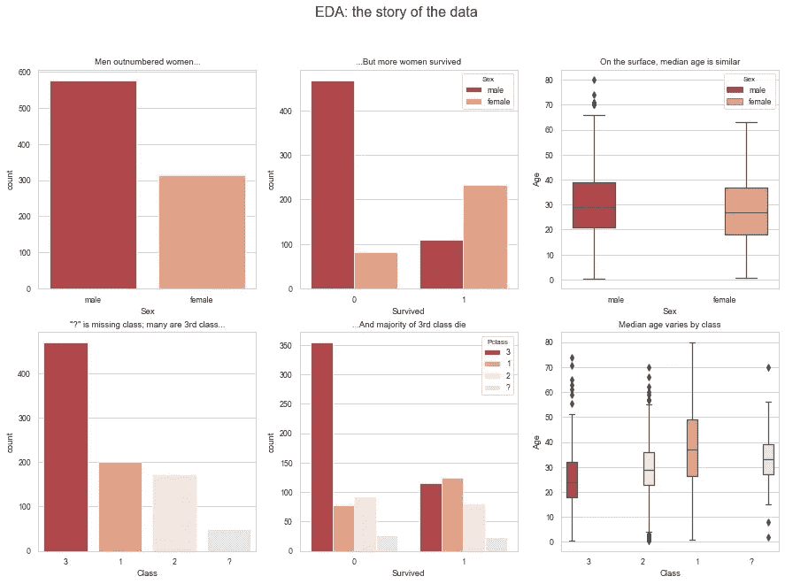
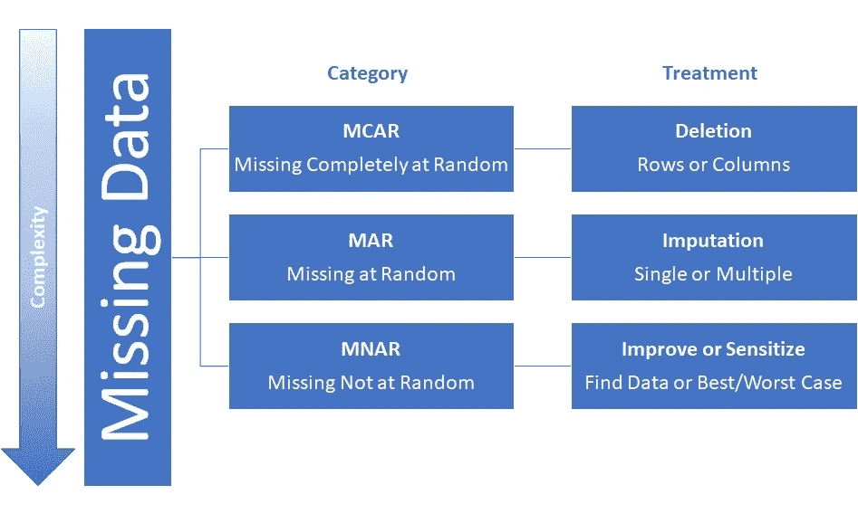
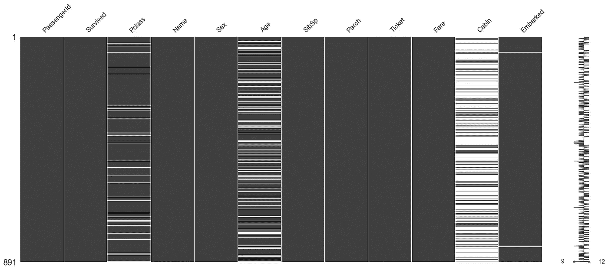
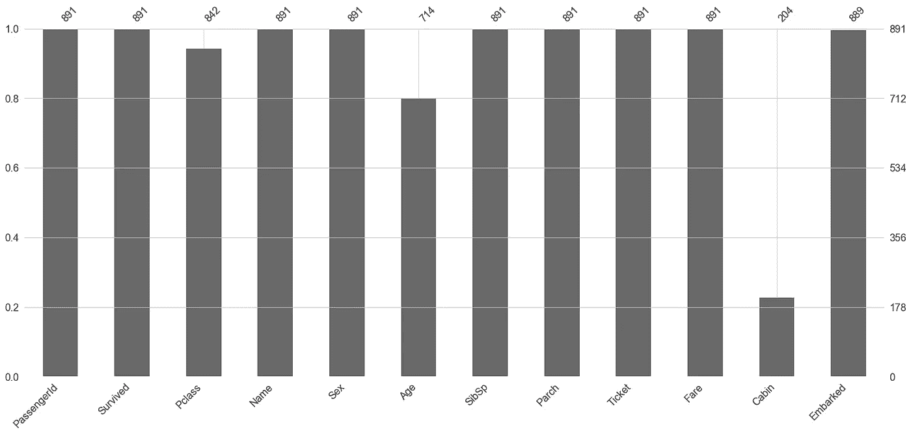
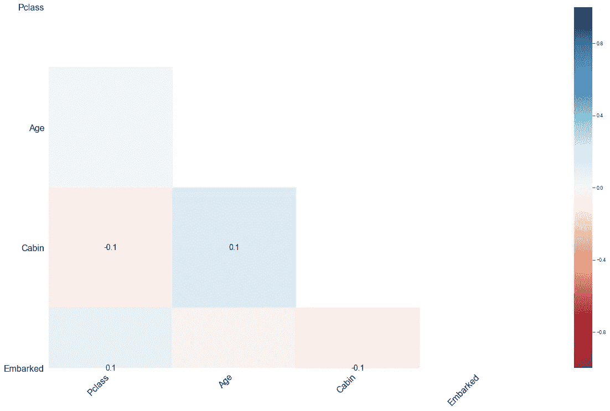
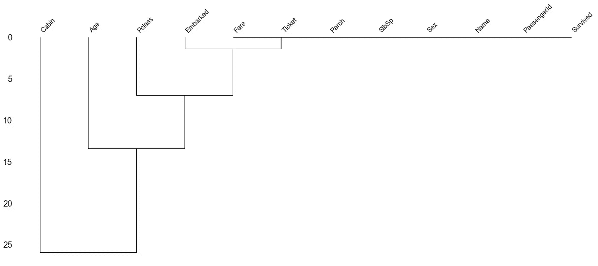

# 缺失数据？

> 原文：<https://towardsdatascience.com/missing-data-cfd9dbfd11b7?source=collection_archive---------14----------------------->

## 减轻痛苦的框架和软件包

Photo by [Markus Spiske](https://unsplash.com/@markusspiske?utm_source=medium&utm_medium=referral) on [Unsplash](https://unsplash.com?utm_source=medium&utm_medium=referral)

在我成为一名数据科学家的旅程开始三个星期后，我正式接受了洗礼……也就是火的洗礼！我选择参加 [Flatiron 的](https://flatironschool.com/career-courses/data-science-bootcamp/dc)数据科学 15 周训练营，以从金融领域转型。到目前为止，这个项目已经超出了预期(我的期望很高)。虽然课程很严格，节奏很快，但它的结构很好，教师致力于帮助学生学习，我的团队很棒——每个人都很友好，乐于助人，聪明，毫无疑问会继续完成伟大的事情。这一系列的博客文章是献给他们的…为未来的数据科学家干杯！

**我们在课堂上涵盖了大量的信息，所以当我在课外发现一些有助于提高我的观点或技能的东西时，我会用接下来的几篇帖子来分享它。**我也期待着阅读我同学的帖子！*更广泛地说，本系列面向对数据科学感兴趣的任何人。*

在学习数据科学时，首先认识到的一点是数据清理非常耗时(许多人认为这是工作中最不愉快的方面)。估计显示 60-80%的时间花在清理和组织数据上，只有很少一部分时间花在分析上(有趣的部分)。有了这个统计数据作为背景，我想我应该分享一些我发现的有用的技术和库，以使数据清理过程更容易。具体来说，我将重点讨论如何处理丢失的数据。我是一个视觉学习者，我喜欢框架，所以**这篇文章的目的是通过**提供一个识别和处理缺失数据的基本过程

1.  **介绍“缺失数据机制”——对缺失进行分类的标准词汇(对缺失数据的处理有影响)，以及**
2.  **演示 Python** [**的用处缺少**](https://github.com/ResidentMario/missingno) **库。**

一些背景信息…对于这个分析，我使用了 Titanic 数据集，因为它易于访问(你可以在这里下载它)并且它不需要领域知识来理解数据(例如，不像医疗保健数据)。我没有把它分成训练集和测试集，因为这里的目标只是覆盖(和发现)缺失数据的问题。最后，所有代码都是 Python。

# 步骤 1:做一些探索性的数据分析(EDA)

EDA 对于理解数据集的特征以及(特别是与当前主题相关的)发现任何可能隐藏的缺失值是至关重要的。你可以用无数种方式来分析泰坦尼克号的数据，但这里有一些我制作的图表，应该足以满足我们的目的。

Insights from EDA help inform treatment of missing data

第一行按性别划分人口。如你所见，男性数量超过女性，比例约为 65/35。然而，在生存问题上，雌性占优势。接近 75%的女性存活下来，相比之下只有不到 20%的男性存活。对于任何看过泰坦尼克号的人来说，这并不奇怪——妇女和儿童首先登上救生艇。总的来说，男女的平均年龄非常接近(女性 27 岁，男性 29 岁)。

第二行是事情变得更有趣的地方。我们看到船上大多数人都是 3 等(换句话说相对贫穷)。大多数伤亡属于第三类也就不足为奇了；穷人最后才登上救生艇，如果有的话。另一个观点是，不同阶层的中值年龄差异很大。最后，所有第二行图表上都有一个神秘的问号——它是一个伪装成真实值的空值！

*从 EDA 中，我们已经获得了一些关键的见解，这些见解将延续到我们对缺失数据的分析中。*我们必须转换“？”转换为空值/缺失值，并决定如何处理它，我们知道乘客等级和性别可能会成为我们可能需要做的任何插补的因素。

# 步骤 2:识别数据中缺失的类型

## 缺失数据机制

Source: From my research, this is the consensus framework for treating missing data

识别缺失类型有助于缩小处理缺失数据的方法范围。缺失数据机制是标准框架。其中，有三种类型的缺失:

1.  **完全随意失踪(MCAR)。**缺失值与观察到的或缺失的数据集中的其他值没有关联。“没有任何*系统性的事情发生，使得一些数据比其他数据更有可能丢失([分析因素](https://www.theanalysisfactor.com/missing-data-mechanism/))。”例如，如果一个班里的几个学生有一天因为他们自己的原因碰巧缺席，那就是 MCAR。*
2.  **随意失踪(MAR)。**“缺失值的倾向和*观察到的*数据之间有系统的关系，但是*没有*缺失数据。”此外，还有一个无法直接观察到的潜在原因。继续我们的课堂例子，现在是流感季节，一些学生生病了。
3.  **不随意遗漏(MNAR)。**缺失和它的值有关系，缺失或非缺失。某种价值的缺失，取决于真正的价值本身。扩展前面的例子，假设有一个全州范围的标准化考试日，许多学生缺席。也许对标准化考试没有安全感的学生最有可能缺席。缺失数据是否因为实际值而缺失是一个很难回答的问题。在我们的课堂例子中，问题是最有可能在考试中表现不佳的学生是否被遗漏了。

有一些测试可以诊断缺失数据的类型，如 MCAR 的[Little’s Test](https://wiki.q-researchsoftware.com/wiki/Missing_Data_-_Little%27s_MCAR_Test)，但是区分 MAR 和 MNAR 的唯一正确方法是测量一些缺失数据。然而，这在大多数情况下是不可能的，因此*对缺失类型的分类实际上是分析缺失数据中的模式，并依靠领域专业知识来指导决策。*幸运的是，有一个简化缺失模式评估的库。

**探索缺失数据的一个好方法是用 missingno 可视化它。**首先要看的图表是*无效矩阵*。在泰坦尼克号的数据集中，在我们替换了“？”之后值为空值时，矩阵显示有四列数据缺失(乘客等级、年龄、客舱分配和乘客登机的港口)。您可以对功能集中的任何列进行排序，以观察缺失之间的潜在关系。Pclass 和 Age 中有缺失值，但它们似乎与其他缺失值不相关。这是 MAR 的典型情况，因为可能有无法直接观察到的丢失值的原因。在这种情况下，悲剧发生后很难保存记录。

Nullity Matrix from Missingno Library

另一个伟大的可视化是条形图。它给出了每个特征的缺失程度的更多细节。我们看到，Pclass 丢失了大约 5 %, Age 丢失了 20 %,而 Cabin 几乎丢失了。

Bar Chart from Missingno Library

最后两个图表允许我们进一步探索相关性(即列之间缺失的相关性)。热图函数显示不同要素的缺失值之间没有强相关性。这很好；低相关性进一步表明数据是错误的

Heatmap from Missingno Library

树状图功能创建缺失的树形图。它通过将相似的缺失列分组来描述缺失的相关性。特征为零，完全预测对方的存在。一个变量可能总是为空，而另一个变量被填充，或者它们可能总是都被填充，或者都为空(没有遗漏文档)。查看泰坦尼克号数据集，船上的失踪倾向于更类似于 Pclass 而不是 Age 等等。

Dendrogram from Missingno Library

# 步骤 3:处理缺失的数据

既然我们已经确定了数据中的缺失，让我们讨论一些处理它的主要方法。

**删除。**优点:简单；CONS:假设 MCAR 并引入偏见，如果不是 MCAR 的话。下面重点介绍了三种类型，但您可以在⁴.的[统计解决方案](https://www.statisticssolutions.com/missing-data-listwise-vs-pairwise/)找到更全面的讨论

*   *列表式删除*(完整案例分析)删除有一个或多个缺失 values⁴.的记录的所有数据
*   *成对删除*(可用案例分析)利用记录中没有丢失的特征。例如，相关性衡量两个变量之间的强度。对于每一对有数据的变量，相关系数将把这些数据考虑进去。因此，成对删除可以最大限度地利用 basis⁴.分析的所有可用数据
*   *当特征的大部分数据为缺失值时，执行列删除*。

**单一插补。**

*   *均值/中值插补*通过用集中趋势的测量值替换缺失值来完成。优点:相对简单；CONS:减少差异
*   *热甲板法*是一种将缺失值与具有非缺失值的相似观测值进行匹配，并用相似的非缺失 observation⁵.值对缺失值进行估算的技术两种方法是最近邻法和匹配模式法。优点:受教育程度更高；CONS—计算成本更高，耗时更长
*   在*单一回归插补*中，数值由回归方程预测。具有完整特征的观测值用于预测缺失数据的值。因为单一回归假设缺失值落在回归线上，所以它减少了 variance⁵.
*   *随机回归*旨在通过用残差项增加每个缺失值的预测值来减少偏差。以这种方式，方差被保留，并且估计是无偏的

**多重插补。**优点:不偏不倚；CONS:复杂

*   *链式方程多元插补(MICE)* 是较为流行的多元插补方法之一。多重插补比其他缺失数据方法有许多优势。建立多重插补，而不是单一插补，说明了插补的统计不确定性。此外，链式方程方法非常灵活，可以处理不同类型的变量(例如，连续变量或二元变量)。多重插补涉及多次填充缺失值，从而产生多个“完整的”datasets⁶.

**敏感性分析**

*   最佳-最差和最差-最佳情况敏感性分析可用于显示由于缺失数据导致的不确定性范围。敏感性分析可以显示不同于主要分析的假设如何影响 obtained⁷.结果参见这篇来自 BMC 医学研究的[论文](https://bmcmedresmethodol.biomedcentral.com/articles/10.1186/s12874-017-0442-1)以获得进一步的解释。当您的数据是 MNAR 时，这是最佳解决方案。否则，收集更好的数据。

# 结论

在本文中，我提供了一个有用的框架和库，用于分类和可视化丢失的数据。在本系列的剩余部分，我将对缺失的泰坦尼克号数据应用上述的一些插补方法，并探索每种方法的效果。

## 参考

[1] G. Press，[清理大数据:最耗时、最不愉快的数据科学任务，调查显示](https://www.forbes.com/sites/gilpress/2016/03/23/data-preparation-most-time-consuming-least-enjoyable-data-science-task-survey-says/#75fde61e6f63) (2016)，福布斯

[2] K. Grace-Martin，[如何诊断缺失数据机制](https://www.theanalysisfactor.com/missing-data-mechanism/) (2019)，分析因素

[3] Bilogur， [Missingno:一个缺失的数据可视化套件](https://joss.theoj.org/papers/10.21105/joss.00547) (2018)，开源软件杂志，3(22)，547

[4]统计解决方案，[缺失数据:列表式与成对式](https://www.statisticssolutions.com/missing-data-listwise-vs-pairwise/)，统计解决方案博客

[5] I. Eekhout，[单一插补方法](https://www.iriseekhout.com/missing-data/missing-data-methods/imputation-methods/)，Iris Eekhout 博客

[6] M. Azur，E. Stuart，C. Frangakis，P. Leaf，[链式方程的多重插补:它是什么，如何工作？](https://www.ncbi.nlm.nih.gov/pmc/articles/PMC3074241/) (2011)，《国际精神病学研究方法杂志》

[7] J. Jakobsen，C. Gluud，J. Wetterslev，P. Winkel，[在随机临床试验中，何时以及如何使用多重插补法处理缺失数据——流程图实用指南](https://bmcmedresmethodol.biomedcentral.com/articles/10.1186/s12874-017-0442-1#citeas) (2017)，BMC 医学研究方法 17，162