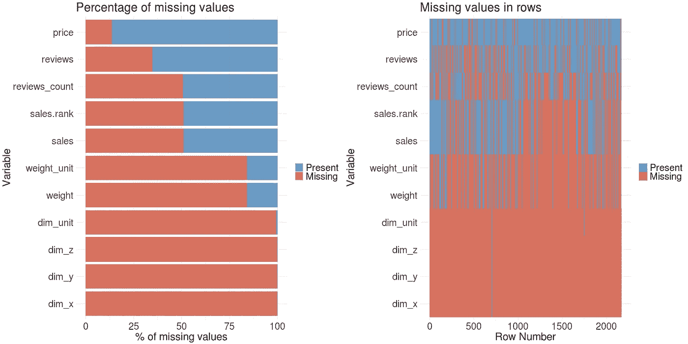

# R 中 tidyverse 的值可视化缺失

> 原文：<https://towardsdatascience.com/missing-value-visualization-with-tidyverse-in-r-a9b0fefd2246?source=collection_archive---------11----------------------->

## 关于如何使用 ggplot2、dplyr、tidyr 查找和可视化缺失数据的简短实用指南


在[探索性数据分析(EDA)](https://en.wikipedia.org/wiki/Exploratory_data_analysis) 期间，寻找缺失值是一项重要任务。它们会影响机器学习模型的质量，需要在训练模型之前进行清理。通过检测缺失值，您还可以评估数据检索过程的质量。这个简短的实用指南将向您展示如何找到缺失的价值，并通过 tidyverse 生态系统将它们可视化。 [tidyverse](https://www.tidyverse.org/) 是数据科学的 R 包集合。在他们的主页上写道“…所有的包共享一个潜在的设计哲学、语法和数据结构。”

# 数据集

该数据集是从一个电子商务网站上刮下来的，包含产品数据。您可以通过评估缺失值来检查数据检索的质量。具有大量缺失值的要素可能表明该要素的提取逻辑存在问题，或者数据由于其他原因而缺失。

```
df %>% 
   head(10)
```


数据集包含 11 个变量，共 2172 行。

# 缺少值的表

您可以对数据集中每个要素的缺失值进行计数:

```
missing.values <- df %>%
    gather(key = "key", value = "val") %>%
    mutate(is.missing = is.na(val)) %>%
    group_by(key, is.missing) %>%
    summarise(num.missing = n()) %>%
    filter(is.missing==T) %>%
    select(-is.missing) %>%
    arrange(desc(num.missing))
```


您可以使用 tidyr 的 gather 函数将列折叠成键值对。然后，创建一个新的逻辑特征，在缺少值的情况下该特征成立。您对键和新逻辑特征进行分组以进行计数。然后过滤逻辑特征以获得缺少值的计数。您跳过不需要的行，并根据缺少的值的数量进行排序。

# 可视化丢失的数据

**表格**及其行和列由我们的语言系统读取。这个系统非常慢。

**图形**与我们的视觉系统互动，比语言系统快得多。这就是为什么在大多数情况下你应该使用图表而不是表格的原因。

您可以在 ggplot2 中用一个简单的条形图直观显示上面的聚合数据集:

```
missing.values %>%
  ggplot() +
    geom_bar(aes(x=key, y=num.missing), stat = 'identity') +
    labs(x='variable', y="number of missing values", 
         title='Number of missing values') +
    theme(axis.text.x = element_text(angle = 45, hjust = 1))
```


您可以通过计算每个要素缺失值的百分比来改进该图。这样更有意义。通过交换轴可以改善视觉外观，使特征名称更具可读性。根据长度对条进行排序是另一个改进。正确的轴标签总是必须的。使用红色作为缺失值(=坏)的视觉提示是因为红色代表危险，你必须采取行动。

```
missing.values <- df %>%
  gather(key = "key", value = "val") %>%
  mutate(isna = is.na(val)) %>%
  group_by(key) %>%
  mutate(total = n()) %>%
  group_by(key, total, isna) %>%
  summarise(num.isna = n()) %>%
  mutate(pct = num.isna / total * 100) levels <- (missing.values  %>% filter(isna == T) %>%     
           arrange(desc(pct)))$keypercentage.plot <- missing.values %>%
      ggplot() +
        geom_bar(aes(x = reorder(key, desc(pct)), 
                     y = pct, fill=isna), 
                  stat = 'identity', alpha=0.8) +
        scale_x_discrete(limits = levels) +
        scale_fill_manual(name = "", 
                          values = c('steelblue', 'tomato3'), 
                          labels = c("Present", "Missing")) +
        coord_flip() +
        labs(title = "Percentage of missing values", 
             x = 'Variable', y = "% of missing values")percentage.plot
```


在这个图中，您以与前面类似的方式汇总数据:不是计数，而是计算百分比。然后将数据链接到 ggplot 可视化部分。

该图显示您在产品尺寸(dim_x，dim_y，dim_z)的特征的抓取过程中遇到了问题:几乎 100%的值都丢失了。您可以看到 sales.rank、sales 和 reviews.count 有相同数量的缺失值。这些值似乎相互关联。

您可以通过绘制数据集中的每一行来以另一种方式显示缺失值，以获得进一步的见解。

```
row.plot <- df %>%
  mutate(id = row_number()) %>%
  gather(-id, key = "key", value = "val") %>%
  mutate(isna = is.na(val)) %>%
  ggplot(aes(key, id, fill = isna)) +
    geom_raster(alpha=0.8) +
    scale_fill_manual(name = "",
        values = c('steelblue', 'tomato3'),
        labels = c("Present", "Missing")) +
    scale_x_discrete(limits = levels) +
    labs(x = "Variable",
           y = "Row Number", title = "Missing values in rows") +
    coord_flip()row.plot
```


这个图可以让你发现我们的条形图中找不到的模式。您可以看到不同要素的缺失值之间的联系。

特性 sales_rank 和 sales 的缺失值实际上是相互关联的。这是你所期望的。在条形图中，您可以看到 reviews_count 具有大约相同百分比的缺失值。您可能会期望与销售和销售排名相关联。我们的第二个图显示没有关联，因为值在不同的行中丢失。

您可以用 gridExtra 包将这两种可视化合二为一。

```
grid.arrange(percentage.plot, row.plot, ncol = 2)
```



# 结论

您以两种方式可视化了数据集中的缺失值，这为您提供了关于数据集中缺失值的不同见解。这样，您可以找到数据抓取器逻辑中的弱点。您可以看到 ggplot2 中的图形语法和 dplyr 中的数据操作语法是非常强大的概念。

2019 年 2 月 5 日由延斯·劳弗撰写

随意分享！

*原载于 2019 年 2 月 5 日*[*【jenslaufer.com】*](http://jenslaufer.com/data/analysis/visualize_missing_values_with_ggplot.html)*。*