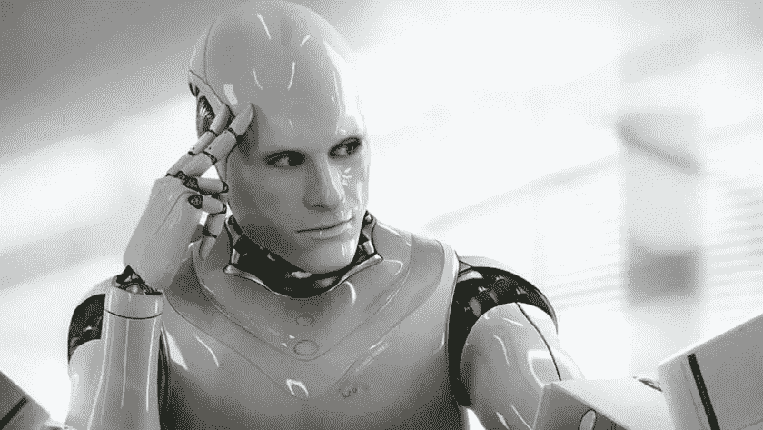
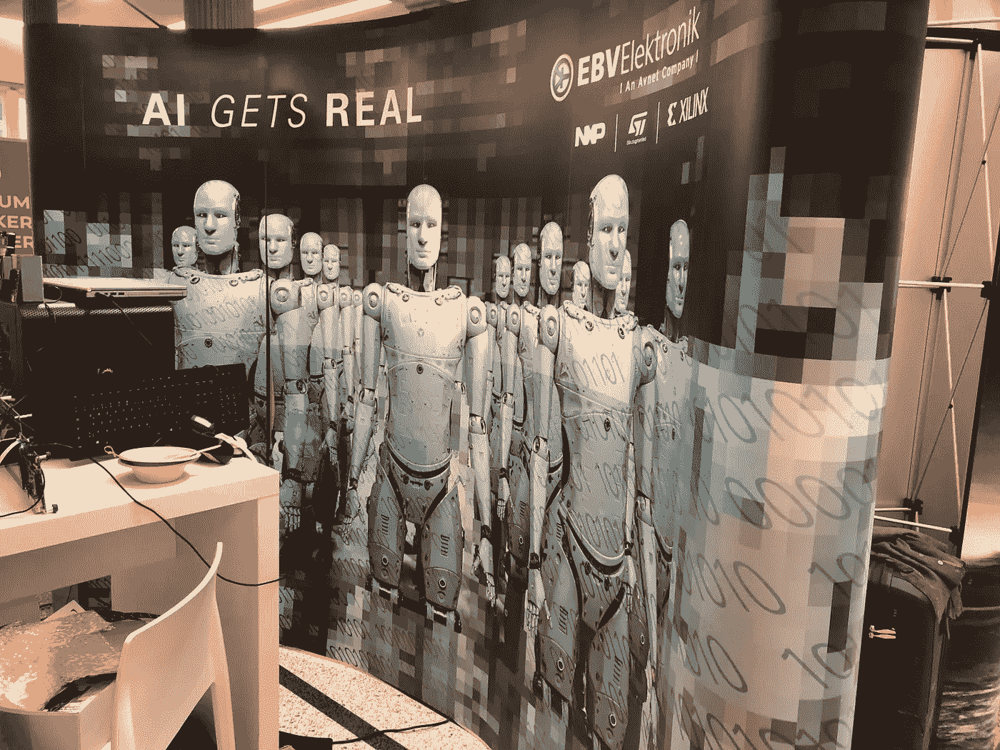

# 错误的身份:为什么媒体使用人形机器人来代表人工智能是个坏消息

> 原文：<https://towardsdatascience.com/mistaken-identity-why-the-media-using-humanoid-robots-to-represent-ai-is-bad-news-c2c1e8a9cb62?source=collection_archive---------24----------------------->

## 用闪闪发光的银色机器人男人的图片来代表 AI，一直都很讨厌。这也有损害行业的风险。

**“Am I the problem?”**

在 2018 年的一篇伟大的[文章](https://medium.com/@ageitgey/the-real-scandal-of-ai-awful-stock-photos-456633b9b0fc)中，亚当·盖特吉痛斥“[人工智能的真正丑闻:糟糕的股票照片](https://medium.com/@ageitgey/the-real-scandal-of-ai-awful-stock-photos-456633b9b0fc)”。他捕捉到了“拨弄键盘的机器人手指”和“1998 年的机器人通用 3D 模型”的天真和可预测性，这些模型用于说明关于人工智能的文章。当时，最佳实践人工智能团队正在整理成千上万的文章，以建立我们开放的人工智能用例及案例研究库[，所以这一点很重要；我们笑了，并热情地转发了这篇文章。](http://www.bestpractice.ai)

本周，我在英国上议院就人工智能问题向跨党派议会小组提供了证据。我在台上与埃森哲(Accenture)和微软(Microsoft)等公司的名人讨论企业采用的障碍。一个反复出现的话题是高管教育。显然，人工智能和机器学习不是简单的话题——理解它们需要时间，我们仍在计算新技术将产生什么样的经济和商业影响。闪亮的银色机器人通常被用来说明解释这一切的文章。

但我越来越清楚，闪亮的机器人插图正在为技术和行业积累问题。

1.  **首先，它设定的期望值太高**。狭义(以任务为中心的工具)和一般(一般人类智能)人工智能之间的区别很重要。后者离科学的飞跃还有一段距离——前者就在我们身边。然而，将这种技术想象成闪闪发光的银人表明，这种技术是关于后者的，并将在一夜之间改变世界。不会的。
2.  **其次，它误导了 AI 可以和应该用于**的东西。如果被认为是更平凡的东西——“有态度的电子表格”是一种讨论中的描述——那么它将更好地帮助非技术人员想象他们可能使用技术做什么。
3.  这表明人工智能的主要潜在商业利益是通过工作自动化取代人类。研究人工智能的组织刚刚开始将他们的问题从“这项技术能做什么？”到“使用这项技术的投资回报率(ROI)是多少”？在这里，人形机器人的心理形象是有问题的，因为它推动了对自动化和用机器人取代人类工作的关注。到目前为止，人类工作替代的例子比宣传的更有限。众所周知，自动取款机的引入与银行职员数量的增加是并行的，类似的事情也可能发生在客服聊天机器人身上。
4.  **这让高管们很难看到人工智能带来的真正商业利益。**当机器开始阅读来自病人的医疗扫描时，在商业或社会层面上，受益的将不是看扫描的员工数量的潜在减少。这将是一个消除流程瓶颈和引入常规先发制人扫描的机会，从而挽救许多人的生命。扩大以前的短缺具有巨大的经济和社会效益——而这并不是通过估算(边际)FTE 减少量来最好理解的。
5.  **它强化了人工智能潜在的恶性形象——模糊了“人工智能伦理”问题的真正来源。电影 [iRobot](https://en.wikipedia.org/wiki/I,_Robot_(film)) 向我们展示了漂亮闪亮的银色机器人成为黑暗面的代理人，迎合了几代人关于机器背叛其制造者的负面故事。更紧迫的是，人们更容易相信这些算法是“种族主义者”或“性别歧视者”，而不是相信它们被灌输了糟糕的人类生成的数据。如果我们围绕人工智能的伦理问题沟通不畅，那么解决这些问题将变得更加困难。**
6.  **最后，这将有助于对感知的“炒作”产生过度反应。在未来几年的某个时候，人们将评估人工智能分娩的现实。自动驾驶汽车还需要 5 年时间。闪亮的银色机器人仍将是虚拟的。他们会失去兴趣。对他们来说，这将是一个错误——就像 2000 年 dot.com 股灾后远离互联网一样。因为人工智能将改变世界——只是(还)不是以人形的形式。**

因此，这不可避免地提出了一个问题——使用什么样的图像更好？感谢你的想法。

Get real