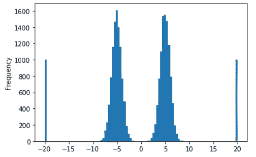
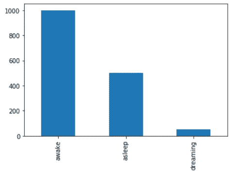
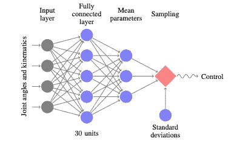
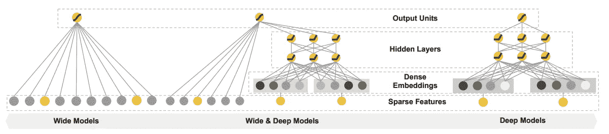
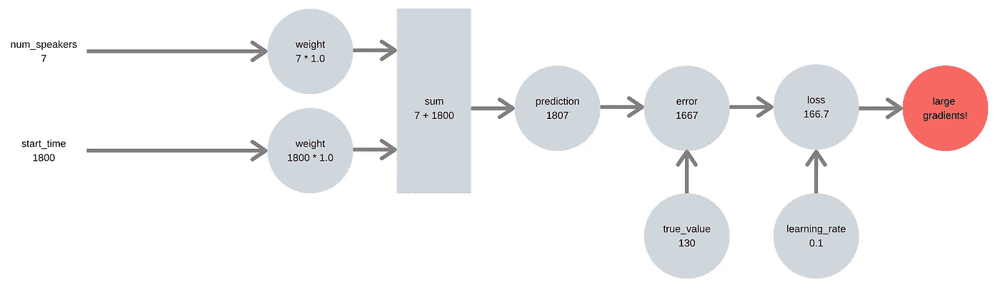
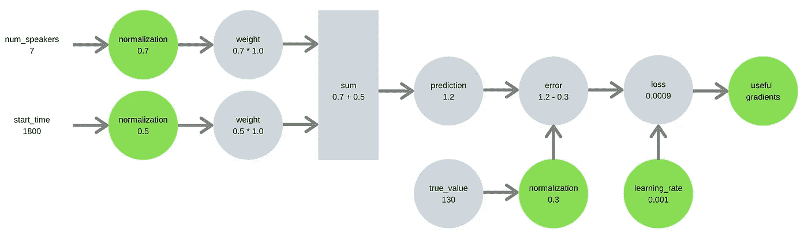

# 数据科学家犯的十二个错误

> 原文：<https://towardsdatascience.com/mistakes-data-scientists-make-e915abd3b2df?source=collection_archive---------19----------------------->

## 成为更好的数据科学家

Nepal — photo by author.

> 专家是在一个非常狭窄的领域里犯了所有可能犯的错误的人。
> 
> 尼尔斯·玻尔——量子物理学家

本文列出了我自己和其他人在学习和实践数据科学时经常犯的错误。

**模式存在于科学家犯的数据错误中——**在这里你也可以从中学习:

1.  不标绘目标，
2.  不考虑维度，
3.  学习率太高，
4.  不去想错误从何而来，
5.  不理解偏差和差异，
6.  对全连接神经网络的宽度和深度的痴迷，
7.  不关注 PEP 8，
8.  不放弃目标，
9.  不缩放目标或特征，
10.  在开发过程中不使用数据样本，
11.  覆盖原始数据，
12.  不使用$HOME 存储数据。

# 1.不标绘目标

**预测是数据科学家和数据分析师的区别**。数据分析师分析过去，数据科学家预测未来。

数据科学家通常使用监督机器学习来进行预测。监督学习的基本过程是使用特征`x`来预测目标`y`。

理解目标的分布是任何监督学习项目的第一步。**目标的分布会影响数据科学家的许多决策，包括**:

*   使用什么模型，
*   是否需要缩放，
*   如果目标具有应该被移除的异常值，
*   如果目标不平衡。

我们预测的目标可以是连续的数字(回归)，也可以是离散的类别(分类)。

## 回归目标

在回归问题中，数据科学家希望了解目标的以下信息:

*   最小值和最大值，
*   目标是如何正常分布的，
*   如果分布是多模态的，
*   如果有异常值。

**直方图将回答所有这些问题，使其成为在回归问题中可视化目标的绝佳选择**。下面的代码生成了一个包含四个分布的玩具数据集，并绘制了一个直方图:

直方图显示了生成该数据集的两个正态分布和两个均匀分布。

## 分类目标

在分类问题中，数据科学家希望了解目标的以下信息:

*   有多少个班级，
*   班级的平衡程度如何。

**我们可以用柱状图来回答这些问题**:

柱状图表明我们有三个班级，并且表明我们的“做梦”班级代表不足。

# 2.不考虑维度

维度为理解世界提供了结构。

## 低维数据的价值

低维表示比高维表示更有价值。这是因为在低维空间做决策更容易。

以决定是步行还是乘公共汽车为例——这个决定取决于是否下雨。

如果给你一个天气的高维表示(比如卫星图像中的像素)，在你决定如何旅行之前还有很多工作要做。

相反，如果您可以访问天气的低维表示(例如下雨的概率)，则可以仅使用单个阈值参数来做出决策。商业中的许多其他决策都是低维的——比如去/不去或者一个项目或者雇佣/不雇佣。

请注意，数据科学家的大部分工作都是使用机器学习来降低维度:

*   使用卫星图像中的像素来预测太阳能输出，
*   使用风力涡轮机性能数据来估计未来故障的概率，
*   利用客户数据预测客户终身价值。

**每个低维输出可以被一个业务方式使用，而高维数据不能**。

与高维原始数据输入不同，低维输出可用于决策:

-太阳能输出可用于指导能源交易商的行动，
-高风力涡轮机故障概率可导致派出维护团队，
-低客户寿命估计可导致营销预算资金减少。

以上是预测和控制相互作用的例子。你越能预测这个世界，你就越能控制它。

这也是数据科学家的工作定义——做出导致行动的预测——改变企业运营方式的行动。

## 高维数据的挑战

在高维空间工作的困难是维度的**诅咒**。

为了理解维数灾难，我们需要对数据的*空间*和*密度*进行推理。

我们可以想象一个密集的数据集——在一个小空间内有大量不同的样本。我们也可以想象一个稀疏的数据集——一个大空间中的少量样本。

当我们添加维度时，数据集的密度会发生什么变化？它变得不那么密集，因为数据现在更加分散。

然而，随着维度的增加，数据密度的降低不是线性的，而是指数性的。**随着维度的增加，空间变得更加难以理解。**

为什么增长是指数级的？因为这个新维度不仅需要根据其他维度(线性)来理解，还需要根据其他维度与其他维度的组合来理解**。**

**这种组合与其他组合一起导致指数增长。**

这是维度的诅咒——随着我们增加维度，空间呈指数增长。下面代码显示了这种效果:

空间的大小越大，机器学习模型需要做的理解工作就越多。

**这就是为什么在没有信号的情况下添加功能是痛苦的**。模型不仅需要了解它的噪声，还需要考虑噪声如何与每隔一列的每个组合进行交互。

## 数据科学工作流中应用维度诅咒的四个领域

从理论上理解维度是第一步。**接下来是在数据科学的日常实践中应用它**。下面我们将通过几个实际案例来说明数据科学家无法将维数灾难应用到他们自己的工作流程中。

## 1.过多的超参数

**数据科学家可能会浪费时间进行过多的网格搜索**——在时间和计算上都很昂贵。复杂网格搜索的动机来自一个好的地方——对好的(甚至是*完美的*)超参数的渴望。

然而，我们现在知道，只增加一个额外的搜索就意味着训练模型的指数增长——因为这个新的搜索参数需要结合其他所有搜索参数进行测试。

**另一个错误是窄网格搜索** —在小范围的超参数上搜索。对数标度比小的线性范围更能提供信息:

不同的项目需要不同数量的网格搜索，包括模型和它们的超参数。我发现我经常构建两个网格搜索管道:

-一个用于比较不同的模型(使用迄今为止为每个模型找到的最佳超参数)
-一个用于比较单个模型的不同超参数

我将从比较第一个管道中的模型开始，然后在第二个网格搜索管道中对单个模型做进一步的调优。一旦模型得到合理的调整，它的最佳超参数就可以放入第一个网格搜索管道。

对单个模型的微调通常是一次搜索一个参数(最多两个)。这使得运行时间很短，并且也有助于发展关于改变超参数将对模型性能产生什么影响的直觉。

## 2.太多功能

作为一名初级数据科学家，我有一个误解，那就是添加功能没有成本。把它们都放进去，让模型自己算出来！我们现在可以很容易地看到这一点的幼稚——更多的功能有指数级的成本。

**这个误解来自于对深度学习的一个根本性误解。**

看到计算机视觉中的结果，深度神经网络从原始像素中完成所有的特征工程工作，我认为对其他数据使用神经网络也是如此。我在这里犯了两个错误:

-不理解卷积神经网络的有用归纳偏差
-不理解维数灾难

我们现在知道添加更多功能的成本是指数级的。这也应该改变你如何看待一次性编码，这大大增加了模型需要理解的空间，数据密度低。

## 3.指标太多

在数据科学项目中，使用诸如培训或测试性能等指标来判断性能。

在行业中，数据科学家将选择与业务目标一致的指标。不同的指标有不同的权衡，数据科学家的部分工作是选择与业务目标最相关的指标。

然而，初级数据科学家报告一系列不同的指标是很常见的。例如，对于一个回归问题，他们可能会报告三个指标:

*   平均绝对误差，
*   平均绝对百分比误差，
*   均方根误差。

再加上报告测试和训练错误(或每个交叉验证折叠的测试和训练)，度量的数量变得太多，以至于无法浏览并做出决策。

**选择一个最符合你业务目标的指标，并坚持下去**。降低度量标准的维度，以便您可以对其采取措施。

## 4.太多模型

数据科学家很幸运能够获得许多开源包(如“scikit-learn ”)中模型的高质量实现。

当数据科学家重复训练一组模型，而没有考虑为什么这些模型应该并行查看的原因时，这可能会成为一个问题。线性模型被一遍又一遍地训练，从未见过笔记本外面的光。

我经常看到新的数据科学家训练线性模型、SVM 和随机森林。一个有经验的数据科学家只会训练一个基于树的集合(随机森林或 XGBoost)，并专注于使用特征重要性来设计或丢弃特征。

**为什么基于树的集合是一个好的初始模型？**几个原因:

*   它们可以用于回归或分类，
*   不需要缩放目标或特征，
*   训练可以跨 CPU 核心并行化，
*   它们在表格数据上表现良好，
*   特性的重要性是可以解释的。

# 3.学习率太高

如果在训练神经网络时有一个值得研究的超参数，那就是学习率。

**将学习速率设置得太高会使神经网络的训练不稳定。**学习率的作用很直观——更高的学习率意味着更快的训练。

神经网络的第二个最重要的参数是批量大小。

**批量大小不太直观** —较小的批量大小意味着较高的方差梯度，但是批量的一些值正在使用该方差来突破局部最小值。

一般来说，批处理大小应该尽可能大，以提高渐变质量-通常它会受到 GPU 内存的限制(尤其是图像)。

# 4.不去想错误从何而来

统计误差的三个来源是:

*   抽样误差——使用对较大总体的子集估计的统计数据，
*   抽样偏差——与其他样本相比具有不同概率的样本，
*   测量误差——测量值与真实值之间的差异。

即使量化这些误差的大小通常是不可能的，定性地思考统计数据中的误差来自哪里仍然是有价值的。

思考训练和测试的采样和分布之间的差异有助于提高机器学习模型的泛化能力，以免它在生产中无法泛化。

错误的另一个有用的思考工具是 IID 的概念——数据应该是独立的&同分布的:

-独立采样(无采样偏差)，
-同分布(无采样或测量误差)。

IID 是统计学习中关于数据分布和抽样质量的一个假设——而且几乎总是一个被打破的假设。

# 5.不理解偏差和差异

监督学习模型的预测误差有三个组成部分-偏差、方差和噪声:

*   **偏差是缺乏信号** —模型看不到可用于预测目标的关系。这是不合适的。可以通过增加模型容量(通过更多的层/树、不同的架构或更多的功能)来减少偏差。
*   **方差是信号**的混淆噪声——训练数据中的模式，在测试时不会出现在数据中。这太合身了。可以通过添加训练数据来减少方差。
*   噪音是难以控制的——一个模特能做的最好的事情就是避免它。

机器学习模型的错误通常是由于这三者的结合。通常，数据科学家将能够做出改变，导致偏差和方差之间的权衡。

数据科学家可以利用三个常用的杠杆来用偏差换取方差(反之亦然):

*   **增加模型容量** —增加模型容量会减少偏差，但会增加方差(额外的容量可用于适应噪声)。
*   **减少模型容量** —减少模型容量(通过正则化、剔除或更小的模型)将减少方差，但会增加偏差。
*   a **添加数据** —更多的数据将减少方差，因为模型有更多的例子来学习如何从信号中分离噪声。

更多的数据对偏倚没有影响。

**更多的数据甚至会使偏倚变得更糟，如果额外的抽样是有偏倚的。**

带有偏差的额外数据采样只会让您的模型有机会更精确地判断错误——有关偏差、采样偏差和数据量之间关系的更多信息，请参见 Chris Fonnesbeck 关于[数据科学统计思维](https:/www.youtube.com/watch?v=TGGGDpb04Yc)的演讲。

# 6.痴迷于全连接神经网络的宽度和深度

对全连接神经网络架构的痴迷伴随着构建它们的过程。构建神经网络需要定义架构——这肯定很重要吧？

**然而，当谈到完全连接的神经网络时，架构并不真的那么重要**。

只要你给模型足够的容量和可感知的超参数，一个全连接的神经网络将能够学习具有多种架构的相同功能。让你的渐变和你赋予它们的容量一起工作。

一个恰当的例子是 2015 年的强化学习论文*信任区域策略优化*，它使用一个简单的前馈神经网络作为移动任务的策略。运动任务使用平面输入向量，具有简单的全连接架构。

[Schulman et. al (2015) Trust Region Policy Optimization](https://arxiv.org/abs/1502.05477)

完全连接的神经网络的正确思维模式是深度为两到三，宽度设置在 50 到 100 之间(或者 64 到 128，如果你想融入酷的计算机科学人群)。如果您的模型是低偏差，考虑通过另一层或额外的宽度增加容量。

**简单全连接架构的一个有趣改进是宽&深架构**，它将宽记忆功能交互与深不可见的学习功能组合混合在一起。

[Cheng et. al (2016) Wide & Deep Learning for Recommender Systems](https://arxiv.org/abs/1606.07792)

# 7.没有关注 PEP 8

> 程序必须写给人们阅读，并且只是附带地给机器执行。
> 
> 艾贝尔森&苏斯曼——计算机程序的结构和解释

代码风格很重要。我记得我很困惑，为什么更有经验的程序员对代码风格如此挑剔。

编程五年后，我现在知道他们来自哪里。

以预期方式布局的代码需要更少的努力来阅读和理解代码。

糟糕的代码风格会给读者带来额外的负担，让他们在考虑实际代码之前就理解你独特的代码风格。

# 8.不放弃目标

如果你曾经得到一个训练误差极低的模型，很可能你的目标是一个特征。

我们都做过一次。

# 9.不缩放目标或特征

这是我在调试机器学习项目时给出最多的建议。每当我看到高亏损(高于 2 或 3)，这是一个明确的信号，表明目标没有被调整到一个合理的范围。

**规模很重要，因为未缩放的目标会导致较大的预测误差**，这意味着较大的梯度和不稳定的学习。

我所说的扩展是指标准化:

或标准化:

请注意，这些东西的名称之间缺乏一致性——规范化通常也称为最小-最大缩放，甚至标准化！

以下面的例子为例，我们试图从发言人数和开始时间来预测有多少人参加了一个讲座。我们的第一个管道没有缩放特征或目标，导致大的误差信号和大的梯度:

我们的第二个管道需要时间来适当地缩放特征和目标，从而产生具有适当大小梯度的误差信号:

类似的逻辑也适用于特征——未缩放的特征可以支配和扭曲信息通过神经网络的方式。

# 10.在开发过程中不使用数据样本

在编写处理数据的代码时，这是一个显而易见的问题——如果每次修复 bug 时都使用完整的数据集来运行数据处理，这将是开发人员时间上一个代价高昂的错误。

您可以使用整数索引粗略地处理数据样本:

`pandas`允许您一次仅加载数据的一个子集(避免将整个数据集拉入内存):

## 控制调试

控制这一点的一个简单方法是变量——这就是你在 Jupyter 笔记本中要做的:

或者更简洁地使用命令行参数:

运行脚本`data.py`时可以控制:

# 11.覆盖原始数据

原始数据是神圣的，永远不应该被覆盖。这在程序内部和磁盘上都是正确的。

# 12.不使用$HOME 存储数据

这不是一个错误——但这是一个极大地简化了我生活的模式。

在 Python 中管理路径可能很棘手。有几件事可以改变路径查找 Python 的工作方式:

-用户克隆源代码
-虚拟环境安装源代码
-用户从哪个目录运行脚本

出现的一些问题是由这些变化引起的:

- `os.path.realpath`将根据虚拟环境安装您的包的位置而变化
- `os.getcwd`将根据用户运行 Python 解释器的位置而变化

**将数据放在一个固定的、一致的地方可以避免这些问题** —除了用户的`HOME '目录之外，您不需要获取任何相关的目录。

解决方法是在用户的`$HOME`目录下创建一个文件夹，用它来存储数据:

这意味着您的工作是可移动的——对您的同事和远程机器都是如此。

感谢阅读！

如果你喜欢这篇文章，请随时在[媒体](https://medium.com/@adgefficiency)上关注我，或者在 [LinkedIn](https://www.linkedin.com/in/adgefficiency/) 上联系我。

请务必查看我的其他帖子:

 [## 充分利用 Jupyter 实验室

### 下一代笔记本工具指南。

towardsdatascience.com](/getting-the-most-out-of-jupyter-lab-9b3198f88f2d)  [## 丹尼尔·丹尼特的四种能力

### 理解计算控制算法的一个有用的想法。

towardsdatascience.com](/daniel-c-dennetts-four-competences-779648bdbabc) 

*原载于 2019 年 9 月 14 日*[*https://adgefficiency.com*](https://adgefficiency.com/mistakes-data-scientist/)*。*