# 混合绘图比例和自定义 violinboxplot 实现

> 原文：<https://towardsdatascience.com/mixed-plot-scales-and-custom-violinboxplot-68cc8c5d6ead?source=collection_archive---------11----------------------->

## 混合比例图和自定义 violinboxplot


简而言之，这篇文章解决了以下两个问题:

# 1.我们如何创建具有远异常值的数据分布的综合可视化？

通常，我们使用线性和对数尺度(用于捕捉异常值)，但在这里，我们将研究创建混合轴的可能性，以各种类型的尺度的任意混合，应用于所需的间隔。

# 2.根据数据分布，我们如何结合箱线图、紫线图和动态标度的优点？

我们将提出一个 violinboxplot 的自定义实现，提供广泛的自定义参数，这些参数控制异常值的呈现、模式和计数的自定义注释、基于任意百分点的线性/对数轴分割。它处理数据数组和按列列表分组的数据帧。

这篇博客中的所有例子都是用 python/matplotlib 实现的，可以在 [Github](https://github.com/ciortanmadalina/modality_tests/blob/master/violinboxplot_hybrid_axes.ipynb) 上找到。

# 混合 matplolib 轴秤

让我们首先选择一个函数(sin ),该函数将生成我们将用来演示混合秤概念的数据集。

```
x = np.arange(-80,80, 0.1)
y = np.sin(x)
plt.title('Linear scale plot of a sinusoid')
plt.xlabel('x')
plt.ylabel('y')
plt.plot(x, y);
```

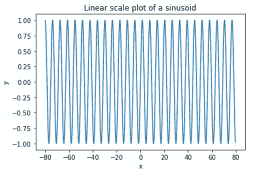

如果我们把这个数据集当作一个黑盒，数据科学家可能会出于各种原因，希望以最小的努力，通过在不同的时间间隔使用不同的尺度，获得图形的动态分辨率。例如，他可能想想象:

*   1 <= y <= 0.5 using a linear scale
*   0.1 <= y <= 0.5 using a log scale
*   -1<= y <= 0.1 using a linear scale

The first naive solution is to create 3 different plots with the chosen axis scales on chosen intervals.
在这篇文章中，我们将探讨 matplotlib 在不同比例下显示原始图形的能力，从而提供统一的可视化。

在本帖中，我们将介绍两种方法:

1.  使用轴分隔线
2.  使用网格规格

# 轴分割器

```
**from** **mpl_toolkits.axes_grid1** **import** make_axes_locatable
```

Matplotlib 的函数 **make_axes_locatable** 允许我们在给定的轴上添加一个新的轴。在下面的示例中，对数轴是从原始线性轴创建的。
通过设置任意的 y 限制，我们可以控制渲染图的哪一部分，并且我们可以创建图连续性的印象。
*Sharedx* 参数允许共享同一个 x 轴，并防止 x 刻度标签被重新渲染。

```
plt.title('Split plot in 2 parts: linear: [0.5, 1] and log: [0.01, 0.5]')
linearAxis = plt.gca()
linearAxis.plot(x, y)
linearAxis.set_ylim((0.5, 1))divider = make_axes_locatable(linearAxis)
logAxis = divider.append_axes("bottom", size=1, pad=0.02, sharex=linearAxis)
logAxis.plot(x, y)
logAxis.set_yscale('log')
logAxis.set_ylim((0.01, 0.5));
```

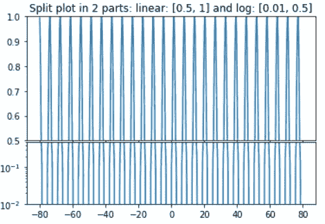

我们可以在给定输入轴上的 4 个潜在位置(顶部/底部/上/下)使用附加轴。下面的代码说明了链接 2 个轴，在顶部和底部。

```
logAxis = plt.gca()
logAxis.plot(x, y)
logAxis.set_yscale('log')
logAxis.set_ylim((0.01, 0.5))divider = make_axes_locatable(logAxis)
linearAxis = divider.append_axes("top", size=1, pad=0.02, sharex=logAxis)
linearAxis.plot(x, y)
linearAxis.set_ylim((0.5, 1))
linearAxis.set_xscale('linear')
linearAxis.set_title('Plot split in 3 scales: linear: [0.5, 1], log: [0.01, 0.5], linear: [-1, 0.01]');linearAxis1 = divider.append_axes("bottom", size=1, pad=0.02, sharex=logAxis)
linearAxis1.plot(x, y)
linearAxis1.set_yscale('linear')
linearAxis1.set_ylim((-1, 0.01));
```

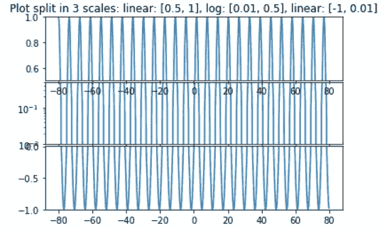

GridSpec implementation

另一个选择是使用 matplotlib 的 GridSpec，它在调整组件大小和使用方面提供了更多的灵活性。我们可以预先定义超级剧情的数量，它们的相对大小(height_ratios)，支线剧情之间的距离(hspace)。
一旦创建了独立轴，我们就可以设置比例和所需的限制。

```
**import** **matplotlib.gridspec** **as** **grd**
gs = grd.GridSpec(3, 1, wspace=0.01, hspace=0.05, height_ratios=[0.33, 0.33, 0.33])ax1 = plt.subplot(gs[0])
ax2 = plt.subplot(gs[1])
ax3 = plt.subplot(gs[2])
ax1.set_xticks([])
ax2.set_xticks([])ax1.plot(x, y)
ax1.set_yscale('linear')
ax1.set_ylim((0.5, 1)) ax2.plot(x, y)
ax2.set_yscale('log')
ax2.set_ylim((0.01, 0.5)) ax3.plot(x, y)
ax3.set_yscale('linear')
ax3.set_ylim((-1, 0.01));
```

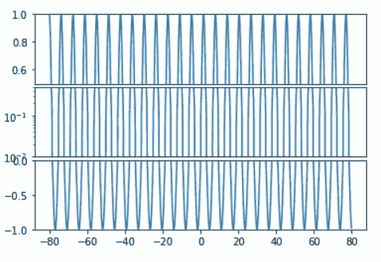

# 自定义紫色位图

让我们从生成几个反映多种场景的数据分布开始:

*   反映高斯分布的单峰数据
*   高斯数据与异常值的组合
*   具有多个(7 个这样的分布)的数据集，说明了输入分布的比较可视化
*   由一列或多列组成的数据帧，用来说明比较数据的分布

```
data1 = [np.round(np.random.normal(10, 0.4, 50), 2)]
data1SharpEnd = [[e **for** e **in** data1[0] **if** e > 9.9]]
data1Spread = [
    np.concatenate([
        np.round(np.random.normal(10, 0.2, 1000), 2), 
        np.round(np.random.normal(80, 0.3, 5), 2)
        ]) 
    ] data2 = [
    np.concatenate([
        np.round(np.random.normal(10, std/10, 1000), 2), 
        np.round(np.random.normal(80, std, np.random.randint(0, 24) * std), 2) ]) 
            **for** std **in** range(1, 7)
        ]
labels7 = ['A', 'B', 'C', 'D', 'E', 'F', 'G']
```

基于一个现有数据集，我们可以定义一个数据框架:

```
df = pd.DataFrame()
df['values'] = data1Spread[0]
df['col1'] = np.random.choice(['A', 'B'], df.shape[0])
df['col2'] = np.random.choice(['C', 'D'], df.shape[0])
```

为了更好地理解底层数据分布，让我们创建一个利用箱线图和紫线图的绘图函数:

```
**def** plotDistributions(inputData, title):
    *"""*
 *This method plots inputData with:*
 *- matplotlib boxplot*
 *- matplotlib violinplot*
 *- seaborn violinplot*
 *"""*
    globalMax = np.max(np.concatenate(inputData))
    globalMin = np.min(np.concatenate(inputData))

    plt.figure(figsize =(14, 4))
    plt.suptitle(title) plt.subplot(121)
    plt.grid()
    plt.title('Matplotlib boxplot')
    plt.boxplot(inputData, vert= **False**);
    plt.axvline(x = globalMax, c ='red', label = 'Global max', alpha = 0.5)
    plt.axvline(x = globalMin, c ='red', label = 'Global min', alpha = 0.5)
    plt.legend() plt.subplot(122)
    plt.grid()
    plt.title('Matplotlib violinplot')
    plt.violinplot(inputData, vert= **False**, showmeans=**False**, showmedians=**True**, showextrema=**True**);
    plt.axvline(x = globalMax, c ='red', label = 'Global max', alpha = 0.5)
    plt.axvline(x = globalMin, c ='red', label = 'Global min', alpha = 0.5)
    plt.legend()
```

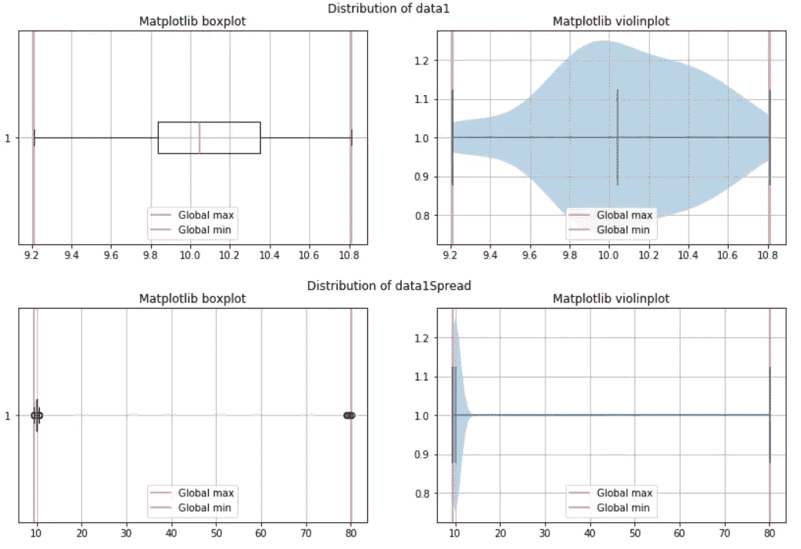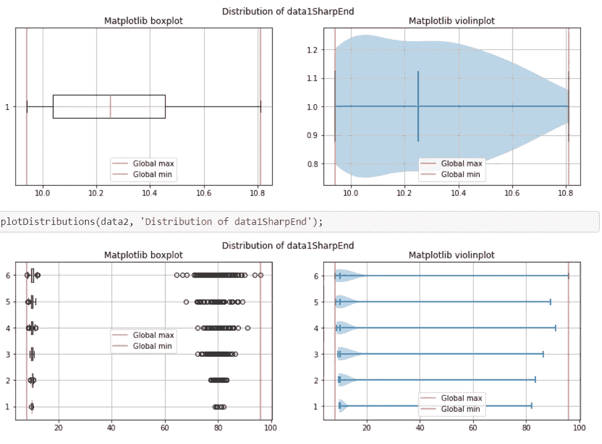

# 我们可以使用 seaborn 来可视化数据帧

```
sns.violinplot(x = 'values', y='col1', data = df)
plt.figure()
sns.violinplot(x = 'values', y='col2', data = df)
```

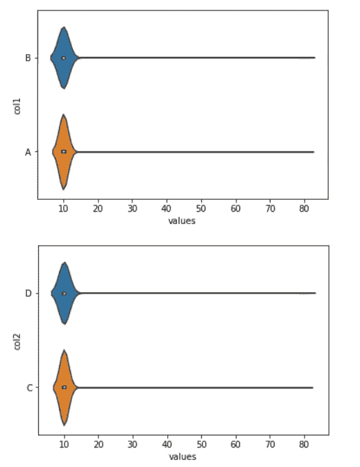

但是，seaborn 希望只将 group by 中用于汇总结果的一列指定为 y。如果我们想要基于多个特征的组合进行聚集，我们必须在调用绘图函数之前进行。

在上面的图中，我们可以发现哪些缺点？

*   如果能在一个图形中结合箱形图和小提琴图的分辨率就好了。Seaborn 通过内部参数提供了一种合并箱线图的方法，但其定制的可能性是有限的。
*   如第二张图所示，如果我们正在处理一个有很大异常值的分布，整体可视化会丢失极端情况下的细节。如果我们可以使用第一部分中讨论的示例来创建一个定制的统一视图，并在目标间隔上使用任意的比例，会怎么样呢？

其他一些需要考虑的问题包括:

*   我们如何使用自定义注释来丰富绘图，例如，为每个数据集指示点数和其他任意度量，如模式？
*   能不能提供一个超参数，把我们认为是离群点的点都从可视化中去掉？

如果我们从这最后一点开始，我们可以想出一个方法，去掉所有大于给定标准偏差数(默认为 3)的点。

在上面的图中，我们可以发现哪些缺点？

*   如果能在一个图形中结合箱形图和小提琴图的分辨率就好了。Seaborn 通过内部参数提供了一种合并箱线图的方法，但其定制的可能性是有限的。
*   如第二张图所示，如果我们正在处理一个有很大异常值的分布，整体可视化会丢失极端情况下的细节。如果我们可以使用第一部分中讨论的示例来创建一个定制的统一视图，并在目标间隔上使用任意的比例，会怎么样呢？

其他一些需要考虑的问题包括:

*   我们如何使用自定义注释来丰富绘图，例如，为每个数据集指示点数和其他任意度量，如模式？
*   能不能提供一个超参数，把我们认为是离群点的点都从可视化中去掉？

如果我们从这最后一点开始，我们可以想出一个方法，去掉所有大于给定标准偏差数(默认为 3)的点。

```
**def** removeOutliers(data, thresholdStd = 3):
    *"""*
 *This method returns all values which are farther away*
 *than thresholdStd standard deviationa*
 *"""*
    noOutliers=[]
    mean = np.mean(data)
    std =np.std(data)
    **if** std == 0:
        **return** data **for** y **in** data:
        z_score= (y - mean)/std 
        **if** np.abs(z_score) <= thresholdStd:
            noOutliers.append(y)
    **return** noOutliers
```

# violinboxplot 的实现

在 [github](https://github.com/ciortanmadalina/modality_tests/blob/master/violinboxplot_hybrid_axes.ipynb) 上找到完整代码。我们将只展示前面介绍的数据集的结果。该自定义实现呈现:

*   (可选)绿色表示每个分发的模式
*   (可选)在每一行的末尾返回每个分布的计数
*   可以渲染或隐藏异常值
*   可选的 logpercentile 指定一个百分比值(0.9)，在该值下，渲染将以线性比例进行，该百分比值使用 logscale
*   该方法可以将一组数组或一个数据帧作为输入，这些数组或数据帧可以通过一组列(y)来分组

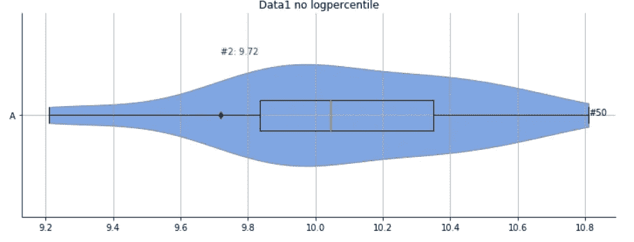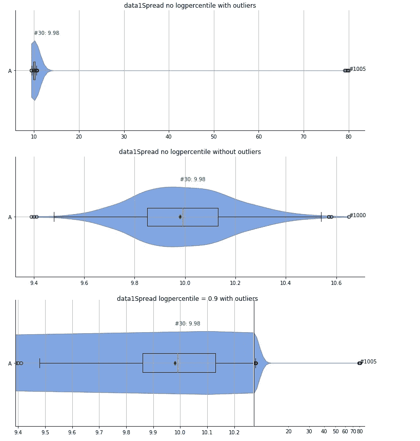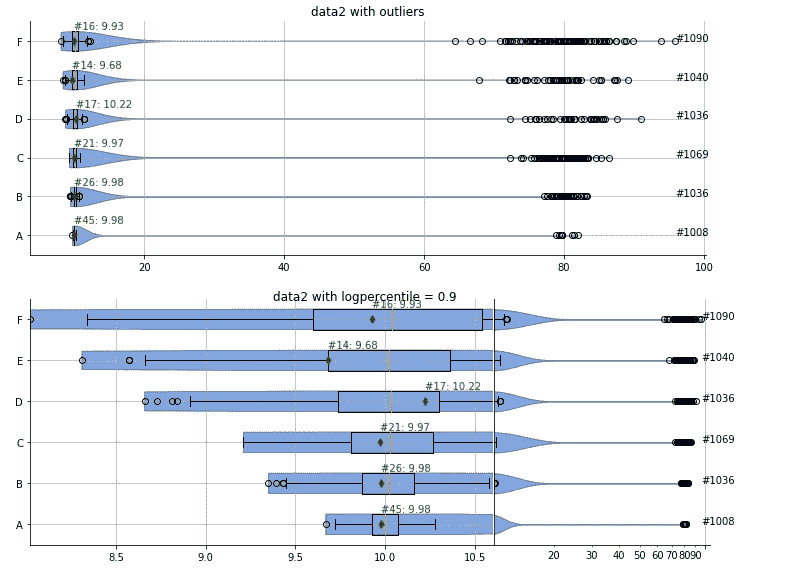

在一列或多列上使用数据框架和聚合的结果:

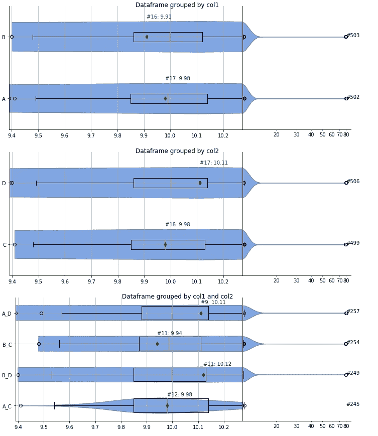

# 未来的工作

未来的一项改进是自动检测所有渲染分布的模式，并通过使用上一篇文章[https://github . com/ciortanmadalina/modality _ tests/blob/master/kernel _ density . ipynb](https://github.com/ciortanmadalina/modality_tests/blob/master/kernel_density.ipynb)中提供的代码来估计 PDF。这可以对一些感兴趣的区域进行估计，例如对数标度将是很好的选择。