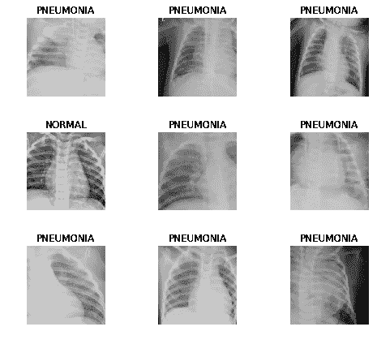
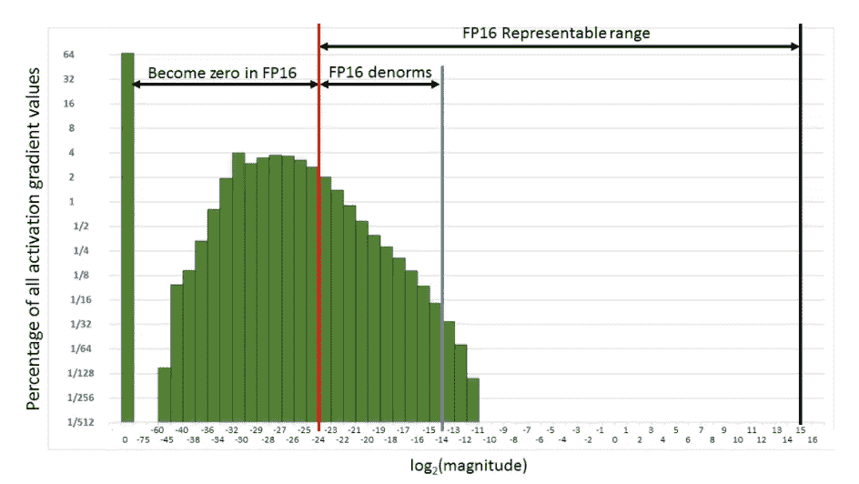
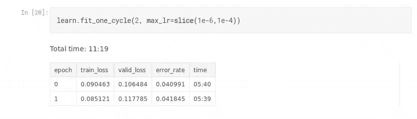
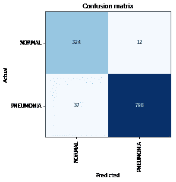

# 使用 fastai 的混合精确训练

> 原文：<https://towardsdatascience.com/mixed-precision-training-using-fastai-435145d3178b?source=collection_archive---------7----------------------->


## 介绍

图像分类是深度学习的 Hello World。对我来说，这个项目是用胸部 x 光检测肺炎(T2)。由于这是一个相对较小的数据集，我可以在大约 50 分钟内训练我的模型。但是如果我告诉你，只要增加一行代码


我们可以减少训练时间(理论上减少 50%)，而不会显著降低精确度。但是首先…

## **为什么这很重要？**

我使用的数据集包括大约 4500 张图片。它花了 50 分钟的唯一原因是因为图像是高清的。

然而，如果我们将同一个项目扩展到现实世界的应用程序，可能会有更多的图像。看看[斯坦福的 Chexpert 数据集](https://stanfordmlgroup.github.io/competitions/chexpert/)。

此外，我训练了一个模型来预测一种疾病，但在现实中，我们将不得不预测比两类疾病更多的疾病。在这种情况下，减少培训时间确实是一个优势。这将降低资源成本，帮助我们更快地进行实验。那么我们该怎么做呢？

我们变得不那么精确。

> 事实证明，有时，在深度学习中使事情不那么精确会使它更好地概括。
> 
> 杰瑞米·霍华德

## 神经网络中的精度



在神经网络中，所有的浮点数，即我们的输入、权重和激活都是用 32 位存储的。使用 32 位给了我们很高的精度。但是更高的精度也意味着需要更多的计算时间和更多的内存来存储这些变量。如果我们只用 16 位呢？

## **半精度**

减少内存使用的一种方法是以一半精度(16 位)执行所有操作。

根据定义，这将占用 RAM 中一半的空间，并且理论上可以让您的批处理大小翻倍。增加的批量意味着并行执行更多的操作，从而减少培训时间。然而，这也带来了一些问题。

## 半精度的问题

1.  **不精确的重量更新:**

我们将模型的权重更新如下:

```
w = w - learning_rate * w.gradient
```

以半精度执行该运算的问题是,`w.grad`通常非常小，我们的`learning_rate`也是如此，这会使等式的第二项非常小，以至于根本不会发生更新。

2.**梯度下溢:**

类似于不精确的权重更新，如果我们的梯度太小(低于可以使用 16 位表示的值)，它们将被转换为 0。

3.**激活爆炸:**

一系列矩阵乘法(前向传递)很容易导致神经网络的激活(输出)变得如此之大，以至于它们达到 NaN(或无穷大)

解决这些问题的办法就是使用 ***混合精度训练*** 。



source: [https://arxiv.org/pdf/1710.03740.pdf](https://arxiv.org/pdf/1710.03740.pdf)

## 混合精确训练

[全朱庇特笔记本。](https://www.kaggle.com/dipam7/mixed-precision-on-pneumonia-using-fastai)

顾名思义，我们做任何事情都不会有一半的精度。我们在 FP16 中执行一些操作，而在 FP32 中执行其他操作。更具体地说，我们以 32 位精度进行权重更新。这解决了问题#1。

为了克服梯度下溢，我们使用称为**梯度缩放**的东西。我们将损失函数乘以一个比例因子。我们这样做是为了避免梯度下降到 FP16 可以表示的范围之下，从而避免它被 0 取代。我们还要确保缩放因子不会大到导致我们的激活溢出。

使用这些思想，我们避免了半精度的问题，并有效地训练我们的网络。

## 最后的想法

使用混合精度训练的想法只出现了几年，并不是所有的 GPU 都支持它。但是这是一个值得了解的想法，并且在将来会被更多的使用。

结果表明，该方法在不影响精度的情况下，减少了训练时间。



这就是本文的全部内容。

如果你想了解更多关于深度学习的知识，可以看看我在这方面的系列文章:

[](https://medium.com/@dipam44/deep-learning-series-30ad108fbe2b) [## 深度学习系列

### 我所有关于深度学习的文章的系统列表

medium.com](https://medium.com/@dipam44/deep-learning-series-30ad108fbe2b) 

~快乐学习。