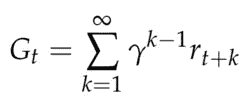
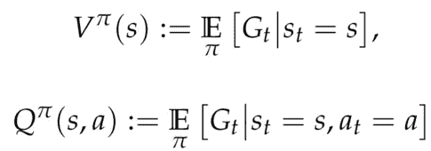

# 混合策略梯度和 Q-学习

> 原文：<https://towardsdatascience.com/mixing-policy-gradient-and-q-learning-5819d9c69074?source=collection_archive---------18----------------------->

策略梯度算法是强化学习算法的一个大家族，包括强化、A2/3C、PPO 等。Q-learning 是另一个家族，在过去几年中有许多重大改进:目标网络、双 DQN、经验重放/采样…

我一直想知道是否有可能取二者之长，创造出更好的学习算法。当我发现刻薄的演员评论家时，这个梦想实现了。

# 快速背景

在强化学习中，有奖励，目标是建立一个代理，使其在一集内的整体奖励最大化。这个数量是:

从时间 t 开始，其中 r 是奖励，γ是折扣因子。无穷大代表一集的结束，所以如果它几乎肯定是有限的，我们可以取 gamma = 1。

实际上，我们有一个策略π，它是每个状态 s 的动作的概率分布。这意味着我们希望从 t 开始最大化 G 的期望值，我们将这个数字称为**值。**

我们也可以定义 Q，它是以一个动作为条件的值:也就是说，从状态 s 开始并使用动作 a 的期望总回报。

# 这个想法

现在我们需要的东西都有了。我们的目标是找到使 v 最大化的策略π。π是从状态集到动作集的静态函数。因此，我们可以使用神经网络来近似它。使用一点微积分，我们可以计算我们的网络参数θ的梯度，以便得到众所周知的策略梯度:

但是另一种写法是:

这就是我所说的**平均梯度。**人们大多使用第一个公式，去掉对行动的期望(根据大数定律，一个实现近似遵循期望)，用 Q 作为使用当前政策给出的行动观察到的总回报。但是我们为什么不用第二个公式，没有任何近似呢？问题是，我们没有任何观察到的其他行动的回报，除非模拟大量的轨迹(在一棵非常大的树上行走，在每个节点的多个行动之间进行选择)。实际上这正是人们用树搜索做的事情，像**、UCT、PO-UCB/T 方法。但现在是深度学习时代，为什么不直接近似这些无法直接观测到的 Q 值呢？**

**这就是 Q-learning 的由来。我们将使用网络预测 Q 值，就像 Q 学习一样，但是我们的策略不会是ε贪婪的，取值的 argmax。我们将使用平均梯度公式更新我们的策略。这就是 **MAC 算法**。**

**例如，如果我们拿一个像 breakout 这样的经典 Atari 游戏，我们将创建一个具有两个输出的卷积神经网络:一个用于 Q 值，具有线性激活，另一个用于策略，具有 softmax 激活。两者的长度都等于游戏中动作的数量。**

**我们的损失将如下所示(在 tensorflow 1 中。x):**

# **优势**

## **方差缩减**

**正如作者在论文中所说，也正如我根据自己的经验观察到的，学习差异大大减少了。这是预期的:由于 MAC 实际上是“共同”政策梯度的期望值，使用一点 Jensen 不等式证明其方差更低。直觉上，平均导致较小的方差，假设我们的神经网络给出了 Q 值的良好评估。**

**这一点对于许多真实世界环境非常重要，这些环境在转移矩阵(给定所采取的行动，下一个状态将是哪个状态)和奖励函数中通常具有非常高的方差。真实环境的动态并不平滑，很多现象甚至是混沌的。**

## ****Q 网络作为代理****

**这对我来说是一个巨大的方面，但似乎作者自己并没有真正看到这一点。MAC 将策略从环境动态中分离出来:Q 值就像是策略和环境之间的代理。在我看来，MAC 是 EPG 的离散版本[2]！正如 EPG(DDPG 的推广)擅长无限多个动作(连续动作空间)，MAC 擅长大量动作(减少方差)。**

**这个“代理”带来了 Q-learning 的一个非常重要的特性:离策学习！更准确地说，在 PPO [3]中，我们可以更有效地采样，多次重用数据。Q 值学习是监督学习，因此在监督学习中，我们可以执行多个时期。这个小细节真的是助推算法，也是今天 PPO 如此受赞赏的主要原因。**

## **使用最先进的技术**

**由于 MAC 使用 DQN，大多数技术可以重用，如目标网络或分布式 RL [4]。我体验了后者，结果令人印象深刻，结合 MAC。对于策略梯度部分，我们可以使用自然梯度(像在 PPO 中)，例如信任区域和二阶方法。**

# **弱点**

**MAC 的一个大缺点(实际上也是我发现的唯一缺点)是，它在几个问题上的表现不如 A2C。我的解释是，与其容量和数据质量相比，训练网络来预测 Q 值有时可能太难了。**

# **结论**

**强化学习是一个非常年轻的研究课题，但是已经收集了很多有趣的论文。许多概念和问题依赖于 AI 的一般理论，独立于纯粹的深度学习，我认为这在今天是一个非常好的观点。**

**Mean actor critic 是一个有趣的算法，它以一种独特的方式解决了强化学习的常见问题，但也对该学科的局限性提出了疑问。深度强化学习是通往 AGI 的黄金之路吗？或者只是大山上的一块石头…**

**[1] Cameron Allen、Melrose Roderick Kavosh Asadi、Abdel rahman Mohamed、George Konidaris 和 Michael Littman。刻薄演员评论家(2017)。[链接](https://arxiv.org/pdf/1709.00503.pdf)**

**[2]卡米尔·克洛克和西蒙·怀特森。预期政策梯度(2017 年)。[链接](https://arxiv.org/pdf/1706.05374.pdf)**

**[3]约翰·舒尔曼、菲利普·沃尔斯基、普拉富拉·德里瓦尔、亚历克·拉德福德、奥列格·克里莫夫。近似策略优化算法(2016)。[链接](https://arxiv.org/pdf/1707.06347.pdf)**

**[4]马克·贝勒马尔、威尔·达布尼和雷米·穆诺斯。强化学习的分布视角(2017)。[链接](https://arxiv.org/pdf/1707.06887.pdf)**