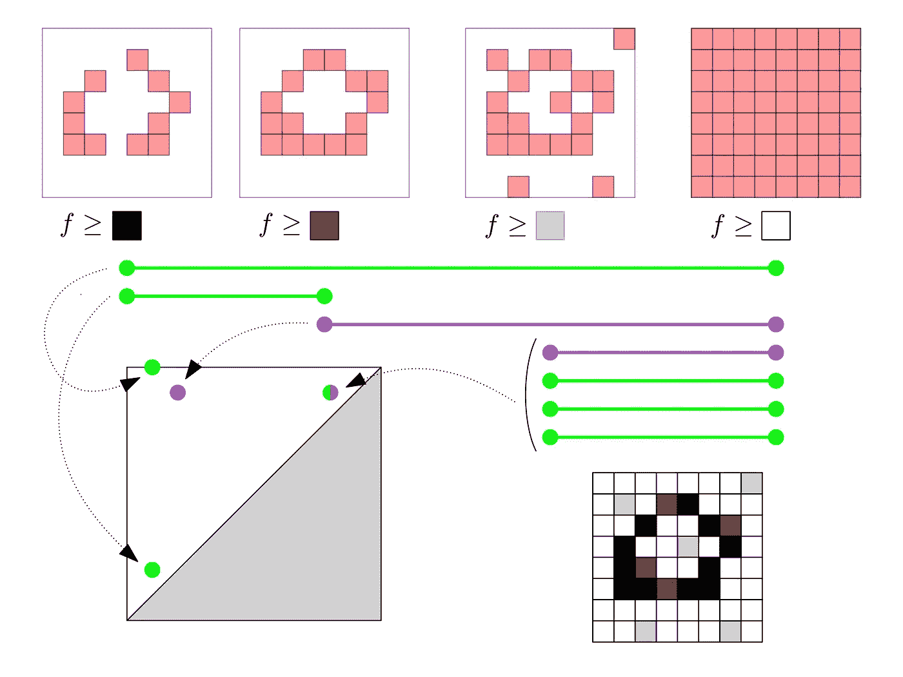
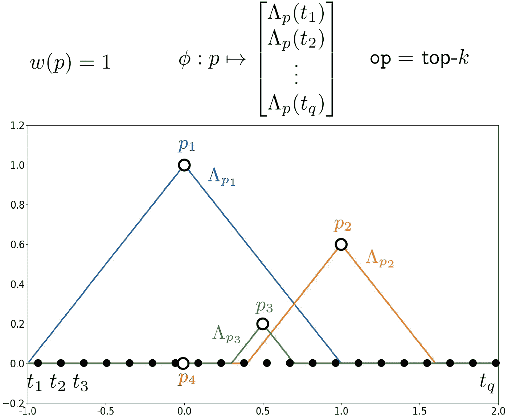

# 用 PersLay 混合拓扑和深度学习

> 原文：<https://towardsdatascience.com/mixing-topology-and-deep-learning-with-perslay-2e60af69c321?source=collection_archive---------9----------------------->

Source: [Sky Motion](https://www.shutterstock.com/fr/g/Sky+Motion/video) / Shutterstock.com

在[前一篇](/a-concrete-application-of-topological-data-analysis-86b89aa27586)中，我提出了**拓扑数据分析**及其主要描述符，即所谓的**持久性图**。在这篇文章中，我想展示如何将这些描述符与神经网络结合起来，为基于深度学习和拓扑的应用开辟道路！

# 什么是持久性图？

简而言之，持久性图是平面中表示数据拓扑的一组点:图中的每个点实际上都见证了数据中拓扑特征的存在。此类特征可以是连接的组件(0 维拓扑)、回路(1 维拓扑)、空腔(2 维拓扑)等。

在下面的例子中，我展示了一个从零的图像(显示在右下角)计算出的持久性图的例子。这个想法是通过逐步增加像素来过滤图像。更具体地说，我们仅从那些灰度值大于给定阈值的像素开始，并且让该阈值从大值减小到低值，直到最终所有像素都存在。在这个过程中，可能会发生一些拓扑变化(例如创建和合并连接的组件和/或孔洞)，而持久性图会准确地编码这些变化。每次拓扑事件发生时，都会在持久性图中产生一个点，该点的坐标提供了该事件发生的阈值。

Example of computation of a persistence diagram from an image (source: [https://www.dropbox.com/s/hihxt8cuz265bf9/phd.pdf?dl=0](https://www.dropbox.com/s/hihxt8cuz265bf9/phd.pdf?dl=0)).

这个描述符很有趣，特别是因为它编码了*拓扑信息，*这是不寻常的，并且通常是对机器学习中更传统的描述符编码的信息的补充。然而，由于持久性图的空间不是结构化的(例如，不可能以一致的方式添加两个持久性图)，在过去几年中已经定义了几个*特征图*，即，将持久性图嵌入到希尔伯特空间(例如有限维欧几里得空间)中。它们中的大多数现在可以在 scikit-learn 兼容库 [*sklearn_tda*](https://github.com/MathieuCarriere/sklearn_tda) 中获得。

# PersLay:持久性图表的层

今天，我想介绍一个我和我的合著者在过去几个月里开发的便利工具，它叫做*PersLay* 。 ***PersLay* 是一个神经网络层，它适合处理持久性图**，并且概括了我上面提到的大多数特征图。更具体地说，**文献的每个特征图都可以由 PersLay 用适当的参数生成。**这尤其意味着特征图可以在训练期间即时学习。不再需要密集的交叉验证！！

此外，由于任何后续的神经网络都可以在 PersLay 之后插入，它允许持久性图被任何架构处理，无论它有多复杂。

**PersLay 的定义实际上很简单** :-)事实上，当一个人希望以一种可微分的方式将持久性图转化为向量(以便可以反向传播)时，首要的要求是对图点的排列保持不变。假设您必须处理两组点，它们唯一的区别在于点的排序:您可能希望输出是相同的！

生成排列不变且可微分的特征图的最简单方法可能是将持久性图的每个点变成一个向量，然后对所有这样的向量求和，最终得到一个向量(实际上，可以使用许多其他操作来代替求和，考虑取最大值、平均值、最大的 *n* 值……)。**这正是 PersLay 的定义。**

Definition of PersLay for a persistence diagram Dg. In this equation, w(p) is a weight function, phi is a vector transformation, and op is any permutation-invariant operation (source: [https://arxiv.org/pdf/1904.09378.pdf](https://arxiv.org/pdf/1904.09378.pdf)).

# PersLay 的模块化

原来**TDA 文献中的所有特征地图实际上都符合这个一般方法！**根据将图点转化为向量的方式以及所使用的排列不变运算，可以看出应用上述方法相当于计算[余辉图像](https://arxiv.org/abs/1507.06217)、[余辉景观](http://www.jmlr.org/papers/volume16/bubenik15a/bubenik15a.pdf)、[余辉轮廓](https://arxiv.org/abs/1312.0308) …

以持久性景观为例。这个方法是第一个被定义来处理持久性图的特性图。其定义如下:对于平面上的每个点 *p* ，统计该点 *p* 位于左上角有余辉图点的正方形内的余辉图点数。由此，你得到了平面上的分段常数函数。第 *k-* 个持续景观被定义为包含具有函数值 *k* 的所有点的平面区域的边界。通过随机采样点并评估这些点上的持久性景观，该边界最终被转化为一个数字向量。

Example of persistence landscape computation (source: [http://www.jmlr.org/papers/volume16/bubenik15a/bubenik15a.pdf](http://www.jmlr.org/papers/volume16/bubenik15a/bubenik15a.pdf))

事实证明，持久性景观可以被认为是 PersLay 的特殊实例！事实上，生成持久性景观的一个更简单的方法是将一个三角形函数与每个持久性图点相关联，并对该函数进行采样以获得向量。那么第 *k* 个持续性景观就是这些向量的每个坐标的第 *k* 个最大值！

PersLay parameters for the generation of persistence landscapes (source: [https://arxiv.org/abs/1904.09378](https://arxiv.org/abs/1904.09378)).

# 持久性图的简单架构

这使得持久性图可以在各种各样的任务中使用，这在以前是无法实现的！事实上，即使对于成千上万的持久性图，用传统的分类器(如 SVM 或随机森林)对所有可能的特征图进行交叉验证也太昂贵了(就运行时间而言)。另一方面，用 PersLay 的几行代码就可以做到:-D

更准确地说，PersLay 的输出可以用作任何后续神经网络的输入。在与 PersLay 相关的[文章中，我们研究了一个简单的架构，其中从每个数据点生成几个持久性图，并且这些图中的每一个都由特定的 PersLay 通道单独处理。然后将所有通道的输出连接起来(带有一些附加功能)，我们使用一个完全连接的层来产生具有正确维度的结果。](https://arxiv.org/abs/1904.09378)

A simple architecture using PersLay.

对于那些想了解更多这方面知识的人，有一个关于 PersLay 和这种架构的[教程](https://github.com/MathieuCarriere/perslay)，里面有一些很酷的图分类应用。我真的希望你也对这种神经网络和拓扑数据分析的新组合感到兴奋。除了分类之外，神经网络还有许多其他应用，所以请继续关注其他即将发布的帖子！