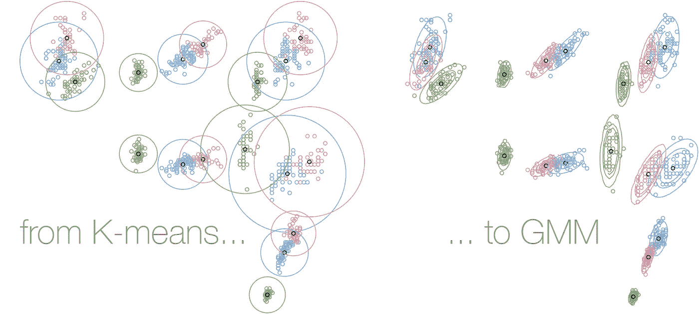
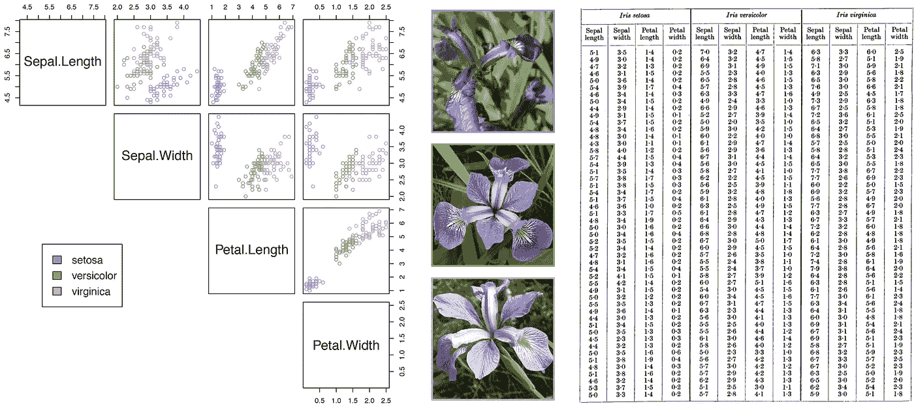
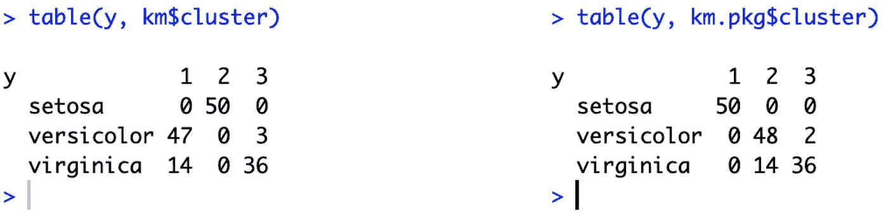
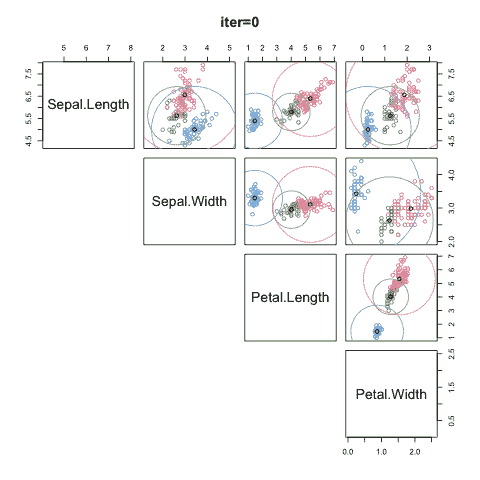
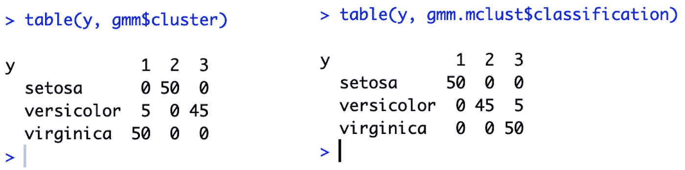
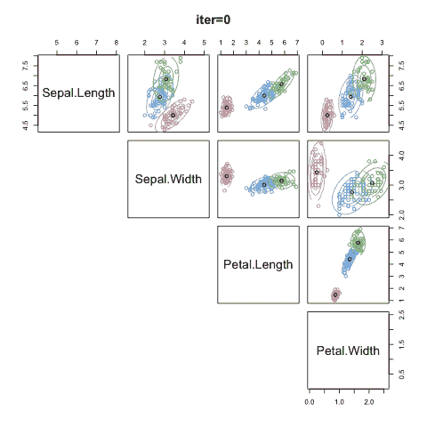

# 混合建模从零开始，在 R

> 原文：<https://towardsdatascience.com/mixture-modelling-from-scratch-in-r-5ab7bfc83eef?source=collection_archive---------1----------------------->

## 从 K-means 到高斯混合建模，浓缩在几行代码中



在机器学习文献中， [**K-means**](https://en.wikipedia.org/wiki/K-means_clustering) 和 [**高斯混合模型**](https://en.wikipedia.org/wiki/Mixture_model#Gaussian_mixture_model) (GMM)是第一个描述的聚类/无监督模型[1–3]，因此，应该是任何数据科学家工具箱的一部分。在 R 中，可以使用`kmeans()`、`Mclust()`或其他类似的函数，但是要完全理解那些算法，需要从头开始构建它们。网上搜索会引导你找到许多有用的教程，但是你很难找到完全透明的 R 代码。我遇到的最好的例子是 R-bloggers 上的一篇优秀文章'[高斯混合建模介绍](https://www.r-bloggers.com/an-intro-to-gaussian-mixture-modeling/)'。

但我仍然有点不满意。这就是我一直在寻找的东西:

*   A-to-Z 算法(数据->算法->结果)
*   独占使用 R 基础包(无隐藏计算)
*   多变量情况(不仅仅是单变量或双变量)
*   优雅的代码(K-means 和 GMM 之间的平行极简)
*   用于绘制算法迭代动画的选项

我上面提到的代码满足了大约一半的需求(从 A 到 Z，优雅的 GMM 多元代码)。我通过更多的研究完成了剩下的部分，结果如下。请注意，我将这篇文章写得很短，重点放在算法的本质上。方程式可以在维基百科和 ML 教材上找到。r 代码被注释只是为了给出足够多的关于建模步骤的细节。我还为 K-means 和 GMM 使用了相同的结构来突出它们之间的明显相似之处(即分别是 [**期望最大化**](https://en.wikipedia.org/wiki/Expectation%E2%80%93maximization_algorithm) 算法的硬版本和软版本)。

# 我们的数据

为了说明，我们将把那些聚类算法应用于著名的 [**虹膜数据集**](https://en.wikipedia.org/wiki/Iris_flower_data_set) 。在 20 世纪初，Edgar Anderson 收集数据量化了三种鸢尾花的形态变异:*鸢尾*、*海滨鸢尾*和*杂色鸢尾*。该数据集由 3 个物种的 50 个样本和 4 个特征组成:萼片和花瓣的长度和宽度[4]。英国统计学家和遗传学家**罗纳德·费雪**(1890–1962)，*一个几乎是单枪匹马为现代统计科学奠定基础的天才*【5】，然后在*“分类问题中多重测量的使用*’【6】中使用这个数据集作为[线性判别分析](https://en.wikipedia.org/wiki/Linear_discriminant_analysis) (LDA)的例子。从那时起，Iris 数据集已经成为简单多维聚类问题的教科书示例(尽管 Fisher 显然使用了 LDA 的标签，LDA 是一种监督学习模型)。`iris`数据集包含在 R `datasets`包中。

```
X <- iris[,1:4]
y <- iris[,5]y_col <- c('#7DB0DD', '#86B875', '#E495A5')pdf('dat_iris.pdf')
pairs(X, lower.panel = NULL, col = y_col[y])
par(xpd = T)
legend(x = 0.1, y = 0.4, legend = as.character(levels(y)), fill = y_col)
dev.off()
```



**The Anderson/Fisher Iris flower dataset** | Features and labels from the R `datasets` package; photographs of the 3 Iris species, source: [Wikipedia](https://en.wikipedia.org/wiki/Iris_flower_data_set); and original data, Table 1 of [6].

# k 均值

我们从优秀的综述“*数据聚类:50 年后的 K-means*”[7]中了解到，聚类方法的发展是一项跨学科的努力，有来自分类学家、生物学家、心理学家、统计学家、工程师等的众多贡献。“数据聚类”一词首次出现在 1954 年一篇关于人类学数据的文章的标题中。在现有的所有聚类算法中，K-means 算法是最流行和最简单的。它有着丰富多样的历史，因为它是在 1956 年至 1967 年间在不同的科学领域独立发现的[8–9]。下面的注释 R 代码对此进行了描述:

```
# finds partition such that squared error between empirical mean
# and points in cluster is minimized over all k clusters
km.fromscratch <- function(X, k){
  p <- ncol(X)  # number of parameters
  n <- nrow(X)  # number of observations
  Delta <- 1; iter <- 0; itermax <- 30
  while(Delta > 1e-4 && iter <= itermax){
    # initiation
    if(iter == 0){
      centroid <- X[sample(nrow(X), k),]
      centroid_mem <- centroid
    }

    # equivalent to E-step
    d <- sapply(1:k, function(c) sapply(1:n, 
      function(i) sum((centroid[c,] - X[i,])^2) ))
    cluster <- apply(d, 1, which.min)

    # equivalent to M-step
    centroid <- t(sapply(1:k, function(c) 
      apply(X[cluster == c,], 2, mean)))

    Delta <- sum((centroid - centroid_mem)^2)
    iter <- iter + 1; centroid_mem <- centroid
  }
  return(list(centroid = centroid, cluster = cluster))
}# run K-means
km <- km.fromscratch(X, 3)
pairs(X, lower.panel = NULL, col = km$cluster)
table(y, km$cluster)
```

我们来对比一下打包的算法`km.pkg <- kmeans(X, 3)`:



以下动画基于建议的 R 代码，但使用`pairs()`功能的面板选项绘制了集群球形决策边界的半径。为了清楚起见，这在前面的代码中没有显示，因为它的大小已经翻倍了！然而，附录中提供了完整的代码。与鸢尾属物种标记相比，我们得到了 88.7% 的**(对于 *setosa* 没有错误，对于 *versicolor* 有 3 个错误分类的观察值，对于 *virginica* 有 14 个错误分类的观察值——注意，结果可能会因随机启动而略有变化)。使用`kmeans()`内置的 R 函数会产生类似的结果，但速度更快。**



**K-means clustering of the Iris dataset** | The different iterations to convergence, with radius of the cluster spherical decision boundary plotted.

# 高斯混合模型

高斯混合(高斯混合模型或 GMM)是最广泛使用的混合模型。GMM 可以被描述为具有高斯密度的 K-均值的软版本。下面是多维情况下的 R 代码，这意味着我们采用全张量，这是通过多元正态分布和协方差矩阵的特征分解来了解 GMM 所有复杂性的最佳方式。我们开始吧:

```
# Uses EM algorithm with multivariate normal
# distribution to estimate cluster probability
mvnorm.cov.inv <- function(Sigma) {
  # Eigendecomposition of covariance matrix
  E <- eigen(Sigma)
  Lambda.inv <- diag(E$values^-1)   # diagonal matrix
  Q <- E$vectors
  return(Q %*% Lambda.inv %*% t(Q))
}#multivariate Gaussian pdf
mvn.pdf.i <- function(xi, mu, Sigma)
  1/sqrt( (2*pi)^length(xi) * det(Sigma) ) * 
  exp(-(1/2) * t(xi - mu) %*% mvnorm.cov.inv(Sigma) 
  %*% (xi - mu)  )mvn.pdf <- function(X, mu, Sigma)
  apply(X, 1, function(xi) mvn.pdf.i(as.numeric(xi), mu, Sigma))gmm.fromscratch <- function(X, k){
  p <- ncol(X)  # number of parameters
  n <- nrow(X)  # number of observations
  Delta <- 1; iter <- 0; itermax <- 30
  while(Delta > 1e-4 && iter <= itermax){
    # initiation
    if(iter == 0){
      km.init <- km.fromscratch(X, k)
      mu <- km.init$centroid; mu_mem <- mu
      w <- sapply(1:k, function(i) length(which(km.init$cluster == i)))
      w <- w/sum(w)
      cov <- array(dim = c(p, p, k))
      for(i in 1:p) for(j in 1:p) for(c in 1:k) cov[i, j, c] <- 
        1/n * sum((X[km.init$cluster == c, i] - mu[c, i]) *
        (X[km.init$cluster == c, j] - mu[c, j]))
    }

    # E-step
    mvn.c <- sapply(1:k, function(c) mvn.pdf(X, mu[c,], cov[,, c]))
    r_ic <- t(w*t(mvn.c)) / rowSums(t(w*t(mvn.c)))

    # M-step
    n_c <- colSums(r_ic)
    w <- n_c/sum(n_c)
    mu <- t(sapply(1:k, function(c) 1/n_c[c] * colSums(r_ic[, c] *
      X)))
    for(i in 1:p) for(j in 1:p) for(c in 1:k) cov[i, j, c] <-
      1/n_c[c] * sum(r_ic[, c] * (X[, i] - mu[c, i]) * r_ic[, c] *
      (X[, j] - mu[c, j])) Delta <- sum((mu - mu_mem)^2)
    iter <- iter + 1; mu_mem <- mu
  }
  return(list(softcluster = r_ic, cluster = apply(r_ic, 1,
    which.max)))
}# run GMM
gmm <- gmm.fromscratch(X, 3)
pairs(X, lower.panel = NULL, col = gmm$cluster)
table(y, gmm$cluster)
```

我们来对比一下来自`library(mclust)`的`gmm.mclust <- Mclust(X, 3)`:



同样，为了清楚起见，本代码中没有显示迭代过程中椭圆的绘制，如下面的动画所示(完整代码请参见附录)。与鸢尾属物种标记相比，当将每个观察分类到最高聚类概率时，我们得到了 96.7% 的**准确度(对于 *setosa* 和 *virginica* 没有错误，对于 *versicolor* 有 5 个观察被错误分类)。但是，请注意，结果可能会因随机参数初始化而略有不同；运行几次算法来研究这种可变性。使用`Mclust()`也能得到类似的结果(但`Mclust()`显然要快得多)。如果我们详细比较两种聚类算法的结果，我们可以看到，是 K-means** 做出的**球形假设使其在 Iris 数据集上的性能略差于 GMM。**



**Gaussian Mixture Modelling of the Iris dataset** | The different iterations to convergence, with elliptic distribution of each cluster plotted.

现在看看这两种算法之间的相似之处，两者都由三个步骤构成:初始、E 步骤和 M 步骤的 [**期望最大化**](https://en.wikipedia.org/wiki/Expectation%E2%80%93maximization_algorithm)**【EM】算法**【10】。EM 是一种简单而强大的迭代算法，它在给定参数的情况下推断聚类(E 步骤)，然后在给定预测聚类的情况下优化参数(M 步骤)之间交替进行。

*瞧*。既然你已经理解了这两个经典聚类算法的步骤，我推荐你使用正式的 R 函数(`kmeans()`、`Mclust()`、*等)。*)，已经过基准测试，效率要高得多。

[1] C. M. Bishop，[模式识别和机器学习](https://www.springer.com/de/book/9780387310732) (2006)，Springer

[1] C. M. Bishop，[模式识别和机器学习](https://www.springer.com/de/book/9780387310732) (2006)，Springer

[2] T. Hastie 等人，[统计学习、数据挖掘、推理和预测的要素](https://www.springer.com/de/book/9780387848570) (2009)，Springer，第二版。

[3] K. P. Murphy，[机器学习，概率视角](https://www.cs.ubc.ca/~murphyk/MLbook/) (2012)，麻省理工学院出版社

[4] E .安德森，[鸢尾属植物中的物种问题](https://www.jstor.org/stable/pdf/2394164.pdf) (1936)，密苏里植物园年报

[5] A .哈尔德，[一部数理统计史](https://www.amazon.com/History-Mathematical-Statistics-Wiley-Probability/dp/0471179124) (1998)，威利

[7] A. K. Jain，[数据聚类:50 年后的 K-means](https://www.sciencedirect.com/science/article/abs/pii/S0167865509002323) (2010)，模式识别字母

[8] H .施泰因豪斯，[《关于各方的材料分工》](http://www.laurent-duval.eu/Documents/Steinhaus_H_1956_j-bull-acad-polon-sci_division_cmp-k-means.pdf) (1956 年)，《波罗乃兹科学院公报》

[9] J. MacQueen，[多变量观测值的一些分类和分析方法](https://projecteuclid.org/download/pdf_1/euclid.bsmsp/1200512992) (1967)，第五届伯克利研讨会

[10] A. P. Dempster 等人，[通过 EM 算法从不完整数据中获得最大似然](http://web.mit.edu/6.435/www/Dempster77.pdf) (1977)，皇家统计学会杂志

## 附录:动画 K 均值

```
wd <- getwd()# finds partition such that squared error between empirical mean
# and points in cluster is minimized over all k clusters
km.fromscratch <- function(X, k, plot = F){
  p <- ncol(X)  # number of parameters
  n <- nrow(X)  # number of observations
  Delta <- 1; iter <- 0; itermax <- 30
  class_col <- c('#7DB0DD', '#86B875', '#E495A5')
  while(Delta > 1e-4 && iter <= itermax){
    # initiation
    if(iter == 0){
      centroid <- X[sample(nrow(X), k),]
      centroid_mem <- centroid
    }

    # equivalent to E-step
    d <- sapply(1:k, function(c) sapply(1:n, function(i) sum((centroid[c,] - X[i,])^2) ))
    cluster <- apply(d, 1, which.min)
    # equivalent to M-step
    centroid <- t(sapply(1:k, function(c) apply(X[cluster == c,], 2, mean)))

    rad <- sapply(1:k, function(c) max(sqrt(d[cluster == c,c])))
    if(plot){
      i <- 1
      idx <- matrix(rep(seq(p), p), ncol = p, nrow = p)
      idx <- idx[lower.tri(idx)]
      idy <- matrix(rep(seq(p), each=p), ncol = p, nrow = p)
      idy <- idy[lower.tri(idy)]
      theta <- seq(0,1,0.01) * 2*pi

      png(paste0(wd, '/fig_kmeans/iter', iter, '.png'))
      pairs(rbind(X, centroid), lower.panel = NULL, asp = 1,
            col = c(class_col[cluster], rep('black', k)), main =
            paste0('iter=',iter), panel=function(x, y, ...) {
              points(x, y, col = c(class_col[cluster], rep('black', k)))
              lines(centroid[, idx[i]][1]+cos(theta)*rad[1], 
                    centroid[, idy[i]][1]+sin(theta)*rad[1], 
                    col=class_col[1])
              lines(centroid[, idx[i]][2]+cos(theta)*rad[2], 
                    centroid[, idy[i]][2]+sin(theta)*rad[2], 
                    col=class_col[2])
              lines(centroid[, idx[i]][3]+cos(theta)*rad[3], 
                    centroid[, idy[i]][3]+sin(theta)*rad[3], 
                    col=class_col[3])
              i <<- i+1
            })
      dev.off()
    }

    Delta <- sum((centroid - centroid_mem)^2)
    iter <- iter + 1; centroid_mem <- centroid
  }
  return(list(centroid = centroid, cluster = cluster))
}# run K-means
km <- km.fromscratch(X, 3, plot = T)
table(y, km$cluster)library(magick)
list.files(path = paste0(wd, '/fig_kmeans/'), pattern = '*.png', full.names = T) %>% 
  image_read() %>%
  image_join() %>%
  image_animate(fps=1) %>%
  image_write('fig_kmeans_anim.gif')
```

## 附录:动画 GMM

```
library(reshape)   #cast()
wd <- getwd()# Uses EM algorithm with multivariate normal
# distribution to estimate cluster probability
mvnorm.cov.inv <- function(Sigma) {
  # Eigendecomposition of covariance matrix
  E <- eigen(Sigma)
  Lambda.inv <- diag(E$values^-1)   # diagonal matrix with inverse of eigenvalues
  Q <- E$vectors                    # eigenvectors
  return(Q %*% Lambda.inv %*% t(Q))
}#multivariate Gaussian pdf
mvn.pdf.i <- function(xi, mu, Sigma)
  1/sqrt( (2*pi)^length(xi) * det(Sigma) ) * 
  exp(-(1/2) * t(xi - mu) %*% mvnorm.cov.inv(Sigma) %*% (xi - mu)  )mvn.pdf <- function(X, mu, Sigma)
  apply(X, 1, function(xi) mvn.pdf.i(as.numeric(xi), mu, Sigma))gmm.fromscratch <- function(X, k, plot = F){
  p <- ncol(X)  # number of parameters
  n <- nrow(X)  # number of observations
  Delta <- 1; iter <- 0; itermax <- 30
  class_col <- c('#7DB0DD', '#86B875', '#E495A5')
  while(Delta > 1e-4 && iter <= itermax){
    # initiation
    if(iter == 0){
      km.init <- km.fromscratch(X, k)
      mu <- km.init$centroid; mu_mem <- mu
      w <- sapply(1:k, function(i) length(which(km.init$cluster == i)))
      w <- w/sum(w)
      cov <- array(dim = c(p, p, k))
      for(i in 1:p) for(j in 1:p) for(c in 1:k) cov[i, j, c] <- 
        1/n * sum((X[km.init$cluster == c, i] - mu[c, i]) *
        (X[km.init$cluster == c, j] - mu[c, j]))
    }

    # E-step
    mvn.c <- sapply(1:k, function(c) mvn.pdf(X, mu[c,], cov[,, c]))
    r_ic <- t(w*t(mvn.c)) / rowSums(t(w*t(mvn.c)))# M-step
    n_c <- colSums(r_ic)
    w <- n_c/sum(n_c)
    mu <- t(sapply(1:k, function(c) 1/n_c[c] * colSums(r_ic[, c] *
      X)))
    for(i in 1:p) for(j in 1:p) for(c in 1:k) cov[i, j, c] <- 
      1/n_c[c] * sum(r_ic[, c] * (X[, i] - mu[c, i]) * r_ic[, c] *
      (X[, j] - mu[c, j]))cluster <- apply(r_ic, 1, which.max)
    if(plot){
      i <- 1
      idx <- matrix(rep(seq(p), p), ncol = p, nrow = p)
      idx <- idx[lower.tri(idx)]
      idy <- matrix(rep(seq(p), each=p), ncol = p, nrow = p)
      idy <- idy[lower.tri(idy)]

      if(iter < 10) iter4plot <- paste0('0', iter) else iter4plot <- iter

      png(paste0(wd, '/figs_gmm/iter', iter4plot, '.png'))
      pairs(rbind(X, mu), lower.panel = NULL, asp = 1, 
        col = c(class_col[cluster], rep('black', k)), main =
        paste0('iter=',iter), panel=function(x, y, ...) {
              points(x, y, col = c(class_col[cluster], rep('black', k)))
              xi <- seq(min(X[, idx[i]])-1, max(X[, idx[i]])+1, 0.1)
              yi <- seq(min(X[, idy[i]])-1, max(X[, idy[i]])+1, 0.1)
              grid <- expand.grid(xi = xi, yi = yi)
              grid['z'] <- mvn.pdf(grid, mu[1,c(idx[i],idy[i])],
                cov[c(idx[i],idy[i]),c(idx[i],idy[i]), 1])
              z <- cast(grid, xi ~ yi)
              contour(xi, yi, as.matrix(z[,-1]), 
                levels = c(.1, .5, .9), col = class_col[1], 
                add = T, lty = 'solid', labels = '')
              grid <- expand.grid(xi = xi, yi = yi)
              grid['z'] <- mvn.pdf(grid, mu[2,c(idx[i],idy[i])], 
                cov[c(idx[i],idy[i]),c(idx[i],idy[i]), 2])
              z <- cast(grid, xi ~ yi)
              contour(xi, yi, as.matrix(z[,-1]), 
                levels = c(.1, .5, .9), col = class_col[2], 
                add = T, lty = 'solid', labels = '')
              grid <- expand.grid(xi = xi, yi = yi)
              grid['z'] <- mvn.pdf(grid, mu[3,c(idx[i],idy[i])], 
                cov[c(idx[i],idy[i]),c(idx[i],idy[i]), 3])
              z <- cast(grid, xi ~ yi)
              contour(xi, yi, as.matrix(z[,-1]), 
                levels = c(.1, .5, .9), col = class_col[3], 
                add = T, lty = 'solid', labels = '')
              i <<- i+1
            })
      dev.off()
    }

    Delta <- sum((mu - mu_mem)^2)
    iter <- iter + 1; mu_mem <- mu
  }
  return(list(softcluster = r_ic, cluster = cluster))
}gmm <- gmm.fromscratch(X, 3, plot = T)
table(y, gmm$cluster)library(magick)
list.files(path = paste0(wd, "/figs_gmm/"), pattern = "*.png", full.names = T) %>% 
  image_read() %>%
  image_join() %>%
  image_animate(fps=1) %>%
  image_write("fig_gmm_anim.gif")
```