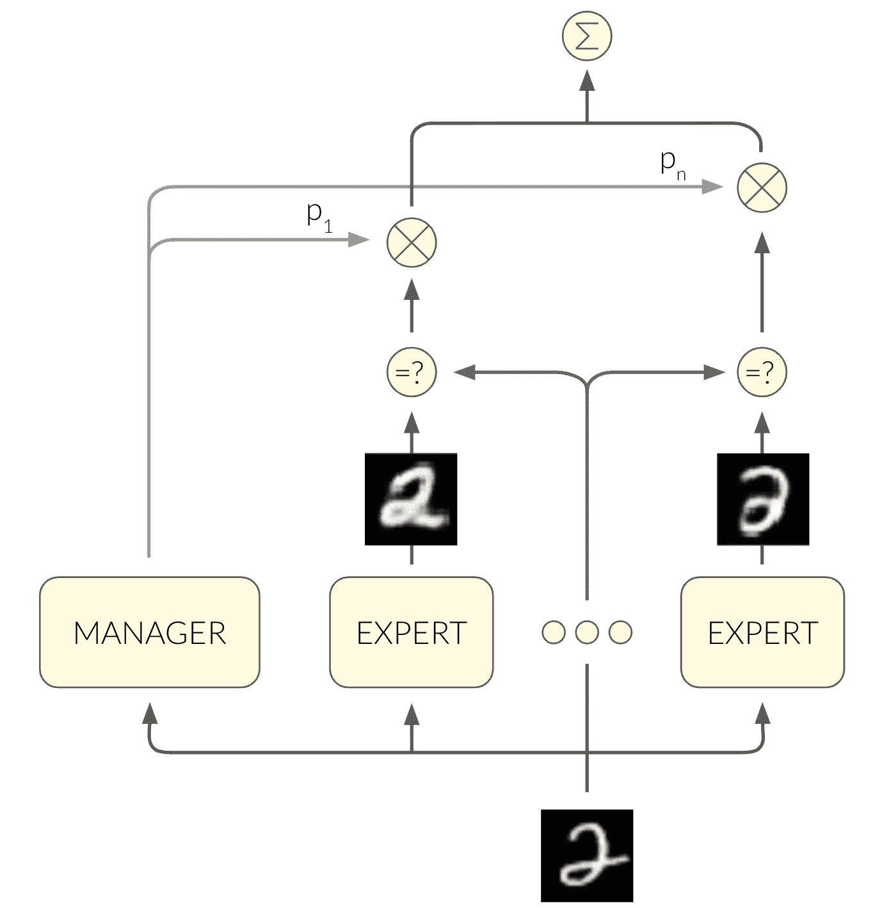

# 可变自动编码器的混合 MoE 和 VAE 的融合

> 原文：<https://towardsdatascience.com/mixture-of-variational-autoencoders-a-fusion-between-moe-and-vae-22c0901a6675?source=collection_archive---------12----------------------->

## 一种无监督的数字分类和生成方法

[变分自动编码器(VAE)](http://anotherdatum.com/vae.html) 是试图学习输入空间形状的神经网络的典范。一旦经过训练，该模型可用于从输入空间生成新样本。

如果我们有输入数据的标签，那么[也可以在标签上设定生成过程](http://anotherdatum.com/vae2.html)。在 [MNIST](https://en.wikipedia.org/wiki/MNIST_database) 的情况下，这意味着我们可以指定我们想要为哪个数字生成图像。

让我们更进一步……我们能在完全不使用标签的情况下根据数字来决定生成过程吗？我们能用无监督的方法达到同样的结果吗？

如果我们想依赖标签，我们可以做一些简单得令人尴尬的事情。我们可以训练 10 个独立的 VAE 模型，每个模型都使用一位数的图像。

那显然可以，但是你用的是标签。那是作弊！

好吧，我们根本不用它们。让我们训练我们的 10 个模型，在把它传给合适的模型之前，用我们的眼睛看一下每张图像。

嘿，你又作弊了！虽然您不使用标签本身，但您确实会查看图像，以便将它们发送到适当的模型。

好吧……如果我们让另一个模特学习路线，而不是自己做路线，那根本不算作弊，不是吗？

**对！:)**

我们可以使用 11 个模块的架构，如下所示:

A manager module routing an input to the appropriate expert module

但是经理如何决定将图像传递给哪个专家呢？我们可以训练它来预测图像的数字，但是我们不想使用标签！

**唷…我还以为你要作弊呢…**

那么，我们如何在不使用标签的情况下培训经理呢？这让我想起了一种不同类型的模型——专家混合模型。让我绕个小圈子来解释一下 MoE 是如何工作的。我们需要它，因为它将是我们解决方案的关键组成部分。

# 向非专家解释的专家组合

MoE 是一个监督学习框架。你可以在 Coursera 和 YouTube 上找到 Geoffrey Hinton 的精彩解释。MoE 依赖于根据𝑥→𝑦映射对输入进行分段的可能性。看看这个简单的函数:

地面实况被定义为𝑥的紫色抛物线

In complex datasets we might not know the split points. One (bad) solution is to segment the input space by clustering the 𝑥’s using K-means. In the two parabolas example, we’ll end up with 𝑥’’ as the split point between two clusters. Thus, when we’ll train the model on the 𝑥

So how can we train a model that learns the split points while at the same time learns the mapping that defines the split points?

MoE does so using an architecture of multiple subnetworks — one manager and multiple experts:

MoE architecture

The manager maps the input into a soft decision over the experts, which is used in two contexts:

First, the output of the network is a weighted average of the experts’ outputs, where the weights are the manager’s output.

Second, the loss function is

𝑦¡ is the label, 𝑦¯¡ is the output of the i’th expert, 𝑝¡ is the i’th entry of the manager’s output. When you differentiate the loss, you get these results (I encourage you to watch the [视频](https://www.youtube.com/watch?v=d_GVvIBlWtI)了解更多详情):

1.  经理为每个专家决定它对损失的贡献大小。换句话说，管理者选择哪些专家应该根据他们的误差来调整他们的权重。
2.  管理器以这样一种方式调整它输出的概率，使得答对的专家将比没答对的专家获得更高的概率。

这个损失函数鼓励专家专攻不同种类的输入。

# 拼图的最后一块……是𝑥

让我们回到我们的挑战！MoE 是一个监督学习的框架。当然，我们可以把𝑦换成𝑥，在无人监管的情况下，对不对？MoE 的强大之处在于，每位专家都专门研究输入空间的不同部分，并具有唯一的制图𝑥→𝑦.如果我们使用映射𝑥→𝑥，每个专家将专注于输入空间的不同部分，在输入本身中具有独特的模式。

我们将使用 VAEs 作为专家。VAE 的部分损失是重建损失，其中 VAE 试图重建原始输入图像𝑥:

MoE architecture where the experts are implemented as VAE

这种架构的一个很酷的副产品是，管理器可以使用图像的输出向量对图像中的数字进行分类！

在训练这个模型时，我们需要小心的一件事是，管理器可能很容易退化为输出一个常量向量——不管手头的输入是什么。这导致一个 VAE 专用于所有数字，而九个值不专用于任何数字。在教育部的论文中描述了一种减轻损失的方法，即在损失中增加一个平衡项。它鼓励管理者的输出在一批输入中达到平衡:

说够了，训练时间到了！

Images generated by the experts. Each column belongs to a different expert.

在最后一张图中，我们看到了每个专家都学到了什么。在每个时期之后，我们使用专家从他们擅长的分布中生成图像。第 I 列包含第 I 个专家生成的图像。

我们可以看到，一些专家很容易地专注于一个位数，例如— 1。有些人被相似的数字搞糊涂了，比如专家既擅长 3 又擅长 5。

*An expert specializing in 2*

# 还有什么？

使用一个简单的模型，不需要太多的调整，我们得到了合理的结果。最理想的情况是，我们希望每个专家专门研究一个数字，从而通过管理器的输出实现完美的无监督分类。

另一个有趣的实验是把每个专家变成他们自己的 MoE！它将允许我们学习 vae 应该专门化的分级参数。例如，一些数字有多种绘制方式:7 可以有或没有删除线。这种变化的来源可以由层次结构中第二级的教育部来模拟。但是我会为以后的帖子留些东西…

*原文由我在***发表。**