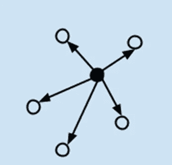
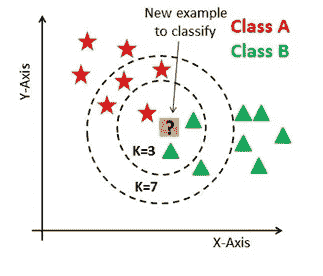
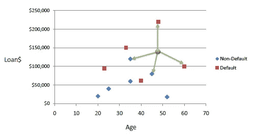
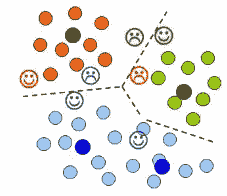
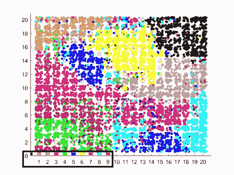
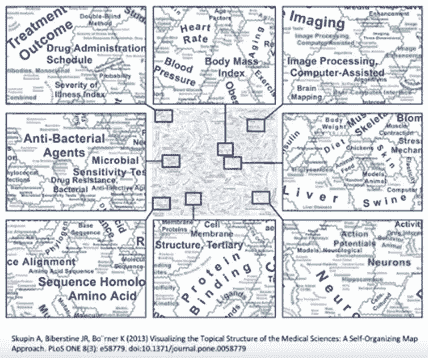
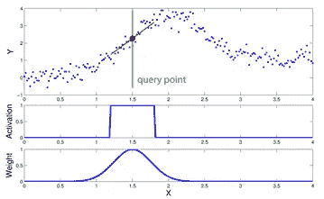

# ML 算法:一种基于 SD (σ)实例的算法

> 原文：<https://towardsdatascience.com/ml-algorithms-one-sd-%CF%83-instance-based-algorithms-4349224ed4f3?source=collection_archive---------6----------------------->

## 基于实例的机器学习算法简介

当面对各种各样的机器学习算法时，一个显而易见的问题是“哪种算法更适合特定的任务，我应该使用哪种算法？”

> 回答这些问题取决于几个因素，包括:(1)数据的大小、质量和性质；(2)可用的计算时间；(3)任务的紧迫性；以及(4)你想用这些数据做什么。

这是我在[以前的文章](/ml-algorithms-one-sd-σ-74bcb28fafb6)中写的许多算法中的一部分。
在这一部分中，我试图尽可能简单地展示和简要解释可用于基于实例的任务的主要算法(尽管不是全部)。

# **基于实例的算法:**

> *这些算法不执行显式归纳，而是将新的问题实例与训练中看到的实例进行比较，这些实例已经存储在内存中。*

**K-最近邻(KNN)**

可用于分类和回归问题。KNN 存储所有可用病例，并通过其 K 个邻居的多数投票对新病例进行分类。通过在整个训练集中搜索 K 个最相似的实例(邻居)并总结这 K 个实例的输出变量，对新的数据点进行预测。例如，如果我们取 K=3，并且我们想要决定一个新的例子属于哪一类，我们考虑离新的例子最近的 3 个点(通常是欧几里德距离)。

对于回归问题，这可能是平均输出变量:

*需要考虑的一些事情:*

选择 K 的最佳值最好通过首先检查数据来完成(您可以使用弯头方法)。

这是一种监督学习算法。

**学习矢量量化(LVQ)**

作为分类算法开发。它能够支持二元(两类)和多类分类问题。K 近邻的一个缺点是，您需要保留整个训练数据集。LVQ 是一种人工神经网络算法，允许您选择要保留多少训练实例，并准确学习这些实例应该是什么样子。实例数量的值在学习过程中被优化。

*需要考虑的一些事情:*

这是一种监督学习方法

如果您发现 KNN 在数据集上给出了很好的结果，请尝试使用 LVQ 来减少存储整个训练数据集的内存需求。

**自组织映射(SOM)**

一种无监督的深度学习模型，主要用于特征检测或降维。SOM 不同于其他人工神经网络，因为它应用竞争学习，而不是纠错学习(如梯度下降的反向传播)，并且在某种意义上，它们使用邻域函数来保持输入空间的拓扑属性。SOM 执行从高维空间到二维空间的拓扑有序映射。换句话说，它产生训练样本集的输入空间的二维表示。

例如，让我们看看手写数字数据集。SOM 的输入是高维的，因为每个输入维度表示 28×28 图像上一个像素的灰度值，这使得输入是 784 维的(每个维度是 0 到 255 之间的值)。

如果我们将它们映射到 20x20 SOM，并根据它们的真实类别(从 0 到 9 的数字)对它们进行着色，我们将得到以下结果:

真实类别根据左下方的颜色进行标注。

看一下黄色区域。这就是 6 被映射到的地方，请注意与其他类别有一点重叠。相比之下，看看左下方，绿色和棕色的点重叠的地方。这就是高级官员在 4 和 9 之间感到“困惑”的地方。

SOM 的另一个例子是 NLP。我们可以用它对 200 万份医学论文进行分类。SOM 将创建一组意思相似的单词:

右下方的单词与大脑相关，右上方的单词与医学影像相关。

*需要考虑的一些事情:*

SOM 输出任意数量指标的 2D 图。

我们可以使用 SOM 对数据进行聚类，而不需要知道输入数据的类成员。

**局部加权学习(LWL)**

LWL 背后的基本思想是，不是为整个函数空间建立全局模型，而是基于查询点的相邻数据为每个感兴趣的点创建局部模型。

为此，每个数据点成为一个加权因子，它表示该数据点对预测的影响。通常，与当前查询点邻近的数据点比远离的数据点接收更高的权重。基本上，假设你想预测未来会发生什么。你可以简单地进入你以前所有经历的数据库，然后抓住一些相似的经历，将它们组合起来(也许通过加权平均，更强地加权更多相似的经历)，并使用组合来做出预测。

*需要考虑的一些事情:*

LWL 方法是非参数的。

> 如果你对我的更多作品感兴趣，你可以看看我的 [Github](https://github.com/shaier) ，我的[学者页面](https://scholar.google.com/citations?user=paO-O00AAAAJ&hl=en&oi=sra)，或者我的[网站](https://shaier.github.io/)