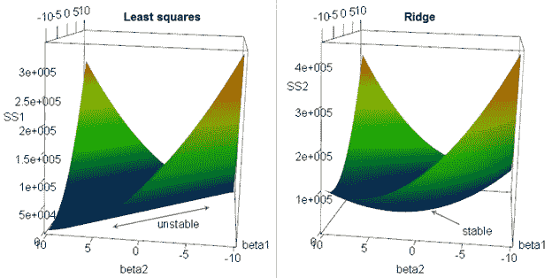
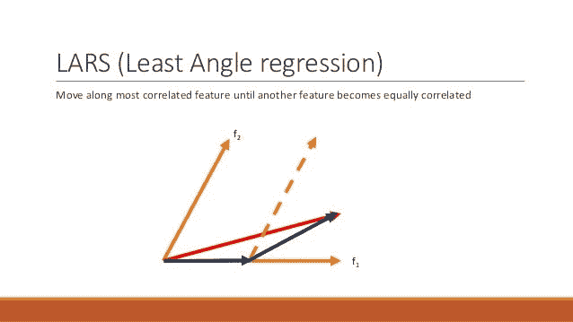

# ML 算法:一种 SD (σ)-正则化算法

> 原文：<https://towardsdatascience.com/ml-algorithms-one-sd-%CF%83-regularization-algorithms-728af0e92f84?source=collection_archive---------25----------------------->

## 机器学习正则化算法简介

当面对各种各样的机器学习算法时，要问的明显问题是“哪种算法更适合特定的任务，我应该使用哪种算法？”

> 回答这些问题取决于几个因素，包括:(1)数据的大小、质量和性质；(2)可用的计算时间；(3)任务的紧迫性；以及(4)你想用这些数据做什么。

这是我在以前的[文章](/ml-algorithms-one-sd-σ-74bcb28fafb6)中写的许多算法中的一部分。
在这一部分，我试图尽可能简单地展示和简要解释正则化任务的主要算法(虽然不是全部)。

# 正则化算法:

我发现这些算法特别有用。大多数数据科学家会发现他们的一些模型在他们职业生涯的某个时候过度拟合。这些算法背后的一般思想是，它们试图最小化甚至防止过拟合。

# **岭回归** ( **L2 正规化**)

它的目标是解决数据过度拟合的问题，以及当数据出现多重共线性时(多重回归模型中的多重共线性是两个或多个解释变量之间高度线性相关的关联)。在特征变量之间存在高度共线性(独立变量之间存在近似线性关系)的情况下，标准线性或多项式回归模型将会失败。岭回归给变量增加了一个小的平方偏差因子。这种平方偏差因子使特征可变系数远离这种刚性，将少量偏差引入到模型中，但极大地减少了方差。

*需要考虑的一些事情:*

脊很好地避免了过度拟合。

如果数据集中有一个包含大量要素的模型，并且希望避免模型过于复杂，请使用正则化来解决过度拟合和要素选择问题。

岭有一个主要缺点，它包括最终模型中的所有 N 个特征。

当您有高度相关的变量时，岭回归会使两个系数相互缩小。Lasso 有点无所谓，一般都是挑一个不选一个。

根据上下文，我们不知道选择哪个变量。弹性网是两者之间的折衷，它试图同时收缩和进行稀疏选择。

# **最小绝对收缩和选择算子(拉索，L1 正则化**

与岭回归相反，它只惩罚高系数。当超参数θ足够大时，Lasso 具有迫使某些系数估计精确为零的效果。因此，可以说 Lasso 执行变量选择产生的模型比岭回归产生的模型更容易解释。基本上，它减少了可变性，提高了线性回归模型的准确性。

*需要考虑的一些事情:*

Lasso 是一种用于执行线性回归的正则化技术。

Lasso 是逐步回归和其他模型选择和降维技术的一种替代方法。

在我们有大量特征的情况下，LASSO 对于特征选择很有效(它减少了冗余的特征并识别出重要的特征)。

它将系数缩减为零(与将系数的“平方值”作为惩罚项添加到损失函数的 Ridge 相比)。

如果一组预测值高度相关，lasso 只选择其中一个，并将其他预测值缩减为零。

其他方法，如交叉验证、逐步回归，对于减少过度拟合和执行特征选择相当有效。但是，它们主要处理少量的功能。山脊线和套索适用于大量要素。

# **弹力网**

结合了套索和脊的特点。弹性网减少了不同特征的影响，同时没有消除所有的特征。Lasso 将消除许多特征，并减少线性模型中的过度拟合。岭将减少在预测 y 值时不重要的要素的影响。弹性网结合了 Lasso 中的要素消除和 Ridge 模型中的要素系数减少来改善模型的预测。

*需要考虑的一些事情:*

当你有几个高度相关的变量时，使用弹性网。

当有多个相关的特征时很有用。Lasso 可能会随机选择其中一个，而 elastic-net 可能会两个都选。

研究表明，当用于具有高度相关预测值的类似数据时，弹性网技术可以优于 LASSO。

# **最小角度回归(LARS)**

类似于向前逐步回归。在每一步，它都会找到与响应最相关的预测值。当存在具有相等相关性的多个预测器时，不是沿着同一预测器继续，而是在预测器之间的等角方向上继续。最小角度回归就像向前逐步回归的一个更“民主”的版本。它遵循向前逐步回归的相同一般方案，但是没有将预测器完全添加到模型中。该预测器的系数仅增加，直到该预测器不再是与剩余 r 最相关的预测器。然后，邀请一些其他竞争预测器“加入俱乐部”。它从所有系数都等于零开始，然后找到与 y 最相关的预测值。它在与 y 相关的符号方向上增加系数，然后在此过程中获取残差，当其他一些预测值与 r 的相关性与第一个预测值一样大时停止。

*需要考虑的一些事情:*

当维数明显大于点数时，这是有用的

如果两个变量与响应的相关性几乎相等，那么它们的系数应该以大致相同的速率增加。

如果数据是高维的或者有多重共线性，就不能很好地工作。

> 如果你对我的更多作品感兴趣，你可以看看我的 [Github](https://github.com/shaier) ，我的[学者页面](https://scholar.google.com/citations?user=paO-O00AAAAJ&hl=en&oi=sra)，或者我的[网站](https://shaier.github.io/)