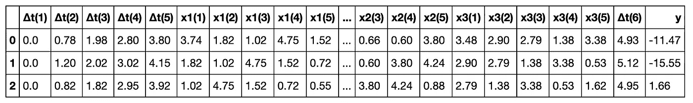

# 时间序列的 ML 方法

> 原文：<https://towardsdatascience.com/ml-approaches-for-time-series-4d44722e48fe?source=collection_archive---------0----------------------->

## [时间序列数据的机器学习方法](https://towardsdatascience.com/tagged/ML-Time-Series)

用非常规模型模拟时间序列


在这篇文章中，我尝试了一些机器学习技术来分析时间序列数据，并探索它们在这种情况下的潜在用途。

在这第一篇文章中，只开发了索引的第一点。其余的有一个单独的帖子，可以从索引中访问。

**注意:**这项工作是在 2017 年初完成的，所以很可能有些库已经更新了。

# 索引

1 —数据创建、窗口和基线模型
2 —遗传编程:符号回归
3 —极限学习机
4 —高斯过程
5—卷积神经网络

# 1 —数据创建、窗口和基线模型

## 1.1 —数据创建

在这项工作中，我们将对**非均匀间隔时间序列**数据进行分析。我们将创建 3 个随机变量 *x1* 、 *x2* 和 *x3* 的合成数据，并向这些变量的一些滞后的线性组合添加一些噪声，我们将确定 y，即响应。

这样，我们可以确保函数不是 100%可预测的，响应取决于预测器，并且存在由预测器的先前**滞后对响应的影响引起的**时间依赖性**。**

该 python 脚本将在给定时间序列数据的情况下创建窗口，以便以一种我们可以为模型提供尽可能完整的信息的方式来构建问题。

让我们看看，首先，我们有哪些数据，我们将采用什么样的治疗方法。

```
N = 600

t = np.arange(0, N, 1).reshape(-1,1)
t = np.array([t[i] + np.random.rand(1)/4 **for** i **in** range(len(t))])
t = np.array([t[i] - np.random.rand(1)/7 **for** i **in** range(len(t))])
t = np.array(np.round(t, 2))

x1 = np.round((np.random.random(N) * 5).reshape(-1,1), 2)
x2 = np.round((np.random.random(N) * 5).reshape(-1,1), 2)
x3 = np.round((np.random.random(N) * 5).reshape(-1,1), 2)

n = np.round((np.random.random(N) * 2).reshape(-1,1), 2)

y = np.array([((np.log(np.abs(2 + x1[t])) - x2[t-1]**2) + 0.02*x3[t-3]*np.exp(x1[t-1])) **for** t **in** range(len(t))])
y = np.round(y+n, 2)
```


然后，我们有一个函数 y，它是 3 个独立随机变量的响应，并带有一个附加噪声。此外，响应与独立变量的滞后直接**相关，而不仅仅是与它们在给定点的值相关。这样我们确保了**时间依赖性**，并且我们强制我们的模型能够识别这种行为。**

此外，时间戳的间隔**也不均匀**。通过这种方式，我们强化了这样一个想法，即我们希望我们的模型能够理解时间依赖性，因为它们不能仅仅根据观察值(行)的数量来处理序列。

我们包含了指数和对数运算符，目的是**在数据中引入高度非线性**。

## 1.2 —窗户框架

这项工作的所有模型所遵循的方法是通过固定的窗口来重塑我们所拥有的信息，这些窗口将在给定的时间点从最近的过去给模型提供尽可能最完整的信息，以便实现准确的预测。此外，我们将检查将响应本身的先前值作为独立变量如何影响模型。

让我们看看我们将如何去做:


图中只显示了时间轴和响应。记住，在我们的例子中，还有 3 个变量负责 *t* 的值。

顶部的图片显示了一个选定(固定)尺寸 w 的窗口，在本例中为 4。这意味着，模型将映射包含在该窗口中的信息，预测点在 *t+1* 。响应的大小中有一个 r，因为我们可能想要预测过去的几个时间步长。这将是一种**多对多**关系。为了简单和更容易可视化，我们将使用`r=1`。

我们现在可以看到**滑动窗口**的效果。通过将窗口移动一个时间步到未来，并像我们在上一步中所做的那样继续，获得模型将具有的用于找到映射函数的下一对输入-输出。

那好吧。我们如何将它应用到当前的数据集？让我们看看我们需要什么，并建立我们的助手功能。
但是首先，我们不希望时间是绝对值，我们更感兴趣的是知道哪一个是观察之间的**经过时间**(记住数据不是均匀分布的！).因此，我们创建一个 t，看看我们的数据。

```
dataset = pd.DataFrame(np.concatenate((t, x1, x2, x3, y), axis=1), 
                       columns=['t', 'x1', 'x2', 'x3', 'y'])

deltaT = np.array([(dataset.t[i + 1] - dataset.t[i]) **for** i **in** range(len(dataset)-1)])
deltaT = np.concatenate((np.array([0]), deltaT))

dataset.insert(1, '∆t', deltaT)
dataset.head(3)
```


现在我们知道了数据集的样子，让我们重新创建我们希望我们的帮助函数在一个表的方案上做什么。

对于尺寸为 4 的窗户:


我们的函数要做的是展平窗口中包含的所有信息，即 W 窗口中的所有值，以及我们希望进行预测的时间戳。

这样，我们可以有两个不同的方程来模拟我们的系统，这取决于我们是否包括以前的响应值作为新的预测值。

该函数必须返回的结果应该如下所示:


我们将能够创建`l = n - (w+r) +1`窗口，因为我们丢失了第一行，因为我们没有关于 *Y(0)* 的第一个值的先前信息。

我们提到的所有滞后就像模型的新预测器(在这个可视化中，不包括先前的值 *Y* ，它们将遵循与 *Xi* 相同的值)。然后，我们希望进行预测的时间戳(经过的时间)*∏t(4)*，以及预测应该是什么的对应值 *Y(4)* 。请注意，所有第一个*∏t(0)*都被初始化为 *0* ，因为我们希望将每个窗口标准化为相同的范围。

下面是为实现这一过程而创建的代码。有一个函数 WindowSlider，通过它我们可以创建对象来构造不同的窗口，改变参数。

## 3 —基线模型

> “总是先做简单的事情。只在需要的时候运用智慧”——萨德·斯塔纳

**创建窗口**

```
w = 5
train_constructor = WindowSlider()
train_windows = train_constructor.collect_windows(trainset.iloc[:,1:], 
                                                  previous_y=**False**)

test_constructor = WindowSlider()
test_windows = test_constructor.collect_windows(testset.iloc[:,1:],
                                                previous_y=**False**)

train_constructor_y_inc = WindowSlider()
train_windows_y_inc = train_constructor_y_inc.collect_windows(trainset.iloc[:,1:], 
                                                  previous_y=**True**)

test_constructor_y_inc = WindowSlider()
test_windows_y_inc = test_constructor_y_inc.collect_windows(testset.iloc[:,1:],
                                                previous_y=**True**)

train_windows.head(3)
```



我们可以看到窗口是如何为每个预测带来的，剩余变量过去(window_length)时间步长的记录，以及*∏t*的累加和。

**预测=当前**

我们将首先从一个简单的模型开始，该模型将给出最后一个值(每个预测点的当前值)作为下一个时间戳的预测。

```
*# ________________ Y_pred = current Y ________________* 
bl_trainset = cp.deepcopy(trainset)
bl_testset = cp.deepcopy(testset)

bl_y = pd.DataFrame(bl_testset['y'])
bl_y_pred = bl_y.shift(periods=1)

bl_residuals = bl_y_pred - bl_y
bl_rmse = np.sqrt(np.sum(np.power(bl_residuals,2)) / len(bl_residuals))
print('RMSE = **%.2f**' % bl_rmse)
print('Time to train = **0** seconds')## RMSE = 11.28
```


**结论**我们已经有了一个值，可以与即将得出的结果进行比较。我们应用了给定我的当前值作为预测的简单规则。对于响应值更稳定(即平稳)的时间序列，这种方法有时比最大似然算法表现得更好。在这种情况下，数据的曲折是众所周知的，导致预测能力很差。

## **多元线性回归**

我们的下一个方法是建立一个多元线性回归模型

```
*# ______________ MULTIPLE LINEAR REGRESSION ______________ #***from** **sklearn.linear_model** **import** LinearRegression
lr_model = LinearRegression()
lr_model.fit(trainset.iloc[:,:-1], trainset.iloc[:,-1])

t0 = time.time()
lr_y = testset['y'].values
lr_y_fit = lr_model.predict(trainset.iloc[:,:-1])
lr_y_pred = lr_model.predict(testset.iloc[:,:-1])
tF = time.time()

lr_residuals = lr_y_pred - lr_y
lr_rmse = np.sqrt(np.sum(np.power(lr_residuals,2)) / len(lr_residuals))
print('RMSE = **%.2f**' % lr_rmse)
print('Time to train = **%.2f** seconds' % (tF - t0))## RMSE = 8.61 
## Time to train = 0.00 seconds
```


**结论**

我们可以看到多元线性回归模型是如何无法捕捉到反应行为的。这可能是因为响应和独立变量之间的非线性关系。此外，正是这些变量的滞后影响了给定时间的响应。因此，对于找不到映射此关系的模型，这些值位于不同的行中。

我很想检查一下我们在解释窗户结构时所做的假设。我们说过，我们希望为每个预测点建立一个完整的信息集。因此，预测能力应该增加后，建设的窗口…让我们去吧！

## **带窗口的 MLR**

```
*# ___________ MULTIPLE LINEAR REGRESSION ON WINDOWS ___________* **from** **sklearn.linear_model** **import** LinearRegression
lr_model = LinearRegression()
lr_model.fit(train_windows.iloc[:,:-1], train_windows.iloc[:,-1])

t0 = time.time()
lr_y = test_windows['y'].values
lr_y_fit = lr_model.predict(train_windows.iloc[:,:-1])
lr_y_pred = lr_model.predict(test_windows.iloc[:,:-1])
tF = time.time()

lr_residuals = lr_y_pred - lr_y
lr_rmse = np.sqrt(np.sum(np.power(lr_residuals,2)) / len(lr_residuals))
print('RMSE = **%.2f**' % lr_rmse)
print('Time to train = **%.2f** seconds' % (tF - t0))## RMSE = 3.84
## Time to train = 0.00 seconds
```


**哇！这绝对是一大进步。现在我们有一个非常强大的模型要打败。似乎有了新的窗口，模型能够找到整个窗口信息和响应之间的关系。**

# 2 —符号回归


[符号回归](https://en.wikipedia.org/wiki/Symbolic_regression)是一种回归分析，它搜索数学表达式的**空间，以找到最适合给定数据集的模型。**

符号回归的基础是 [**遗传规划**](https://en.wikipedia.org/wiki/Genetic_programming) ，因此，它是一种[进化算法](https://en.wikipedia.org/wiki/Genetic_algorithm)(又名遗传算法——GA)

简单总结一下算法是如何工作的，首先我们需要理解一个数学表达式可以表示为一个**树形结构**，如上图所示。

这样，算法将从第一代的大量树木开始，根据**适应度**函数来测量，在我们的例子中是 RMSE。然后，每一代中最好的个体在它们之间进行交叉**,并且应用一些**突变**,以包括探索和随机性。当满足停止标准时，该迭代算法结束。**

**这个视频是对基因编程的精彩解释。**

## ****型号****

****************

## **结论**

**我们已经看到，符号回归表现出令人难以置信的好，几乎完美地符合验证数据。**

**令人惊讶的是，我通过只包含四个最简单的操作符(加、减、乘、除)获得了最好的准确性，缺点是需要更多的训练时间。**

**我鼓励你尝试模型的不同参数并改进结果！**

# **3 —极限学习机**

****

**极端学习机是一种重要的涌现机器学习技术。这些技术的主要方面是它们不需要学习过程来计算模型的参数。**

**本质上，EML 是一个单层前馈神经网络 [(SLFN)](https://en.wikipedia.org/wiki/Feedforward_neural_network) 。ELM 理论表明，该隐藏层的权重值不需要调整，因此与训练数据无关。**

**[**通用逼近属性**](https://en.wikipedia.org/wiki/Universal_approximation_theorem) 意味着，如果 EML 有足够的隐藏神经元和训练数据来学习所有隐藏神经元的参数，它可以以期望的精度解决任何回归问题。**

**EML 还受益于模型结构和正则化，这减少了随机初始化和过度拟合的负面影响。**

**给定一组 N 个训练样本`(x, t)`。具有 L 个隐藏神经元输出的 SLFN 是:**

****

**目标与网络的输入和输出之间的关系是:**

****

**隐藏的神经元分两步将输入数据转换成不同的表示。首先，通过输入层的权重和偏差将数据投影到隐藏层，然后对结果应用非线性激活函数。**

**实际上，ELMs 是以矩阵形式作为普通神经网络来求解的。矩阵形式如下所示:**

****

**这就是这个方法的重要部分。给定 T 是我们想要达到的目标，使用**摩尔-彭罗斯广义逆**可以找到具有最小平方误差的系统的唯一解。因此，我们可以在一个单独的操作中计算隐藏层的权重值，这将导致预测目标 t 的误差最小的解决方案**

****

**使用[奇异值分解](https://en.wikipedia.org/wiki/Singular-value_decomposition)计算这个伪逆**

**在[这篇文章](http://ieeexplore.ieee.org/stamp/stamp.jsp?arnumber=7140733)中，有一个关于 EML 如何工作的详细描述，以及一个用于 EML 的高性能工具箱的包，以及在 MATLAB 和 Python 中的实现。**

## **模型**

**不考虑 y 的先前值作为特征**

```
RMSE = 3.77
Time to train 0.12
```

****

**考虑 y 的先前值作为特征**

```
RMSE = 6.37
Time to train 0.00
```

****

## **结论**

**我们可以看到 EML 对我们的数据有很强的预测能力。此外，如果我们把以前的反应值作为预测值，结果会更糟。**

**毫无疑问，EML 是需要继续探索的模型，这是一个快速的实现，已经显示了它们的强大功能，它们能够通过简单的矩阵求逆和很少的运算来计算精度。**

****在线学习****

**EMLs 最大的优势在于，对于实现在线模型来说，它们在计算上非常便宜。在[这篇文章](http://pabloruizruiz10.com/resources/Time-Series-Analysis/Extreme-Learning-Machines.html)中有更多关于更新和 downdate 操作的信息。**

**在几行中，我们可以说模型变得自适应，并且如果预测误差超过一个稳定的阈值，这个特定的数据点被合并到 SVD 中，因此模型不需要昂贵的完全再训练。这样，模型可以适应过程中可能发生的变化，并从中学习。**

# **4 —高斯过程**

**这篇文章是一系列文章的一部分。首发哨车发现[在这里](https://medium.com/@pabloruizruiz/ml-approaches-for-time-series-4d44722e48fe)**

**[高斯过程](https://en.wikipedia.org/wiki/Gaussian_process)是随机变量的集合，使得这些随机变量的每个有限集合都具有多元正态分布，这意味着它们的每个可能的线性组合都是正态分布的。(高斯过程可以看作多元正态分布的无限维推广)。**

**GP 的分布是所有那些随机变量的 [**联合分布**](https://en.wikipedia.org/wiki/Joint_distribution) 。简而言之，GPs 使用确定点之间相似性的**核函数**来预测一个看不见的点的值。**

**[这个视频](https://www.youtube.com/watch?v=UpsV1y6wMQ8&t=3578s)是预测二氧化碳水平的高斯过程的精彩快速介绍。
[这本书](http://www.gaussianprocess.org/gpml/chapters/RW.pdf)是高斯过程的主要指南。**

**GP 的一个明显的**优势**是，我们在每次预测时都获得一个**标准偏差**，这可以很容易地用来计算预测的置信区间。**

## **模型**

**一个非常简单的 CNN 游戏:**

**不考虑 y 的先前值作为特征**

```
RMSE = 2.320005
Time to train 4.17
```

****

**考虑 y 的先前值作为特征**

****

**如果我们不向模型显示响应的先前值，那么验证的性能要差得多。**

****结论****

**我们已经看到高斯过程是另一种具有高预测能力的奇妙方法。该模型在引入以前的响应值作为预测值时也得到更差的结果。**

**主要的一点是，我们可以通过调整内核的几乎无限组合来寻找随机变量的组合，它们的联合分布更好地符合我们的模型。我鼓励您尝试您自己的内核并改进这些结果！**

# **5-卷积神经网络**

**这个想法是，窗口的前一个值定义为一个 ***画面*** 在给定时间过程的状态。**

**因此，我们对*图像识别*使用并行性，因为我们希望找到将“图片”映射到响应值的模式。我们在`timeseries.py`中包含了一个新函数`WindowsToPictures()`。**

**该函数将我们一直使用的窗口作为输入，并为响应中的每个值创建一个图片，该图片包含所有列的*窗口长度*的所有先前值。**

**如果我们还记得第一章中对窗户的改造，这一次，窗户不会变平。相反，它们将被堆叠在 3D 张量的第三维中，其中每个*切片*将是用唯一响应值映射的图片。下面是一个例子:**

****

## **模型**

**不考虑 y 的先前值作为特征**

****

```
RMSE = 4.21
```

****

**考虑 y 的先前值作为特征**

****

```
RMSE = 3.59
```

****

## **结论**

**对于多变量时间序列预测，将过程的先前状态作为每个时间步的过程图似乎是一种合理的方法。**

**这种方法允许将问题构建成任何类型的问题，例如金融时间序列预测、温度/天气预测、过程变量监控…**

**我仍然想考虑创建窗口和图片的新方法来改善结果，但对我来说，它看起来像一个防止过度拟合的健壮模块，正如我们在峰值中看到的那样，它从来没有超过实际值。**

**我很想知道你想出什么来改善它！**