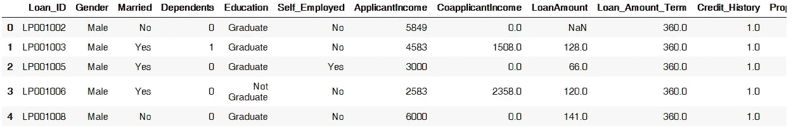
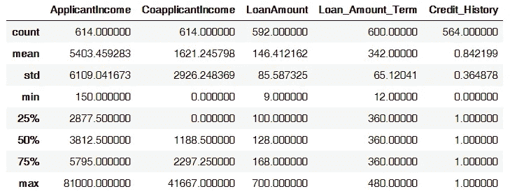
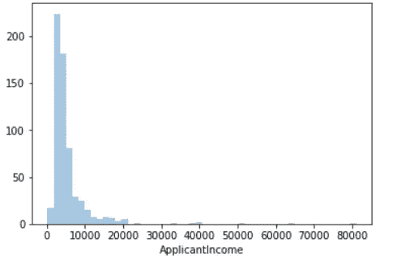
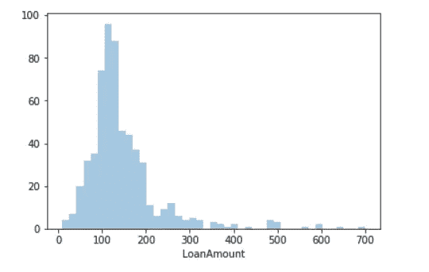
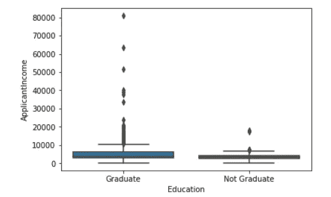
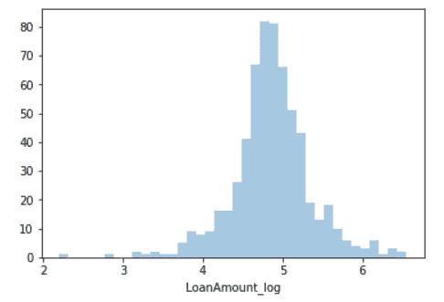

# ML 基础:贷款预测

> 原文：<https://towardsdatascience.com/ml-basics-loan-prediction-d695ba7f31f6?source=collection_archive---------2----------------------->

## 一个简单问题的完整数据科学管道


Photo by [Dmitry Demidko](https://unsplash.com/@wildbook?utm_source=medium&utm_medium=referral) on [Unsplash](https://unsplash.com?utm_source=medium&utm_medium=referral)

# 问题是:

梦想住房金融公司处理所有房屋贷款。他们遍布所有城市、半城市和农村地区。在公司确认客户贷款资格后，客户首先申请住房贷款。

该公司希望根据填写在线申请表时提供的客户详细信息自动执行贷款资格流程(实时)。这些详细信息包括性别、婚姻状况、教育程度、受抚养人人数、收入、贷款金额、信用记录等。为了实现这一过程的自动化，他们提出了一个问题来确定客户群，即那些有资格获得贷款金额的客户，以便他们可以专门针对这些客户。

这是一个分类问题，给定关于申请的信息，我们必须预测他们是否会偿还贷款。

我们将从探索性数据分析开始，然后是预处理，最后我们将测试不同的模型，如逻辑回归和决策树。

该数据由以下行组成:

```
**Loan_ID :** Unique Loan ID**Gender :** Male/ Female**Married :** Applicant married (Y/N)**Dependents :** Number of dependents **Education :** Applicant Education (Graduate/ Under Graduate)**Self_Employed :** Self employed (Y/N)**ApplicantIncome :** Applicant income**CoapplicantIncome :** Coapplicant income**LoanAmount :** Loan amount in thousands of dollars**Loan_Amount_Term :** Term of loan in months**Credit_History :** credit history meets guidelines yes or no**Property_Area :** Urban/ Semi Urban/ Rural**Loan_Status :** Loan approved (Y/N) this is the target variable
```

# 探索性数据分析:

我们将使用 seaborn 进行可视化，使用 pandas 进行数据处理。可以从这里下载数据集:[https://data hack . analyticsvidhya . com/contest/practice-problem-loan-prediction-iii/](https://datahack.analyticsvidhya.com/contest/practice-problem-loan-prediction-iii/)

我们将导入必要的库并加载数据:

```
import matplotlib.pyplot as plt
import pandas as pd
import seaborn as sns
%matplotlib inline
import numpy as nptrain=pd.read_csv("train.csv")
test=pd.read_csv("test.csv")
```

我们可以使用 head 函数来查看顶部的几行

```
train.head()
```



Image by Author

我们可以看到有一些缺失的数据，我们可以使用 pandas describe 函数进一步探究这一点:

```
train.describe()
```



Image by Author

一些变量有缺失值，我们必须处理，而且申请人收入、共同申请人收入和贷款金额似乎也有一些异常值。我们也看到大约 84%的申请者有信用记录。因为 Credit_History 字段的平均值为 0.84，并且它有两个值(1 表示有信用记录，0 表示没有)

研究数字变量(主要是申请人收入和贷款金额)的分布是很有趣的。为此，我们将使用 seaborn 进行可视化。

```
sns.distplot(train.ApplicantIncome,kde=False)
```



Image by Author

分布是偏斜的，我们可以注意到相当多的异常值。

由于贷款金额有缺失值，我们不能直接绘制它。一种解决方案是删除缺失的值行，然后绘制它，我们可以使用 dropna 函数来实现

```
sns.distplot(train.ApplicantIncome.dropna(),kde=False)
```



Image by Author

受过良好教育的人通常应该有较高的收入，我们可以通过绘制教育水平与收入的关系来验证这一点。

```
sns.boxplot(x='Education',y='ApplicantIncome',data=train)
```



Image by Author

分布非常相似，但我们可以看到毕业生有更多的离群值，这意味着高收入的人最有可能受过良好的教育。

另一个有趣的变量是信用历史，为了检查它如何影响贷款状态，我们可以将其转换为二进制，然后计算信用历史每个值的平均值。接近 1 的值表示贷款成功率高

```
#turn loan status into binary 
modified=train
modified['Loan_Status']=train['Loan_Status'].apply(lambda x: 0 if x=="N" else 1 )
#calculate the mean
modified.groupby('Credit_History').mean()['Loan_Status']OUT : 
Credit_History
0.0    0.078652
1.0    0.795789
Name: Loan_Status, dtype: float64
```

有信用记录的人更有可能还贷，比例为 0.07 比 0.79。这意味着信用历史将是我们模型中的一个有影响的变量。

# 数据预处理:

首先要做的是处理缺失值，让我们先检查每个变量有多少个缺失值。

```
train.apply(lambda x: sum(x.isnull()),axis=0)
OUT:
Loan_ID               0
Gender               13
Married               3
Dependents           15
Education             0
Self_Employed        32
ApplicantIncome       0
CoapplicantIncome     0
LoanAmount           22
Loan_Amount_Term     14
Credit_History       50
Property_Area         0
Loan_Status           0
dtype: int64
```

对于数值，一个好的解决方案是用平均值填充缺失值，对于分类，我们可以用众数(出现频率最高的值)填充它们

```
#categorical
train['Gender'].fillna(train['Gender'].mode()[0], inplace=True)
train['Married'].fillna(train['Married'].mode()[0], inplace=True)
train['Dependents'].fillna(train['Dependents'].mode()[0], inplace=True)
train['Loan_Amount_Term'].fillna(train['Loan_Amount_Term'].mode()[0], inplace=True)
train['Credit_History'].fillna(train['Credit_History'].mode()[0], inplace=True)
train['Self_Employed'].fillna(train['Self_Employed'].mode()[0], inplace=True)
#numericaldf['LoanAmount'].fillna(df['LoanAmount'].mean(), inplace=True)
```

接下来，我们必须处理离群值，一个解决方案是删除它们，但我们也可以对它们进行对数变换，以消除它们的影响，这是我们在这里采用的方法。有些人可能收入很低，但有很强的共同收入，所以一个好主意是把他们放在一个总收入栏里。

```
train['LoanAmount_log']=np.log(train['LoanAmount'])
train['TotalIncome']= train['ApplicantIncome'] +train['CoapplicantIncome'] train['TotalIncome_log']=np.log(train['TotalIncome'])
```

绘制贷款金额日志的直方图我们可以看到它是一个正态分布！



Image by Author

# 建模:

我们将在模型中使用 sklearn，在此之前，我们需要将所有分类变量转换为数字。我们将使用 sklearn 中的 LabelEncoder 来实现这一点

```
from sklearn.preprocessing import LabelEncoder
category= ['Gender','Married','Dependents','Education','Self_Employed','Property_Area','Loan_Status'] 
encoder= LabelEncoder()
 for i in category:   
  train[i] = encoder.fit_transform(train[i]) 
  train.dtypesOUT:
Loan_ID               object
Gender                 int64
Married                int64
Dependents             int64
Education              int64
Self_Employed          int64
ApplicantIncome        int64
CoapplicantIncome    float64
LoanAmount           float64
Loan_Amount_Term     float64
Credit_History       float64
Property_Area          int64
Loan_Status            int64
LoanAmount_log       float64
TotalIncome          float64
TotalIncome_log      float64
dtype: object
```

现在我们所有的变量都变成了我们的模型可以理解的数字。

为了尝试不同的模型，我们将创建一个函数，该函数接受一个模型，对其进行拟合，并测量其准确性，这意味着在训练集上使用该模型，并在同一集上测量误差。我们将使用一种称为 Kfold cross validation 的技术，它将数据随机分为训练集和测试集，使用训练集训练模型，并用测试集验证它，它将重复 K 次，因此命名为 Kfold，并取平均误差。后一种方法可以更好地了解模型在现实生活中的表现。

```
#Import the models
from sklearn.linear_model import LogisticRegression
from sklearn.cross_validation import KFold   #For K-fold cross validation
from sklearn.ensemble import RandomForestClassifier
from sklearn.tree import DecisionTreeClassifier, export_graphviz
from sklearn import metricsdef classification_model(model, data, predictors, outcome):
  #Fit the model:
  model.fit(data[predictors],data[outcome])

  #Make predictions on training set:
  predictions = model.predict(data[predictors])

  #Print accuracy
  accuracy = metrics.accuracy_score(predictions,data[outcome])
  print ("Accuracy : %s" % "{0:.3%}".format(accuracy))#Perform k-fold cross-validation with 5 folds
  kf = KFold(data.shape[0], n_folds=5)
  error = []
  for train, test in kf:
    # Filter training data
    train_predictors = (data[predictors].iloc[train,:])

    # The target we're using to train the algorithm.
    train_target = data[outcome].iloc[train]

    # Training the algorithm using the predictors and target.
    model.fit(train_predictors, train_target)

    #Record error from each cross-validation run
    error.append(model.score(data[predictors].iloc[test,:], data[outcome].iloc[test]))

  print ("Cross-Validation Score : %s" % "{0:.3%}".format(np.mean(error)))
```

现在我们可以测试不同的模型，我们将从逻辑回归开始:

```
outcome_var = 'Loan_Status'
model = LogisticRegression()
predictor_var = ['Credit_History','Education','Married','Self_Employed','Property_Area']
classification_model(model, train,predictor_var,outcome_var)
OUT : 
Accuracy : 80.945%
Cross-Validation Score : 80.946%
```

我们现在将尝试一个决策树，它应该会给我们更准确的结果

```
model = DecisionTreeClassifier() predictor_var = ['Credit_History','Gender','Married','Education'] classification_model(model, df,predictor_var,outcome_var)OUT:
Accuracy : 80.945%
Cross-Validation Score : 78.179%
```

我们在准确性上得到了相同的分数，但在交叉验证上得分更低，更复杂的模型并不总是意味着更好的分数。

最后，我们将尝试随机森林

```
model = RandomForestClassifier(n_estimators=100)
predictor_var = ['Gender', 'Married', 'Dependents', 'Education',
       'Self_Employed', 'Loan_Amount_Term', 'Credit_History', 'Property_Area',
        'LoanAmount_log','TotalIncome_log']
classification_model(model, train,predictor_var,outcome_var)OUT: 
Accuracy : 100.000%
Cross-Validation Score : 78.015%
```

该模型在准确性上给了我们满分，但在交叉验证上得分很低，这是过度拟合的一个很好的例子。该模型很难推广，因为它非常适合训练集。

对此的解决方案包括:减少预测器的数量或调整模型参数。

# 结论:

在本文中，我们已经讨论了数据科学的大部分内容，即 EDA、预处理和建模，并且使用了基本的分类模型，如逻辑回归、决策树和随机森林。了解更多关于这些算法背后的主干逻辑，以及处理数据采集和部署阶段将会很有趣。我们将在下一篇文章中尝试这样做。