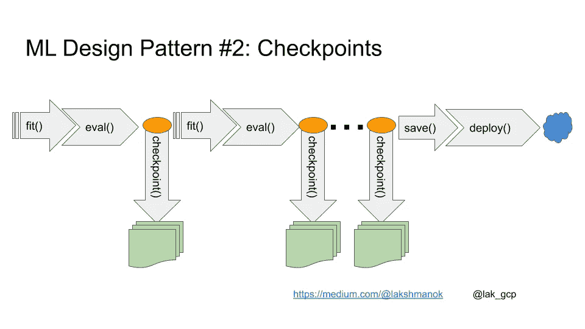
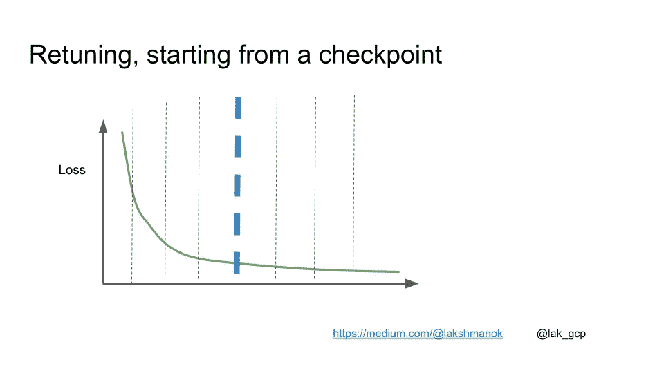

# ML 设计模式#2:检查点

> 原文：<https://towardsdatascience.com/ml-design-pattern-2-checkpoints-e6ca25a4c5fe?source=collection_archive---------18----------------------->

## 在训练期间保存模型的中间权重可以提供弹性、泛化和可调性

*偶尔为 ML 工程师设计的一系列设计模式。* [*完整列表在此。*](https://medium.com/@lakshmanok/machine-learning-design-patterns-58e6ecb013d7)

机器学习流水线的关键步骤是训练模型(使用 Keras 中的`model.fit()`)、评估模型(使用`model.evaluate()`)、导出模型(使用`model.save()`)、部署模型(使用`gcloud ai-platform versions create`)以及通过访问模型的 REST API 使用模型进行预测。然而，有时使用检查点对训练和评估循环进行更多的控制会更好。


一个检查点是一个模型的整个内部状态(它的权重，当前学习率等)的中间转储。)以便框架可以在任何需要的时候从这一点继续训练。包括检查点后，ML 管道变成:



换句话说，你训练一些迭代，然后评估模型，检查它，然后再拟合一些。完成后，保存模型，并像平常一样部署它。

保存中间检查点有几个好处:

*   **韧性**:如果你正在进行非常长时间的训练，或者在很多机器上进行分布式训练，那么机器出现故障的可能性就会增加。如果机器出现故障，TensorFlow 可以从最后保存的检查点恢复，而不必从头开始。此行为是自动的— TensorFlow 会查找检查点并从最后一个检查点恢复。
*   **泛化**:一般来说，训练时间越长，训练数据集上的损失越低。然而，在某一点上，被搁置的评估数据集上的误差可能停止减小。如果您有一个非常大的模型，并且没有进行充分的正则化，则评估数据集上的误差甚至可能开始增加。如果发生这种情况，返回并导出具有最佳验证错误的模型会很有帮助。这也被称为*提前停止*，因为如果您看到验证错误开始增加，您可以停止。(当然，一个更好的想法是降低模型复杂性或增加正则化，这样就不会发生这种情况)。您可以返回到最佳验证错误或提前停止的唯一方法是，如果您已经定期评估和检查模型。
*   **可调性**:在一个表现良好的训练循环中，梯度下降的表现是，你可以根据你的大部分数据快速到达最佳误差的邻域，然后通过优化拐角情况慢慢收敛到最低误差。现在，假设您需要定期根据新数据重新训练模型。你通常希望强调新的数据，而不是上个月的关键案例。你最好不要从最后一个检查点开始训练，而是从蓝线标记的检查点开始:



要在 Keras 中检查模型，请提供一个回调:

```
trainds = load_dataset('taxi-train*', TRAIN_BATCH_SIZE, tf.estimator.ModeKeys.TRAIN)
evalds = load_dataset('taxi-valid*', 1000, tf.estimator.ModeKeys.EVAL).take(NUM_EVAL_EXAMPLES)steps_per_epoch = NUM_TRAIN_EXAMPLES // (TRAIN_BATCH_SIZE * NUM_EVALS)shutil.rmtree('{}/checkpoints/'.format(OUTDIR), ignore_errors=True)
checkpoint_path = '{}/checkpoints/taxi'.format(OUTDIR)
**cp_callback = tf.keras.callbacks.ModelCheckpoint(checkpoint_path, 
                                                 save_weights_only=True,
                                                 verbose=1)**history = model.fit(trainds, 
                    validation_data=evalds,
                    epochs=NUM_EVALS, 
                    steps_per_epoch=steps_per_epoch,
                    verbose=2, # 0=silent, 1=progress bar, 2=one line per epoch
                    **callbacks=[cp_callback]**)
```

尽情享受吧！