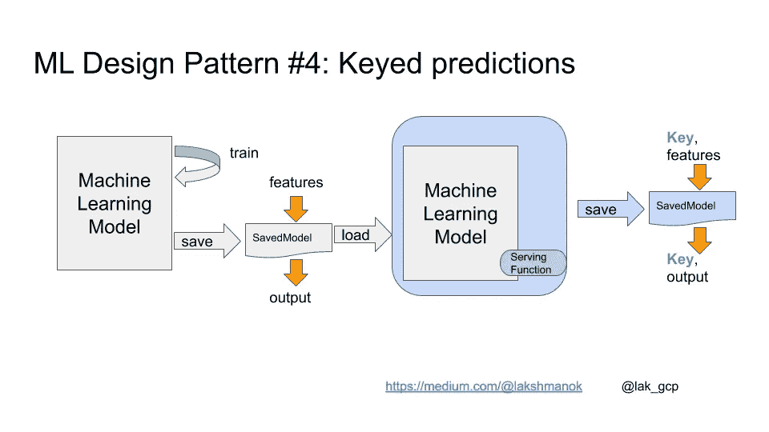

# ML 设计模式#4:键控预测

> 原文：<https://towardsdatascience.com/ml-design-pattern-4-keyed-predictions-a8de67d9c0f4?source=collection_archive---------25----------------------->

## 导出您的模型，以便它通过客户端密钥

给 ML 工程师的一系列偶然的设计模式。 [*完整列表在此。*](https://medium.com/@lakshmanok/machine-learning-design-patterns-58e6ecb013d7)

通常情况下，您可以在模型将被实时提供的同一组输入上训练您的模型。然而，在许多情况下，让您的模型也传递一个客户端提供的密钥可能是有利的。


Client-supplied keys are essential for high-performance serving infrastructure. Photo by [Florian Berger](https://unsplash.com/@bergerteam?utm_source=unsplash&utm_medium=referral&utm_content=creditCopyText) on [Unsplash](https://unsplash.com/s/photos/key?utm_source=unsplash&utm_medium=referral&utm_content=creditCopyText)

## 服务基础设施的热点

如果您的模型被部署为 web 服务并接受单个输入，那么哪个输出对应于哪个输入是非常清楚的。如果模型接受一组输入会怎么样？您可能会认为，第一个输出实例对应于第一个输入实例，第二个输出实例对应于第二个输入实例，等等，这应该是显而易见的。但是，这种 1:1 的关系会在您的服务基础设施中产生大量热点，因为无论哪个服务器节点不幸接收到特别大的请求，都需要计算阵列中所有实例的输出。这些热点将迫使你使你的服务器比他们需要的更强大。

当然，如果接收节点可以将实例外包给一个集群，收集所有结果输出，然后将它们发送回来，效率会高得多。但是如果它这样做了，那么输出就会变得混乱。客户端如何判断哪个输出对应于哪个输入？

## 传递键

解决方案？让客户端提供一个与每个输入相关联的键。例如，假设您的模型使用三个输入(a、b、c)进行训练，显示为绿色，以产生输出 d，显示为黄色。让你的客户提供(k，a，b，c)给你的模型，其中 k 是一个*键*。这个键可以简单到给输入实例编号 1、2、3 等等。然后，您的模型将返回(k，d ),因此客户端将能够计算出哪个输出实例对应于哪个输入实例。


Clients supply a key with each input instance, so that they can disambiguate the outputs

这与您进行批量预测时会遇到的情况完全相同，因此键在这种情况下也很有用。

## 为什么密钥应该由客户提供？

等等……为什么服务器不能在调用模型之前给接收到的输入分配键，然后在发送输出之前删除键呢？为什么要求客户指定一个键？

这是因为键在其他一些情况下也很有用——异步服务和评估。如今许多生产机器学习模型是神经网络，神经网络涉及矩阵乘法。如果您可以确保矩阵在特定的大小范围内和/或特定数字的倍数内，GPU 和 TPU 等硬件上的矩阵乘法会更有效。因此，累积请求(当然达到最大延迟)并分块处理传入的请求会很有帮助。因为块将由来自多个客户机的交叉请求组成，所以在这种情况下，键也需要有某种客户机标识符。

如果您正在进行持续评估，记录有关预测请求的元数据会很有帮助，这样您就可以监视性能是全面下降，还是仅在特定情况下下降。如果关键点确定了所讨论的情况，这种切片就容易多了。

因为高性能服务器将支持多个客户端，由一个集群支持，并批量处理请求以获得性能优势，所以最好提前做好计划—要求客户端为每个预测提供密钥，并要求客户端指定不会导致与其他客户端冲突的密钥。

## 如何在 Keras 中传递密钥

为了让您的 Keras 模型通过密钥，在导出模型时提供一个服务签名。

例如，这是获取一个模型的代码，否则该模型将接受 4 个输入(is_male、mother_age、multiplies 和 importation _ weeks ),并让它还接受一个键，该键将与模型的原始输出(婴儿体重)一起传递给输出:

```
# Serving function that passes through keys
[@tf](http://twitter.com/tf).function(input_signature=[{
      'is_male': tf.TensorSpec([None,], dtype=tf.string, name='is_male'),
      'mother_age': tf.TensorSpec([None,], dtype=tf.float32, name='mother_age'),
      'plurality': tf.TensorSpec([None,], dtype=tf.string, name='plurality'),
      'gestation_weeks': tf.TensorSpec([None,], dtype=tf.float32, name='gestation_weeks'),
      'key': tf.TensorSpec([None,], dtype=tf.string, name='key')
}])
def my_serve(inputs):
    feats = inputs.copy()
    key = feats.pop('key')
    output = model(feats)
    return {'key': key, 'babyweight': output}tf.saved_model.save(model, EXPORT_PATH, 
                    signatures={'serving_default': my_serve})
```

请注意，即使原始模型没有用服务函数保存，上面的代码也可以工作。只需使用 tf.saved_model.load()加载模型，附加一个服务函数并使用上面的代码片段！



Load a SavedModel, attach a non-default serving function and save it.

尽情享受吧！