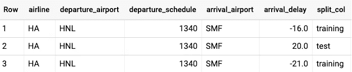

# ML 设计模式#5:可重复采样

> 原文：<https://towardsdatascience.com/ml-design-pattern-5-repeatable-sampling-c0ccb2889f39?source=collection_archive---------10----------------------->

## 使用分布良好的列将数据分为训练/有效/测试

给 ML 工程师的一系列偶然的设计模式。 [*完整列表在此。*](https://medium.com/@lakshmanok/machine-learning-design-patterns-58e6ecb013d7)

许多机器学习教程会建议您将数据随机分成训练、验证和测试数据集:

```
df = pd.DataFrame(...)rnd = np.random.rand(len(df))
train = df[ rnd < 0.8  ]
valid = df[ rnd >= 0.8 & rnd < 0.9 ]
test  = df[ rnd >= 0.9 ]
```

问题是，这在许多现实世界的情况下都失败了。原因是这些行很少是独立的。例如，如果您正在训练一个预测航班延误的模型，则同一天航班的到达延误将彼此高度相关。这叫做*漏*，是做机器学习时要避免的重要问题。


Use the Farm Fingerprint hashing algorithm on a well-distributed column to split your data into train/valid/test

解决方案是基于日期列拆分数据集:

```
SELECT
  airline,
  departure_airport,
  departure_schedule,
  arrival_airport,
  arrival_delay
FROM
  `bigquery-samples`.airline_ontime_data.flights
WHERE
  ABS(MOD(FARM_FINGERPRINT(date), 10)) < 8 -- 80% for TRAIN
```

除了解决最初的问题(数据泄漏)，这还为您提供了可重复性:

1.  [FARM_FINGERPRINT](https://github.com/google/farmhash) 是一种开源哈希算法，在 C++(因此:Java 或 Python)和 BigQuery SQL 中实现一致。
2.  任何给定日期的所有航班都属于同一个分段——列车、有效或测试。这是可重复的，与随机种子无关。

## 选择拆分列

如何选择要拆分的列？日期列必须具有几个特征，以便我们能够将其用作拆分列:

1.  相同日期的行往往是相关的，这也是我们希望确保相同日期的所有行都在相同的拆分中的主要原因。
2.  日期不是模型的输入(从日期中提取的要素(如 dayofweek 或 hourofday)可以是输入，但不能使用实际输入进行分割，因为经过训练的模型不会看到 20%的可能输入值)。
3.  必须有足够的日期值。因为您正在计算散列值并寻找相对于 10 的模，所以您至少需要 10 个唯一的散列值。当然，你拥有的独特价值观越多越好。为了安全起见，取模的分母为 3–5 倍，因此在这种情况下，您需要 50 个或更多的唯一日期。
4.  标签必须在日期之间分布均匀。如果结果是所有的延迟都发生在 1 月 1 日和一年中的其他时间，没有延迟，这将不起作用，因为分割的数据集将是倾斜的。为了安全起见，请查看一个图表，并确保所有三个拆分都具有相似的标签分布(根据出发延误或其他输入值)。您可以使用 [Kolomogorov-Smirnov 测试](http://www.physics.csbsju.edu/stats/KS-test.html)来实现自动化。

## 变体 1:单一查询

您不需要三个单独的查询来生成训练、验证和测试分割。您可以在一个查询中完成，如下所示:

```
CREATE OR REPLACE TABLE mydataset.mytable ASSELECT
  airline,
  departure_airport,
  departure_schedule,
  arrival_airport,
  arrival_delay,
  **CASE(ABS(MOD(FARM_FINGERPRINT(date), 10)))
      WHEN 9 THEN 'test'
      WHEN 8 THEN 'validation'
      ELSE 'training' END AS split_col**
FROM
  `bigquery-samples`.airline_ontime_data.flights
```



## 变体 2:随机拆分

如果你想要一个随机的分裂，但只需要可重复性呢？在这种情况下，您可以简单地散列行数据本身。这里有一个简单的方法:

```
SELECT
  airline,
  departure_airport,
  departure_schedule,
  arrival_airport,
  arrival_delay
FROM
  `bigquery-samples`.airline_ontime_data.flights **f**
WHERE
  ABS(MOD(FARM_FINGERPRINT(**TO_JSON_STRING(f))**, 10)) < 8
```

请注意，如果您有重复的行，那么它们将总是以相同的拆分结束。如果这是一个问题，请在选择查询中添加一个唯一 id 列。