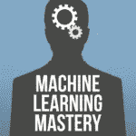
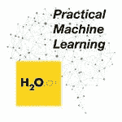
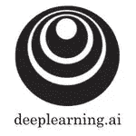
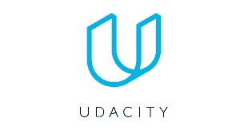

# ML & DL 学习路径

> 原文：<https://towardsdatascience.com/ml-dl-learning-path-66edc2e5bd91?source=collection_archive---------10----------------------->

## *为 ML & DL* 提供的无数在线课程&mooc 指南

**you could be lost even before you begin**

继我之前关于我从商业智能到机器学习世界的转变的帖子之后，([https://towards data science . com/from-Business-Intelligence-to-data-science-94a 1fd 866231](/from-business-intelligence-to-data-science-94a1fd866231))，我想分享一下我在这条路上参加的许多在线课程的学习经验。我相信一些关于这些课程顺序的指导会对那些对机器学习感兴趣的新手有很大帮助。此外，我还会指出我在完成其中一些课程(以及没有完成其中一些课程)时遇到的困难程度。

在深入细节之前，让我分享一下我选择以下课程的指导原则——编程语言的选择。当我几年前开始学习这些课程时，机器学习社区广泛采用 R 或 Python 作为编程语言。(在某种程度上，R 在当时的竞争中领先)我甚至以“R 编程”的课程开始介绍 R。但我相信，Python 在机器学习和高级分析的可用库方面很快赶上了 R，并很快受到欢迎。此外，我认为 Python 对于数据科学家/分析师来说是一种更好的语言，因为它是一种多功能的语言，使人们能够在广泛的领域编写项目代码——机器学习、Spark 上的大数据编程、文本挖掘和自然语言处理、用于深度学习的 Pytorch 等(人们甚至可以使用 Python 框架编写 web 应用程序)。此外，不断进入行业的新框架(如 h20 等)支持 python APIs，因为它在编码社区中很受欢迎。顺便说一句，我并不是说选择 R 的人不能学到很多东西，但是了解 python 有利于轻松地过渡到相关框架。

# **机器学习课程**

1.  ***斯坦福大学的机器学习——吴恩达***

Machine Learning by Stanford

我猜，这实际上是你开始机器学习之旅的地方，由大师(吴恩达)亲自讲授这门课程。很少有人能像他那样清楚地解释这些概念。本课程将为你提供机器学习/高级统计的一些基本技术，如线性/逻辑回归。如果我没记错的话，他用房价数据集的例子解释了这些概念。

我没有完成这门课程，因为它要求用一种叫做 octave 的语言来完成练习，我相信这种语言类似于 Matlab，我太懒了，不想为了完成这门课程而学习一种新的语言。然而，我建议这是你学习道路上的第一站。

[https://www.coursera.org/learn/machine-learning](https://www.coursera.org/learn/machine-learning)

**2*。用 Python 掌握机器学习——杰森·布朗利***

Machine Learning Mastery

杰森·布朗利是该领域为数不多的专家之一(杰瑞米·霍华德是另一位)，他提倡自上而下的学习方法。他本人拥有博士学位，但他强烈主张，要成为一名成功的 ML 专业人士，博士并不是必要条件，最重要的是知道如何对数据应用不同的算法以获得结果。稍后，深入研究算法的具体细节。

他的网站[https://machinelearningmastery.com/](https://machinelearningmastery.com/)是你在 python 中搜索 ML 相关内容时会遇到的第一批网址之一，并提供了一些非常有用的学习资源。他提供了关于使用 python 进行机器学习/深度学习的电子书，我通过他关于 ML 的电子书“使用 python 掌握机器学习”第一次体验了 scikit learn python 库。除了使用 scikit learn library 之外，人们还将学习在 ML 项目生命周期中要遵循的典型过程，该过程用公开可用的数据集来说明。

***预期学习时间***—2-4 周，如果你计划每周花几个小时的话。如果你真的迷上了它，你可以在一两个周末轻松度过。你可以把它作为你将来任何项目的参考书

***3。华盛顿大学的机器学习专业。讲师——卡洛斯·盖斯特林&艾米丽·福克斯***

Machine Learning Specialization

一旦我理解了使用 python 库在数据上应用 ML 算法——scikit learn，我对使用 python 的 ML 专门化课程的搜索将我带到了这个课程。讲师是 Carlos Guestrin 和 Emily Fox，他们共同创建了后来被亚马逊收购的 Dato，他们是华盛顿大学 CS 系的杰出教授。

这是一门由四部分组成的课程，涵盖了最大似然、回归、分类和聚类的基础知识。回归课程在华盛顿房价数据集的帮助下，介绍简单的多元线性回归的概念。分类课程将通过使用决策树的线性模型和非线性模型，介绍这类算法的核心概念。Carlos G 清晰地解释了这些概念，并主要使用直觉来发展对决策树和 glm 模型的理解。他使用公开的亚马逊消费者评论，通过分类技术来预测评论的情绪。(他的插图如此生动，以至于我仍然记得他用评论来分类情绪的长颈鹿玩具)

人们在现实生活中遇到的大多数解决方案都属于分类问题领域，例如，对客户流失、客户产品倾向、高级文本分类等建模，因此如果有帮助的话，可以只做分类课程。

***预计研究时间—*** 各部分 8-12 周

【https://www.coursera.org/specializations/machine-learning? 

***4。如何赢得数据科学竞赛:向顶级 Kagglers 学习-Coursera***

how to win DS competition?

对于渴望在竞争中获胜的 ML 工程师来说，这是一门伟大的课程。在这门课中，我发现了许多在书本和其他课程中找不到的新颖、实用的概念。我认为这是顶级卡格勒人赢得像卡格勒这样的大联盟比赛的终极实用指南。

我能从这门课中回忆起的一些有用的概念是均值因子编码，数据泄漏。我无法完成这门课程，因为我没有太多时间参加比赛，但我肯定会推荐这门课程。

[https://www.coursera.org/learn/competitive-data-science](https://www.coursera.org/learn/competitive-data-science)

***5。H2O H2O 实用机器学习— Coursera***

h2o.ai

这是 H2O 公司提供的一门课程，该公司提供自己的开源机器学习/人工智能框架/库，用于在 Spark 等分布式计算框架上进行更快的计算。在 Garner 的魔力象限中，它被提供 ML 框架的供应商评为有远见者。鉴于这一框架目前被广泛采用，将这一框架添加到一个人的剧目中肯定会有所帮助。我也希望有更多的时间来完成这门课程，但是我强烈推荐它。

[https://www.coursera.org/learn/machine-learning-h2o](https://www.coursera.org/learn/machine-learning-h2o)

# **深度学习课程**

1.  ***【深度学习专业化(Deeplearning.ai)***

deeplearning.ai

这是一套关于深度学习的 5 门课程，从入门课程开始，涵盖所有主要类型的 DL 网络 CNN，RNN。这是吴恩达的名言“人工智能是新的电力”，在整个课程中，他借鉴了他在百度的经验。除了课程内容，他还分享了他对深度学习和人工智能领域顶级人物的采访，包括 Andrej Karpathy、Ian Goodfellow 等，标题为“深度学习的英雄”。

在入门课程中，他讲述了神经网络的基础知识，并使用 numpy 库实现了一个工作示例。后来，他使用 tensorsflow 库和 tensor 做了同样的事情。从那里，他涵盖了 CNN 的主题，并解释了图像分类的概念，对象检测，面部检测等。最后，他完成了序列模型(RNN)及其在自然语言处理领域的适用性，NLP。

尽管有使用 tensorflow 的手工示例，但由于我选择 Pyspark 作为深度学习的首选库，所以我不太关注本课程的实践练习。

***预期学习时间——每门课程 8-10 周***

【https://www.coursera.org/specializations/deep-learning 

***2。程序员实用深度学习— Fast.ai***

fast.ai

杰瑞米·霍华德和瑞秋·托马斯共同创立了专注于深度学习培训内容的 Fast.ai 公司，fast.ai library 对 pytorch 的作用就像 Keras 对 tensorflow 的作用一样。这是一个高度优化深度学习应用程序所需代码的库。在分享课程信息之前，有必要提一下 Jeremy H 编码原则。

与 Jason Brownlee 类似，Jeremy H 来自“自上而下学习方法”学派，该学派主张在深入研究深度学习的具体细节之前实践应用深度学习的实践方面。事实上，他引用了使用自下而上的方法来学习深度学习是多么错误的例子。在开始深度学习之旅之前，一个人不可能学会统计学、数学或计算机科学博士学位以及其他任何与之相关的东西。他是排名第一的卡格勒，是为什么不需要博士学位就能在深度学习应用和研究领域取得成功的经典例子。

这个免费课程大约有 7 个部分，每个部分处理深度学习中的一个不同主题，包括 NLP，CNN，RNN 等。他是我选择 pytorch 而不是 tensorflow 作为深度学习库的原因之一，因为根据他和其他像 Andrej Karpathy 这样的伟人的说法，pytorch 使编码相对于 tensorflow 更简单。此外，根据 Jeremy H 的说法，他所尊重的每个研究人员都将 Pytorch 用于他们的研究目的。此外，它有助于它基于 python 风格，使任何 python 机器学习工程师都能很快掌握。

***预计学习时间-*** 如果想对内容做到恰如其分，完成 1 部分大概需要 2 周时间。尽管我必须承认，我只是浏览了一些内容，因为我想快速了解内容。我当然想把它作为项目的参考来源。

[https://course.fast.ai/](https://course.fast.ai/)

***3。深度学习纳米学位-uda city***

Udacity DL Nanodegree

在参加了杰瑞米·霍华德关于深度学习的课程后，我对深度学习的驱动力增强了，我对 pytorch 认证课程的搜索使我进入了这个课程。Udacity 最初在 tensorflow 中提供这门课程，但由于 pytorch 在研究社区中取得的成功，内容被转移到了 pytorch。另一个加强了我对 Pytorch 的选择的例子是，除了 Pytorch 之外，2018 年所有开源项目中第二重要的更新超过了 Tensorflow。

本课程由多名讲师提供，涵盖神经网络和深度网络的基础知识。从这里开始，它涵盖了所有重要的主题，如主要用于图像分类任务的 CNN(卷积神经网络)，用于自然语言处理任务的 RNN(递归神经网络)，GANS(生成对抗性神经网络)，以及关于在 AWS 上部署生产规模的深度学习模型。

这门课最酷的部分是针对上述每个主题的项目。人们开始编写应用程序，可以根据狗的图像对狗的品种进行分类(CNN)，自动生成电视脚本(RNN)，使用一组人脸创建假的面部图像(GANs)，在 AWS 上部署情感分类器模型，并实时接受评论和返回响应。

**预计学习时间-** 4 个月

[https://in.udacity.com/course/deep-learning-nanodegree-nd 101](https://in.udacity.com/course/deep-learning-nanodegree--nd101)

***4。深度学习研究员 PyTorch 的深度学习实践— Udemy，新加坡国立大学***

Udemy — Pytorch Course

当我在寻找 pytorch 培训的内容时，我偶然在 Udemy 上看到了这个课程，并开始浏览。尽管大部分概念看起来像是在重复，但我发现它有助于在 pytorch 上进行实践，并且一些概念用不同的直觉进行了解释。

例如，讲师非常直观地解释了卷积层(即滤波器)中的特征映射的概念以及它的名字的由来。在我看来，有时对同一个主题的不同观点会增强对这个概念的理解，从而加深对它的回忆。

***预期学习时间-***2-3 个月

[https://www.udemy.com/practical-deep-learning-with-pytorch/](https://www.udemy.com/practical-deep-learning-with-pytorch/)

感谢你通读这篇文章，我希望你会觉得有用。我想接着在博客、youtube 视频和播客上发一篇我认为值得一听的帖子。