# [ML]酒店评分的特征转换、自然语言处理和分类建模

> 原文：<https://towardsdatascience.com/ml-feature-transformation-nlp-and-classification-modeling-on-hotel-scoring-94107353a015?source=collection_archive---------18----------------------->

## 结合数字特征和文本评论来建立分类模型(神经网络、Xgboost、逻辑)

# 0.摘要

## **0.1 奖励**

这篇文章的目的是，在我之前的尝试中，我试图为每家酒店的点评者评分建立一个预测模型。事实证明，预测能力并不令人满意，T2 R T3(决定系数)徘徊在 T4 0.4 到 0.5 T5 之间。因此，在这项任务中，我将尝试一种不同的方法，首先将评论者的分数离散化为三个有序类别—低、中、高，然后建立一个分类模型。看看在简化分类方法下是否达到更高的预测能力。该模型应该更容易将评审者的分数分为三个级别，而不是要求得出精确的预测分数。

## **0.2 数据集的信息**

原始数据集从 Booking.com 收集，并在[ [Kaggle](https://www.kaggle.com/jiashenliu/515k-hotel-reviews-data-in-europe) ]平台上共享。该数据集包含 50 万条酒店评论，收集了 14 个特征，包括数字评分和文本评论。

## **0.3 车型性能快速汇总**

在比较了 MLP、Xgboost 和 Logistic 的模型性能后，我最终选择了 **Logistic 模型**。结果表明，逻辑斯蒂模型不仅比其他模型表现更好，尽管差距很小，而且在训练上也有相当好的效率。在此任务中还实施了超参数微调，但是结果显示默认配置和优化参数设置之间没有显著的性能差异。

**最终模型准确率达到 0.62，F1 评分达到 0.61。**如果我们看得更深一点，每一个阶层在人口中所占的份额分别是 35%、29%、36%，与每一个阶层的预测结果的精度分别是 68%、47%、65%相比，我们可以说 **Logistic 模型的精度一般是**的两倍。

## **0.4 报告的结构**

> 1.[数据预处理](#e0d7)

在这一部分，原始数据将经过一系列预处理，以便成为高质量的、随时可用的数据集。它包括缺失值移除、重复移除和异常值移除的实现。

> 2.[探索性可视化](#ab05)

探索性分析包括目标变量和所有特征的统计汇总。可视化数据并观察要素的分布情况。

> 3.[特征工程—离散化](#283e)

在更加熟悉手头的数据后，我将首先**把目标变量分成三组——低、中、高**。基于目标变量的分布来定制每个箱的范围，因此，目标变量具有不相等的箱宽度。

> 4.[特征工程—日志转换](#6de8)

从分布图中可以看出，这些特征是高度倾斜的。在模型中输入时，最好使用正态分布特征。因此，大多数数字特征将具有**对数变换**，并且**也被缩放以具有相同的单位**，为稍后的建模做准备。

> 5.[特征工程——词语标记化](#0ddc)

这个数据集的优势在于它包含酒店客人的文本评论以及他们的评分。因此，我们实际上可以利用文本提供的信息来提高预测模型的准确性。在本节中，**文本将通过词条化和标记化**进行预处理。然后给单词分配根据 **TF-IDF 公式**计算的值。

> 6.[相关性分析](#02b9)

在这一部分，我将检查特征工程是否增加了目标变量(评审者的分数)和输入特征之间的相关性。结果显示在相关矩阵中。

> 7.[不同型号的试验](#a399)

有许多模型非常适合分类案例。在这里，在我的第一次尝试中，我将比较三种模式的性能— **逻辑回归、Xgboost 决策树和神经网络**。超参数设置为默认值。

> 8.[微调造型](#85c9)

从上述模型中，选择性能最好的模型作为最终模型，然后通过网格搜索对模型的超参数进行微调，以进一步提高其精度。最终模型将在测试数据集上进行测试，并与默认配置的模型进行比较。

# 1.预处理数据

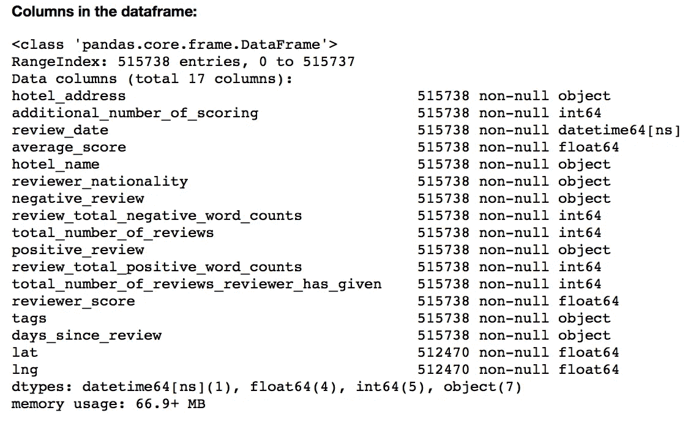

Columns in Dataset

[︽](#7bb1) 检查数据集行中是否有缺失值或重复值。未完成的行和重复的行将从数据集中删除。

总共有 3268 行包含缺失值和 526 个重复行。删除这些记录后，最终数据集仍有 511，944 条记录。

对数据的样子感兴趣，可以查看链接[ [Kaggle](https://www.kaggle.com/jiashenliu/515k-hotel-reviews-data-in-europe) ]。

# 2.探索可视化

[︽](#a9dc) 在此部分，将分别显示目标变量和所有其他数值特征。

## 2.1 目标变量的分布(reviewer_score)

事先，我为下面的可视化定义了一个绘图函数。

Function — Plot Histogram and Mean/Median Line

`**Result:**`

很明显，评论者的分数分布是**左倾**。有很大一部分分数分布在 9.5 分及以上。

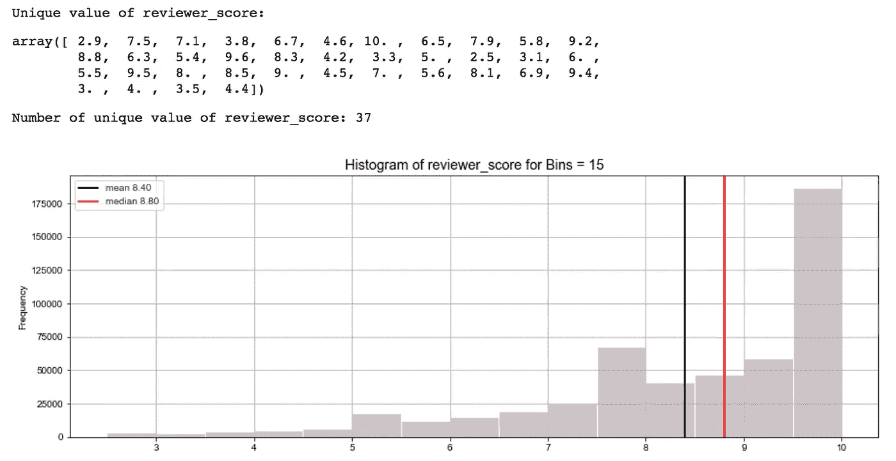

Distribution of reviewer_score

## 2.2 特征分布

*   平均分数
*   评论总数
*   附加得分次数
*   复习 _ 总计 _ 负数 _ 字数
*   复习总字数

以下几组网格图显示了每个数字特征的 QQ 图和直方图。 **QQ-plot** 增加可读性，以检查特征是否遵循正态分布。此外，在内核分布旁边增加了一行**理论正态分布**，用于直方图比较。下面是创建 QQ-plot 和直方图并排的定义函数。

Function — Plot QQ-Plot and Histogram Alongside

`**Result:**`

我们可以看出，除了平均分数*和平均分数*之外，几乎所有的特征都是**左偏或右偏**。根据显示的证据，需要对这些特征进行转换和归一化，以便在使用这些特征作为输入时建模可以达到更高的精度。

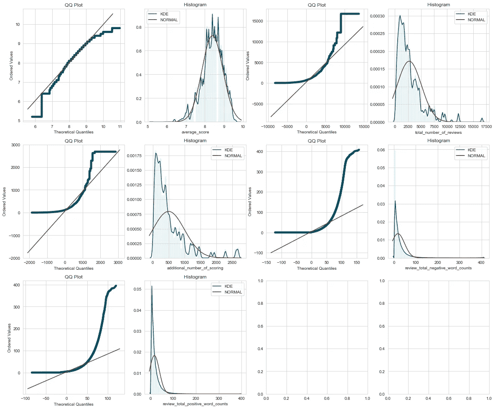

QQ-Plot and Histogram over Each Numerical Feature (Before Transformation)

# 3.特征工程—离散化

## 3.1 目标变量

[︽](#5d37) 关注目标变量— **审核人 _ 分数**，将分为三组。绑定间隔如下，

1.  *低:数值< = 8.0。*
2.  *中:8.0 <值< = 9.5。*
3.  *高:9.5 <值< = 10.0。*

Function — Bin up Variable

`**Result:**`

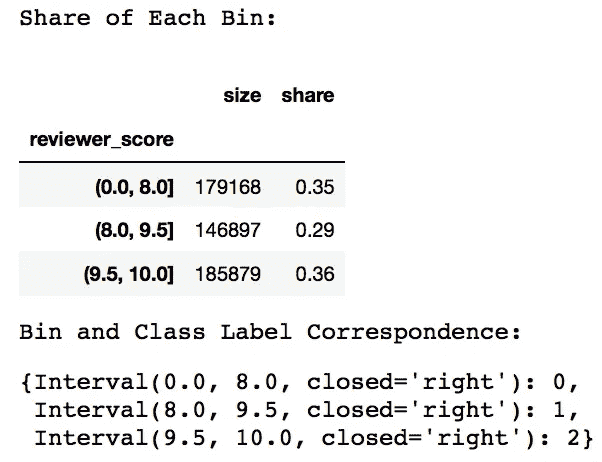

Bin Size and Share of Target Variable

离散化后，目标变量分成三组，每组分别为 **35%、29%、36%** 。

# 4.特征工程—测井转换

## 4.1 功能

[**︽**](#9293) **数值特征首先进行对数变换，然后缩放到范围(0，1)内。**通过这种方式，数值将具有带有分类特征的相同单位，稍后也将被热编码为(0，1)虚拟值。

Log Transformation and MinMax Scaling

`**Result:**`

从 QQ 图和直方图中，我们可以看出，即使经过变换，特征仍然不太符合正态分布，但至少它们现在不那么偏斜了。

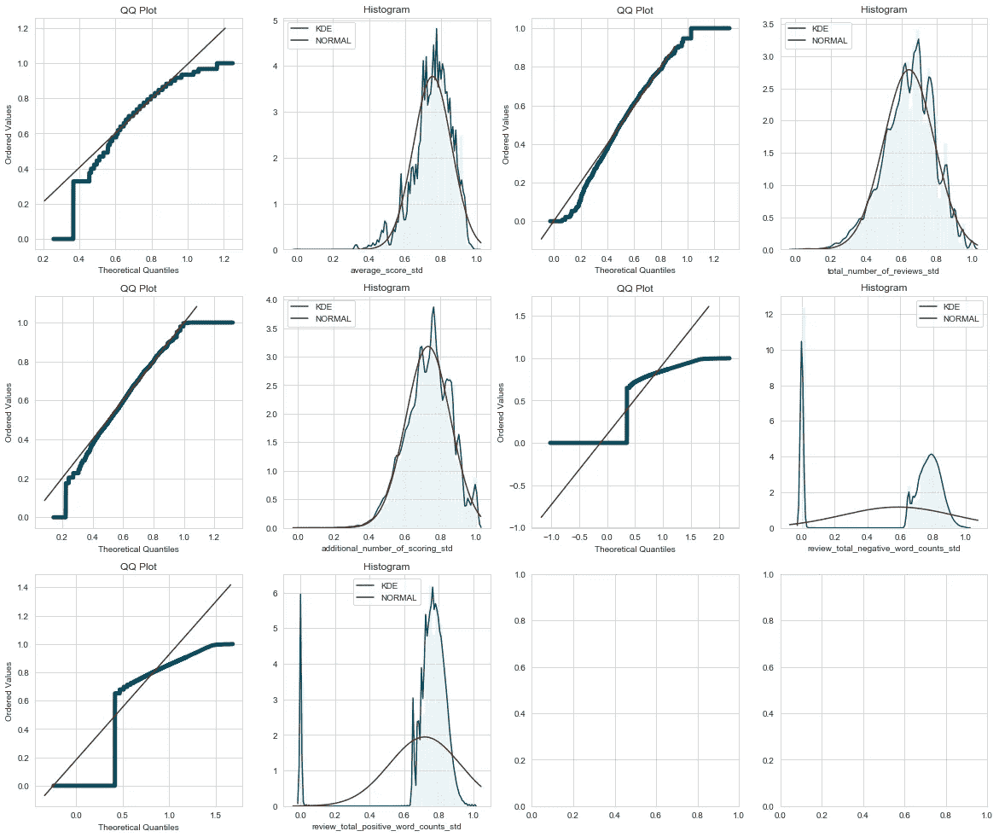

QQ-Plot and Histogram over Each Numerical Feature (After Transformation)

# 5.特征工程——单词标记化

## 5.1 整理文本

[︽](#c13d) 在清理文本数据时，我首先将两个独立的评论(一个负面，一个正面)连接成一个，然后让它去掉空白和其他标点符号。

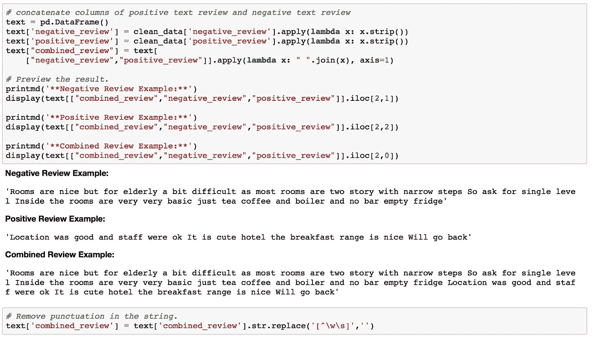

Preview of Text Review (Before Concatenated and After)

## 5.2 词汇化和标记化

在对文本进行分词之前，我使用**分词器**进一步提取每个单词的词根，从而剔除不同形式单词的派生词。

然后**停止字**被忽略，并通过 **max_df** 和 **min_df** 指定字选择阈值。

**二元语法**用于标记化，这样我们可以考虑短语中相反的意思，例如*非常好*和*不好*。

随后选择第一个 **2500** 记号作为模型输入。

Lemmatize and Tokenize

`**Result:**`

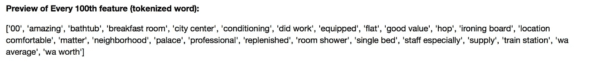

Samples of Tokenized Word (Both Uni-gram and Bi-gram)

# 6.相关性检验

[︽](#b02a) 下面，我将呈现 target (reviewer_score)和所有其他特征之间的相关性，包括特征转换之前和之后。看看相关性是因为变换而被放大了还是保持不变。

Function — Plot Correlation Matrix

`**Result:**`

通过观察这种相关性，我得出了一些有趣的发现。

1.  对于离散化的目标变量(reviewer_score_class ),所有特征的相关性(无论是否经过变换)似乎稍弱。比方说(平均分数与审阅者分数)的相关性为 **0.36** ，而(平均分数与审阅者分数类)的相关性为 **0.34** 。
2.  转换后的特征与目标变量有更强的相关性。实际上，当这些转换后的特征作为输入时，这对于后续的建模是一个好兆头。

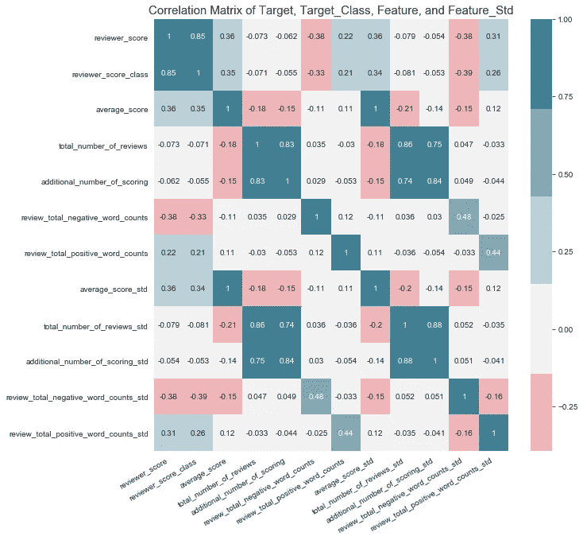

Correlation Matrix (Target, Discretized Target, and Standardized Features)

# 7.不同模型的试验

︽:现在是整个任务的关键部分——建模。我将首先在三个不同的模型上进行实验，**多感知机、Xgboost 和逻辑回归**。

这些模型将基于它们在测试数据集上的**性能(F1 分数)**进行比较。最佳模型将进行到下一部分，即超参数微调。这样我们可以进一步提高它的准确性。

## 7.1 MLP 模式—培训

## 7.2 Xgboost 模型—培训

## 7.3 物流模型——培训

## 7.4 功能重要性

在拟合 Xgboost 模型时，我们从中获得了额外的好处。Xgboost 可以为我们提供特征重要性的图表，这样我们就可以告诉我们什么样的特征对数据分类更有帮助和影响。

Plot Top Feature Importance From Xgboost Model

`**Result:**`

快速排序在这里，我们可以从特性重要性图(Xgboost)中看出，确定的前 5 个重要特性是，

1.  review _ total _ negative _ words _ count _ STD(数字)
2.  review _ total _ positive _ words _ count _ STD(数字)
3.  average_score_std(数字)
4.  位置(单词)
5.  五线谱(word)

值得注意的一点是，这里我选择同时使用单字和双字作为输入特征，似乎最重要的标记是**单字**，而不是一个双字排在前 20 个重要特征中。

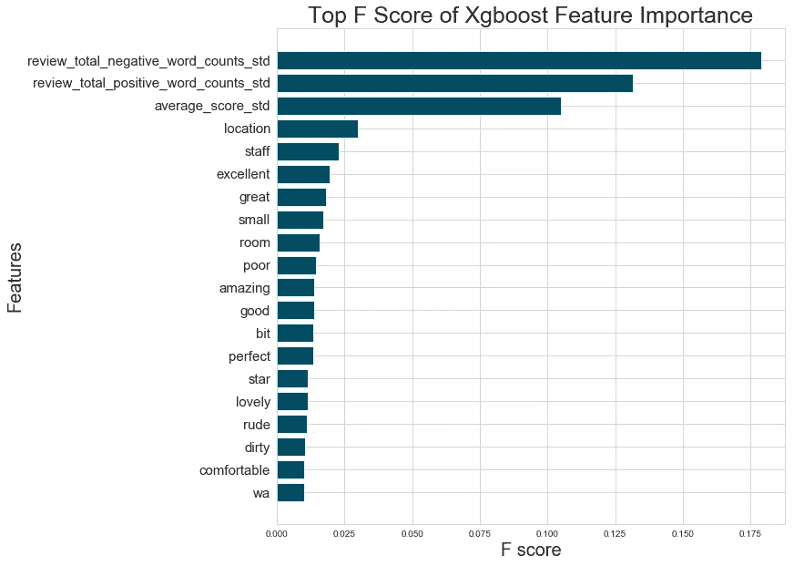

Feature Importance Ranking

## 7.5 最终选择的模型:逻辑回归

结果是，**逻辑回归**在测试数据集上达到了**最佳性能(F1 分数)**，尽管只是很小的差距。但考虑到它在如此大量的数据和特征(超过 2000 个特征)上的训练效率，这确实令人印象深刻。

因此，在下一节中，我将进一步微调逻辑回归的超参数。但总的来说，三个模型在分类数据集方面都表现得很好，准确率都在 **60%** 以上，相比之下**随机猜测**的准确率在 **33%** 左右，这是一个相当大的预测能力增益。下表列出了更多详细信息。

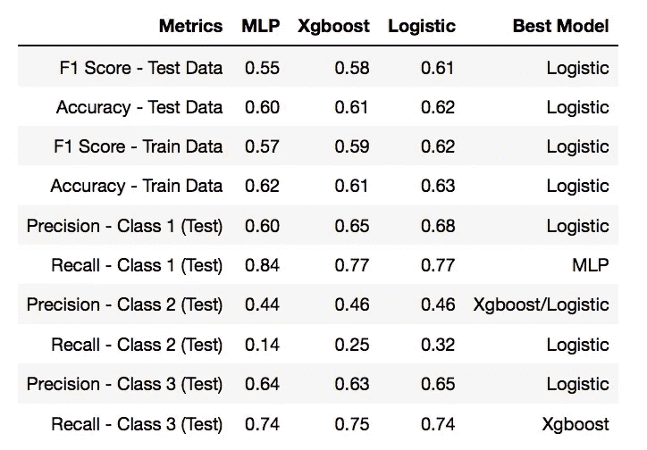

Table of Performance over Models

# 8.微调选择的模型

[︽](#350b) 在这一部分，我将进一步微调逻辑模型的超参数，看看它是否能进一步提高模型的性能。

被微调(网格搜索)的超参数是 **C** 和**惩罚**。这两个参数都负责模型的正则化。

## 8.1 微调模型-培训

通过热图可视化，我们甚至可以更好地掌握不同超参数组合的整体性能。让我们看看下面的图表。

在热图中绘制网格搜索分数的函数参考了[*Python 机器学习入门*](https://github.com/amueller/introduction_to_ml_with_python/blob/master/05-model-evaluation-and-improvement.ipynb) *，*初学者必备的 ML 书。

Function — Plot Grid Search Scores in Heat map

`**Result:**`

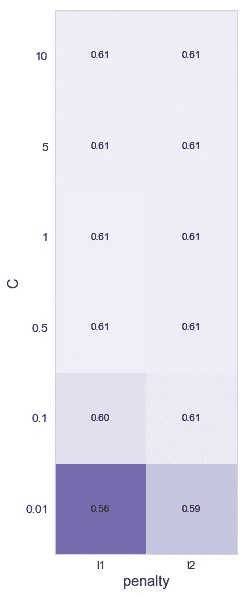

Score Heatmap over Parameters

选择的最佳参数是 **C** 的 **0.5** 和 **L1** 的**罚**。

似乎一旦 C 超过 0.5，模型的性能就达到了平稳状态。精度没有提高。

此外，微调带来的好处似乎微不足道，没有显著的改善。因为右上角的大多数分数始终保持在 0.61。

## 8.2 网格搜索前后的性能

现在，让我们检查一下，相对于没有超参数微调，它获得了多少改进。

`**Result:**`

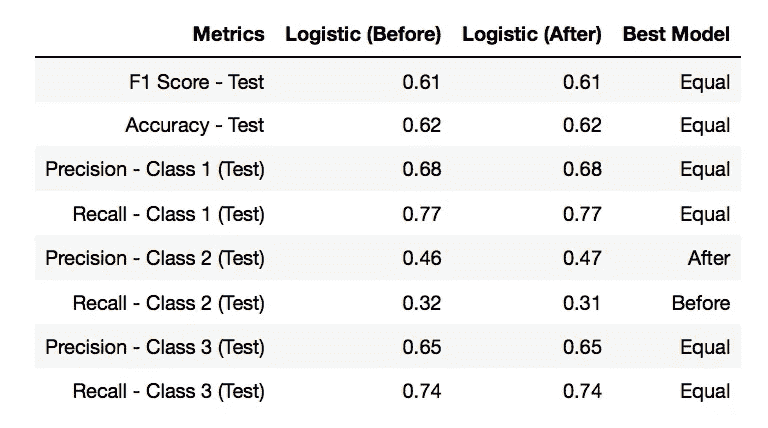

Score of Before and After Grid Search on Test Data

# 结论

在对评论者的评分进行清理、转换、训练和微调分类模型的所有努力之后。该模型在识别低分和高分方面表现很好，但在识别处于中间的 T2 分数方面表现不佳。

参见**回忆**，该模型实际上只能识别出所有得分中的 **31%** ，这意味着其余的 **69%** 被错误地归类为低水平或高水平。

尽管如此，如果我们看看**精度**，那么至少模型达到了 **47%** 的准确度，这意味着对于每个被标记为中等的样本，有 47%的几率是正确的。与随机猜测的结果相比， **29%** 。这仍然被认为是一个重大的收获。

综合 jupyter 笔记本可以在这个链接找到:【 [Github](https://github.com/TomLin/Playground/blob/master/01-Classification-Modeling-on-Hotel-Scoring.ipynb) 】。如果你喜欢这篇文章，欢迎在下面留下你的反馈。让我们一起把这个模型改进得更好！！！

**参考:**

[1] [定制矢量器类](https://scikit-learn.org/stable/modules/feature_extraction.html#text-feature-extraction)(版本 0.20.2)，sckite-learn

[2] A. Muller，[用 Python 进行机器学习的介绍](https://github.com/amueller/introduction_to_ml_with_python/blob/master/05-model-evaluation-and-improvement.ipynb) (2018)，github

[3] S. Hallows，[探索 XGBoost 的使用及其与 Scikit 的集成-Learn](https://www.kaggle.com/stuarthallows/using-xgboost-with-scikit-learn) (2018)，kaggle

[4] S. Miller，[XGBoost with Python](https://www.datasciencecentral.com/profiles/blogs/xgboost-with-python-part-0)(2018)，数据科学中心

[5] J. Brownlee，[Python 中 XGBoost 的特征重要性和特征选择](https://machinelearningmastery.com/feature-importance-and-feature-selection-with-xgboost-in-python/) (2016)，机器学习掌握

[6] J. Brownlee，[Python 中如何用 XGBoost 保存梯度增强模型](https://machinelearningmastery.com/save-gradient-boosting-models-xgboost-python/) (2016)，机器学习掌握