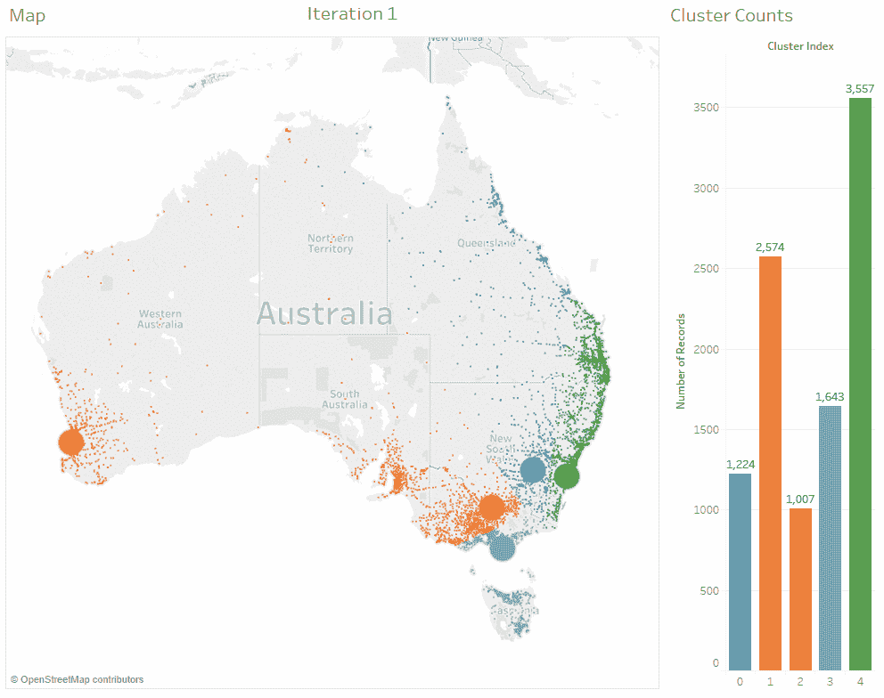
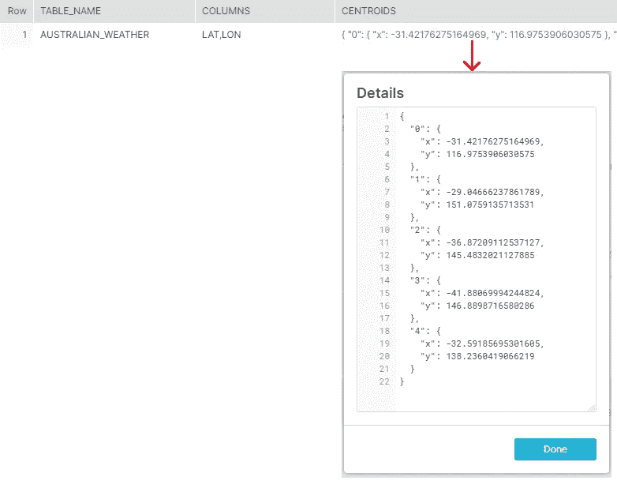
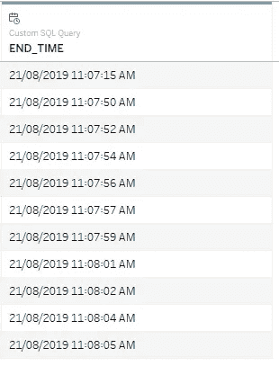
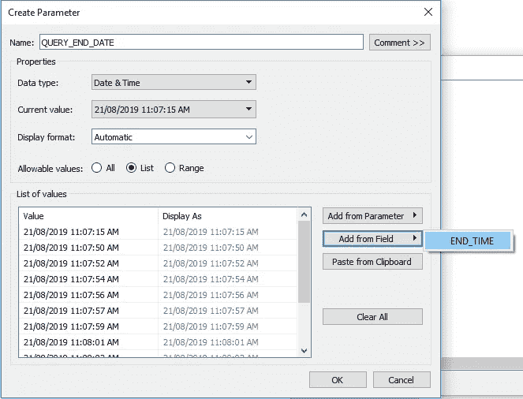
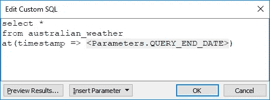
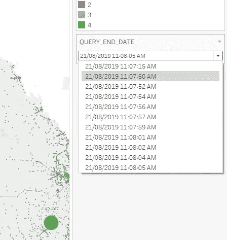

# 雪花中的 ML 第 2 部分:k 均值聚类

> 原文：<https://towardsdatascience.com/ml-in-snowflake-part-2-k-means-clustering-b943c829477?source=collection_archive---------26----------------------->

我们喜欢的理解世界的方式之一是将相似的事物组合在一起。

在设计中，我们把颜色分成不同的色调。在销售和市场营销中，客户通常被细分以适应他们的差异。在统计学中，聚类是一种广泛使用的无监督学习技术，用于帮助组织数据集。

您可能已经从我以前的故事中注意到，雪花不仅仅可以用于检索或聚合数据。它可以大规模扩展到各种与数据相关的任务，并与更传统的工作负载和平共存。

在这个故事中，我将演示在雪花中运行的 k-means 聚类，其方式可以很好地扩展到大型数据集。这是最终产品的一个快速可视化画面:



The large dots are the cluster centroids, small dots are the data points

# 什么是 k-means？

我将把解释留给专家，StatQuest 有一个很棒的视频描述了 k-means 聚类是如何工作的:

# 雪花实现

首先，从我们账户中的样本数据中获取一些天气数据:

It’s always good beach weather in Australia

这是一个很大的表，所以为了节省时间，我只是快速地从顶部切下一百万行并对它们进行采样。

现在，我们将创建一个表来跟踪不同表和列的 k-means 元数据:

我们稍后将介绍质心列的用途。

我们希望能够将源表中的每一行分配给一个特定的集群，因此为此添加一个额外的列。

使用存储过程将整个事情联系在一起。完整的源代码是[这里](https://github.com/jamesweakley/snowflake-ml/blob/master/k-means/kmeans_stored_procedure.sql)，但我会一步一步地解释。

调用 k-means 存储过程如下所示:

```
call k_means('AUSTRALIAN_WEATHER', 'LAT,LON','CLUSTER_INDEX', 5, 10)
```

简单地说:对于 AUSTRALIAN_WEATHER 表中的每一行，使用 10 次迭代训练，将纬度和 LON 组合分配给 5 个分类中的一个。将最后一个集群标识符放入 CLUSTER_INDEX 列。

该存储过程执行以下操作:

1.  从 KMEANS_CLUSTERS 表中删除“AUSTRALIAN_WEATHER”中“LAT，AUSTRALIAN”的任何现有分类元数据。
2.  从表中随机抽取 5 行样本，并使用这些样本的纬度和 LON 值作为 5 个初始聚类的中心点(或“质心”)。
3.  将这些初始聚类质心插入到 KMEANS_CLUSTERS 表中。此后，KMEANS_CLUSTERS 表如下所示:



These are just randomly chosen points, now the k-means algorithm takes over and moves them around.

4.定义了分类后，存储过程现在使用用户定义的函数(UDF)将每一行分配给最近的分类:

For some reason this preview is being truncated, see here for the full code: [https://gist.github.com/jamesweakley/edd9edfa3d9cffe3134e8e0f83670844](https://gist.github.com/jamesweakley/edd9edfa3d9cffe3134e8e0f83670844)

存储过程生成 SQL，该 SQL 将此 UDF 用作 UPDATE 语句的一部分:

5.更新所有记录的分类索引后，存储过程通过获取每个分类的平均 x 和 y 值来计算新的质心:

步骤 4 和 5 循环重复，直到所有的迭代用完。每次，当记录从一个群集移动到另一个群集时，群集质心通常会稍微移动。

# "你是如何做出如此酷的观想的？"

很高兴你问了。

雪花有一个特性叫做[时间旅行](https://docs.snowflake.net/manuals/user-guide/data-time-travel.html#querying-historical-data)，基本上就是说你可以在定义的时间旅行窗口内从任意时间点查询一个表。

为了利用这一点，我首先为 Tableau 提供了一个定制查询，该查询将检索我在过去一个小时内运行的每个查询的准确时间戳，我在这里更新了 AUSTRALIAN_WEATHER 表:

```
select END_TIME::timestamp_ntz as END_TIME
from table(information_schema.query_history_by_user(USER_NAME => CURRENT_USER(), END_TIME_RANGE_START => TIMESTAMPADD(hour,-1,CURRENT_TIMESTAMP())))
where QUERY_TEXT like 'update "AUSTRALIAN_WEATHER"%'
order by start_time asc
```

结果如下:



然后，当查询您的实际表时，您可以创建一个从该列表中取值的参数:



并使用“at”限定符从参数中选择时间点。



把这个加到你的桌面上，你就有了一个时间旅行装置！

