# ML Intro 7:本地连接和空间参数共享(又名卷积层)

> 原文：<https://towardsdatascience.com/ml-intro-7-local-connections-and-spatial-parameter-sharing-abbreviated-convolutional-layers-b419e629d2d0?source=collection_archive---------11----------------------->

这篇文章紧随 [ML intro 3](/ml-intro-3-logistic-output-units-ec42cc576634) 或 [ML intro 6](/ml-intro-6-reinforcement-learning-for-non-differentiable-functions-c75e1464c6b9) 之后。我们假设您直观地理解了堆叠线性回归图层和交替非线性函数来构建神经网络的强大功能，并理解了自定义输出单元，如 logistic 或 softmax 函数。

这个演讲是我在哥伦比亚工程【https://bootcamp.cvn.columbia.edu/data/ 的系列演讲的一部分，旨在适用于技术和企业观众。

## 学习目标

在这篇文章中，我们建立了一个数学工具集，让我们处理图像、语言、视频、图形和其他 ML 问题。我们将设计自定义的数学计算层，这些计算层采用本地连接来共享本地信息和空间参数，从而共享情报。最后，我们构建卷积层，并使用一个包(在这种情况下，我们选择 PyTorch)从图像数据中学习。

在这次讲座之后，你应该能够熟练地使用图像完成任务，例如物体识别，并且能够熟练地设计数学表示，以及将适当的参数共享应用于定制的商业和学术场合。

# 问题设置

眼前的问题是依靠 softmax 输出单元进行多类分类。正如在 [ML intro 3](/ml-intro-3-logistic-output-units-ec42cc576634) 中所讨论的，多类分类是将一个数据点分类为多个类型中的一个。正如在 [ML intro 3](/ml-intro-3-logistic-output-units-ec42cc576634) 中，我们使用 softmax 输出单位来分配每种类型(或类别)的可能性。但是在这个分析中，我们使用图像作为输入数据。

不要跑去谷歌“ML for images”或“如何卷积张量流”。相反，让我们想想我们想要从我们的机器学习系统中得到什么，并适当地设计它。

## 代码

在这里跟随尚未解决的部分代码:[https://github . com/leedtan/LeeTanData/blob/master/ML _ Intro _ 7 _ Convolutions/unsolved . ipynb](https://github.com/leedtan/LeeTanData/blob/master/ML_Intro_7_Convolutions/Unsolved.ipynb)

并在此查看填写的解决方案:[https://github . com/leedtan/LeeTanData/blob/master/ML _ Intro _ 7 _ Convolutions/solution . ipynb](https://github.com/leedtan/LeeTanData/blob/master/ML_Intro_7_Convolutions/Solution.ipynb)

## 原始数据

过去，我们需要学习数据点。数据集可以像我们的第一个例子一样在 2d 网格中可视化，其中每行代表一个数据点，每列代表一个要预测的特征或目标。

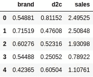

Table Visualizing Sales

图像也是如此。每个图像可以是一行，图像的每个值可以是我们机器学习模型中的一个特征。但是，请注意，图像显然具有网格结构。图像通常被理解为像素的 2d 网格，或者是 NxN 灰度图像(每个像素只是一个值)，或者是 Nx3 RGB 图像(每个像素包含 3 个值，红绿蓝)。这些可以被认为是具有 1 个过滤器或 3 个过滤器的 2d 网格，其中过滤器在该空间中被定义为数值层，图像中的每个空间区域一个值。在图像的神经网络中，我们计算由许多过滤器组成的神经网络层，而不仅仅是许多密集的节点。

让我们想象一下我们的一幅灰度图像:

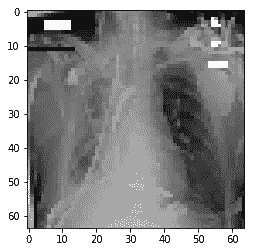

# 建模图像数据

所以现在我们已经讨论了图像具有结构，但我们仍然会用我们的神经网络来处理它们。那看起来是不是…乱七八糟？

## 概念检查:神经网络图像数学

假设我们有一个 1024x1024 的图像，我们想计算一个同样大小的隐藏层。对于这一层，我们需要学习多少个标量乘数？

## 解决方案:神经网络图像数学

1024*1024*1024*1024 标量，因为每百万个输入单元都需要连接到每百万个输出单元。一个隐藏层就有十亿个学习参数。似乎有点过分，对吧？

## 引入本地连接

与其将所有的输入单元连接到所有的隐藏单元，不如将隐藏单元构造成一幅图像。这样，我们可以认为每个隐藏单元不需要计算关于图像的特征，它只需要计算关于其区域的特征。

我们称之为局部连接层。它是保持上一层结构的一层，每个单元只接受来自自身周围一个小的局部区域的输入。我们把它接收输入的区域的宽度和高度叫做它的“内核大小”。

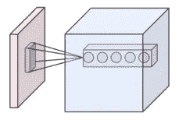

上面，内核大小没有标注，但是你可以看到蓝色的盒子正在计算红色图像的隐藏表示。蓝框的每个位置都接收来自其周围一个小区域的输入。

你可以看到在蓝色立方体中图像的相同位置有许多球。这是因为我们创建了多个隐藏单元(就像隐藏层中的节点)来计算不同的函数。然后，蓝色立方体就像图像一样被处理，并用于进一步处理表示，就像神经网络中的层一样。

查看基本的本地连接图层，并注意生成输出图层的计算。

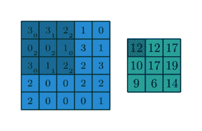

请注意，上面的输出(右边的绿色)过滤器比左边的过滤器小。

现在请注意，蓝色立方体和红色图像，或者蓝色正方形和绿色正方形的高度和宽度是相同的。看到绿色方块的每个位置是如何由一个 3×3 的网格计算出来的吗？还要注意，边节点是通过观察蓝色网格外的区域来计算的。这些用来保持图像大小和形状的空白单元格被称为**填充**。因此，5x5 内核需要在所有边上填充 2，以保持图像大小。

## 概念检查:神经网络本地连接

如果是在课堂上，与同伴讨论。假设我们有一个 5x5x1 的灰度图像，我们想计算一个没有填充的 3x3x2 的灰度图像。我们需要多少内核？我们将如何使用它们？使用 python 随机生成内核[-1，0，1]并计算以下输入图像的隐藏层值:

[[2，1，0，0，1]，
，【0，0，0，1，0】，
，
，【1，2，0，1，0】，
，【0，1，0，0，1】]

## 解决方案:神经网络本地连接

我们需要 18 个内核，每个空间位置 2 个，总共 9 个空间位置。

下面我们随机生成 18 个内核，

乘以输入

并将负值修剪为 0

创建:

## 概念检查:局部连接的参数数量

利用上面的公式，我们现在需要多少个参数来从 1024×1024 灰度图像学习隐藏表示？现在让我们假设我们的隐藏层有 16 个隐藏单元，每个单元有一个 3x3 内核。

## 解决方案:局部连接的参数数量

我们需要大约 1024×1024 个位置来计算，对于每个位置，我们只需要学习 16×9 个参数(与全连接层的 16×1024 个参数相反)。这使我们的参数减少了 100 倍！我们现在只需要 10⁸参数，这听起来仍然很多。

## 包装本地连接:

本地连接的网络在图像处理之外还有很多应用。它们可以应用于处理语言数据，以及处理图形数据，例如社会或地理信息。本练习的目标是学习识别何时需要处理局部信息来计算局部表示。

## 引入空间参数共享

在传统的机器学习中，我们首先手工制作内核来检测图像中的对象，如蓝线或黄色斑点。

对于本地连接，我们有一个内核来处理图像的左上角。也许该特征擅长检测图像中的黄色斑点，这是全局图像分类之前的重要局部任务。如果内核对图像的左上角有用，那么检测图像的中间和底部可能也很重要。为什么不只是定义相同的一组内核，然后将它们应用到图像中所有不同的空间区域？通过这种方式，我们不会学习不同的函数来处理图像的右侧和左侧，我们学习的参数数量会急剧下降。

## 概念检查:空间参数共享多个参数

利用上面的公式，我们现在需要多少个参数来从 1024×1024 灰度图像学习隐藏表示？同样，我们的隐藏层有两个隐藏单元，它们有相同的 3x3 内核。

之后，使用与之前相同的图像，定义适当数量的内核，并利用参数共享计算隐藏层。

[[2，1，0，0，1]，
，【0，0，0，1，0】，
，【0，0，1，2，0】，
，【1，2，0，1，0】，
，【0，1，0，0，1】]

## 解决方案:空间参数共享多个参数

嗯，在每个图像位置，我们仍然需要 2*9 个参数来学习 2 个过滤器，但现在我们在整个图像上应用同样的 2 个过滤器！现在我们只需要 2*9 ~ 18 个参数就可以学习整个滤波器了！

下面我们随机生成两个内核，

乘以输入

并将负值修剪为 0

创建:

## 创造术语卷积层

本地连接层的参数共享组合如此强大，以至于它有了自己的名字，卷积层，它构建成一个卷积网络。

参数共享及其对 2D 卷积层的应用是使 Yann Lecun(脸书人工智能研究负责人)出名的关键见解之一，也是我们日常接触到的大部分人工智能得以实现的原因之一。

对于下面的编码活动，我们可以依赖卷积层，但我也应该先向您介绍一些其他概念:

## 池层:

池是压缩层。假设我有一张 1024x1024x1 的灰度图像，我不想在计算上处理这么大的图像。嗯，对于每个 4x4 的立方体，我可以取最大值(或最小值，或平均值)，这将把图像压缩成 256x256x1 的灰度图像。(一层所需的处理能力降低了 16 倍！)

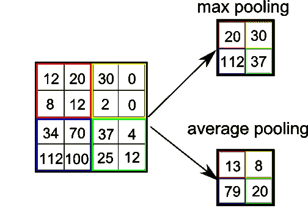

相反，如你所料，取消 pooling 会在空间上扩展图像。

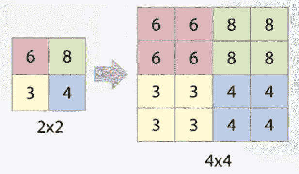

传统上，我们交替使用卷积层、ReLU 层和(最大)池层来降低数据的维度，同时为每个空间位置计算越来越多的要素

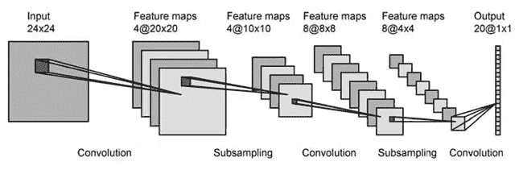

不过，我们不太喜欢池层不能完全区分所有的输出单元。对于最大池，只有最大值可以摆动以影响输出，因此其他值不会得到导数。因此，现在我们经常使用步长卷积进行降维。

## 交错盘旋；

卷积的跨度是压缩到单个输出位置的输入空间位置的数量。

例如，步幅为 2 会将图像大小减少一半，类似于 2x2 池。此外，0.5 的步幅(也称为转置卷积)会将图像的大小扩大 2 倍。

请注意下面的步幅 2 是图像形状的一半，而步幅 0.5 是图像宽度和高度的两倍。

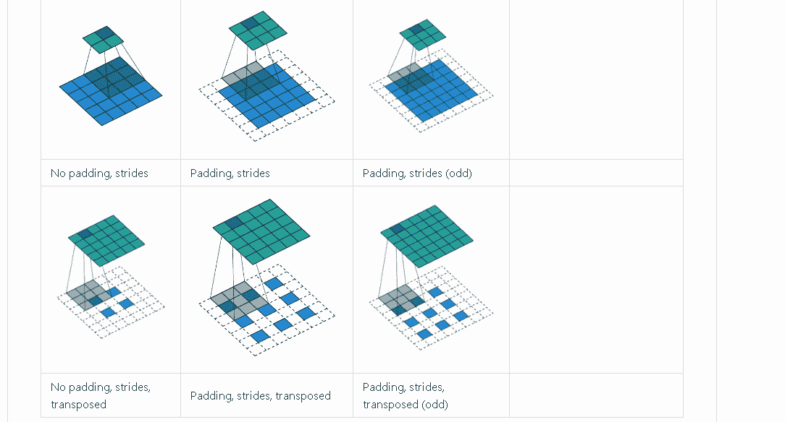

In the transposed convolution images above, blank pixels are inserted between the blue pixels to show that the 2x2 or 3x3 blue image is expanded and the output green image is much wider

还要注意，网络中大于 1 或小于 1 的跨距是一种通用数学工具，用于网络层以扩展或压缩卷积信息，并且比仅应用于图像操作更通用。

这是定制机器学习数学的一个案例！如果你在 ML 方面有所进步，你会发现理解核心操作背后的这些概念是令人难以置信的强大，因此你可以用它们来为你手头的问题构建定制的操作，而不是试图将你的问题放入现成的系统中。

# 现在让我们在 Pytorch 中实现一个神经网络

对于这个练习，您应该使用 nn。新罕布什尔州 Conv2d。LeakyReLU 和 nn。MaxPool2d 构建神经网络层，将图像转换为窄的类似图像的表示，然后将内容重塑为单个向量，并执行标准分类。

注意:这只是真实数据集的一个样本，所以我们不能获得很高的准确性，而只是演示概念。

## 首先导入许多包

## 编码活动:读入数据标签

## 解决方案:读入数据标签

## 编码活动:将数据文本标签映射到数字

## 解决方案:将数据文本标签映射到数字

读入图像。如果之前读入，则从缓存加载。

## 以下是一些对所有 PyTorch 项目有用的函数

## 填写你的模型的待办事项

## 并通过填写这些待办事项来训练模型:

## 创建并训练模型，绘制学习曲线

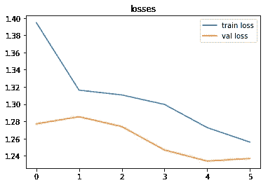

Learning curve of training and validation losses (notice the model improves over time!)

## 想象你的第一层(或第二层！)

最后，我们很好奇我们的第一层正在学习什么类型的形状，所以我们想象下面的层权重

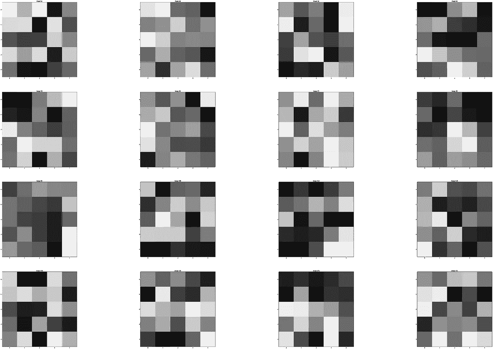

如果我们训练我们的模型更长时间，如果我们有一个更大的数据集，我们可能会学习关于线和斑点的低级特征，以及关于曲率的中级特征，这些特征可能如下所示:

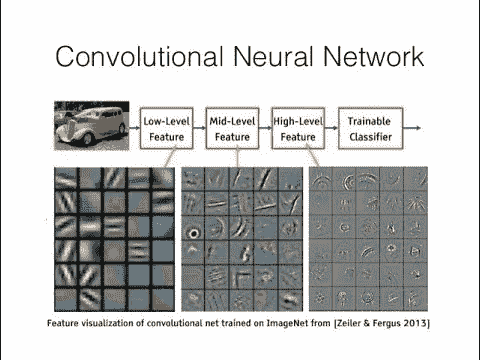

## 包裹

不幸的是，我们只在一些图像的小样本上运行我们的代码，所以我们的第一层看起来不太有意义，我们的精确度也不是很好。不过没关系，我们学习了代码。如果我们有一个强大的 GPU 来运行大型数据集上的代码，这个模型可能会做得更好。

我们的例子使用了一个小数据集，并且没有训练太长时间，所以你们都可以获得舒适的学习体验，而不用等待很长的训练时间。

反正就是这样！当我们处理图像时，我们希望在计算最终预测之前使用空间参数共享来处理局部特征，因此我们可以使用简单的神经网络卷积层，但我们认识到为什么我们使用那些类型的卷积，以便我们可以在解决其他类似问题时使用其他类似的操作。

# 总结我们所讲的内容:

在整个会议期间，我们

*   开始用**神经网络**来处理**图像**的像素特征。
*   计算出的**局部**特征而不是**密集**特征(所有节点都连接到所有其他节点)以减少计算次数。
*   了解了术语**内核**，它是一个占用空间很小的矩阵，可以让我们基于前一层的局部补丁计算一个新的隐藏值。**内核的高度**和**宽度**很重要，因为它们决定了每个输出单元有多少单元。
*   利用**参数共享**在我们图像的各个区域共享内核矩阵。
*   为上述过程的组合创造了术语**卷积**。
*   了解了**池化**和**跨步**，两种减少图像空间宽度的方法。
*   利用医学图像数据集上的卷积和池实现网络。

**软件工程师可选后续岗位:** 重数学、重 CS 的详解(上):[https://medium . com/@ leetandata/neural-network-introduction-for-Software-Engineers-1611d 382 C6 aa](https://medium.com/@leetandata/neural-network-introduction-for-software-engineers-1611d382c6aa)

**数学-CS-重详解(下):**[https://medium . com/@ leetandata/neural-network-for-software-engineers-2-mini-batch-training-and-validation-46ee 0a 1269 a 0](https://medium.com/@leetandata/neural-network-for-software-engineers-2-mini-batch-training-and-validation-46ee0a1269a0)

**Cho 教授可选数学笔记:**
[https://github . com/NYU-dl/Intro _ to _ ML _ Lecture _ Note/raw/master/Lecture _ Note . pdf](https://github.com/nyu-dl/Intro_to_ML_Lecture_Note/raw/master/lecture_note.pdf)