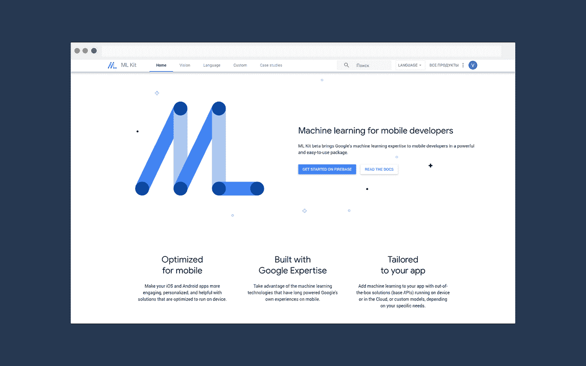
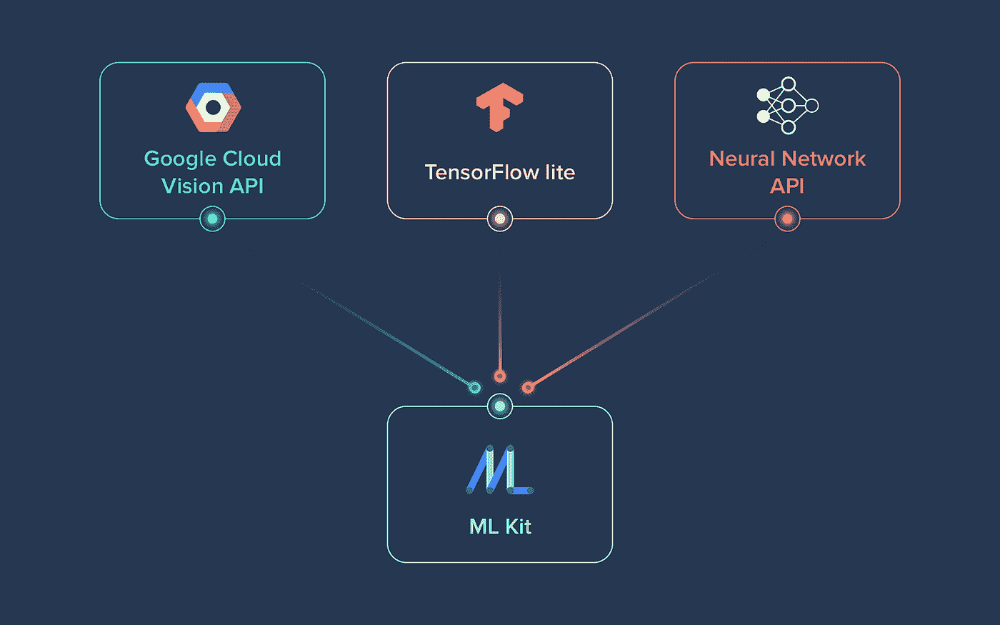
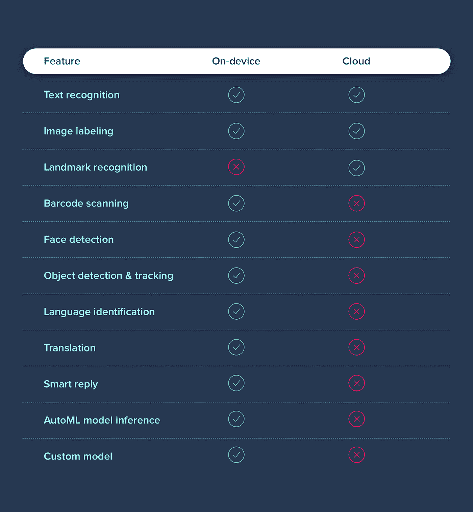

# 用于 Firebase 的 ML 工具包:特性、功能、优点和缺点

> 原文：<https://towardsdatascience.com/ml-kit-for-firebase-features-capabilities-pros-and-cons-a182b4299cc?source=collection_archive---------11----------------------->

## 使用 ML Kit APIs 为您的项目带来好处的权威指南

Photo by PhonlamaiPhoto from [iStockphoto](https://www.istockphoto.com/photo/robot-connect-human-gm914327272-251658363)

许多开发人员期待谷歌在他们的 I/O 会议上的创新。这并不奇怪——谷歌总是有一些令人兴奋和不寻常的东西。2019 年也不例外。Android Q，升级的智能助手，新的智能手机 Pixel 3a 和 Pixel 3a XL——更新的列表还远远不够完整。

今天，我们将重点关注面向开发人员的机器学习解决方案，如用于 Firebase 的 ML Kit。这个工具包是去年在 Google I/O 2018 上向公众展示的。今年它得到了一些更新。让我们回顾一下这个 SDK，找出所有的优缺点和关键功能。

我们希望这份权威性的指南对你有所帮助和认知。

# ML 试剂盒特性

ML Kit SDK 是谷歌在 2018 年推出的一款相当新的产品。ML Kit 是一个软件开发工具包，它使开发人员能够简化机器学习模型与其移动应用程序的集成。此外，即使是初级开发人员也可以处理这项任务。

ML 套件仍然只有测试版。它可以使用 Firebase 启动。目前，有 11 个特性提供了 API。顺便说一下，2018 年 Google I/O presentation 上只有 5 个功能可用，而今天，这个数字增加了一倍。功能如下:

*   文本识别；
*   人脸检测；
*   条形码扫描；
*   图像标注；
*   目标检测和跟踪；
*   地标识别；
*   语言识别；
*   翻译；
*   智能回复；
*   自动模型推理；
*   自定义模型推断。

稍后我们将更好地探索每个特性及其 API，现在我们将挑选出 ML Kit 的特殊性和优点。

Image by Author

## 清晰易用

众所周知，将基于人工智能的算法集成到移动应用程序中并不是一件容易的事情，它需要良好的技能和大量的时间。首先，开发人员需要学习一些合适的机器学习库，如 TensorFlow、Torch、PyBrain、Azure 等等。然后，应该训练一个神经网络来执行所有必要的任务。但这不是终点！而且，这仅仅是个开始。下一步是建立一个不会很重的机器学习模型，因为它应该可以在移动设备上流畅地运行。而且只有模型建好了，开发者才可能稍微放松一点。如您所见，即使对于有经验的开发人员来说，这项任务也相当复杂。

但是新的 ML Kit SDK 允许开发者让一切变得更快更容易。开发人员需要将数据传递给所需的 API，并等待 SDK 的响应。谷歌的代表保证，开发人员不需要在神经网络方面高度熟练才能实现他们的 API。开发人员需要的一切就是添加几行代码，一个新的应用程序将获得基于人工智能的酷功能。

## 定制模型

对于熟练的开发人员来说，这是一个合适的选择。如果现有的 ML Kit APIs 没有为开发人员提供他们需要的特性，他们可以构建自己的定制 ML 模型。在 Firebase 网站上，有一个关于开发者如何做到这一点并从他们的模型中获益的解释。

ML Kit 配合 TensorFlow 使用，这是一个面向 iOS 和 Android 操作系统的机器学习库。这个库允许开发人员将他们的模型下载到 Firebase 控制台，并与他们的产品捆绑在一起。如果构建的模型太重，开发人员可以将其留在云中，然后安排动态下载到应用程序。它使缩小应用程序成为可能，用户将更快地下载应用程序。除此之外，模型的更新也是动态的，这是一件重要的事情。这意味着模型将被更新，而整个应用程序不会被更新。

## 设备上和云 API

开发人员可以根据自己的需求选择基于设备的 API 或云 API。如果你不知道什么选项更好，你应该考虑所有的差异，以做出正确的选择。云 API 在谷歌云平台上处理数据，因此对象识别的执行更加精确。

然而，云模型比设备模型大。设备上的模型需要更少的空间，它们可以离线工作，数据处理更快，但这些模型不是那么准确。

更重要的是，离线和云模式都有一些特定的功能。例如，文本和地标识别、图像标记——这些功能在云中工作。设备上的 API 提供了更多功能，如文本识别、人脸检测、条形码扫描、图像标记、对象检测和跟踪、语言识别、翻译、智能回复、自动模型推断、自定义模型推断。

价格也不一样。本地 API 是免费的。Firebase ML Kit 使用的是云视界 API，所以云 API 和云视界 API 的价格是一样的。你使用 API 的次数越多，你需要支付的费用就越多，一切都很简单。比如每月最多 1000 次使用，是免费的。那么每新使用 1000 次将花费 1.50 美元。

还有，更重要的一点是隐私。根据谷歌的声明，用户的数据不会存储在云 API 中，一旦处理完成，就会被删除。

## 多平台

还有一个好消息——ML Kit SDK 是多平台的，即 API 可以用于 iOS 和 Android 应用程序。因此，一个新的 ML 套件可能会与苹果的 CoreML 竞争，甚至有一天会打败它。然而今天，CoreML 比 ML Kit 更有优势。例如，CoreML 使用 TensorFlow，它也接受 ONYX、Python 工具、Apache MXNet。

Image by Author

通过 ML Kit 获得 ML 特性的 Android 应用程序甚至可以在 Android 4.0 上运行，因此 ML 的特殊性之一是它能够在旧的 Android 版本上工作。像 Android Oreo 和 Pie 这样的新版本获得了更好的性能。云模型也使用 Android 的标准神经网络 API。

## 其他 Firebase 服务如何与 ML 工具包交互

ML Kit SDK 可以与其他 Firebase 服务完美配合。图片标注可以保存在云 Firestore。或者谷歌分析可以用来衡量用户参与度。此外，在远程配置和 ML 套件的帮助下，可以轻松执行定制 ML 模型的 A/B 测试。

## 清晰而实际的例子

Firebase service 包括面向开发人员的详细手册，其中解释了如何在他们开发的应用程序中实现主要用例。有针对 Android 和 iOS 程序员的手册，因此开发人员可以使用现有的 API 在几个小时内用新功能增强他们的应用程序。

# 主要特性及其功能

正如我们在开始时承诺的，我们将详细讨论每个特性，并为您提供每个特性的相关信息。

## 文本识别

这项功能在云中和设备上都可用。文本识别 API 使得以文本形式识别任何基于拉丁语的语言成为可能。此功能可用于自动化信用卡、收据和名片的烦人数据输入。基于云的 API 允许开发者从文档的图片中提取文本。该文本可用于文档翻译或提高可访问性。此外，具有文本识别功能的应用程序可以读取现实世界物体上的数字。例如，客户需要从商店的一张图片中提取数据。

## 图像标注

这个 ML 工具包 API 使得识别图像中的对象成为可能。不需要提供额外的元数据，识别是在独立的基础上实现的。这个特性在离线和云中也是可用的。借助手机应用程序中的图像标签功能，用户将能够了解图片中显示的所有内容。用户得到了该图像中所有可识别物体的列表:人、动物、建筑物等等。每个标签都有一个分数，表示 ML 模型在识别这个或另一个对象时的置信度。使用此功能，用户可以执行自动元数据生成和内容审核。

## 地标识别

这个 API 只在云中可用。这使得在任何图像中识别众所周知的地标成为可能。为了测试它，开发人员可以将一个图像放到这个 API 中，然后所有识别出的地标都会显示出来。除此之外，还显示了地标的地理坐标。因此，可以看到这张照片是在哪里拍摄的。这些信息可用于元数据生成，为用户提供个性化体验。

## 人脸检测

人脸检测 API 用于检测图像中的人脸、关键面部特征，并构建检测到的人脸的轮廓。此功能仅在脱机时使用。使用这个 API，用户可以从图片中提取人脸，并使用不同的过滤器进行编辑。此外，还可以从用户的照片中生成头像。由于 ML Kit 为用户提供了在实时模式下应用人脸检测功能的可能性，开发者可以将其集成到视频聊天或游戏中。所以如果你需要[开发人脸识别 app](https://www.cleveroad.com/blog/face-recognition-app-development--how-to-choose-the-best-tool-for-implementation) ，你可以从 ML Kit 中调用这个 API。

## 条形码扫描

条形码扫描 API 允许用户使用最标准的条形码格式从条形码中读取数据。扫描在设备上执行，不需要互联网连接。在条形码的帮助下，用户可以发现编码数据中隐藏了什么。例如，它可以是联系信息或任何支付数据。这个特性对于检测编码数据非常方便。

## 目标检测和跟踪

这个在设备上运行的令人惊叹的 API 将帮助用户定位和跟踪图像或直播相机馈送中的对象。检测到的物体可以被分类到所选择的一般类别中。如果用户需要构建实时视觉搜索体验，对象检测和跟踪功能可能是有利的。当检测到所有对象时，用户可以将它们发送到云后端或自定义模型，如果开发人员构建了这个模型的话。

## 语言识别

有了这个功能一切都清楚了。语言识别 API 使得从一个文本字符串中识别语言成为可能。对于需要找出图像或文档中所写语言的翻译人员或历史学家来说，该功能尤其有用。

## 翻译

这个 API 和上一个一样简单。它用于多达 59 种语言的文本翻译，用户可以在语言之间切换。也就是说，可以使用可用的 59 种语言选择各种翻译组合。翻译 API 使用与谷歌翻译离线应用相同的模型。

## 智能回复

智能回复 API 根据整个对话生成回复建议。而且这个功能可能会建立一个完整的建议，而不仅仅是“是”或者“不是”这样的简短回答。因此，由于所有回复都是自动生成的，用户可以快速回复邮件。但是目前只支持英语，而且这个功能只能用在随意的对话中，不能用于具体的讨论。

## 自动视觉边缘

AutoML 模型推理功能允许开发人员训练他们的图像标签模型。设备上图像标签 API 模型经过训练，可识别多达 400 个不同的类别。但是可能有必要缩小对象的数量以识别更具体的对象。例如，用户需要区分不同品种的狗。在这里，AutoML Vision Edge 工具用于使用开发人员上传的图像来训练所需的模型。

## 自定义模型推理

这个特性主要针对那些没有找到合适的现成模型的熟练开发人员，他们可以使用 ML Kit 构建自己的定制模型。为此，开发人员可以使用 TensorFlow Lite 模型和 ML 工具包。

Image by Author

**重要提示！【Firebase 的 ML 工具包仍处于测试版发布模式。并且每个 API 都可能以向后不兼容的方式改变，并且 API 不受弃用策略或 SLA 的约束。**

# ML 套件的缺点

不幸的是，ML Kit 中也存在一些陷阱，我们应该考虑到它们。

## 大号

使用定制模型是一个很好的选择，因为它们可以帮助有经验的开发人员集成他们需要的特性。但是，额外的定制模型可能会使应用程序变得非常沉重，并使应用程序变得过大。因此，一个文件的大小将远远大于一个典型的应用程序的大小。而且对开发者和用户都不会有好处。

## 测试版

尽管 ML Kit 在一个多小时前就已经发布了，但正如我们上面提到的，它仍然处于 beta 发布模式。而且可能对基于云的 API 有负面影响。如果开发者需要添加基于云的 API，需要直接使用云视界 API。况且任何测试版都有一些缺陷和 bug，对于一个测试版来说很正常。没有关于最终版本发布日期的消息。

# 如何在实际应用中使用 ML 工具包

一些公司已经成功地使用 ML 套件为用户提供了全新的卓越体验。我们将在这里列举两个例子。

## 丢掉它！

那是一个为那些想减肥的人设计的健身应用程序。该应用程序可以跟踪燃烧的卡路里数量。该应用的所有者 FitNow 是首批使用 ML Kit 为用户提供商业应用的公司之一。因此，该应用程序使用文本识别 API，用户可以输入他们所吃产品的信息，而无需手动输入。也就是用户把摄像头对着商品标签，输了 I！应用程序扫描并读取所有内容。除了可用的 API，该公司还创建了自己的定制模型。

## 涡轮税

该应用程序旨在使纳税过程更加易于管理。集成了条形码扫描 API。例如，司机可以扫描他们的驾驶证，应用程序将从这个许可证中读取所有的个人数据。因此，用户将会犯更少的错误，并且准确性水平将会提高。

包装应用程序，我们想补充一点，ML Kit 是一个强大的工具，可以构建具有机器学习功能的应用程序。此外，您可以添加您的自定义模型。此外，谷歌可能会在未来准备一些新的功能，将我们击倒。也许 ML Kit 最终会正式发布。