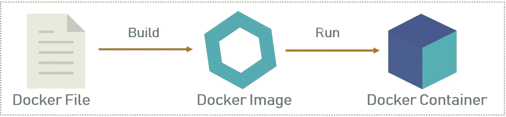
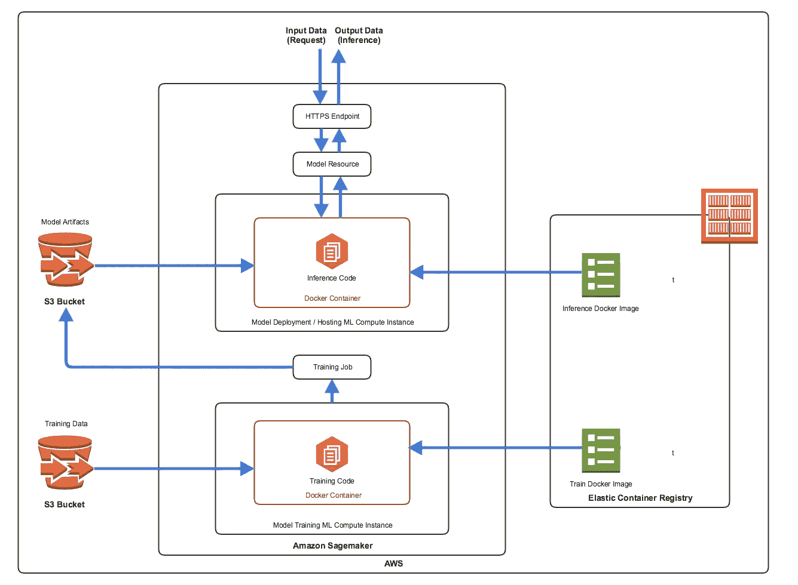
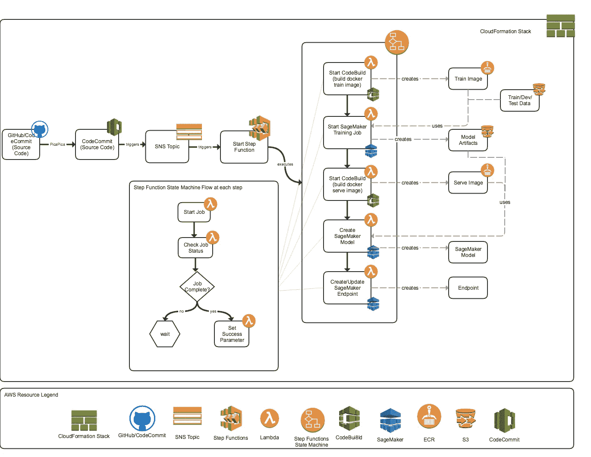

# ML 模型——从原型到生产

> 原文：<https://towardsdatascience.com/ml-models-prototype-to-production-6bfe47973123?source=collection_archive---------10----------------------->

你有了一个模型，现在呢？

通过机器学习的力量和深度学习的承诺，今天的会议，思想领袖和人工智能专家一直在描绘由数据驱动的商业愿景。然而，尽管在 ML 和深度学习领域有突破性的研究和不断涌现的新论文，但这种研究的大部分仍然只是研究(除了少数科技巨头)。部署 ML 模型仍然是一个巨大的挑战。作为一名数据科学家和 ML 实践者，我亲身经历了从一个可靠和准确的原型模型到一个性能良好和可扩展的生产推理服务的旅程，这通常比实际构建模型更困难。当代码和/或数据更新时，需要重新训练和部署模型。因此，自动构建和部署机器学习模型是创建生产机器学习服务的关键部分。

“生产化”ML 模型的部署和操作方面处于各种实践和学科的交叉点，如统计建模、数据科学、开发运维、ML 工程等。因此，它不属于任何单一学科的专业领域。此外，除了选择部署堆栈之外，生产流量服务模型还有其他考虑因素，如持续改进和部署的需求、安全问题、性能和延迟方面、支持快速实验和 A/B 测试的能力、允许自动扩展等。

在这篇文章中，我将描述一种使用 AWS Sagemaker 和 AWS Step 函数自动构建和部署 ML 模型的方法。

[**AWS SageMaker**](https://docs.aws.amazon.com/sagemaker/latest/dg/whatis.html) 是一个完整的机器学习(ML)工作流服务，用于开发、训练和部署模型。它与 Jupyter 笔记本电脑集成在一起，用于数据分析、探索和模型实验。它提供灵活的分布式培训选项和模型托管服务，通过 https 端点在安全和可扩展的环境中进行模型部署。SageMaker 附带了许多预定义的算法。您还可以通过提供 Docker 映像、训练模型的训练映像和部署到 REST 端点的推理映像来创建自己的算法。

**Docker 到底是什么？**

Docker 是一个基于 Linux 容器的开源项目。它是一个工具，旨在使使用容器创建、部署和运行应用程序变得更加容易。容器允许你打包一个应用程序及其所有的库和其他依赖项，并把它们打包成一个包。码头集装箱是非常轻便和快速的。

**码头工人的基本概念**

Docker Build Process

Docker 文件是您编写构建 Docker 映像的指令的地方。这些指令可以是安装软件包、设置环境变量、路径、暴露网络端口等。

一旦建立了 docker 文件，就可以使用“docker build”命令来构建映像。Docker 图像是只读模板，您可以根据 docker 文件中的一组指令来构建。映像定义了您希望打包的应用程序及其依赖项的外观，以及启动时要运行的流程。

这些只读模板是 Docker 容器的构建块。您可以使用“docker run”命令运行映像并创建一个容器。Docker 容器是 Docker 映像的运行实例。这些基本上是从 Docker 映像创建的现成应用程序。

Docker 图像存储在 Docker 注册表中。它可以是用户的本地存储库，也可以是 Docker Hub 这样的公共存储库，它允许多个用户协作构建应用程序。

# **SageMaker 模型部署架构概述**

使用 SageMaker 部署模型涉及到以下步骤

1.  构建用于训练的 docker 映像，并上传到 ECR(弹性容器注册表)。该映像包含您的训练代码和依赖项。
2.  创建并启动 SageMaker 培训作业([SageMaker CreateTrainingJob API](https://docs.aws.amazon.com/sagemaker/latest/dg/API_CreateTrainingJob.html)
3.  为服务(推理)构建 docker 映像并上传到 ECR(弹性容器注册中心)。该映像包含您的推理代码和依赖项。
4.  创建 SageMaker 模型( [SageMaker CreateModel API](https://docs.aws.amazon.com/sagemaker/latest/dg/API_CreateModel.html)
5.  创建/更新托管模型的 SageMaker 端点([SageMaker create endpoint API](https://docs.aws.amazon.com/sagemaker/latest/dg/API_CreateEndpoint.html))

Sagemaker Architecture BYOM (Bring Your Own Model) Approach

SageMaker 算法被打包成 Docker 图像。这为您提供了使用 SageMaker 的几乎任何算法代码的灵活性，而不管实现语言、依赖的库、框架等等。可以使用自己定制的训练算法和自己的推理代码。您将算法和推理代码打包在 Docker 映像中，并使用这些映像来训练一个模型，并使用 Amazon SageMaker 部署它。

培训—当 Sagemaker 创建培训作业时，它会启动 ML compute 实例，运行在 ML compute 实例中创建 docker 容器的 train docker 映像，将来自 S3 位置的培训数据注入容器，并使用培训代码和培训数据集来培训模型。它将生成的模型工件和其他输出保存在您为此指定的 S3 存储桶中。

部署——对于模型部署，Sagemaker 首先使用存储模型工件的 S3 路径和包含推理代码的图像的 Docker 注册路径来创建模型资源。然后，它使用端点配置创建一个 HTTPS 端点，该端点配置指定生产模型变量和要部署到的 ML 计算实例。

客户端应用程序向 Sagemaker HTTPS 端点发送请求，以从部署的模型中获取推论。

# **一个完整的模型部署框架**

让我们看看如何使用 SageMaker 和一系列其他不同的 AWS 服务来设计端到端的模型部署管道，并将 AWS Step 函数用作主要的协调器和工作流编排器。

[**AWS 步骤功能**](https://aws.amazon.com/step-functions/) 用于工作流编排。使用 Step 函数，您可以设计和运行将多个 AWS 服务(如 AWS Lambda、Amazon ECS 等)连接在一起的工作流。Step 函数还将您的工作流转换为状态机图，以便于可视化表示和监控。

以下是服务如何协同工作的高级概述-

阶跃函数就像一个状态机，从初始状态开始，使用 AWS Lambda 函数转换状态，根据需要改变、分支或循环状态。 [AWS Lambda](https://aws.amazon.com/lambda/) 功能用于启动模型训练、图像构建、检查训练和构建状态等。 [AWS CodeBuild](https://aws.amazon.com/codebuild/) 用于构建 docker 映像，并将它们推送到一个[弹性容器注册表](https://aws.amazon.com/ecr/) (ECR)存储库。 [AWS Systems Manager 参数存储库](https://docs.aws.amazon.com/systems-manager/latest/userguide/systems-manager-parameter-store.html)为我们的培训和部署工作提供了一个共享的集中式参数存储库。AWS Lambda 函数从该存储中查询参数。 [AWS 简单通知服务](https://aws.amazon.com/sns/) (SNS)用于启动构建和通知。 [AWS 简单存储服务](https://docs.aws.amazon.com/s3/index.html) (S3)桶用于保存模型训练数据和训练好的模型工件。当代码发生变化时，Github/CodeCommit 存储库发布到 SNS 主题。当构建开始、完成和失败时，通知也会发布到 SNS 主题。

下图显示了这些服务如何协同工作。

Automatic Build and Deployment with AWS Sagemaker and Step Functions Architecture

总之，SageMaker 和 Step 函数与其他 AWS 服务相结合，可以提供一个健壮的、功能丰富的端到端部署框架——持续地训练、构建和部署 ML 模型。