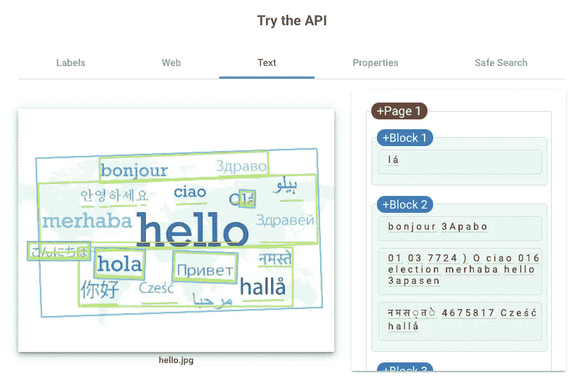

# ML Study Jam — Vision API

> 原文：<https://towardsdatascience.com/ml-study-jam-detect-labels-faces-and-landmarks-in-images-with-the-cloud-vision-api-a80e89feb66f?source=collection_archive---------21----------------------->

## 使用云视觉 API 检测图像中的标签、人脸和地标

AES, a Fortune 500 global power company, is using drones and AutoML Vision to accelerate a safer, greener energy future. Video from [Vision AI](https://cloud.google.com/vision/)

基本上，谷歌视觉人工智能可以分为两类，`AutoML Vision`和`Vision API`。AutoML Vision 是指通过上传图片来训练你自己定制的机器学习模型，用 [AutoML Vision](https://cloud.google.com/automl/) 来训练模型。至于 Vision API，是 Google 提供的一个 API，带有预先训练好的模型，可以很容易地用在你正在构建的产品上。今天我们要介绍的是`Vision API`。

在我们开始之前，我想给你一个关于**什么是云视觉 API 的基本概念？它能做什么？**

> Google Cloud 的 Vision API 通过 REST 和 RPC APIs 提供了强大的预训练机器学习模型。为图像分配标签，并快速将它们分类到数百万个预定义的类别中。检测物体和人脸，阅读印刷和手写文本，并将有价值的元数据构建到您的图像目录中。

## [谷歌云视觉——拖放](https://cloud.google.com/vision/docs/drag-and-drop)

点击上面的链接，亲自尝试一下 cloud Vision API。您可以看到它可以检测到什么，以及它将通过该网站返回什么样的 JSON 响应。

我们将把一些图像放入谷歌云视觉网站，看看会发生什么。

## 表面

> **面部检测**检测图像中的多张面部以及相关的关键面部属性，如情绪状态或`*wearing headwear*`。**不支持面部识别。**


The movie poster is from [Marvel Studio](https://www.facebook.com/marvelstudios/)

API 将为您提供面部的标志(演员面部的绿色圆点和区域)，每个圆点对应于 JSON 响应:

```
"landmarkingConfidence": 0.5006456,
      "landmarks": [
        {
          "position": {
            "x": 402.5942,
            "y": 91.294495,
            "z": -0.00084796624
          },
          "type": "LEFT_EYE"
        },
        ...
       ]
```

此外，它还会分析他们的情绪状态，如喜悦、悲伤、愤怒等。

```
"faceAnnotations": [
    {
      "angerLikelihood": "VERY_UNLIKELY",
      "blurredLikelihood": "VERY_UNLIKELY",
      "boundingPoly": {
        "vertices": [
          {
            "x": 354,
            "y": 85
          },
          {
            "x": 469,
            "y": 85
          },
          {
            "x": 469,
            "y": 219
          },
          {
            "x": 354,
            "y": 219
          }
        ]
      },
      "detectionConfidence": 0.83385795,
      "fdBoundingPoly": {
        "vertices": [
          {
            "x": 380,
            "y": 116
          },
          {
            "x": 466,
            "y": 116
          },
          {
            "x": 466,
            "y": 202
          },
          {
            "x": 380,
            "y": 202
          }
        ]
      },
      "headwearLikelihood": "VERY_UNLIKELY",
      "joyLikelihood": "VERY_UNLIKELY",
      ...
]
```

## 目标

> **物体定位**可以检测并提取一幅图像中的多个物体。
> 
> 对象定位识别图像中的多个对象，并为图像中的每个对象提供一个[LocalizedObjectAnnotation](https://cloud.google.com/vision/docs/reference/rest/v1/images/annotate#LocalizedObjectAnnotation)。


## 标签

> **标签检测**检测图像中广泛的类别，从运输方式到动物。


## 网

> **网页检测**检测网页对图片的引用。


## 文本

> **文本检测**执行光学字符识别。它检测并提取图像中的文本，支持多种语言。它还具有自动语言识别功能。


我试图把多种语言放在一个图像中。似乎还有改进的余地。



## 性能

> **图像属性**功能检测图像的一般属性，例如主色。


## 裁剪提示

> **裁剪提示**为图像上的裁剪区域建议顶点。


JSON 的响应如下所示。

```
"cropHintsAnnotation": {
    "cropHints": [
      {
        "boundingPoly": {
          "vertices": [
            {
              "x": 63
            },
            {
              "x": 498
            },
            {
              "x": 498,
              "y": 535
            },
            {
              "x": 63,
              "y": 535
            }
          ]
        },
        "confidence": 1,
        "importanceFraction": 0.41
      },
      ...
   ],      
}
```

另一个例子，我们可以看到原始图像是一个猫的形象。


这是裁剪后的图像。


个人认为，这将是一个很好的工具来裁剪图像，而不削减最重要的东西，如脸。但是，如果图像包含许多像复仇者联盟样本一样的脸，它就不能在裁剪后的图像中包含所有的脸。

## 安全搜索

> **安全搜索检测**检测图像中的色情内容或暴力内容。此功能使用五个类别(“成人”、“欺骗”、“医疗”、“暴力”和“色情”)，并返回每个类别出现在给定图像中的可能性。有关这些字段的详细信息，请参见[安全搜索注释](https://cloud.google.com/vision/docs/reference/rpc/google.cloud.vision.v1#google.cloud.vision.v1.SafeSearchAnnotation)页面。


这可能是一个过滤互联网或 UGC(用户生成内容)上任何不适当内容的好办法。最好的例子就是`Google search`，它会在你谷歌的时候自动过滤不良内容。

## 陆标

> **地标检测**检测图像中常见的自然和人造结构。


Picture from [Travel Explore Discovery](https://radissontravels.com/paris-travel-guide/cathedrale-notre-dame-de-paris/)

API 不仅响应景点名称，还响应位置的纬度和液化天然气。

```
"landmarkAnnotations": [
    {
      "boundingPoly": {
        "vertices": [
          {
            "x": 418,
            "y": 32
          },
          {
            "x": 816,
            "y": 32
          },
          {
            "x": 816,
            "y": 559
          },
          {
            "x": 418,
            "y": 559
          }
        ]
      },
      "description": "Notre Dame de Paris",
      "locations": [
        {
          "latLng": {
            "latitude": 48.853096,
            "longitude": 2.349113
          }
        }
      ],
      "mid": "/m/0gtxh",
      "score": 0.85791147
    }
  ]
```

**标志**

> **标识检测**检测图像中流行的产品标识。


Picture from [Line Corporation](https://linecorp.com/)

好了，现在我们都知道 Vision API 可以实现什么了。接下来，我们将通过 ML Study Jam 了解如何创建一个 Vision API 请求并使用`curl`调用 API。

# 激活谷歌云外壳

1.  在 GCP 控制台的右上角工具栏上，单击“打开云壳”按钮。


2.在打开的对话框中，点击**启动云壳**:


3.稍等片刻，以进行资源调配并连接到环境。然后你会看到这个项目被设置为你的*项目 ID。*


# 创建 API 密钥

因为我们将使用`curl`向 Vision API 发送一个带有 API 键的请求，所以我们需要创建一个 API 键，并将其作为环境变量导出。


## 将密钥导出为环境变量

复制您的 API 密钥，并在 shell 中执行以下命令。


```
export API_KEY=<YOUR_API_KEY>
```

# 将图像上传到云存储桶

> 有两种方式将图像发送到视觉 API 进行图像检测:通过向 API 发送 base64 编码的图像字符串，或者**向其传递存储在 Google 云存储**中的文件的 URL。我们将使用云存储 URL。

要在 Google 云存储上保存图像，我们需要先创建一个 bucket。


# 上传一张图片到你的桶里

创建 bucket 后，向它上传一个图像。然后将图像的权限修改为`allUsers`，以便 Vision API 可以访问它。


# 创建您的 Vision API 请求

创建一个`request.json`文件，作为发送给 Vision API 的请求。`gcsImageUri`应该被替换为我们在上一步中刚刚创建的图片 URL。并且我们可以将我们想要检测的所有类型添加到`features`中，包括`FACE_DETECTION`、`LANDMARK_DETECTION`、`OBJECT_LOCALIZATION`、`WEB_DETECTION`、`DOCUMENT_TEXT_DETECTION`、`IMAGE_PROPERTIES`、`SAFE_SEARCH_DETECTION`、`CROP_HINTS`。


# 将请求发送到 Vision API

最后，用`curl`调用 Vision API:

```
curl -s -X POST -H “Content-Type: application/json” --data-binary @request.json [https://vision.googleapis.com/v1/images:annotate?key=${API_KEY}](https://vision.googleapis.com/v1/images:annotate?key=${API_KEY})
```

回应应该是这样的:

```
{
  "labelAnnotations": [
    {
      "mid": "/m/02wbm",
      "description": "Food",
      "score": 94
    },
    {
      "mid": "/m/0ggjl84",
      "description": "Baked Goods",
      "score": 90
    },
    {
      "mid": "/m/02q08p0",
      "description": "Dish",
      "score": 85
    },
    {
      "mid": "/m/0270h",
      "description": "Dessert",
      "score": 83
    },
    {
      "mid": "/m/0bp3f6m",
      "description": "Fried Food",
      "score": 75
    },
    {
      "mid": "/m/01wydv",
      "description": "Beignet",
      "score": 67
    },
    {
      "mid": "/m/0pqdc",
      "description": "Hors D Oeuvre",
      "score": 54
    }
  ]
}
```

> `description`带有物品的名称。
> 
> `score`，一个 0 - 100 的数字，表示描述与图像中的内容匹配的可信度。
> 
> `mid`映射到谷歌[知识图](https://www.google.com/intl/bn/insidesearch/features/search/knowledge.html)中项目的`mid`的值。当调用[知识图 API](https://developers.google.com/knowledge-graph/) 时，您可以使用`mid`来获取关于该项目的更多信息。

# 参考

[官网视觉 AI](https://cloud.google.com/vision/#vision-api-demo)
[官网所有样品](https://cloud.google.com/vision/docs/all-samples)

# 定价

这是公司或开发商可能考虑的另一个主要问题。我把定价图贴在这里供参考。


## 柴犬、秋田，傻傻分不清楚

这是一个鉴别柴犬和秋田犬的网站。这是一个如何用 AutoML 模型训练你的模型并在产品上实现的例子。这只是为了好玩，享受它。

[](https://gcp.expert/automl/) [## 柴犬、秋田傻傻分不清楚？一起來 AutoML 訓練機器學習辨識 | GCP 專門家

### 用 GCP 只要三步驟，您也可以輕鬆訓練 AutoML model，快找 GCP 專門家。

gcp .专家](https://gcp.expert/automl/) 

总之，Vision API 确实是一个很好的工具，可以帮助我们简单地处理图像分析。对于许多开发者来说，它提供了一个进入专业领域的入口。图像分析不再是一件非常困难的事情。Vision API 可能有很多实现，包括娱乐、教育、医学等等。真的很期待以后的创意产品！


Picture from [Returnjet.com](https://returnjet.com/whats-the-future-for-the-charter-broker/)