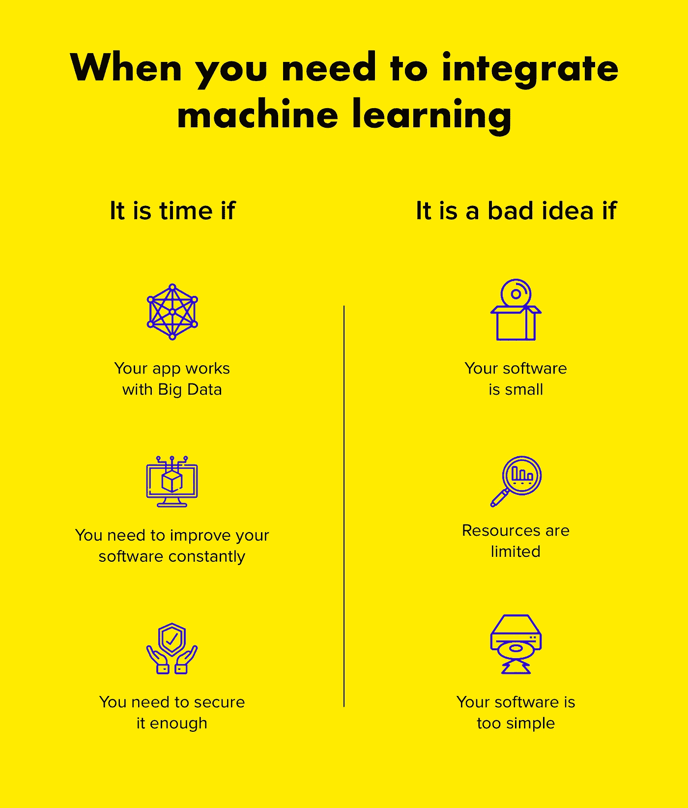
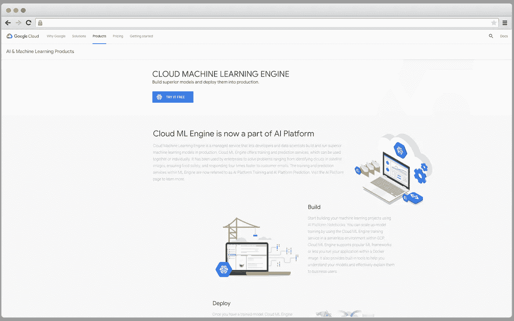
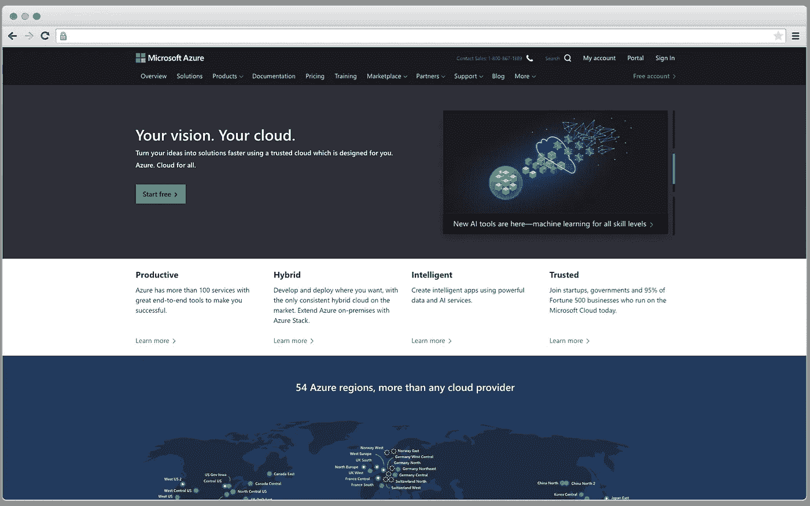
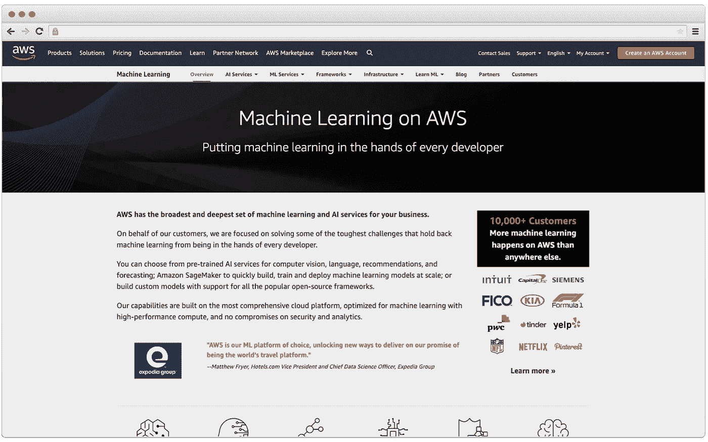
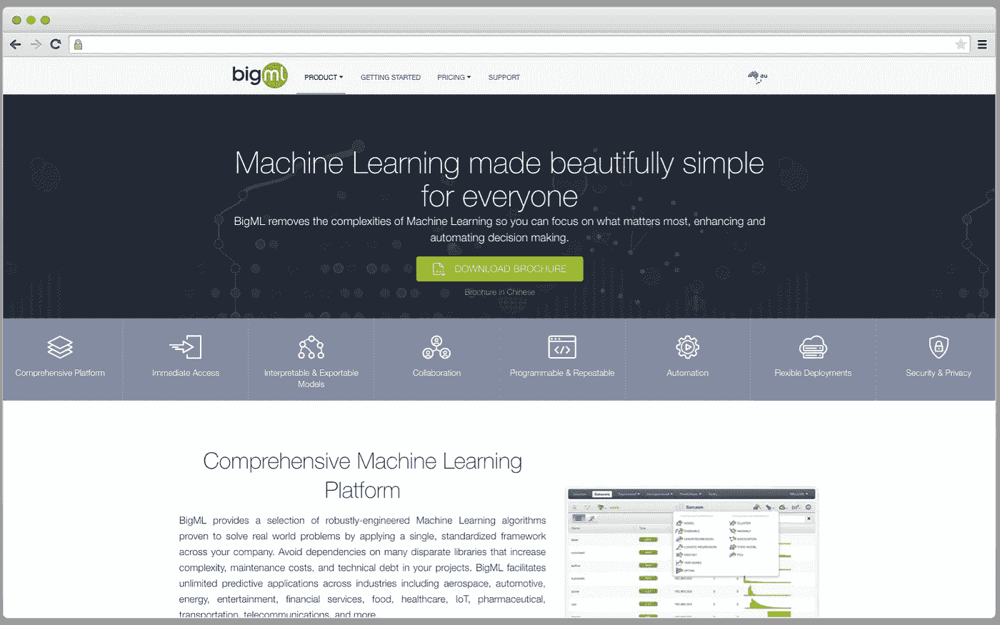
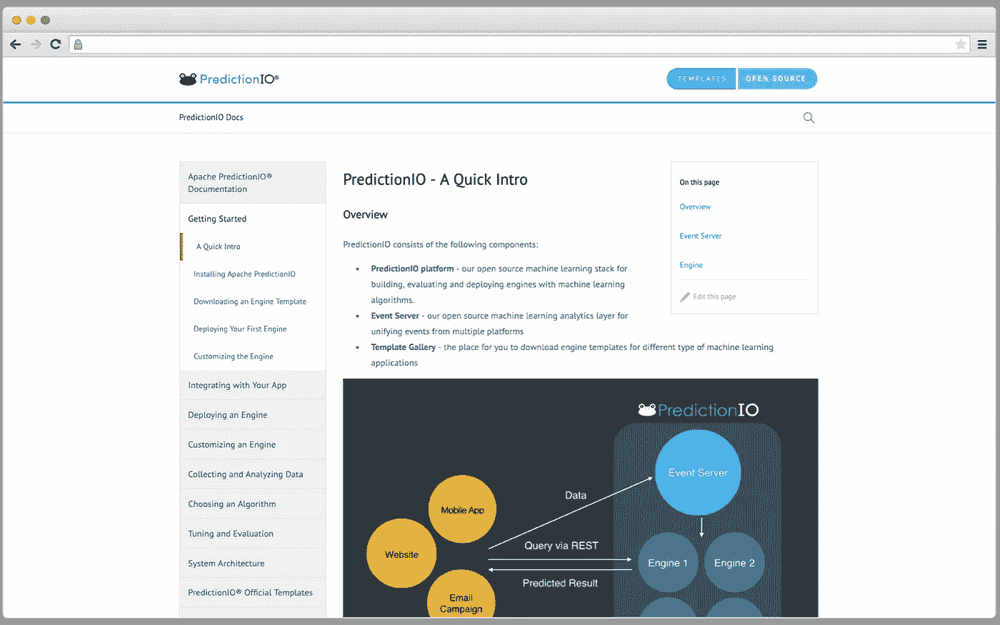
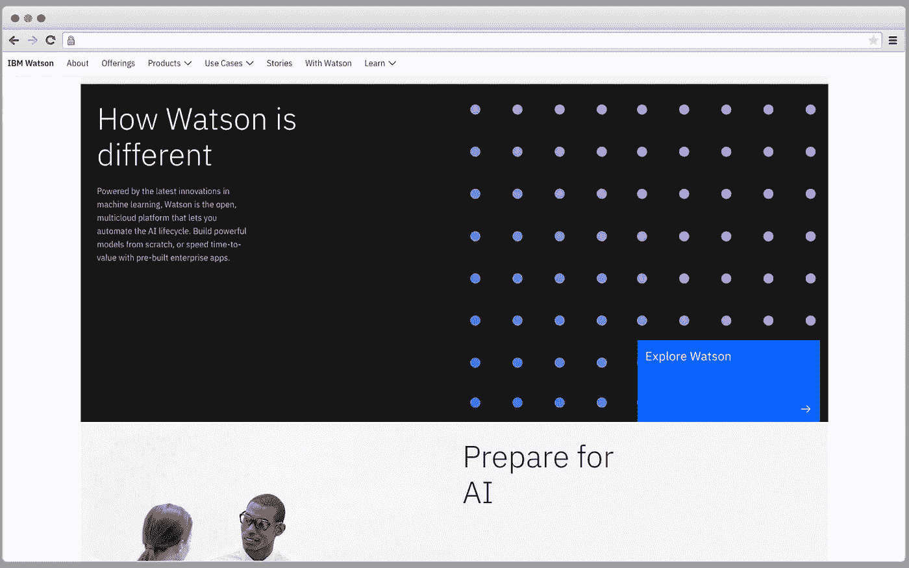
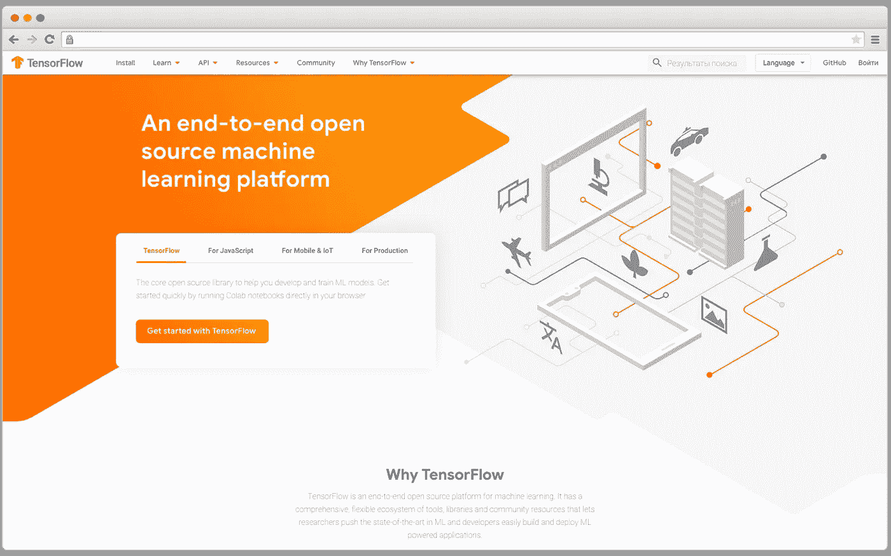

# 新手和专业人士的 MLaaS 平台:选择你需要的

> 原文：<https://towardsdatascience.com/mlaas-platforms-for-novices-and-pros-opt-the-one-you-need-6b64c377a89c?source=collection_archive---------28----------------------->

## 了解 MLaaS 平台和采用机器学习的原因

机器学习是相当新的技术，尽管第一个计算机学习软件是在 20 世纪 50 年代创建的。因此，机器学习技术今天被集成到许多类型的软件中，这些软件将每个软件变成一个智能项目，可以帮助人们解决许多日常事务。

像谷歌和微软这样的大公司不想落后，他们建立了自己的机器学习平台，使开发者能够毫无困难地将机器学习功能添加到他们的项目中。

我们在本文中的目标是挑出市场上可用的所有主要的机器学习即服务平台。此外，我们将向您展示集成人工智能的项目示例。

# 关于 MLaaS 的更多信息

我们认为您听说过 BaaS(后端即服务)概念或 SaaS(软件即服务)？MLaaS 还处理基础设施和所有相关问题。因此，开发人员不需要花时间处理模型训练、评估，并且基于云的预测已经配置好了。

如果您想知道基于云的预测如何为您的内部基础架构带来结果。可以使用 REST APIs 将预测和基础设施结合起来。

事实上，云机器学习服务可以用于创建第一个功能模型，这将帮助您基于预测获得有用的见解。此外，在这种情况下，大的开发团队是不必要的。

真正神奇强大的 MlaaS 平台代表是亚马逊 MLaaS，谷歌的云机器学习引擎，微软的 Azure ML。使用这些 MLaaS 平台不需要在机器学习方面有很高的技能。

# 软件需要机器学习的原因(反之亦然)

在我们继续描述顶级 MLaaS 平台之前，我们希望您就机器学习实现的必要性做出决定。为了帮助您考虑所有的利弊，我们将涵盖您应该在软件中添加机器学习的所有原因，以及何时最好放弃这一想法。

Image by Author

# 当机器学习整合的时候到了

下面这些提示将是人工智能集成的一个起点。

**您的软件使用大数据**。简而言之，如果您的软件需要处理和分析大量数据，您可能会考虑机器学习算法集成。例如，你创建一个电子商务网站或移动应用程序，人工智能可以用来为用户提供个性化体验、特别推荐、为他们提供他们真正需要的产品等等。或者，如果您在医疗保健行业工作，并且您的软件将执行医疗保健相关的任务，基于 ML 的预测分析将会非常及时。

你的软件需要一个永久的改进。机器学习技术的优势在哪里？从名字就很清楚——机器学习就是不断学习新的信息，自我完善。因此，你的软件获得了永久的经验，并且变得更加强大。

因此，如果你有金融、医疗保健或电子商务软件——它应该改善用户的体验，给他们新的机会，并且也为[欺诈预防](https://www.cleveroad.com/blog/fraud-detection-machine-learning--find-out-more-about)保护数据。AI 还有助于解决安全问题。见下一点。

**你的软件应该足够安全**。机器学习技术应用新的安全工具来保护你的应用程序，保护所有用户的个人数据。基于 ML 的软件能够学习新的威胁，并创建额外的保护层，以确保您的软件足够安全。

此外，还可以及时检测到任何欺诈活动并加以抑制。

# 而当你最好放弃机器学习整合的想法

不幸的是，尽管机器学习有很多优点，但在某些情况下，它可能会成为负担而不是发现。看看这些案子。

**你的 app 相当小**。只有当你的软件包含太多数据时，机器学习才会有用。它需要大量的数据来学习。但如果你的应用很小，机器学习就无法正常工作，弊大于利。因此，您的应用程序可能会提交错误的推荐、不当的信息等等。

**你的资源有限**。机器学习集成不是一件便宜的事情，在进一步的改进过程中，你也需要花钱。此外，处理大量数据需要强大的计算机能力，因此这一领域也需要额外的投资。专家需要时间来训练数据集，所以他们工作得越多，你需要花的钱就越多。

**你的软件有简单的功能**。举例来说，如果你用当地地铁的时间表或管理购物的应用程序创建一个应用程序，它根本不需要机器学习。这种应用程序执行非常简单的任务，它们不需要永久的改进和数据学习。

我们希望这些建议能帮助你了解你需要什么，不需要什么。如果你知道你的应用将从机器学习中受益，那么我们就进入顶级 MLaaS 平台的列表。

# 顶级机器学习平台

嗯，少说话。现在，我们将讨论所有提到的平台，它们有什么功能，我们还将添加一些现有的平台。

## 云机器学习引擎

定价:非常多样化，你可以在平台的官方页面找到你需要的方案。

CMLE 是一项帮助开发者和数据科学家创建和运行强大的机器学习模型的服务。CLME 有培训和预测服务，专家可以一起使用或单独使用。它已经被许多公司用于卫星图像中的云识别、食品安全保证、自动回复客户电子邮件等等。AI 平台训练和 AI 平台预测用于相应的训练和预测服务。

Image by Author

CMLE 有许多如下的特征:

*   **便携式型号**。使用 ML 支持的框架训练的模型可以下载用于本地执行或移动集成。
*   **自定义容器支持**。你可以使用任何运行在 CMLE 上的 ML 框架，Docker 容器是实现这个的必要工具。
*   **分布式训练**。如果数据和模型对于一台机器来说太大而无法正常工作，CMLE 就推出一个在多台机器上运行的环境。
*   **HyperTune** 。它使自动调整深度学习超参数成为可能，并更快地达到所需的结果。

当然，这只是 Cloud ML Engine 提供的几个有用的特性，但如果需要，您可以更深入地研究它。

## Azure 机器学习

价格:免费/每月 9.99 美元

[Azure ML](https://azure.microsoft.com/en-in/services/machine-learning-studio/) 提供了一个可视化界面，帮助构建和训练模型，选择要应用的算法，等等。这个平台与 ML Studio 框架一起工作，使得构建模块化解决方案成为可能。

Image by Author

这是一个基于云的平台，面向新手和熟练的专家，它的许多操作可以手动实现。此外，Azure Machine 有详细的文档，它还提供了数百个存储在 Cortana Intelligence Gallery 中的 ML 解决方案。任何其他开发人员都可以自行决定使用这些解决方案。

## 亚马逊机器学习

定价:0.42 美元/小时计算，0.10 美元/1000 个预测

这项服务是最受欢迎和领先的 ML 服务之一。这对许多项目来说是非常好的，尤其是如果这个项目到了最后期限，但并不是所有的事情都实现了。

Image by Author

然而，与此同时，在自动化过程中有一些限制，所以它不是一个非常灵活的机器学习工具。

[亚马逊机器学习](https://aws.amazon.com/machine-learning/)可用于检测欺诈、文档分类和许多其他任务。此外，各种开发人员可能会找到适合他们编程语言的 SDK，如 Ruby、Java 等。NET 等语言都有。

## BigML

定价:从免费到每月 10，000 美元

创建这个平台的同名公司试图使 [BigML](https://bigml.com/) 成为每个客户的有用平台，提供各种价格计划和详细的文档以及灵活的集成 API。

Image by Author

大数据解决方案、客户细分、购物篮分析、预测分析和其他任务的完美选择。此外，BigML 为开发人员提供了现成的脚本，尽管这个平台与上面提到的平台相比并不大。

## 预测

定价:开源

对于那些想要控制机器学习部署的人来说，这是一个完美的[解决方案](https://predictionio.apache.org/start/)。允许开发者创建预测引擎的开源服务器。

Image by Author

这个服务器提供了很多编程语言的 SDK，比如 Python，PHP，Ruby，Java。此外，GitHub 上的一个大型社区也为 Swift、Node.js 等语言创建了 SDK。

## IBM 沃森

价格:从免费到 1070.00 美元/实例，
，0.43 美元/1000 个预测，
，0.43 美元/能力单位小时

[IBM Watson](https://www.ibm.com/watson) 在概念上并不是一个 ML 平台。IBM MlaaS 目前只提供数据可视化和数据值相互交互的描述。这项服务提供了自动预测分析和认知能力，对于不精通计算机科学的用户来说，这是一个很好的选择。

Image by Author

然而，数据科学家也可以与开发人员一起使用 IBM Watson，将人工智能集成到软件中，并简化部署过程。

但是 IBM Watson 每年都在发展，其功能的数量将呈指数级增长。

## 张量流

价格:开源

这不是 MlaaS 平台，但它是谷歌的一个非常有用的机器学习库，它有大量必要的机器学习工具。该库缺乏可视化界面，它是为希望更深入地了解数据科学的开发人员而构建的。[张量流](https://www.tensorflow.org/)集成到我们上面提到的云机器学习引擎中，但它也可以与许多其他服务提供商集成。

Image by Author

# 数据存储解决方案—寻找最合适的解决方案

为数据收集及其处理寻找存储已不再是问题。为了实现这一点，将需要 NoSQL 和 SQL 数据库。除了数据库，还有必要使用像 Cassandra、Redfish、亚马逊 S3 这样的辅助解决方案。

如果你计划使用机器学习平台，这个挑战就变得简单了。您可以使用一个服务提供商来实现机器学习和数据存储。因此，它将帮助您避免数据源配置的麻烦。如果您认为这不是您的首选，请注意，一些 MLaaS 平台支持与第三方数据存储的集成。

# 应用机器学习算法的应用程序示例

让我们回顾几个已经使用机器学习功能并使用户体验更加明亮的应用程序。

## Snapchat

Snapchat 用户喜欢用该应用进行有趣和搞笑的实验，因此机器学习使之成为可能。Snapchat 在人工智能的基础上有很多特殊的滤镜。滤镜用于跟踪人脸，添加帽子、眼镜等配件，用小胡子、胡须、眼睛颜色等改变人脸。此外，最近的过滤器甚至允许用户改变性别，这也是一个有趣的功能。

该公司在收购乌克兰专注于计算机视觉的 Looksery 公司时，已经开始将机器学习算法集成到 Snapchat 中。

Image by Author

我们人类可以毫不费力地识别人脸，而机器需要很长时间来学习这种能力。因此，专家们花了很多时间让算法变得足够智能，以识别面孔和面部特征。

## 照片墙

这个流行的照片和视频社交网络也想用人工智能的力量吸引用户，所以它有特殊的算法来执行特定的任务。首先，Instagram 应用程序用户通过机器学习来阻止垃圾邮件和攻击性评论，但如果用户不需要，可以关闭这一功能。还有，Instagram 使用 AI 来删除虚假的关注者，以避免大量带有机器人的虚假个人资料。

从而，Instagram 与虚假的喜欢和用户作战，为真实用户提供高质量的沉浸式体验。

## 推特

这种人们分享新闻的社交网络服务也认为机器学习是他们所需要的。当用户点击“首先向我展示最好的推文”按钮时，他们会看到开发团队为用户提供热门推文而创建的算法提要。这项技术使得基于一些指标评估推文成为可能。智能算法可能会理解客户的偏好，并显示他们特别感兴趣的内容。

此外，Twitter 使用机器学习来打击钓鱼，它删除不适当的和攻击性的内容。

除此之外，机器学习算法可能会裁剪图像中最有趣的部分进行预览。

## 拼趣

这个图片托管的社交网络服务也应该知道如何为用户提供正确的内容。这就是机器学习算法有所帮助并变得有用的地方。Pinterest 收购了 Kosei 公司，该公司专门开发用于增强内容搜索和更好推荐的 ML 算法。

因此，Pinterest ML 算法可以检测垃圾邮件，为用户提供个性化内容，并且还可以用于广告货币化。

## 销售力量

你认为社交网络是唯一应用机器学习的应用吗？你错了。Salesforce CRM 使用机器学习算法来分析客户、他们的偏好和行为，它帮助公司建立更好的客户关系，并为他们提供高质量的体验。

这就是我们想告诉你的。MlaaS 平台的列表相当大，您可以选择一个您感兴趣的平台，它可以增强您的应用程序并对其进行修改。如果你不擅长数据科学，有些平台不需要这些技能。你只需要决定你的软件中是否需要机器学习，然后你就会成功！