# 如何利用机器学习在 GitHub 上实现任务自动化，以获得乐趣和利润

> 原文：<https://towardsdatascience.com/mlapp-419f90e8f007?source=collection_archive---------15----------------------->

## *关于如何使用*[*tensor flow*](https://www.tensorflow.org/)*和公共数据集构建预测和应用问题标签的 GitHub 应用程序的教程。*

由哈默尔·侯赛因[、](https://twitter.com/HamelHusain)[迈克尔·贾斯特兹·布斯基](https://twitter.com/_inc0_)和[杰里米·路易](https://twitter.com/jeremylewi)

# 挑逗:建立一个模型，标签的问题，并推出它作为一个产品！

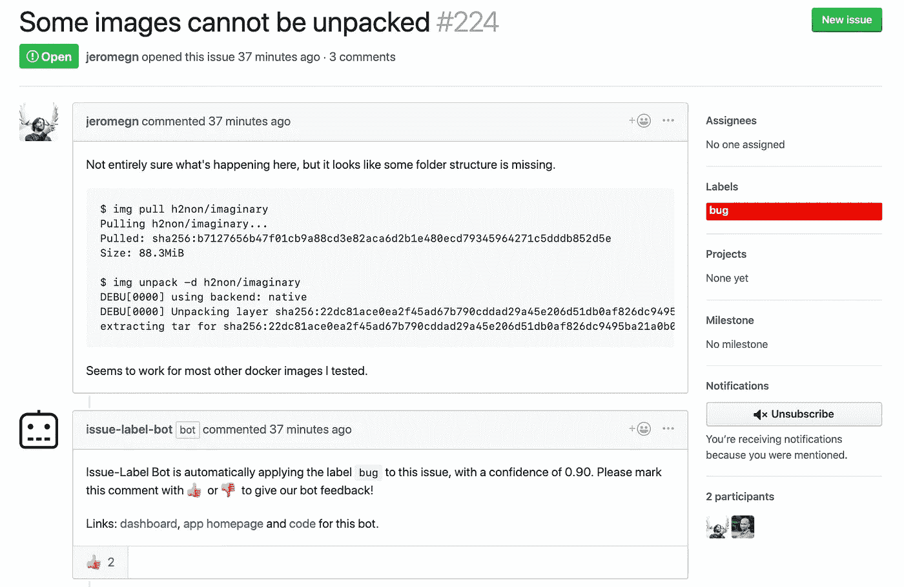

[Link](https://github.com/genuinetools/img/issues/224) to this issue. More examples can be viewed [here](https://label-bot-prod.mlbot.net/).

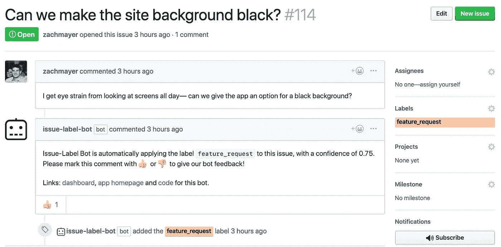

[Link](https://github.com/hamelsmu/Issue-Label-Bot-Examples/issues/114) to this issue. More examples can be viewed [here](https://label-bot-prod.mlbot.net/)

[**从此页面**](https://mlbot.net/) **将此应用程序安装到您的 GitHub 存储库中。**

# 动机:难以捉摸的完美机器学习问题

Finding the ideal machine learning problem can feel like searching for treasure or chasing dragons. [Image credit](https://polycount.com/discussion/179516/help-on-creating-a-wide-a-treasure-room-full-of-gold).

我们的数据科学家朋友和同事会将理想的预测建模项目描述为这样一种情况:

*   有一个**丰富的数据**，它已经被贴上标签或者标签可以被推断出来。
*   这些数据可以用来解决**现实问题**。
*   问题与你热衷的领域有关，或者你想解决的问题是你自己的，你可以成为你的第一个客户。
*   有一个平台**可以让你的数据产品接触到**大量的受众，**有机制**收集反馈并改进**。**
*   你可以用**最少的花费和时间**创建这个，希望使用你熟悉的语言和工具。
*   如果你的产品成功了，有一种方法可以将它货币化。

上面的列表是令人向往的，数据科学家很幸运地遇到了满足所有这些的问题(如果我们能找到满足其中一半的问题，作者会感到幸运！).

# 进入 GH-Archive 和 GitHub 应用程序:数据遇到机会的地方

今天，我们展示了一个数据集、平台和领域，我们认为它们满足上述标准！

**数据集**:**[**GH-Archive**](https://www.gharchive.org/)。**

**GH-Archive 通过从 [GitHub REST API](https://developer.github.com/v3/) 中摄取大部分[这些事件](https://developer.github.com/v3/activity/events/types/)来记录来自 GitHub 的大量数据。这些事件以 JSON 格式从 GitHub 发送到 GH-Archive，称为[有效载荷](https://developer.github.com/v3/activity/events/types/)。以下是编辑问题时收到的有效负载的示例:**

**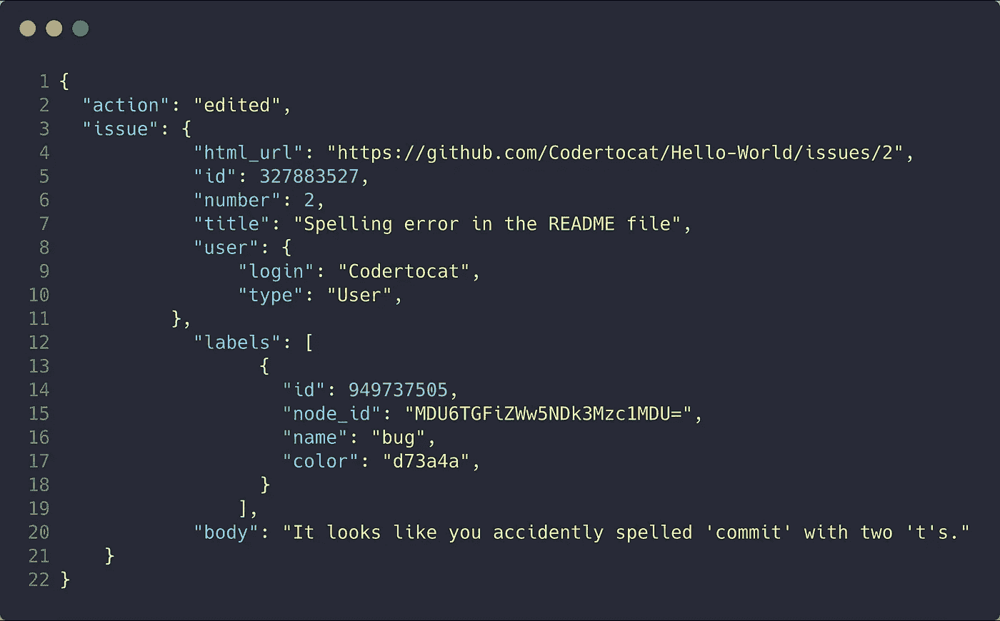**

**A truncated version of [this example](https://developer.github.com/v3/activity/events/types/#webhook-payload-example-14).**

**可以想象，考虑到 GitHub 上的事件类型和用户数量，有大量的有效负载。幸运的是，[这些数据存储在 BigQuery](http://www.gharchive.org/#bigquery) 中，允许通过 SQL 接口快速检索！获取这些数据是非常经济的，因为当你第一次注册一个帐户时，谷歌会给你 300 美元，如果你已经有一个帐户，费用非常合理。**

**因为数据是 JSON 格式的，所以解嵌套数据的语法可能有点陌生。我们可以使用 *JSON_EXTRACT* 函数来获取我们需要的数据。下面是一个示例，说明如何从问题有效负载中提取数据:**

**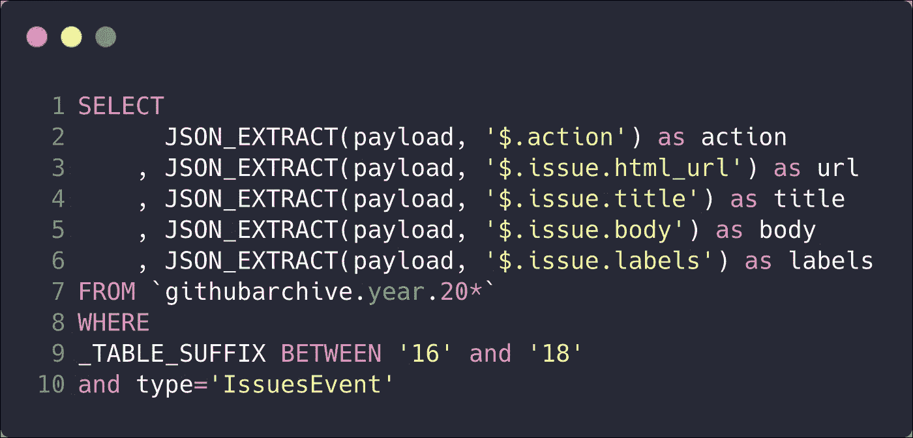**

**Example query syntax you might use for GH-Archive data stored on BigQuery. Pay close attention to the syntax used.**

**关于如何从 BigQuery 中提取 GitHub 问题的分步解释可以在本文的[附录部分中找到，但是，重要的是要注意，除了问题数据之外，还可以检索 GitHub 上发生的](/how-to-create-data-products-that-are-magical-using-sequence-to-sequence-models-703f86a231f8)[几乎任何事情](https://developer.github.com/v3/activity/events/types/#event-types--payloads)的数据！您甚至可以在 BigQuery 中从公共 repos 中检索到大量的[代码。](https://github.com/hamelsmu/code_search/blob/master/notebooks/1%20-%20Preprocess%20Data.ipynb)**

****平台**:[**GitHub Apps**](https://developer.github.com/apps/)**&GitHub market place****

**GitHub 平台允许你构建能够执行许多动作的应用，比如[与问题](https://developer.github.com/v3/issues/)交互、[创建存储库](https://developer.github.com/v3/repos/)或者[修复拉请求中的代码](https://fixmie.com/)。由于你的应用程序所需要的只是从 GitHub 接收[有效负载](https://developer.github.com/v3/activity/events/types/)并调用[REST API](https://developer.github.com/v3/)，你可以用你选择的任何语言编写应用程序，包括 python。**

**最重要的是， [GitHub marketplace](https://github.com/marketplace) 为你提供了一种在可搜索平台上[列出你的应用](https://developer.github.com/marketplace/#apps)并向用户收取月费的方式。这是将你的想法货币化的好方法。你甚至可以托管[未经验证的免费应用](https://developer.github.com/marketplace/#unverified-apps)作为收集反馈和迭代的方式。**

**令人惊讶的是，使用机器学习的 GitHub 应用并不多，尽管这些公共数据集是可用的！提高对此的认识是这篇博文的动机之一。**

# **一个端到端的例子:用机器学习自动标记 GitHub 问题**

****

**Automatically labeling issues can help with organizing and finding information. Photo by [Susan Yin](https://unsplash.com/@syinq?utm_source=medium&utm_medium=referral)**

**为了向您展示如何创建自己的应用程序，我们将带您完成创建一个能够自动标记问题的 GitHub 应用程序的过程。请注意，这个应用程序的所有代码，包括模型训练步骤，都位于[这个 GitHub 存储库](https://github.com/hamelsmu/MLapp)中。**

# ****第一步:注册您的应用&完成先决条件。****

**首先，您需要设置您的开发环境。完成本文中[的步骤 1-4。您不需要阅读“Ruby 编程语言”一节，或者第 4 步之后的任何步骤。确保你设置了一个 Webhook secret，即使这个部分是可选的。](https://developer.github.com/apps/quickstart-guides/setting-up-your-development-environment/)**

**请注意，GitHub 应用程序和 Oauth 应用程序之间存在[差异。出于本教程的目的，我们对 GitHub 应用程序感兴趣。您不需要太担心这一点，但是如果您在浏览文档时知道这一区别是很好的。](https://developer.github.com/apps/differences-between-apps/)**

# ****第二步:用 python 轻松地与 GitHub API 交互。****

**您的应用程序需要与 GitHub API 进行交互，以便在 GitHub 上执行操作。使用您选择的编程语言中的预构建客户端是非常有用的，这样可以使工作变得更加轻松。虽然 GitHub 上的[官方文档](https://developer.github.com/apps/quickstart-guides/using-the-github-api-in-your-app/)向您展示了如何使用 Ruby 客户端，但还有针对许多其他语言的[第三方客户端](https://developer.github.com/v3/libraries/)，包括 Python。出于本教程的目的，我们将使用 [Github3.py 库](https://github3.readthedocs.io/en/master/)。**

**作为应用程序与 GitHub API 接口的最令人困惑的方面之一是认证。对于下面的指令，使用 curl 命令，而不是文档中的 ruby 示例。**

**首先，您必须[通过签署一个 JSON Web 令牌(JWT)来认证为一个应用](https://developer.github.com/apps/building-github-apps/authenticating-with-github-apps/#authenticating-as-a-github-app)。一旦您签署了 JWT，您就可以使用它作为应用安装进行[验证。在认证为应用程序安装时，您将收到一个安装访问令牌，您可以使用它与 REST API 进行交互。](https://developer.github.com/apps/building-github-apps/authenticating-with-github-apps/#authenticating-as-an-installation)**

**请注意，作为应用程序的身份验证是通过 GET 请求完成的，而作为应用程序安装的身份验证是通过 PUT 请求完成的。尽管在示例 CURL 命令中说明了这一点，但这是我们在开始时忽略的一个细节。**

**即使您将使用 [Github3.py 库](https://github3.readthedocs.io/en/master/)，了解上述认证步骤也是有用的，因为可能存在不支持的路由，您可能希望使用[请求](http://docs.python-requests.org/en/master/)库来实现自己。对我们来说就是这种情况，所以我们最终围绕 Github3.py 库编写了一个名为 [**mlapp**](https://github.com/hamelsmu/MLapp/blob/master/flask_app/mlapp.py) 的薄包装器来帮助我们与问题进行交互，这就是这里定义的。**

**下面是可用于创建问题、发表评论和应用标签的代码。这个代码在[这个笔记本](https://github.com/hamelsmu/MLapp/blob/master/notebooks/GitHub-api-example.ipynb)里也有。**

**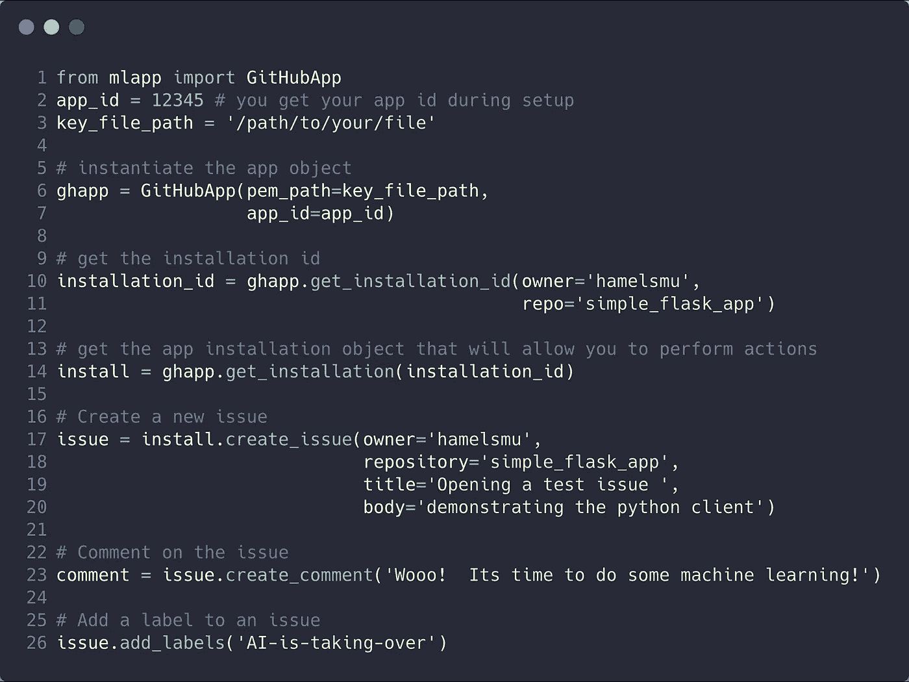**

**The above code created [this issue on GitHub](https://github.com/hamelsmu/simple_flask_app/issues/1). This code is also available [in this notebook](https://github.com/hamelsmu/MLapp/blob/master/notebooks/GitHub-api-example.ipynb).**

**你可以在这里看到这个代码[产生的问题。](https://github.com/hamelsmu/simple_flask_app/issues/1)**

# **第三步:获取和准备数据。**

**如前所述，我们可以使用托管在 [BigQuery](https://www.gharchive.org/#bigquery) 上的 [GH-Archive](https://www.gharchive.org/) 来检索问题示例。此外，我们还可以检索人们为每个问题手动应用的标签。下面是我们用来构建所有这些标签的帕累托图的查询:**

**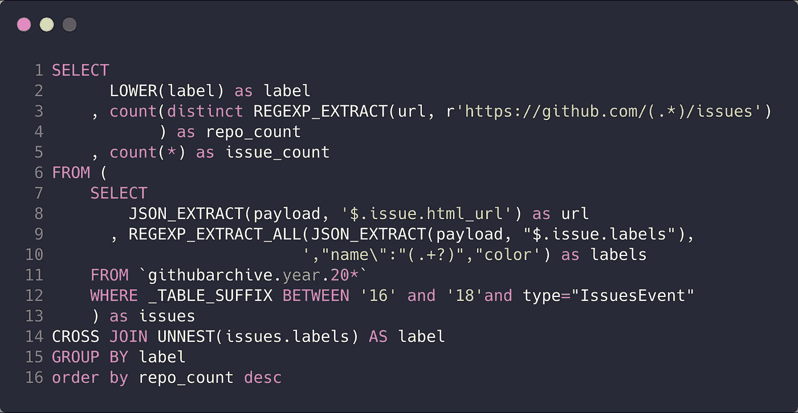**

**[Link](https://console.cloud.google.com/bigquery?sq=123474043329:b424d2bbd79844999b970a0bc8498efa) to this query. Data produced by this query is available in [this spreadsheet](https://docs.google.com/spreadsheets/d/1NPacnVsyZMBneeewvPGhCx512A1RPYf8ktDN_RpKeS4/edit?usp=sharing).**

****

**Top issue labels from the public dataset. There is an extremely long tail (not shown here).**

**[这个电子表格](https://docs.google.com/spreadsheets/d/1NPacnVsyZMBneeewvPGhCx512A1RPYf8ktDN_RpKeS4/edit?usp=sharing)包含了整个帕累托图的数据。有一个不相互排斥的问题标签的长尾。例如，*增强*和*特征*标签可以组合在一起。此外，标签的质量和含义可能因项目而异。尽管存在这些障碍，我们还是决定简化问题，将尽可能多的标签分成三类:*特性请求*、 *bug* 和*问题*使用我们在手动查看前 200 个标签后构建的试探法。此外，我们咨询了一个大型开源项目 [Kubeflow](https://github.com/kubeflow) 的维护者，作为我们的第一个客户来验证我们的直觉。**

**我们尝试创建名为 *other* 的第四个类别，以便获得不在前三个类别中的项目的负面样本，然而，我们发现信息是嘈杂的，因为在这个“其他”类别*中有许多 bug、功能请求和问题。*因此，我们将训练集限制在我们可以归类为*特性请求、bug* 或*问题*专有*的问题上。***

**应该注意的是，这种训练数据的安排远非理想，因为我们希望我们的训练数据尽可能接近真实问题的分布。然而，我们的目标是用尽可能少的时间和费用构建一个最小的可行产品，并在以后进行迭代，所以我们采用了这种方法。**

**最后，我们特别注意消除重复问题。为了保守起见，我们解决了以下类型的重复(通过在重复集中任意选择一个问题):**

1.  **同一回购协议中相同标题的发行。**
2.  **不管标题如何，正文内容相同的问题。通过仅考虑问题正文中的前 75%字符和后 75%字符，删除了更多重复项。**

**用于对问题进行分类和消除重复问题的 SQL 查询可通过此链接查看[。您不必运行此查询，因为我们来自](https://console.cloud.google.com/bigquery?sq=123474043329:01abf8866144486f932c756730ddaff1) [Kubeflow](https://www.kubeflow.org/) 项目的朋友已经运行了此查询，并将结果数据作为 CSV 文件托管在 Google Cloud Bucket 上，您可以通过遵循本笔记本中的代码[来检索。笔记本](https://github.com/hamelsmu/MLapp/blob/master/notebooks/Issue_Labeling_Model.ipynb)中还有对原始数据的探究以及对数据集中所有字段的描述[。](https://github.com/hamelsmu/MLapp/blob/master/notebooks/Issue_Labeling_Model.ipynb)**

# **步骤 4:建立和训练模型。**

**现在我们有了数据，下一步是构建和训练模型。对于这个问题，我们决定借用[我们为类似问题](/how-to-create-data-products-that-are-magical-using-sequence-to-sequence-models-703f86a231f8)构建的一个文本预处理管道，应用在这里。这个预处理管道清理原始文本，标记数据，构建词汇表，并将文本序列填充到相等的长度，这些步骤在我们之前的博客文章的[“准备和清理数据”部分](/how-to-create-data-products-that-are-magical-using-sequence-to-sequence-models-703f86a231f8)中进行了概述。在[这本笔记本](https://github.com/hamelsmu/MLapp/blob/master/notebooks/Issue_Labeling_Model.ipynb)中概述了完成这一问题标签任务的代码。**

**我们的模型接受两个输入:问题标题和主体，并将每个问题分类为 *bug* 、*特性请求*或*问题*。下面是我们用 [tensorflow 定义的模型架构。Keras](https://www.tensorflow.org/guide/keras) :**

**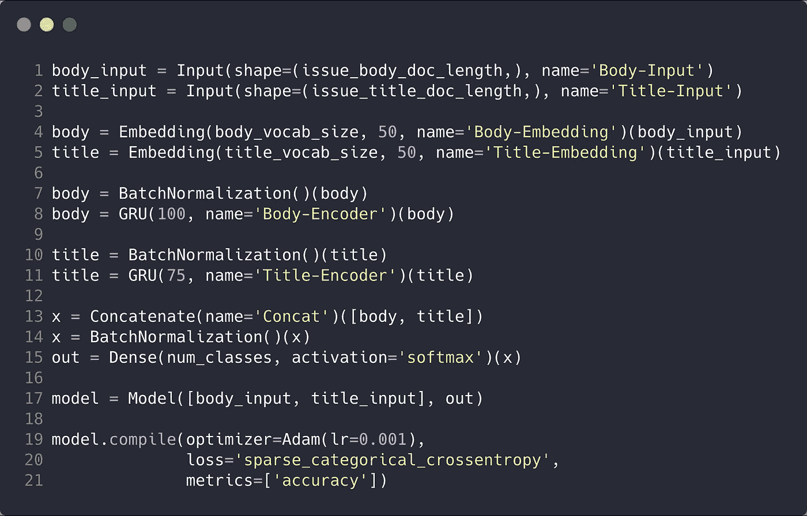**

**Code available in [this notebook](https://github.com/hamelsmu/MLapp/blob/master/notebooks/Issue_Labeling_Model.ipynb).**

**关于该模型的几点注意事项:**

*   **你不必使用深度学习来解决这个问题。我们只是使用了我们为另一个密切相关的问题建立的现有管道，以便快速引导我们自己。**
*   **模型架构简单得令人尴尬。我们的目标是让事情尽可能简单，以证明您可以使用简单的方法构建真正的数据产品。我们没有花太多时间调整或试验不同的架构。**
*   **我们预计，通过使用更先进的架构或改进数据集，该模型还有很大的改进空间。我们在这篇博文的*后续步骤*部分提供了几个提示。**

****评估模型****

**下面是一个混淆矩阵，显示了我们的模型在三个类别的测试集上的准确性。该模型确实很难对问题进行分类，但在区分 bug 和特性方面做得相当不错。**

**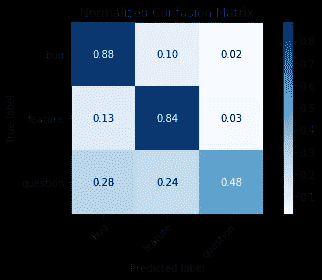**

**请注意，由于我们的测试集并不代表所有问题(因为我们只过滤了我们可以分类的数据集)，所以应该对上面的准确性指标持保留态度。我们通过从用户那里收集明确的反馈在一定程度上缓解了这个问题，这允许我们重新训练我们的模型并非常快速地调试问题。我们将在后面的章节中讨论显式反馈机制。**

****做预测****

**以下是模型预测玩具的例子。完整的代码可在本笔记本中[获得。](https://github.com/hamelsmu/MLapp/blob/master/notebooks/Issue_Labeling_Model.ipynb)**

**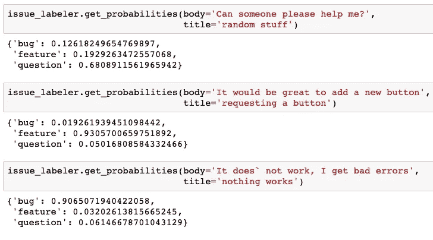**

**[Link](https://github.com/hamelsmu/MLapp/blob/master/notebooks/Issue_Labeling_Model.ipynb) to the notebook.**

**我们希望选择合理的阈值，这样模型就不会向人们发送太多不正确的预测(这意味着我们的应用程序在某些情况下可能不会提供任何预测)。我们通过在几个回购上测试我们的系统并就可接受的[假阳性率](https://en.wikipedia.org/wiki/False_positive_rate)咨询几个维护者来选择阈值。**

# **步骤 5:使用 Flask 来响应有效负载。**

**现在，您已经有了一个可以进行预测的模型，并且有了一种以编程方式向问题添加评论和标签的方法(步骤 2)，剩下的工作就是将这些部分粘在一起。您可以通过以下步骤实现这一点:**

1.  **启动一个 web 服务器，监听来自 GitHub.com 的有效负载(在步骤 1 中注册应用程序时，您指定了 GitHub 将有效负载发送到的端点)。**
2.  **验证有效载荷来自 GitHub(由[脚本](https://github.com/hamelsmu/MLapp/blob/master/flask_app/app.py)中的 verify_webhook 函数说明)。**
3.  **如果需要，可以使用 GitHub API(您在第 2 步中学到的)来响应有效负载。**
4.  **将您收到的适当数据和反馈记录到数据库中，以便于模型再训练。**

**实现这一点的一个很好的方法是使用像 [Flask](http://flask.pocoo.org/) 这样的框架和像 [SQLAlchemy](http://flask-sqlalchemy.pocoo.org/2.3/) 这样的数据库接口。如果您已经熟悉 flask，下面是当 GitHub 通知某个问题已经打开时应用预测问题标签的代码的截断版本:**

**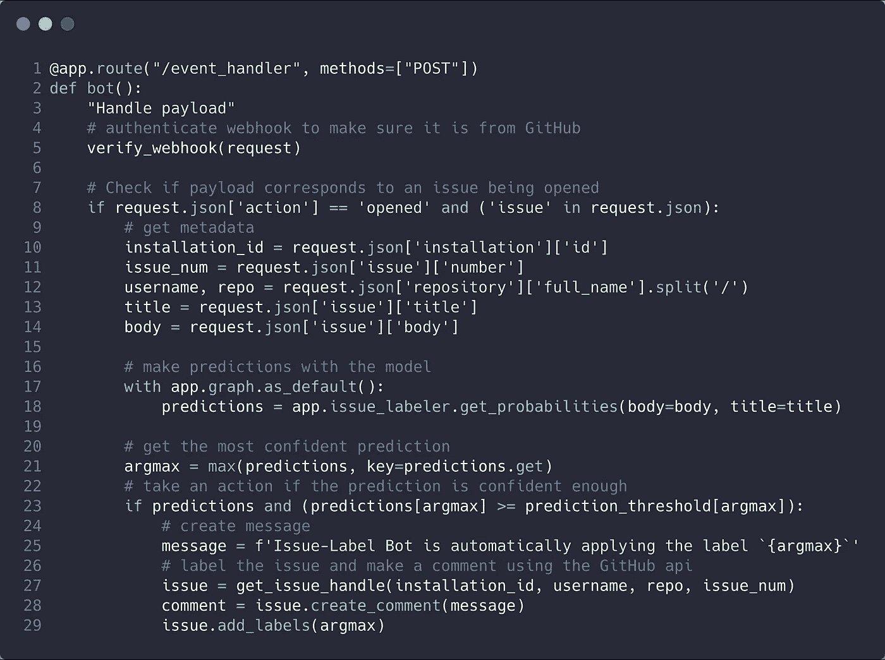**

**This code is also available [here](https://github.com/hamelsmu/MLapp/blob/master/flask_app/app.py).**

**如果您不熟悉 Flask 或 SQLAchemy，也不用担心。你可以从这个精彩的 [MOOC on Flask、HTML、CSS 和 Javascript](https://www.edx.org/course/cs50s-web-programming-with-python-and-javascript) 中了解到关于这个主题你需要知道的一切。如果你是一个数据科学家，这个课程是一个很大的时间投资，因为这将允许你以一种轻量级的方式为你的数据产品构建接口。我们参加了这个课程，并对它印象深刻。**

**我们把它作为一个练习，让读者在 GitHub 库中浏览剩余的 [flask 代码。](https://github.com/hamelsmu/MLapp)**

# **收集明确的用户反馈。**

**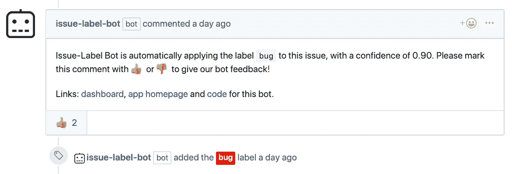**

**This screenshot was taken from [this issue.](https://github.com/genuinetools/img/issues/224)**

**如上所述，明确的反馈是通过要求用户做出反应来请求的👍或者👎一个预言。我们可以将这些反应存储在数据库中，这样我们就可以重新训练和调试我们的模型。这可能是作为 GitHub 应用程序发布数据产品的最令人兴奋和最重要的方面之一！**

**你可以在我们应用的主页上看到更多预测和用户反馈的例子。例如，这是 kubeflow/kubeflow 回购的页面:**

**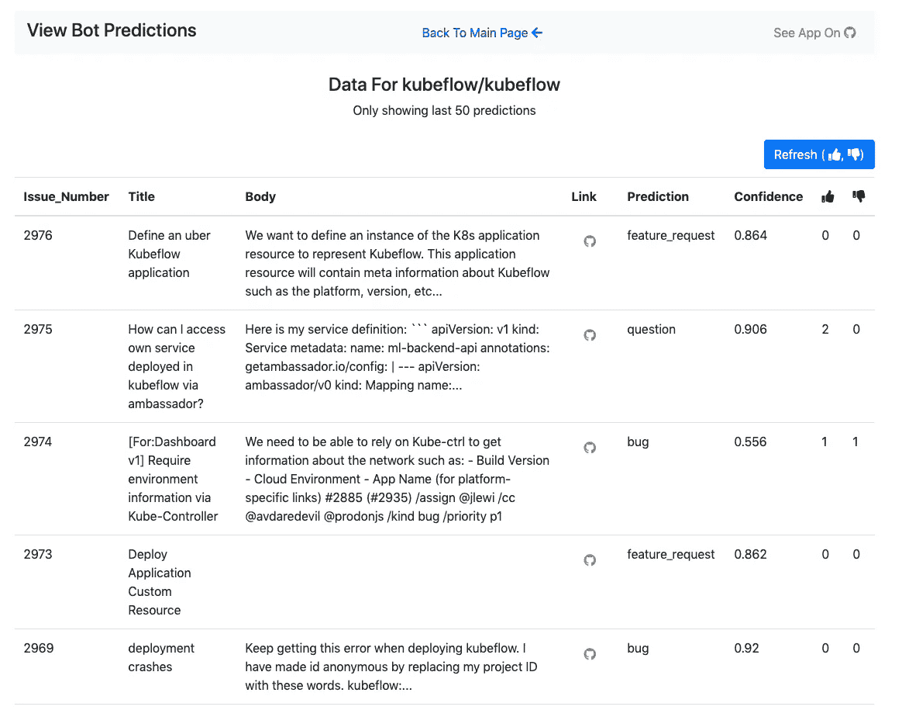**

**[Link](https://mlbot.net/data/kubeflow/kubeflow) to this page.**

# **请安装我们的应用程序，它是免费的！**

**如果你喜欢你到目前为止读到的内容，并希望支持这个项目，请在你的公共存储库安装这个应用程序(即使安装在那里，这个应用程序也不会对私人回购做出预测)，并在它做出预测时给我们的机器人反馈👍 👎。**

**[**这里是安装我们 app**](https://github.com/apps/issue-label-bot) 的链接。**

# **结论:构建自己的机器学习应用的技巧**

*   **不要害怕使用公共数据集。除了标签问题之外，您还可以做更多的事情(参见参考资料一节获得一些想法)。**
*   ****不要害怕快速迭代，即使解决方案并不完美**。构建模型有时是项目中最小的组成部分，获得用户反馈是非常有价值的，所以你不要浪费时间。**
*   ****尝试咨询至少一个真实的客户或用户**，并让他们指导和验证决策。**
*   ****利用机会收集明确的用户反馈**。这将允许您快速改进您的解决方案和模型。**

# **第二部分和后续步骤**

**我们没有涉及的一个方面是如何大规模地为你的应用服务。当您刚刚起步时，您可能不需要担心这一点，并且可以通过您最喜欢的云提供商在一台服务器上提供这一服务。您也可以使用 Heroku 之类的服务，这将在下面参考资料部分链接的 Flask 课程中介绍。**

**在第二部分中，我们将讨论以下内容:**

*   **如何在 Kubernetees 上部署您的 Flask 应用程序，以便它可以扩展到许多用户。**
*   **使用 [Argo 管道](https://argoproj.github.io/)管理模型训练和服务管道。**

**我们相信有很多机会来改进我们在这篇文章中阐述的方法。我们想到的一些想法是:**

*   **构造更好的标签和不属于标签集的项目的负样本。**
*   **使用来自 [fastai](https://docs.fast.ai/) 的工具探索最先进的架构，例如[多头注意力](https://docs.fast.ai/text.models.html#MultiHeadAttention)。**
*   **在大型语料库上进行预训练，并在 GitHub 问题上进行微调，以使用户能够预测特定于回购的标签，而不是一小组全球标签。**
*   **使用额外的数据，比如关于存储库的信息或者打开问题的用户，也许学习这些实体的嵌入。**
*   **允许用户自定义标签阈值和标签名称，以及选择要预测的标签。**

# **资源**

*   **我们 app 的[网站](https://mlbot.net/)。**
*   **我们 app 的[安装页面](https://github.com/apps/issue-label-bot)。**
*   **[GitHub 储存库](https://github.com/hamelsmu/MLapp)包含所有这些代码。**
*   **需要灵感来开发其他可以使用机器学习和公共 GitHub 数据集构建的数据产品吗？看这些例子:(1) [GitHub 问题摘要](/how-to-create-data-products-that-are-magical-using-sequence-to-sequence-models-703f86a231f8)(2)自然语言[语义代码搜索](/semantic-code-search-3cd6d244a39c)。**
*   **[堆栈交换提供的公共数据](https://archive.org/details/stackexchange)可能对迁移学习有用。最近利用这些数据的一个很酷的机器学习项目是 stackroboflow.com。**
*   **[源代码上的机器学习](https://ml4code.github.io/)，将机器学习应用于代码的文献综述，作者[米尔托斯·阿拉玛尼斯](https://miltos.allamanis.com/)。**
*   **关于烧瓶的优秀课程: [HarvardX CS50 Web](https://www.edx.org/course/cs50s-web-programming-with-python-and-javascript) 。**
*   **MOOCs 由 [fastai](https://www.fast.ai/) 进行[机器学习](http://course18.fast.ai/ml)和[深度学习](http://course.fast.ai/)。**
*   **我们的 repo 和相关教程中的代码假定您熟悉 Docker。[这篇博客文章](/how-docker-can-help-you-become-a-more-effective-data-scientist-7fc048ef91d5)为数据科学家提供了 Docker 的简单介绍。**
*   **[Kubeflow 项目](https://www.kubeflow.org/)包含了我们将在这篇博文的第 2 部分使用的资源。此外，这篇博文的内容将成为 2019 年 4 月 17 日[即将到来的演讲](https://conferences.oreilly.com/artificial-intelligence/ai-ny/public/schedule/detail/73422)的主题。**

# **取得联系！**

**我们希望你喜欢这篇博文。请随时与我们联系:**

*   **哈默尔·侯赛因**
*   **米哈尔·贾斯特日斯基**
*   **[杰里米·路易](https://twitter.com/jeremylewi)**

# **放弃**

**本文中提出的任何想法或观点都是我们自己的。提出的任何想法或技术不一定预示任何公司的未来产品。这个博客的目的只是为了教育。**