# 最大似然估计、映射和贝叶斯推理

> 原文：<https://towardsdatascience.com/mle-map-and-bayesian-inference-3407b2d6d4d9?source=collection_archive---------0----------------------->

## 通过关注与最大似然法和映射的区别，掌握贝叶斯推理的思想

Photo by [Aysha Begum](https://unsplash.com/@aysha_be?utm_source=medium&utm_medium=referral) on [Unsplash](https://unsplash.com?utm_source=medium&utm_medium=referral)

最大似然法、映射和贝叶斯推断是推断观测数据背后的概率分布特性的方法。话虽如此，MLE/MAP 和贝叶斯推断还是有很大区别的。

在本文中，我将通过关注 MLE/MAP 和贝叶斯推理之间的差异来介绍贝叶斯推理。

**注:**本文假设了 MLE 和 MAP 的初步知识。如果你不熟悉这些方法，请参考下面的文章。

 [## 最大似然估计和最大后验估计简介

### 以足球为例获得最大似然法和地图的直觉

towardsdatascience.com](/a-gentle-introduction-to-maximum-likelihood-estimation-and-maximum-a-posteriori-estimation-d7c318f9d22d) 

## 最大似然估计和贝叶斯推理的区别

让我们从 MLE 和 MAP 的重述开始。
给定观测数据 *D* ，MLE 和 MAP 对概率模型参数 *θ* 的估计如下。

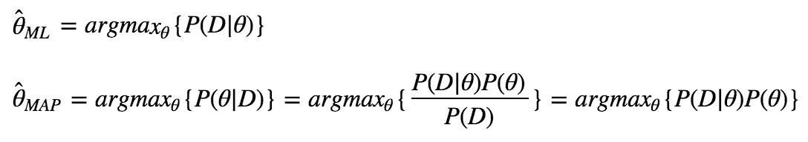

MLE 给出了使可能性最大的值 *P(D|θ)* 。MAP 给出了使后验概率最大化的值 *P(θ|D)* 。由于两种方法都给你一个固定值，它们被认为是**点估计量**。

另一方面，贝叶斯推理完全计算后验概率分布，如下式。因此，输出不是单个值，而是概率密度函数(当 *θ* 是连续变量时)或概率质量函数(当 *θ* 是离散变量时)。

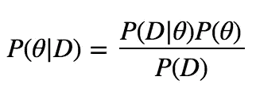

这就是 MLE/MAP 和贝叶斯推断的区别。MLE 和 MAP 返回单个固定值，但贝叶斯推断返回概率密度(或质量)函数。

但是为什么我们甚至需要完全计算分布，当我们有 MLE 和 MAP 来确定 *θ* 的值时？要回答这个问题，让我们看看 MAP(和其他点估计器)不好用的情况。

## 地图(或一般意义上的点估计器)不能很好工作的情况

假设你在一个充满老虎机的赌场，赢的概率为 *50%* 。玩了一会儿后，你听到谣言说有一个特殊的吃角子老虎机有 67% 的获胜概率。现在，你正在观察人们玩两个可疑的吃角子老虎机(你确定其中一个是特殊的吃角子老虎机！)并得到了以下数据。

*A 机:4 局 3 胜*
*B 机:121 局 81 胜*

凭直觉，你会认为*机 B* 是特别的那一个。因为在*机器上 4 次游戏中有 3 次获胜，所以*可能只是偶然发生。但是*机 B* 的数据看起来不像是偶然发生的。

但是为了以防万一，您决定通过使用超参数 *α=β=2* 的 MAP 来估计这两台机器的获胜概率。(假设结果( *k* 在 *n* 次游戏中获胜)遵循二项式分布，吃角子老虎机的获胜概率 *θ* 作为其参数。)

公式和结果如下。

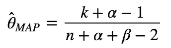

*甲机:(3+2–1)/(4+2+2–2)= 4/6 =****66.7%*** *乙机:(81+2–1)/(121+2+2–2)= 82/123 =****66.7%***

与你的直觉不同，通过地图估算的两台机器的获胜概率 *θ* 完全相同。因此，通过地图，你不能确定哪一个是特殊的老虎机。

但是真的吗？难道看起来不明显的是*机器 B* 更有可能是特殊的一个吗？

## 贝叶斯推理

为了看看*机器 A* 和*机器 B* 之间是否真的没有区别，让我们全面计算后验概率分布，而不仅仅是地图估计。

在上述情况下，后验概率分布 *P(θ|D)* 计算如下。(详细的计算将在下一节介绍。)

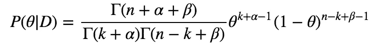

*A 机*和*B 机*的 *P(θ|D)* 绘制如下。

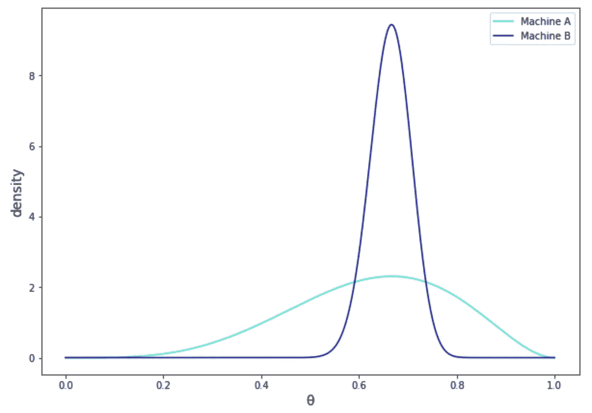

虽然两种分布在 *θ=0.666…* 上都有其 ***模态*** (这就是为什么它们的 MAP 估计值相同)，但是分布的形状却大不相同。在*机 B* 的分布中模式周围的密度远远高于*机 A* 的分布。这就是为什么你想计算完整的分布，而不仅仅是地图估计。

## 贝叶斯推理的计算

由于我们在上一节中跳过了对 *P(θ|D)* 的计算，所以我们在本节中来看看详细的计算过程。

地图和贝叶斯推理都是基于贝叶斯定理。贝叶斯推理和 MAP 的计算区别在于，在贝叶斯推理中，我们需要计算 *P(D)* 称为**边际似然**或**证据**。这是贝叶斯定理的分母，它确保 *P(θ|D)* 在所有可能的 *θ* 上的积分值*变为 1。(*若 *θ* 为离散变量，则为 *P(θ|D)* 之和。)

*P(D)* 是通过联合概率的边缘化得到的。当 *θ* 为连续变量时，公式如下。

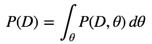

考虑到[链式法则](https://en.wikipedia.org/wiki/Chain_rule_(probability))，我们得到以下公式。

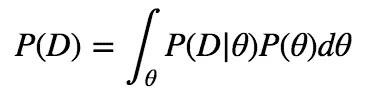

现在，把这个放到后验概率分布的原始公式中。下面计算是贝叶斯推理的目标。

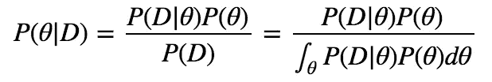

让我们为上面的情况计算一下 *P(θ|D)* 。

从 *P(D|θ)* — **似然** —即给定参数 *θ* 时，观察到数据 *D* 的概率。上例中， *D* 为“*4 局 3 胜”*，参数 *θ* 为*机 A* 的获胜概率。由于我们假设胜数服从二项式分布，公式如下，其中 *n* 为匹配数， *k* 为胜数。

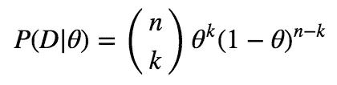

那么*P(θ)*—*θ—*的**先验概率分布**就是表达我们对 *θ* 的先验知识的概率分布。这里，对应于可能性 *P(D|θ)* 的概率分布，使用特定的概率分布。叫做[共轭先验分布](/a-gentle-introduction-to-maximum-likelihood-estimation-and-maximum-a-posteriori-estimation-d7c318f9d22d)。

由于二项分布的共轭先验是贝塔分布，所以我们这里用贝塔分布来表示 *P(θ)* 。贝塔分布描述如下，其中 *α* 和 *β* 为超参数。

现在我们得到了*P(D |θ)P(θ)——*公式的分子——如下。

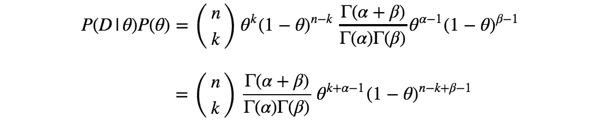

然后，*P(D)*——公式的分母——计算如下。注意 *θ* 的可能范围是 0 ≤ *θ ≤ 1。*

有了第一类[欧拉积分](https://en.wikipedia.org/wiki/Euler_integral)，上面的公式可以变形为下面。

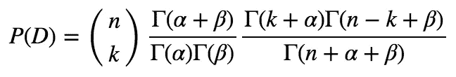

最后我们可以得到 *P(θ|D)* 如下。

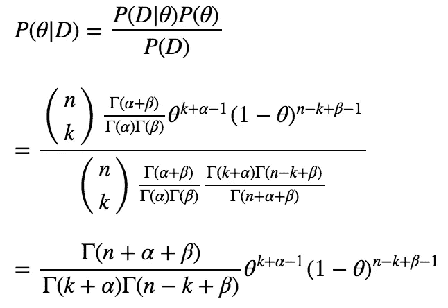

## 预期后验概率

你可能已经注意到了，MAP 估计的是后验分布的 ***模*** 。但是我们也可以使用其他统计量进行点估计，比如θ|D 的 ***期望值*** *。使用 *θ|D* 的期望值的估计称为**期望后验**。*

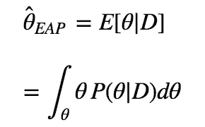

让我们用 EAP 估计一下 2 台机器的中奖概率。从上面的讨论来看，这种情况下的 *P(θ|D)* 低于*。*

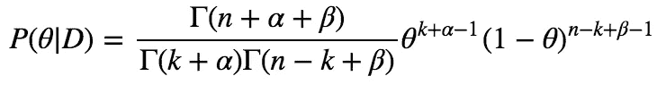

因此，估计如下所述。

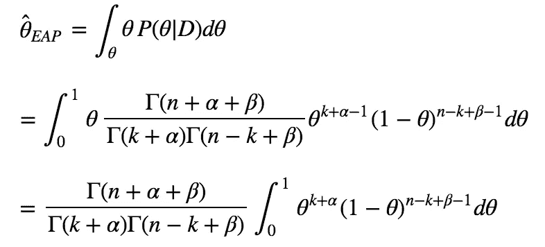

利用第一类欧拉积分[和](https://en.wikipedia.org/wiki/Euler_integral)[伽玛函数](https://en.wikipedia.org/wiki/Gamma_function)的定义，上述公式可以变形为以下公式。

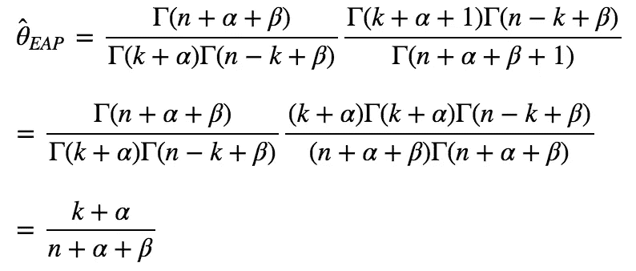

因此，在超参数 *α=β=2* 下，EAP 对 2 台机器获胜概率的估计低于*。*

*甲机:(3+2)/(4+2+2)= 5/8 =****62.5%*** *乙机:(81+2)/(121+2+2)= 83/125 =****66.4%***

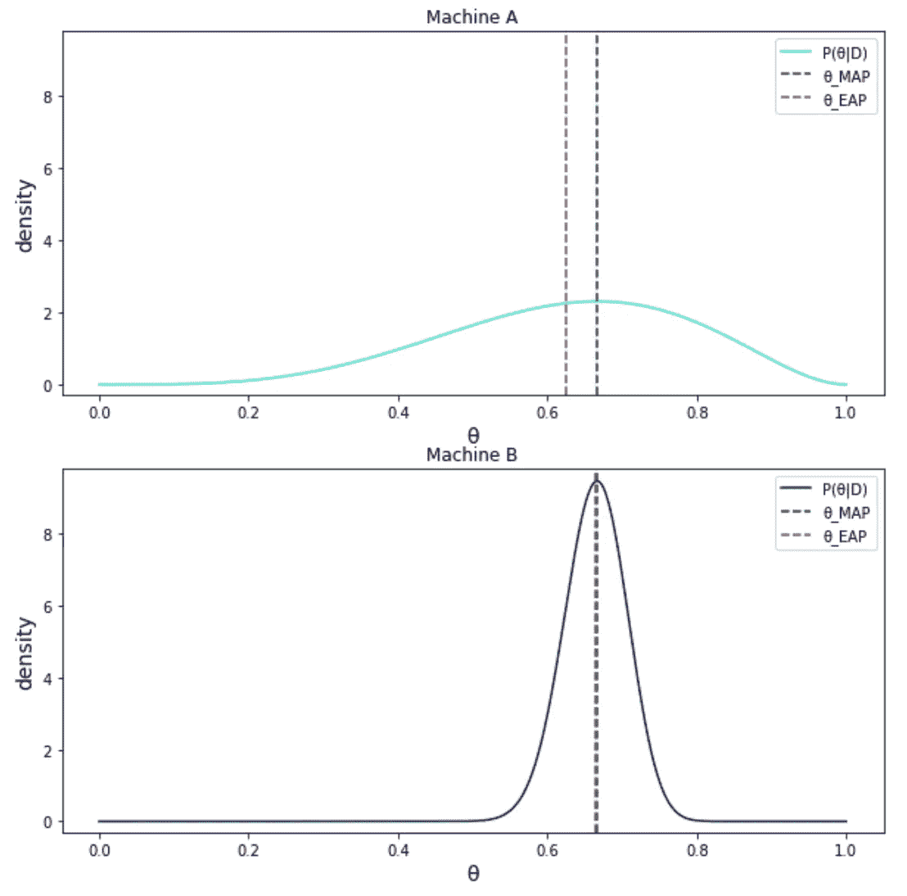

## 结论

如上所述，贝叶斯推断比点估计(如 MLE 和 MAP)提供了更多的信息。然而，它也有一个缺点——积分计算的复杂性。本文中的情况非常简单，并且通过分析得到了解决，但是在现实世界的应用程序中并不总是这样。然后，我们需要使用 MCMC 或其他算法来代替直接积分计算。
希望这篇文章能帮助你理解贝叶斯推断。