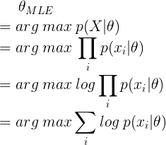
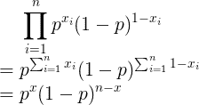
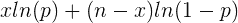
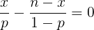
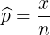
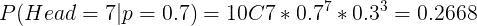
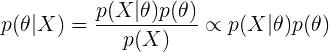
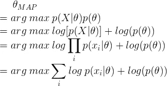
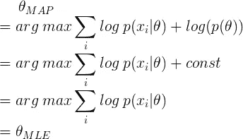
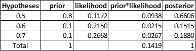

# 最大似然估计与最大后验概率

> 原文：<https://towardsdatascience.com/mle-vs-map-a989f423ae5c?source=collection_archive---------5----------------------->

## 机器学习和深度学习之旅

## MLE 和 MAP 背后的数学，展示了这两种方法的联系和区别

Image by Author

最大似然估计(MLE)和最大后验估计(MAP)都用于估计分布的参数。MLE 也广泛用于估计机器学习模型的参数，包括朴素贝叶斯和逻辑回归。它如此普遍和受欢迎，以至于有时人们甚至在不太了解它的情况下使用 MLE。例如，当对数据集拟合正态分布时，人们可以立即计算样本均值和方差，并将其作为分布的参数。虽然最大似然法是一种非常流行的参数估计方法，但是它是否适用于所有的情况呢？MLE 是如何工作的？MLE 和 MAP 有什么联系和区别？这篇博客的目的就是要回答这些问题。

**最大似然估计**

MLE 的目标是推断似然函数*p(X |θ)中的*θ*。*

使用这个框架，首先我们需要导出对数似然函数，然后通过使关于*θ*的导数等于 0 或通过使用各种优化算法(如梯度下降)来最大化它。由于对偶，最大化对数似然函数等于最小化负对数似然。在机器学习中，最小化负对数似然是优选的。例如，它在逻辑回归中用作损失函数，交叉熵。

以抛硬币为例，更好的理解 MLE。例如，如果你掷一枚硬币 1000 次，有 700 个正面和 300 个反面。这枚硬币正面朝上的概率是多少？这是一枚公平的硬币吗？

首先，每次抛硬币都遵循伯努利分布，因此可能性可以写成:

在公式中， *xi* 表示单尾(0 或 1)，而 *x* 表示总头数。然后记录下可能性:

对数似然函数对 *p* 求导，则我们可以得到:

最后， *p* 的估计值为:

因此，在这个例子中，这个典型硬币的正面概率是 0.7。显然，这不是一枚公平的硬币。

根据大数定律，一系列伯努利试验的经验成功概率将收敛于理论概率。然而，如果你把这个硬币抛 10 次，有 7 个正面和 3 个反面。结论还成立吗？

即使 *p(Head = 7| p=0.7)* 大于 *p(Head = 7| p=0.5)* ，我们也不能忽视 *p(Head)* = 0.5 的可能性仍然存在。那就是 MLE(频率主义推理)的问题。它从不使用或给出假设的概率。

举一个更极端的例子，假设你掷硬币 5 次，结果都是正面。是不是就可以下结论 *p(Head)* =1？答案是否定的。这又引出了另一个问题。当样本容量较小时，极大似然估计的结论不可靠。

**最大一条后路**

回想一下，我们可以用贝叶斯法则把后验写成似然性和先验的乘积:

公式中， *p(y|x)* 为后验概率； *p(x|y)* 是似然性； *p(y)* 是先验概率 *p(x)* 是证据。

为了得到 MAP，我们可以用后验概率代替 MLE 中的似然性:

对比 MAP 和 MLE 的方程，我们可以看到唯一的区别就是 MAP 在公式中包含了先验，也就是说可能性是由 MAP 中的先验来加权的。

在先验服从均匀分布的特殊情况下，这意味着我们给*θ的所有可能值分配相等的权重。*在这种情况下，映射可以写成:

根据上面的公式，我们可以得出结论，当先验服从均匀分布时，最大似然估计是映射的一个特例。这就是地图和 MLE 的联系。

让我们回到前面的例子，抛一枚硬币 10 次，有 7 个正面和 3 个反面。本次应用 MAP 计算 *p(头)*。贝叶斯分析从选择一些先验概率值开始。这里我们列出三个假设，p(head)等于 0.5，0.6 或者 0.7。相应的先验概率等于 0.8、0.1 和 0.1。类似地，我们计算第 3 列中每个假设下的可能性。注意，列 5，后验，是列 4 的归一化。

在这种情况下，即使当 p(head)=0.7 时可能性达到最大，当 p(head)=0.5 时后验性达到最大，因为现在可能性被先验加权。通过使用 MAP， *p(头)* = 0.5。但是，如果改变第 2 列中的先验概率，我们可能会有不同的答案。因此，对 MAP(贝叶斯推理)的主要批评之一是，主观先验是主观的。

希望看完这篇博客，你清楚 MLE 和 MAP 的联系和区别，以及如何自己手动计算。在下一篇博客中，我将解释 MAP 如何应用于收缩方法，如套索和岭回归。如果你有兴趣，请阅读我的其他博客:

 [## 目录

### 这一系列博客将从理论和实现两个方面对深度学习进行介绍。

medium.com](https://medium.com/@songyangdetang_41589/table-of-contents-689c8af0c731)