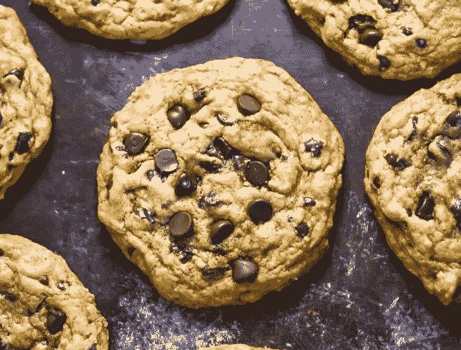
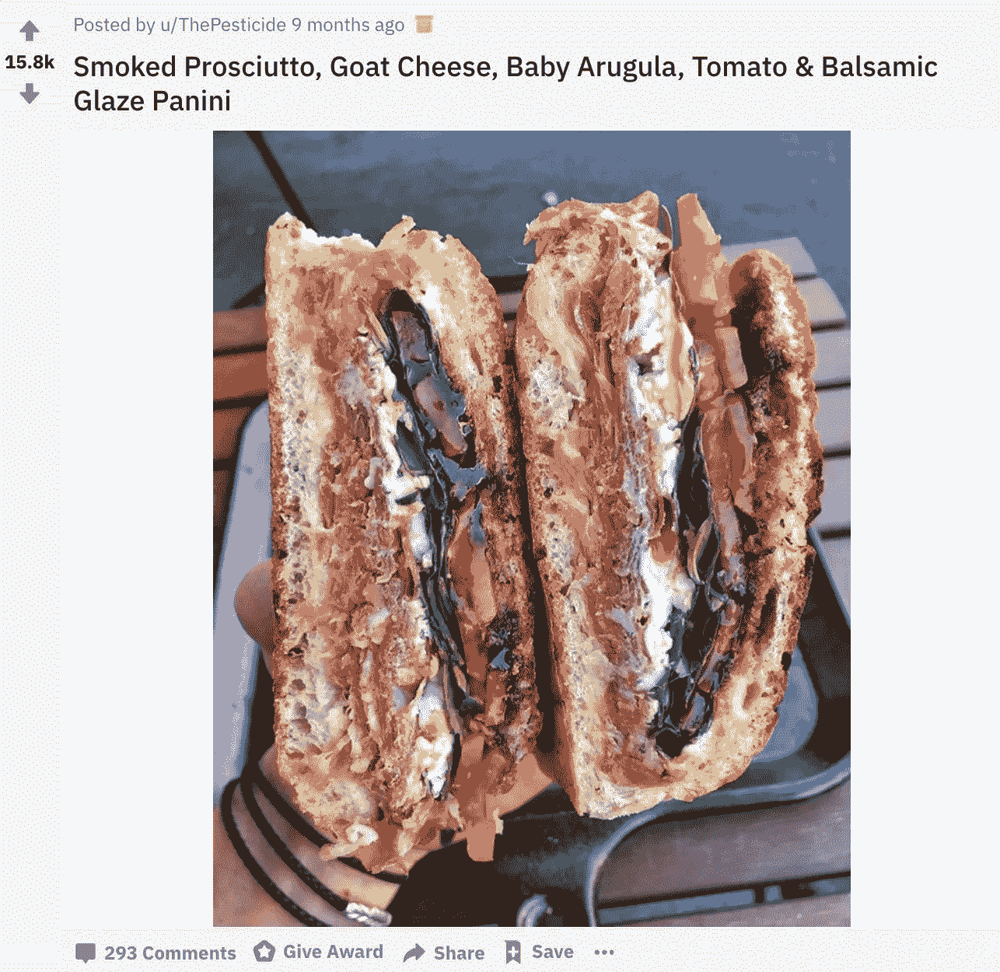
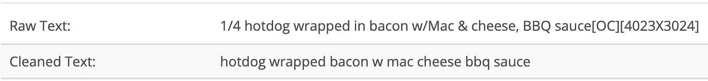
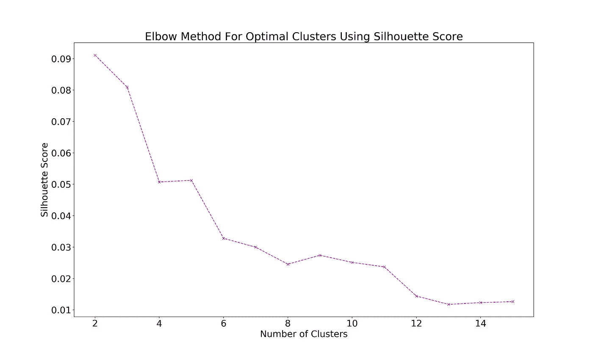
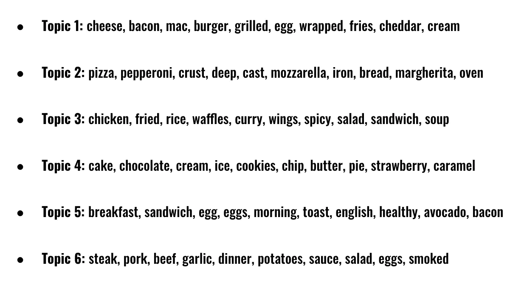
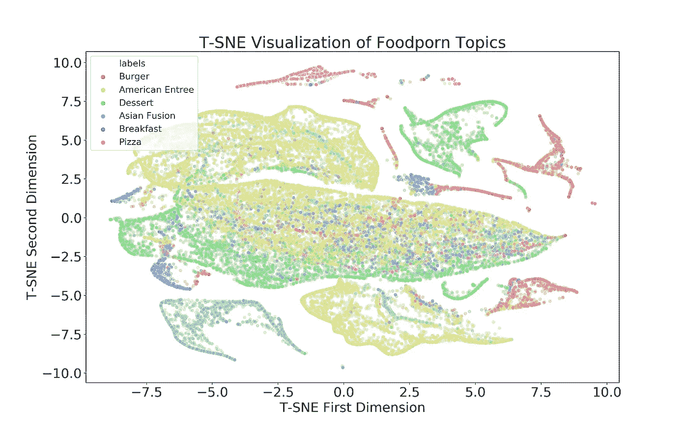

# Mmmm 美食色情！使用自然语言处理的聚类和分类研究

> 原文：<https://towardsdatascience.com/mmmm-foodporn-a-clustering-and-classification-study-using-natural-language-processing-e2eae8ddefe1?source=collection_archive---------15----------------------->

# 介绍

作为一个美食爱好者和经常在 reddit 上冲浪的人，subreddit [r/foodporn](https://www.reddit.com/r/foodporn) (一个发布美食图片的 reddit 论坛)似乎是我为一个使用自然语言处理(NLP)的无监督学习项目收集数据的好地方。

无监督学习是指我们事先不知道数据的潜在结构，并试图揭示这种结构。与之相反的是监督学习，在监督学习中，我们确实事先知道数据的结构，这些数据是以*标签的形式存在的。*通常，无监督学习包括基于数据点彼此的相似性对数据点进行分组/聚类。

**我这个项目的目标是在 r/foodporn 上展示任何潜在的结构。进入这个项目，我有一种预感，如果我们把标题聚集在一起，我们会看到一个自然的烹饪结构。也就是说，我们会观察到日本食物群、意大利食物群等等。**

# 数据收集和清理

我使用了 [pushshift API](https://github.com/pushshift/api) 从 subreddit 中抓取了 48，000 个帖子。具体来说，我提取了过去 48 个月中每月排名前 1000 的帖子。以下是其中一个帖子的例子:

因为我只分析了文章标题，所以上面例子的数据是文本“熏火腿，山羊奶酪，小芝麻菜，番茄和意大利面”。

我从清理我的数据开始。这包括将所有单词小写，删除标点符号、表情符号和数字，以及过滤广告和非英语帖子。

经过清洗和过滤，我有 42，234 个标题可以玩。

# 矢量化

这里我要介绍一些行话，把一切放在 NLP 的语境中。每当我说“文档”时，我指的是一个 r/foodporn 标题的单独实例。当我说“文集”时，我指的是整个“文档”集合(我的标题的整个集合)。

在 NLP 中，我们必须将所有文档转换成数字向量，这样我们就可以对它们运行统计模型。有许多方法可以做到这一点。我选择的方法(也是最流行的方法之一)是 TF-IDF(词频——逆文档频率)。本质上，TF-IDF 在语料库中所有唯一单词的上下文中查看给定文档中的所有单词。如果一个术语在一个文档中出现多次，它就被认为是重要的。但是如果一个术语在语料库中出现多次，这就否定了它的重要性。

以“培根”为例。单词“bacon”经常出现在所有的标题中，所以如果我们在查看一个特定的标题时看到单词“bacon ”,这并不能使这个文档变得独特。TF-IDF 给“培根”的数字很低。TF-IDF 会给一个更稀有的词，比如“生鱼片”一个更高的数字。由于“生鱼片”是一个罕见的词，它比“培根”更能区分标题。你可以在这里阅读更多关于 TF-IDF 的信息。

每个文档的 TF-IDF 输出是一个向量，其长度等于语料库中唯一单词的数量。在我的例子中，有 20，857 个独特的单词。因此，在我的整个语料库上运行 TF-IDF 会得到一个 42，234 乘 20，857 的矩阵(文档数乘以唯一单词数)。

# 主题建模/聚类

我的文档以这种形式矢量化后，我终于可以对它们进行分组了！但是理想的组数应该是多少呢？为了找到答案，我反复对我的数据进行聚类([使用 K-Means](https://medium.com/datadriveninvestor/k-means-clustering-b89d349e98e6) )，增加我的聚类数，并绘制出与每个聚类数相关的[剪影分数](https://en.wikipedia.org/wiki/Silhouette_(clustering))。在高层次上，轮廓分数是考虑到聚类的*内聚*和*分离*的度量。单个集群越密集，彼此之间的距离越远，效果越好。低轮廓分数反映了强聚类。

不出所料，随着我增加聚类数，轮廓得分会下降。但是看起来我们开始在 6 个集群附近达到收益递减点，所以我选择 6 个作为我理想的组数。

最后，我使用了一种称为 NMF(非负矩阵分解)的降维技术，将我的 42，234 个标题分成 6 组(在 NLP 项目的降维环境中，组正式称为“主题”)。NMF 的内部运作超出了这篇博客的范围，但是你可以在这里阅读更多关于 NMF 的内容。NMF 允许我们通过从单词空间到主题空间来降低矩阵的维度。在这种情况下，我们将一个 20，857 元素长的*单词*空格压缩成一个 6 元素长的*主题*空格。在这个过程中，我们丢失了一些信息，但是增加了可解释性。

通过模拟 6 个主题，我期望看到每个主题对应一种美食。

够了，别再说这些疯狂的数据科学巫术了。来看看成果吧！

# 结果

以下是 6 个话题中最重要的 10 个单词:

在我对我的主题建模之后，我检查了它们，看它们在我试图解决的问题的上下文中是否有意义。

看起来主题 1 是一系列经典的美国午餐配料，重点是脂肪和奶酪。我把这个题目命名为**汉堡**。

如果考察话题 2，显然和披萨/意大利菜有关。我把这种披萨命名为**披萨**。这个题目好具体啊！

话题 3 有点过了。单从这个话题的前 10 个词很难看出这个话题的本质是什么，所以我查看了前 30 个词，看到了像马萨拉、姜黄、馄饨和面条这样的词。我给它取名为**亚洲融合**。

话题 4 显然是一个**甜点**话题。就像**披萨**这个话题一样，我喜欢这个有多明显。

我将主题 5 命名为**早餐**，尽管可以说它的本质更像是健康三明治类型的配料。

最后，我将主题 6 命名为**美国主菜**。与其他话题相比，这个话题相当宽泛。

让我们使用 [T-SNE](https://www.datacamp.com/community/tutorials/introduction-t-sne) 来想象标题如何落入不同的主题:

有意思。对于**披萨**、**汉堡**和**亚洲融合**主题(粉色、红色和蓝色)有很强的区分。**美国主菜**、**甜点**和**早餐**主题(黄色、绿色和紫色)都有一些不同的区域，但也在最大的“斑点”中明显混合。这意味着这些主题没有很好地相互分离。

在这些主题之上创建了一个分类器之后，我观察到这是真的。我的分类器将一个字符串作为输入，并将其转换为一个 6 长度的概率向量，对应于这里的 6 个主题。具有最高概率的主题是分类器的输出。你可以自己试试[这里](https://cuisine-classifier-foodporn.herokuapp.com/)！

你会注意到分类器做出了一些好的预测和一些坏的预测。例如，它会正确地将“大黄派”、“鸡肉炒面”和“凤尾鱼和马苏里拉面包片”分类，但它认为“龙虾通心粉和奶酪”是汉堡，“意大利面”是亚洲融合。

# 结论

与我的预期相反，r/foodporn 标题主题并不完全属于美食类，但它们确实反映了帖子的潜在结构。一些群体很容易区分，而另一些则混杂在一起。

一些主题之间的混合反映了人们正在发布跨越多个主题的标题，对应于不容易归类的食物。鉴于当今美食界正在进行的大量烹饪融合和实验，这很有意义。今天的菜肴比以往任何时候都更难分类，因为它们越来越多地由来自世界各地的食材组成。

不混杂的话题也有意义。甜点之所以如此独特，是因为人们没有把“巧克力”和“排骨”混在一起，“馅饼”和“烤肉”混在一起，“饼干”和“洋葱”混在一起。同样，也有一些东西让**披萨**和**汉堡**与众不同。

感谢你阅读我的帖子，我希望你会觉得有趣！如有任何问题/意见，请随时联系我们。

项目代码: [Github](https://github.com/danielwilentz/Cuisine-Classifier)

项目 App: [美食分类器](https://cuisine-classifier-foodporn.herokuapp.com/)

关于我的更多信息: [LinkedIn](https://www.linkedin.com/in/danielwilentz/)