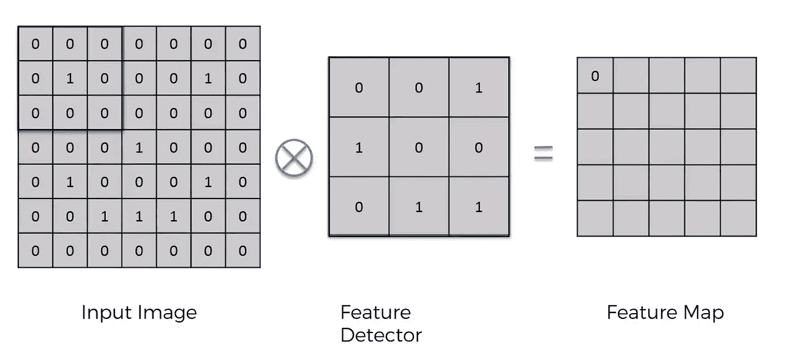
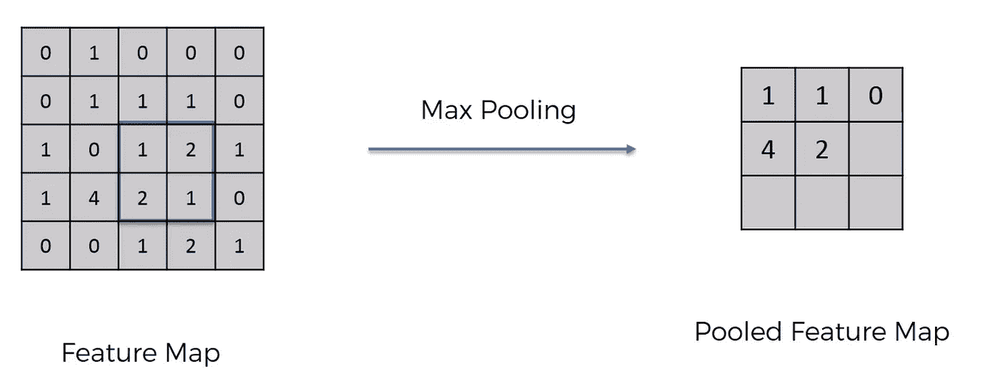
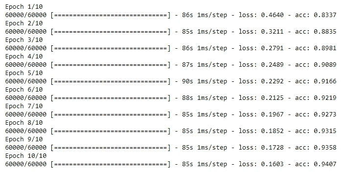
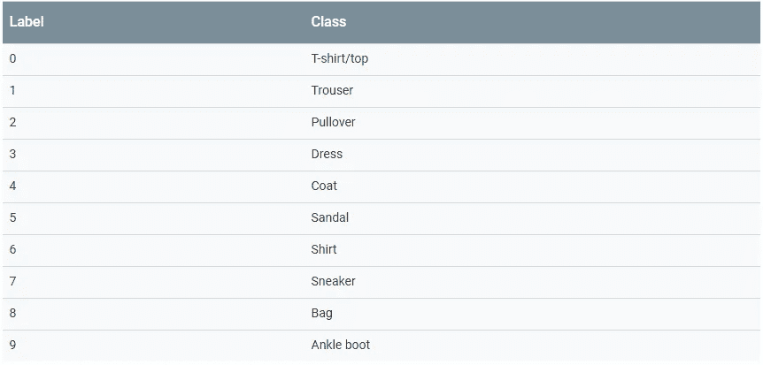
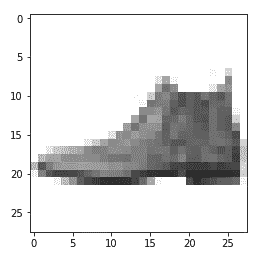

# 使用 CNN 的 MNIST 数据集 Python 示例

> 原文：<https://towardsdatascience.com/mnist-cnn-python-c61a5bce7a19?source=collection_archive---------7----------------------->


[https://www.pexels.com/photo/person-encoding-in-laptop-574071/](https://www.pexels.com/photo/person-encoding-in-laptop-574071/)

自动驾驶汽车普及只是时间问题。没有卷积神经网络，这项巨大的工程壮举是不可能实现的。卷积神经网络使用的算法比传统人工神经网络中使用的算法更适合视觉图像处理。卷积神经网络由卷积层和池层组成。

# 卷积层

卷积层利用了所有图像都可以按照 *1s* 和 *0s* 到*进行编码的事实，创建特征图。特征检测器只是一个矩阵，它的值对应于图像的一个特征(即尖耳朵，狭缝眼睛……)。该矩阵覆盖图像的一部分，并对该位置的所有值执行逐位乘法。逐位乘法的结果被求和并放入特征图的相应位置。然后，它转移到图像的另一部分，并重复该过程，直到它遍历了整个图像。*



# 汇集层

池很像卷积，只是我们不使用特征检测器。相反，我们使用最大池。最大汇集的过程包括在由窗口(nxn 矩阵)覆盖的特征图区域内取最大值，并将其放入汇集的特征图的相应位置。汇集是有用的，因为它减小了图像的大小，使得即使在空间方向上存在差异，也能更容易地计算和检测模式。

例如，假设数字 4 与猫的眼睛吻合。无论照片拍摄时猫的眼睛是直视相机还是偏向一侧，max pooling 可能仍然会得出相同的值。



这是足够的背景资料，对代码。前面的示例使用 Keras(一种高级 API)在 TensorFlow 中构建和训练模型。

```
import keras
from keras.datasets import fashion_mnist 
from keras.layers import Dense, Activation, Flatten, Conv2D, MaxPooling2D
from keras.models import Sequential
from keras.utils import to_categorical
import numpy as np
import matplotlib.pyplot as plt
```

运行下面的代码行来导入我们的数据集。

```
(train_X,train_Y), (test_X,test_Y) = fashion_mnist.load_data()
```

[时尚 MNIST](https://github.com/zalandoresearch/fashion-mnist) 数据集包含 10 个类别的 70，000 幅灰度图像。这些图像以低分辨率(28 x 28 像素)显示了单件衣服，如下所示:


[https://github.com/zalandoresearch/fashion-mnist](https://github.com/zalandoresearch/fashion-mnist)

# 数据预处理

当使用卷积层作为我们模型的第一层时，我们需要将我们的数据整形为(`n_images`、`x_shape`、`y_shape`、`channels`)。你真正需要知道的是，对于灰度图像，你应该将`channels` 设置为 1，当你有一组 RGB 图像作为输入时，将`channels` 设置为 3。

```
train_X = train_X.reshape(-1, 28,28, 1)
test_X = test_X.reshape(-1, 28,28, 1)
```

负一与指定训练集中的图像总数相同。

```
train_X.shapeOut[00]: (60000, 28, 28, 1)
```

修改每个像素的值，使它们的范围从 0 到 1，将提高我们的模型学习的速度。

```
train_X = train_X.astype('float32')
test_X = test_X.astype('float32')train_X = train_X / 255
test_X = test_X / 255
```

我们的模型不能直接处理分类数据。因此，我们必须使用一个热编码。在一种热编码中，数字 0 到 9 被表示为一组 9 个 0 和一个 1。该数字由数字 1 的位置决定。例如，你可以将 3 表示为`[0, 0, 0, 1, 0, 0, 0, 0, 0, 0]`。

```
train_Y_one_hot = to_categorical(train_Y)
test_Y_one_hot = to_categorical(test_Y)
```

# 培养

我们的卷积层将有 64 个神经元(特征映射)和一个 3×3 特征检测器。反过来，我们的池层将使用具有 2x2 矩阵的最大池。卷积神经网络几乎总是由人工神经网络处理。在 Keras 中，`Dense`层实现了操作`output = activation(dot(input, weight) + bias)`。我们的人工神经网络的输入必须是一维的，因此我们预先将其展平。

```
model = Sequential()model.add(Conv2D(64, (3,3), input_shape=(28, 28, 1)))
model.add(Activation('relu'))
model.add(MaxPooling2D(pool_size=(2,2)))model.add(Conv2D(64, (3,3)))
model.add(Activation('relu'))
model.add(MaxPooling2D(pool_size=(2,2)))model.add(Flatten())
model.add(Dense(64))model.add(Dense(10))
model.add(Activation('softmax'))model.compile(loss=keras.losses.categorical_crossentropy, optimizer=keras.optimizers.Adam(),metrics=['accuracy'])
```

由于卷积神经网络中涉及的算法使用矩阵，您可以从在 GPU 上运行 TensorFlow 中受益匪浅。如果你使用 CPU 训练模型，我不建议超过 10 个历元，因为这需要一段时间。批量大小必须与进入第一个卷积层的图像数量相匹配。

```
model.fit(train_X, train_Y_one_hot, batch_size=64, epochs=10
```



到了第十个纪元，我们获得了 94%的准确度*，从各方面考虑，这确实是很好的。让我们看看我们的模型在分类新图像方面做得有多好。*

```
*test_loss, test_acc = model.evaluate(test_X, test_Y_one_hot)
print('Test loss', test_loss)
print('Test accuracy', test_acc)Out[]: Test loss 0.2947616615891457
Out[]: Test accuracy 0.9006*
```

*正如你所看到的，基于测试的准确性，我们稍微过度拟合了我们的模型。*

*让我们来看看我们的模型做出的第一个预测。*

```
*predictions = model.predict(test_X)
print(np.argmax(np.round(predictions[0])))Out[30]: 9*
```

*数字 9 有一个匹配的类别`Ankle boot`。*

**

*运行以下代码将显示第一幅图像。*

```
*plt.imshow(test_X[0].reshape(28, 28), cmap = plt.cm.binary)
plt.show()*
```

**

*我们的模型正确地对测试数据集中的第一幅图像进行了分类。*