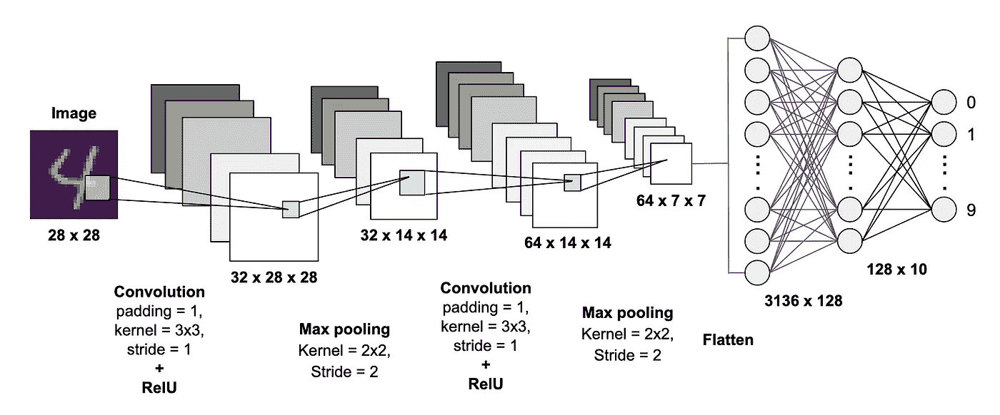
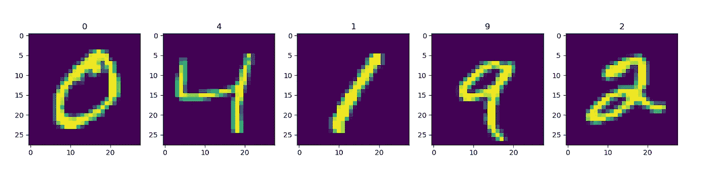
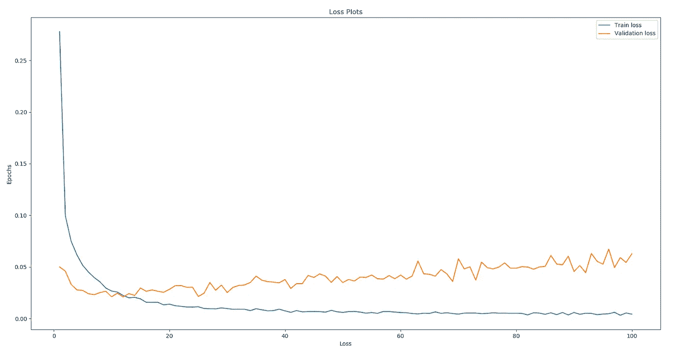
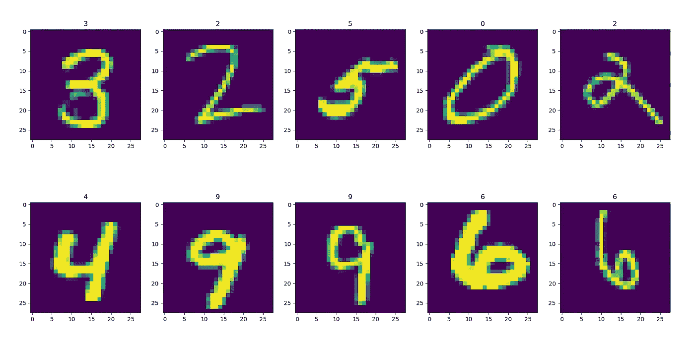

# 基于卷积神经网络的 MNIST 手写数字分类

> 原文：<https://towardsdatascience.com/mnist-handwritten-digits-classification-using-a-convolutional-neural-network-cnn-af5fafbc35e9?source=collection_archive---------4----------------------->



这篇文章的目标是使用 PyTorch 实现一个 CNN 来分类 MNIST 手写数字图像。

这篇文章是关于卷积神经网络(CNN)介绍的 2 部分系列文章的一部分。

[**第一部分——围绕 CNN 的基本概念**](https://medium.com/@krutpatel/convolution-neural-networks-a-beginners-guide-implementing-a-mnist-hand-written-digit-8aa60330d022)

[**第二部分— Pytorch 实现 CNN 对 MNIST 手写数字进行分类**](https://medium.com/@krutpatel/mnist-handwritten-digits-classification-using-a-convolutional-neural-network-cnn-af5fafbc35e9)

本帖没有详细解释**卷积层**、**最大池层**、**全连接层**、**脱落层**等概念的工作原理。如果不熟悉，请阅读[第 1 部分](https://medium.com/@krutpatel/convolution-neural-networks-a-beginners-guide-implementing-a-mnist-hand-written-digit-8aa60330d022)。

你可以在这里找到代码—[https://github.com/iamkrut/MNIST_handwriting_classification](https://github.com/KrutPatel2257/MNIST_handwriting_classification)

从这个[页面](http://yann.lecun.com/exdb/mnist/)可以得到 MNIST 手写数字数据库，它有 60，000 个样本的训练集和 10，000 个样本的测试集。这是从 NIST 可获得的更大集合的子集。数字已经过大小标准化，并在固定大小的图像中居中。

对于那些希望了解现实世界数据的各种模式识别方法，同时花费最少的精力进行预处理和格式化的人来说，这是一个很好的数据库。

# 获取 MNIST 数据集并准备训练、验证和测试数据加载器

我们可以从 NIST 网站下载数据集，但使用 PyTorch 提供的`torchvision`下的`dataset` API 更方便，它直接获取 MNIST 数据。

我们获取 NIST 提供的训练集和测试集。为了获取训练集，我们将参数`train`设置为`True`，而为了获取测试集，我们将其设置为`False`。`dataset` API 还允许我们处理我们想要应用于数据的任何转换。我们设置`transform=transforms.Compose([transforms.ToTensor()]))`将图像数据转换成张量。

```
mnist_trainset = datasets.MNIST(root='./data', train=True, download=True, 
transform=transforms.Compose([transforms.ToTensor()]))mnist_testset = datasets.MNIST(root='./data', train=False, download=True, transform=transforms.Compose([transforms.ToTensor()]))
```

`mnist_trainset`的尺寸为 60000，`mnist_testset`的尺寸为 10000

然后，我们将测试数据集分成两组，一组用于验证，另一组用于测试。我们做 90%–10%的测试，即 9000 次用于验证，1000 次用于测试。我们使用`torch.utils.data.random_split()`函数来完成这项工作。

```
mnist_valset, mnist_testset = torch.utils.data.random_split(mnist_testset, [int(0.9 *    len(mnist_testset)), int(0.1 * len(mnist_testset))])
```

之后，我们为所有三个集合准备数据加载器。DataLoader 基本上将数据集和采样器结合起来，并在给定的数据集上提供一个 iterable。

它还允许我们选择批量大小。**批次大小**是一个超参数，它定义了模型在更新内部模型参数之前查看的样本数量。这个概念被称为**小批量梯度下降**，因为模型对小批量数据进行处理以计算梯度，并根据梯度修改模型参数。我们选择`train_dataloader`的批量为 64，`val_dataloader`和`test_dataloader`的批量为 32。

```
train_dataloader = torch.utils.data.DataLoader(mnist_trainset, batch_size=64, shuffle=True)
val_dataloader = torch.utils.data.DataLoader(mnist_valset, batch_size=32, shuffle=False)
test_dataloader = torch.utils.data.DataLoader(mnist_testset, batch_size=32, shuffle=False)
```

# 可视化数据

开发深度学习模型的第一步是可视化数据。因此，让我们从列车组中绘制一些图像。

该图显示了数字图像及其顶部的标签。如果你把图像数据打印出来，你可以看到数值在 0 和 1 之间。所以不需要对图像数据进行归一化。



# 定义模型

我们将定义一个简单的卷积神经网络，它有两个卷积层，后面是两个完全连接的层。

下面是我们将用于 CNN 的模型架构。


Model Architecture

我们用 RelU 激活函数和 max-pool 层跟踪每个卷积层。RelU 引入了非线性，max-pooling 有助于消除噪声。

第一卷积层`self.conv_1`接收维度为 1 的通道，因为图像是灰度的。内核大小被选择为 3×3，步长为 1。该卷积的输出被设置为 32 个通道，这意味着它将使用 32 个核来提取 32 个特征图。我们用填充大小 1 填充图像，这样输入和输出维度是相同的。该层的**输出尺寸**将为**32×28×28**。

这就是我们如何定义`self.conv_1`层:

```
self.conv_1 = torch.nn.Conv2d(in_channels=1, out_channels=32, kernel_size=3, stride=1, padding=1)
```

我们对其应用 RelU 激活，然后是内核大小为 2、步距为 2 的最大池层。这将特征图向下采样到尺寸 **32 x 14 x 14** 。

这就是我们如何定义`self.relu`层:

```
self.relu = torch.nn.ReLU()
```

这就是我们如何定义`self.max_pool2d`层:

```
self.max_pool2d = torch.nn.MaxPool2d(kernel_size=2, stride=2)
```

第二卷积层`self.conv_2`将具有 32 的输入通道尺寸。我们选择输出通道大小为 64，这意味着它将提取 64 个特征图。这一层的内核大小为 3，步幅为 1。我们再次使用填充大小 1，以便输入和输出维度保持相同。该层的输出尺寸将为 **64 x 7 x 7** 。

这就是我们如何定义`self.conv_2`层:

```
self.conv_2 = torch.nn.Conv2d(in_channels=32, out_channels=64, kernel_size=3, stride=1, padding=1)
```

然后，我们用一个 RelU 激活和一个内核大小为 2、步幅为 2 的 max-pooling 层来跟进。下采样的特征图将具有尺寸**64×7×7**。

我们对此使用相同的定义`self.relu`和`self.max_pool2d`，因为`self.relu`是相同的操作，定义它两次没有意义。类似地`self.max_pool2d`也是相同的操作，因为它们使用相同的内核大小和步数。

最后，使用两个完全连接的层`self.linear_1`和`self.linear_2`。我们将把特征地图的展平版本传递给第一个完全连接的层。因此，它的尺寸必须是 64×7×7，等于 3136 个节点。该层将连接到另一个具有 **128 个节点**的全连接层。这将是我们的最后一层，所以输出的维度应该与总类相匹配，即 **10** 。因此，我们有两个完全连接的层，大小为 **3136 x 128** ，后面是 **128 x 10** 。

该层`self.linear_1`和`self.linear_2`定义如下:

```
self.linear_1 = torch.nn.Linear(7 * 7 * 64, 128)
self.linear_2 = torch.nn.Linear(128, 10
```

由于我们想要丢弃两个线性层之间的连接以减少过拟合，我们定义`self.dropout`的连接丢弃概率为 0.5，如下所示:

```
self.dropout = torch.nn.Dropout(p=0.5)
```

以上所有的层和操作都是在类`torch.nn.Module`的 overridern `__init__`方法下定义的

```
def __init__(self):
    super(Model, self).__init__()
    self.conv_1 = torch.nn.Conv2d(in_channels=1, out_channels=32, kernel_size=3, stride=1, padding=1)
    self.conv_2 = torch.nn.Conv2d(in_channels=32, out_channels=64, kernel_size=3, stride=1, padding=1)
    self.max_pool2d = torch.nn.MaxPool2d(kernel_size=2, stride=2)
    self.linear_1 = torch.nn.Linear(7 * 7 * 64, 128)
    self.linear_2 = torch.nn.Linear(128, 10)
    self.dropout = torch.nn.Dropout(p=0.5)
    self.relu = torch.nn.ReLU()
```

接下来，我们通过覆盖类`torch.nn.Module`的`forward`方法来定义我们希望数据如何流经这些层

```
def forward(self, x):
    x = self.conv_1(x)
    x = self.relu(x)
    x = self.max_pool2d(x)
    x = self.conv_2(x)
    x = self.relu(x)
    x = self.max_pool2d(x)
    x = x.reshape(x.size(0), -1)
    x = self.linear_1(x)
    x = self.relu(x)
    x = self.dropout(x)
    pred = self.linear_2(x)

    return pred
```

# 定义模型对象、损失函数和优化器

我们定义了一个`Model()`类的实例，并将其命名为`model`

```
model = Model()
```

**损失标准:**损失函数告诉我们模型预测的好坏。由于我们正在处理多类分类，我们选择交叉熵作为我们的损失函数。我们使用结合了 softmax 函数`nn.LogSoftmax()`和`nn.NLLLoss()`损失函数的`torch.nn.CrossEntropyLoss`。

```
criterion = torch.nn.CrossEntropyLoss()
```

**优化器:**优化器通过响应损失标准的输出更新模型，将损失函数和模型参数联系在一起。我们将使用 Adam 作为优化器，其**学习率**为 **0.001** 。

```
optimizer = torch.optim.Adam(model.parameters(), lr=0.001)
```

# 培训和评估

我们将训练 100 个时期的模型，并挑选验证损失最低的模型。

## 训练循环

对于每个时期，我们使用 train_dataloader 上的枚举函数迭代通过 train_dataset 的批次。

首先，我们将模型设置为训练模式。这使我们能够启用 dropout 层，并在训练模式下设置模型。

```
model.train()
```

对于每一批，我们将该批图像张量传递到模型中，该模型将返回一个具有该批预测的张量。

```
pred = model(image)
```

得到预测后，我们将它们与它们的实际标签一起传递到交叉熵损失标准中，并计算损失。

```
loss = criterion(pred, label)
```

我们使用这个损失值进行反向传递，并使用 Adam optimizer 来修改模型参数。

```
loss.backward()
optimizer.step()
```

在每次迭代之前，我们需要将优化器梯度归零。

```
optimizer.zero_grad()
```

我们通过将每批迭代的所有损失相加，并通过迭代计数对其进行平均，来获得整个时期的训练损失。除此之外，我们还通过将损失值存储在列表`train_loss`中来跟踪每个时期的训练损失

这是整个循环的样子:

```
model.train()
# training
for itr, (image, label) in enumerate(train_dataloader):

    if (torch.cuda.is_available()):
        image = image.cuda()
        label = label.cuda()

    optimizer.zero_grad()

    pred = model(image)

    loss = criterion(pred, label)
    total_train_loss += loss.item()

    loss.backward()
    optimizer.step()

total_train_loss = total_train_loss / (itr + 1)
train_loss.append(total_train_loss)
```

## 验证循环

对于训练循环之后的每个时期，我们进行验证循环，以查看该模型在验证集上的表现。

首先，我们将模型设置为评估模式

```
model.eval()
```

然后，我们使用 enumerate 函数迭代验证数据加载器中的每个批次。我们采取了与训练相似的步骤，但我们不会将失败反向传播。之后，我们将模型的预测与实际标签进行比较，并计算模型的准确性。与训练阶段类似，我们通过将每批迭代的所有损失相加，并通过迭代计数对其进行平均，来获得该时期的验证损失。我们通过将每个时期的损失值存储在`val_loss`中来跟踪每个时期的确认损失

整个循环如下所示:

```
for itr, (image, label) in enumerate(val_dataloader):
    pred = model(image) loss = criterion(pred, label)
    total_val_loss += loss.item()

    pred = torch.nn.functional.softmax(pred, dim=1)
    for i, p in enumerate(pred):
        if label[i] == torch.max(p.data, 0)[1]:
            total = total + 1

accuracy = total / len(mnist_valset)

total_val_loss = total_val_loss / (itr + 1)
```

我们绘制了每个时期的训练和验证损失，它们分别存储在列表`train_loss`和`val_loss`下。

```
fig=plt.figure(figsize=(20, 10))
plt.plot(np.arange(1, no_epochs+1), train_loss, label="Train loss")
plt.plot(np.arange(1, no_epochs+1), val_loss, label="Validation loss")
plt.xlabel('Loss')
plt.ylabel('Epochs')
plt.title("Loss Plots")
plt.legend(loc='upper right')
plt.show()
```

下面是训练和验证损失图



Loss plot

如所见，第 12 个时期具有最低的验证损失 0.02092566 和精度 0.99388889，之后模型开始过拟合并且验证损失激增。

培训日志如下所示:

```
Training dataset size:  60000
Validation dataset size:  9000
Testing dataset size:  1000Epoch: 1/100, Train Loss: 0.27790789, Val Loss: 0.04998713, Val Accuracy: 0.98311111
Saving the model state dictionary for Epoch: 1 with Validation loss: 0.04998713Epoch: 2/100, Train Loss: 0.09957011, Val Loss: 0.04592616, Val Accuracy: 0.98533333
Saving the model state dictionary for Epoch: 2 with Validation loss: 0.04592616Epoch: 3/100, Train Loss: 0.07494711, Val Loss: 0.03318010, Val Accuracy: 0.98900000
Saving the model state dictionary for Epoch: 3 with Validation loss: 0.03318010Epoch: 4/100, Train Loss: 0.06168462, Val Loss: 0.02777057, Val Accuracy: 0.99033333
Saving the model state dictionary for Epoch: 4 with Validation loss: 0.02777057Epoch: 5/100, Train Loss: 0.05156403, Val Loss: 0.02722912, Val Accuracy: 0.99100000
Saving the model state dictionary for Epoch: 5 with Validation loss: 0.02722912Epoch: 6/100, Train Loss: 0.04502778, Val Loss: 0.02404975, Val Accuracy: 0.99233333
Saving the model state dictionary for Epoch: 6 with Validation loss: 0.02404975Epoch: 7/100, Train Loss: 0.03968575, Val Loss: 0.02311387, Val Accuracy: 0.99211111
Saving the model state dictionary for Epoch: 7 with Validation loss: 0.02311387Epoch: 8/100, Train Loss: 0.03550077, Val Loss: 0.02516144, Val Accuracy: 0.99188889Epoch: 9/100, Train Loss: 0.02957717, Val Loss: 0.02641086, Val Accuracy: 0.99144444Epoch: 10/100, Train Loss: 0.02666702, Val Loss: 0.02112512, Val Accuracy: 0.99344444
Saving the model state dictionary for Epoch: 10 with Validation loss: 0.02112512Epoch: 11/100, Train Loss: 0.02564372, Val Loss: 0.02457329, Val Accuracy: 0.99266667Epoch: 12/100, Train Loss: 0.02233217, Val Loss: 0.02092566, Val Accuracy: 0.99388889
Saving the model state dictionary for Epoch: 12 with Validation loss: 0.02092566Epoch: 13/100, Train Loss: 0.02011606, Val Loss: 0.02414113, Val Accuracy: 0.99322222Epoch: 14/100, Train Loss: 0.02053968, Val Loss: 0.02243329, Val Accuracy: 0.99388889.
.
.Epoch: 99/100, Train Loss: 0.00538922, Val Loss: 0.05434694, Val Accuracy: 0.99366667Epoch: 100/100, Train Loss: 0.00425748, Val Loss: 0.06263806, Val Accuracy: 0.99288889
```

# 测试和可视化结果

我们为具有最低验证损失的模型获取保存的模型状态字典，并将其加载到我们的模型中。接下来，我们将模型设置为评估模式。

```
model.load_state_dict(torch.load("model.dth"))
model.eval()
```

我们通过测试数据加载器进行枚举，并以与验证循环相同的方式计算模型的准确性。我们还将结果存储在“结果”列表中。使用这个模型，我在测试集上获得了 0.99300000 的准确度。

```
results = list()
total = 0
for itr, (image, label) in enumerate(test_dataloader):
    pred = model(image)
    pred = torch.nn.functional.softmax(pred, dim=1)

    for i, p in enumerate(pred):
        if label[i] == torch.max(p.data, 0)[1]:
            total = total + 1
            results.append((image, torch.max(p.data, 0)[1]))
```

然后我们画出结果。

```
# visualize results
fig=plt.figure(figsize=(20, 10))
for i in range(1, 11):
    img = transforms.ToPILImage(mode='L')(results[i]             [0].squeeze(0).detach().cpu())
    fig.add_subplot(2, 5, i)
    plt.title(results[i][1].item())
    plt.imshow(img)
plt.show()
```

预测标签显示在每个图像的上方。从结果可以看出，我们的模型预测得很好。



# 放弃

虽然这篇文章介绍了用 pytorch 实现 CNN 模型对 MNIST 手写数字进行分类，但这绝不是最好的实现。使用数据扩充、调整漏层、正则化、批量归一化、超参数调整可以进一步提高性能。等等。它的目标是那些试图进入计算机视觉领域并希望从某个地方开始的初学者。