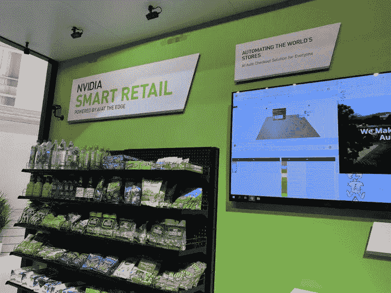
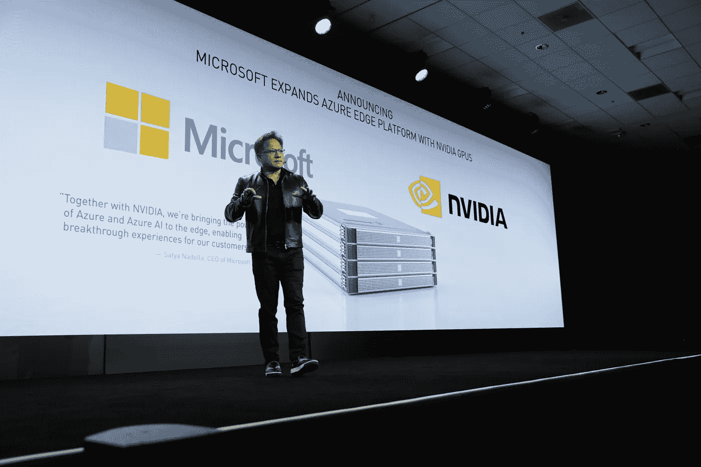

# 2019 年世界移动通信大会:最新的人工智能进展

> 原文：<https://towardsdatascience.com/mobile-world-congress-2019-the-latest-ai-advancements-7af392bf3d?source=collection_archive---------30----------------------->

## 2019 年洛杉矶世界移动通信大会上一些最新人工智能进展的回顾。

(Source: [https://www.iwsinc.com/events/2019/mobile-world-congress-americas-in-los-angeles-october-22-29-2019/](https://www.iwsinc.com/events/2019/mobile-world-congress-americas-in-los-angeles-october-22-29-2019/))

# 介绍

今年 10 月，我有机会参加了在洛杉矶举行的 2019 年世界移动通信大会。在这篇文章中，我将概述一些最新的人工智能公告，以及 5G 网络将如何用于支持人工智能应用。

# 5G 人工智能驱动的应用

## 英伟达 **EGX**

NVIDIA 在世界移动通信大会上发布的最重要的公告之一是 [EGX(边缘计算平台)](https://www.nvidia.com/en-us/data-center/products/egx-edge-computing/)。EGX 是一个高性能的云原生平台，旨在让公司以低延迟从远程位置快速传输数据。许多公司已经决定利用这个平台，一些例子是:沃尔玛，三星和宝马。

> “我们已经进入了一个新时代，数十亿个永远在线的物联网传感器将通过 5G 连接起来，并由人工智能处理。”
> 
> —英伟达首席执行官黄仁勋

EGX 之所以成为可能，得益于三种主要技术的结合:人工智能、物联网和 5G。

*   **物联网:**智能设备如今变得越来越普遍。行业通常使用物联网来远程利用数据，并使用收集的信息做出明智的决策。在工业应用中使用物联网设备的主要问题之一一直是需要实时快速捕获、处理和传输数据。如果这三个要求中的任何一个不能满足，那么我们的物联网设备将无法快速响应环境的变化并将异常情况报告回云。如果您有兴趣了解更多关于物联网设备工作原理的细节，请点击[此处](https://www.freecodecamp.org/news/introduction-to-iot-internet-of-things/)获取更多信息。
*   **人工智能:**在物联网设备中使用 AI 来处理收集的数据。根据应用，捕获的数据可以是许多不同的形式。一些例子是:时间序列数据、摄像机记录和异常检测。在物联网应用中，充分利用运行我们的人工智能模型所需的内存和处理能力变得非常重要。因此，根据应用的不同，可以在本地(如果有隐私相关的问题)或在云上(使我们能够利用更先进的人工智能模型)执行我们的人工智能数据处理。
*   **5G:** 最后，5G 现在可以让我们持续加速物联网设备和云之间的通信。因此，这可以让我们在云上运行更复杂的应用程序，如在线游戏和增强/虚拟现实驱动的应用程序。

英伟达在世界移动通信大会上提供的应用示例之一是智能零售(图 1)。在本例中，摄像机网络用于实时跟踪顾客在购物时挑选购买的商品，持续提升顾客的零售体验。

Figure 1: NVIDIA Smart Retail [1]

此外，NVIDIA 还宣布了与微软的智能边缘计算新合作，将微软 Azure 服务与 NVIDIA EGX 集成在一起(图 2)。

> “通过与英伟达合作，我们将 Azure 和 Azure AI 的力量带到了边缘，为我们的客户带来了突破性的体验。”
> 
> —微软首席执行官塞特亚·纳德拉

如果你有兴趣了解更多关于微软人工智能工具的信息，更多信息请点击[这里](https://www.freecodecamp.org/news/ai/)。

Figure 2: NVIDIA CEO Jensen Huang 2019 Keynote

## 虚拟现实数据可视化

[数据可视化](/interactive-data-visualization-167ae26016e8)是分析大量数据时非常重要的一步。执行数据可视化的一些主要好处是:

*   它可以帮助我们深入了解数据分布背后的动态。
*   深入了解我们的数据可以帮助我们建立更好的机器学习模型。
*   创建图表摘要可以让其他人更容易理解我们的数据调查。

在世界移动通信大会上，不同的公司推出了虚拟现实(VR)驱动的数据可视化工具(例如 [Virtualitics](https://www.virtualitics.com/) 和 [BadVR](https://badvr.com/) )。事实上，由于 5G，现在甚至可以更容易地直播重数据 VR 应用。

虚拟现实创造了一个完全人工的环境，用户可以完全沉浸其中。使用 VR 来可视化数据集可能会增强客户体验，并更好地理解数据集功能(特别是对于蛋白质折叠等医疗应用)。

特别是，Virtualitics 还可以使用其 Python API 与 Jupyter 笔记本集成(如下视频所示)，使每个人都可以创建 ar 数据可视化图表。

Video 1: Virtualitics Python API [2]

如果你正在寻找关于 AR/VR 编程的介绍，你可以在[这是我以前的文章](/getting-started-with-augmented-and-virtual-reality-a51446661c3)中找到更多关于它的信息。

*希望您喜欢这篇文章，感谢您的阅读！*

# 联系人

如果你想了解我最新的文章和项目[，请通过媒体](https://medium.com/@pierpaoloippolito28?source=post_page---------------------------)关注我，并订阅我的[邮件列表](http://eepurl.com/gwO-Dr?source=post_page---------------------------)。以下是我的一些联系人详细信息:

*   [领英](https://uk.linkedin.com/in/pier-paolo-ippolito-202917146?source=post_page---------------------------)
*   [个人博客](https://pierpaolo28.github.io/blog/?source=post_page---------------------------)
*   [个人网站](https://pierpaolo28.github.io/?source=post_page---------------------------)
*   [中等轮廓](https://towardsdatascience.com/@pierpaoloippolito28?source=post_page---------------------------)
*   [GitHub](https://github.com/pierpaolo28?source=post_page---------------------------)
*   [卡格尔](https://www.kaggle.com/pierpaolo28?source=post_page---------------------------)

# 文献学

[1] TechRepublic，英伟达的智慧零售体验——梅西拜仁。访问:[https://www . techrepublic . com/pictures/photos-everything-cool-at-mwc 19-los-Angeles/15/](https://www.techrepublic.com/pictures/photos-everything-cool-at-mwc19-los-angeles/15/)

[2]虚拟化— Python API，虚拟化 sVR。访问地点:[https://www.youtube.com/watch?v=Hf6TlLfjZRA](https://www.youtube.com/watch?v=Hf6TlLfjZRA)