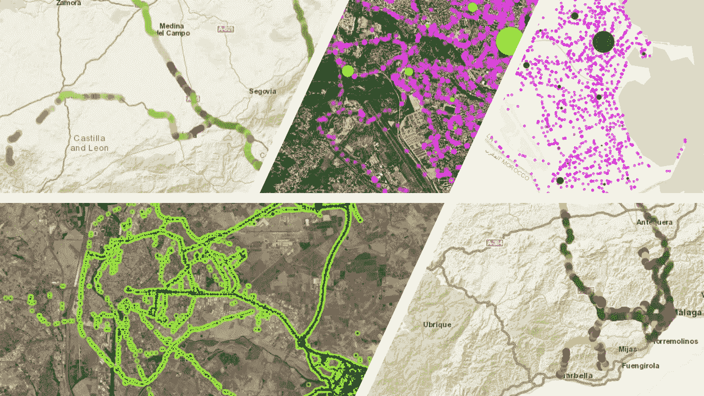
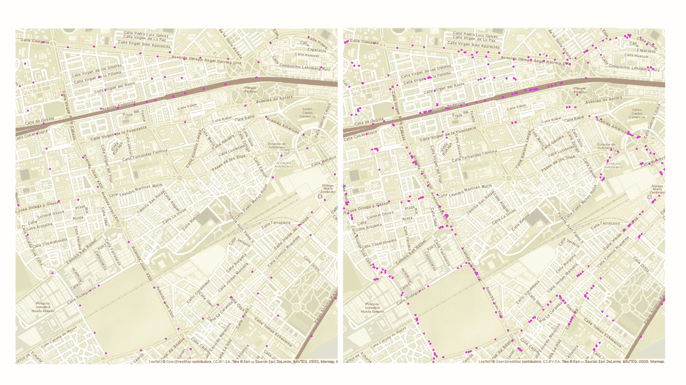
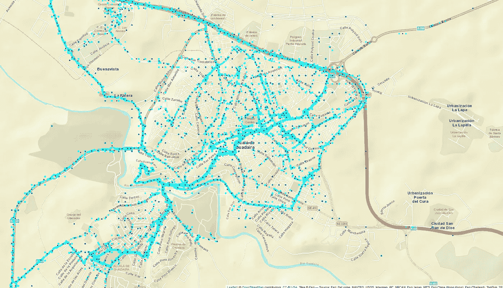

# 移动数据、特征工程和层次聚类

> 原文：<https://towardsdatascience.com/mobility-data-feature-engineering-and-hierarchical-clustering-8199c361eaf2?source=collection_archive---------24----------------------->

美国拥有世界上最大的汽车市场之一，仅次于中国。截至 2017 年，美国道路上有 2.704 亿辆注册车辆，每年发生数百万起车祸。根据国家公路交通安全局的数据，2016 年美国警方报告的机动车碰撞事故估计有 700 万起。这导致 2016 年约 2.07 亿美元的碰撞损失。能够预测司机在未来几个月提出索赔的可能性，为保险公司提供了提前调整保费和计划条款的能力。

将预测分析应用于保险索赔并不是什么新鲜事，但是我们正在见证从传统的、静态的和一般的基于数据的模型(司机年龄、驾照年龄、汽车类型等)的转变。)到基于实际驾驶行为(突然刹车和其他种类的异常驾驶行为指标)的模型。

这种转变主要是由大数据框架的出现及其操纵和分析更大和更少结构化数据集的能力所驱动的。这导致一些公司开始通过使用保险公司安装在受保人汽车中的设备来收集与驾驶模式相关的数据。

# 特征工程

虽然存在许多设备来监控和记录汽车提供的数据，但新旧车型之间可用数据元素的质量存在很大差异。因此，在给定的保险公司的投资组合中，大部分收集的数据可能包含更少的信息，并且数据非常不均匀。在这种情况下，设计一组信息丰富的驱动程序特性来支持 ML 模型是一个真正的挑战；是时候超越直接数据进行思考了…

我们可处理的记录总数约为 1.23 亿条，仅代表 2000 人在从一个月到 18 个月的不同时间段内的旅行。

根据时间戳、坐标和速度，我们构建了*加速度*、*常规行程*(如果驾驶员总是停在相同的坐标，例如往返于工作场所，或者访问许多不同的地方*相似的路线*(如果采用相同的路线去那些地方，即驾驶员总是遵循相似的坐标序列，或者他的行为更随机，遵循不同的路线)。然后，我们查看车辆运行的时间段，以确定它是*周末旅行型驾驶员*、临时驾驶员*还是*高峰时间驾驶员*。*

另一件值得关注的事情是旅行时覆盖的*区域*,并解读司机有许多短途本地旅行和许多公里的长途“直线”旅行。这超出了通常的自动特征工程，并且需要移动性研究的概念，例如回转半径、覆盖的最大面积、基于熵的移动性可预测性等。当然，所有上述数量随后在不同的时间范围内(例如周、天、月)进行观察和总结(平均值、标准偏差、1、2、3 度的峰度..)来创建一组超过 500 个特征。

为了改进我们的建模，我们还通过使用公共 API，利用了在线提供的许多外部数据源。例如，我们包括日出/日落时间的信息，以确定夜间驾驶。公共气象机构提供(在西班牙，研究在西班牙进行，人们可以在 http://www.aemet.es/es/datos_abiertos/AEMET_OpenData 的[访问此信息)](http://www.aemet.es/es/datos_abiertos/AEMET_OpenData))访问地理上不同点的雨、风和温度的历史数据，我们也包括这些数据，以便模拟驾驶条件。

Openstreetmaps 提供了许多其他数据，包括一些道路在不同点的速度限制(尽管必须小心，因为它是一个公共贡献的数据库，因此必须检查数据的完整性)。与谷歌地图地理编码 API 和维基百科提供的数据一起使用，它允许确定道路的名称，以及它们是高速公路还是城市地区。所有这些数据都有助于建立一个更详细的司机档案，独立于汽车能够提供的数据。最后，包括来自汽车测量本身的特征和从公共数据构建的特征，我们构建了一组 1200 个特征，输入到我们的 ML 模型中。

# 熵

超越直接的移动性测量(距离、速度……)的一个方法是从人们的日常习惯来思考。也就是说，从一个物理领域的方法(你走了多少公里，以什么速度)走向一个象征领域的方法(你去了什么地方，多久……)。例如，两个人可以一天走 10 公里，但表现出非常不同的行为；例如，他们中的一个可能从家通勤到工作，而另一个去健身房，然后去工作，然后去他的孩子的学校，然后再回家。因此，这两个个体，尽管具有相同的物理域轮廓，却表现出非常不同的符号域轮廓。另一个例子是，两个人一天去 5 个不同的地方，其中一个人去完全相同的 5 个地方，而另一个人每天都去相同的两个地方，每天在另外三个地方之间交替。

这里的关键概念是个人的可预测性，或者说他的随机性。如果一个人在一天内访问了 5 个不同的地方，而第二个人只访问了 2 个地方，则第一个人更随机，因为他的运动历史包含更高的不确定性(如果必须猜测第一个人在哪里，猜对的可能性是 1/5=0.2，而另一个人是 1/2=0.5)。

现在的问题是，我们如何总结人类流动性的这些维度？在信息论领域，有一个概念可以很好地捕捉到一系列事件中的随机程度，这个概念就是熵。Shannon 熵考虑了事件在序列中的分布，并提供了一个代表“预期惊喜”或随机变量所包含的不确定性的值(在我们的例子中是访问位置的序列)。当随机变量的所有值具有相同的出现概率时，香农熵达到其最大值，也称为哈特利熵。

对于我们的模型，我们包括 Shannon 熵的原始值，并通过 Hartley 熵对每天、每周、工作日、周末和每月聚集的访问和停止点序列进行归一化(个体停止超过 30 分钟的点)。

# 分层聚类

在这个具体的问题中，能够用外部来源扩充数据集的一个关键点是能够过滤掉数据点的数量。事实上，如前所述，日志平均跨度超过一年，大约每 30 秒记录一次数据点(在最好的情况下)，这导致每个驾驶员有数百万个数据点。由于对不同 API 的调用次数和处理 HTTP 请求所需时间的限制，获取数据集中每个点的信息是不可行的。接下来的问题是如何选择获取这些信息的最佳点？

我们解决这个特殊问题的方法是通过集群。然而，存在各种各样的聚类算法，所以下一个问题是使用哪一个？

不用说，有 2000 名不同的司机，分散在西班牙各地，携带不同的数据收集设备，导致有不同的**位置历史，**聚类需要有意义。因此，使用依赖于预定义参数的算法是一个挑战，因为这些参数需要根据不同的情况进行调整。由于这个原因，我们放弃了简单的聚类技术，如 k-NN，因为我们无法知道最终的聚类数。基于密度的聚类算法也被丢弃，因为它们对超参数非常敏感。为了说明这一点，我们进行了一些测试，结果显示在下图中。在左图中，我们看到使用 HDBSCAN(一种基于密度的算法)对用户的行程进行聚类的结果，每个聚类的最小点数等于 2，最小距离等于 10，而在右图中，参数分别更改为 10 和 10。可以看出，对于这个特定的驾驶员和城市区域，结果之间存在巨大差异。因此，基于密度的算法被丢弃，因为它需要在每个场景中为每个驱动程序调整不同的参数集。

Results of clustering a single driver trip with HDBSCAN with two different parameter values

最后，我们转向了层次聚类。这一系列算法只需要集群中各点之间的最大距离来执行任务，我们将所有驾驶员的距离设置为 100 米，因为这是我们想要反映驾驶员行程的粒度。不需要设置其他参数，也不需要设置最终的聚类数或每个聚类的点数。在不同的层次聚类算法中，由于内存限制，我们只关注其中的两种:CLINK 和 SLINK。两者的主要区别在于如何计算聚类之间的距离:SLINK 测量两个前聚类的最近点之间的距离来决定是否合并它们，而 CLINK 测量最远点之间的距离。这样，CLINK 更适合我们的目的，因此我们可以确定没有两个点比阈值更远(使用 SLINK，两个合并聚类的最近点低于 100 m 的阈值，但是我们不知道两个聚类的其余点会发生什么，它们可能更远，从而覆盖具有不同速度限制或道路类型的不同街道或道路)。

下图说明了使用 CLINK 解决我们的问题可以获得的结果。左手边的图像表示特定驾驶员的聚类位置，而右手边的图像是具有所有收集位置的原始图像。可以看出，聚类允许我们在信息损失最小的情况下显著减少点的数量，因为仍然可以识别所有的行程和道路。

Clustering results using CLINK. Light colored points represent the original locations while the dark ones represent the clustered ones.

使用 CLINK 算法，我们可以对附近的点进行聚类，减少冗余，同时在城市级别(需要更近的数据点来描绘整个城市的位移)和公路级别(速度和加速度的变化不太频繁，允许在不损失准确性的情况下更大程度地消除冗余)保持不同的粒度。此外，我们在数据库中引入了空间索引，以便在司机之间高效地共享地理信息。这允许例如将道路类型和速度限制外推至具有非常相似坐标的驾驶员行程，这在某种意义上相当于不同驾驶员之间的聚类。

# 结论

从现实生活场景中成功获得预测分析的关键往往是数据，而不是算法的复杂性。它是关于创造性的，能够提取揭示数据复杂性的创新属性。只有到那时，建模算法才能充分挖掘数据的潜力，并提供最佳预测。

*这项工作由高级数据科学家艾丽西亚·罗德里格斯和* [*GDSLINK*](http://www.gdslink.com) *的首席数据科学家 Florian Lyonnet 完成。*