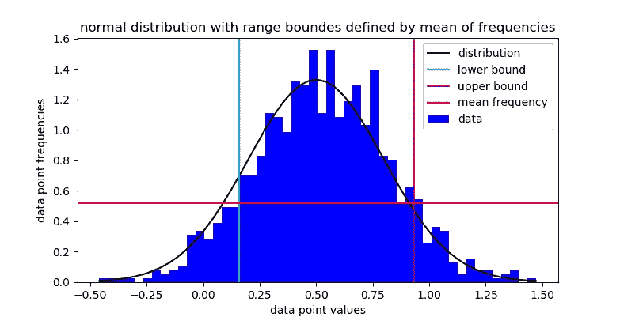
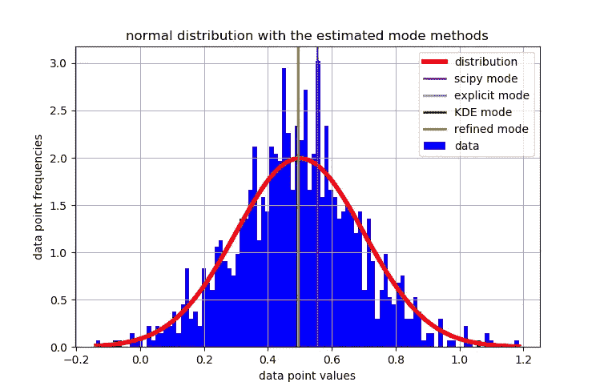

# 模态系列# 1——如何从数据样本中估计整体模态

> 原文：<https://towardsdatascience.com/modal-series-1-how-to-estimate-the-global-mode-from-data-sample-e3e41380bfdb?source=collection_archive---------23----------------------->

## 使用 numpy 和 scipy，通过 KDE 和优化来估计数据集的真实数据外模式。

courtesy of pixabay.com

当寻找数据集[模式](https://en.wikipedia.org/wiki/Mode_(statistics))时，人们自然会使用 [scipy.stats.mode](https://docs.scipy.org/doc/scipy/reference/generated/scipy.stats.mode.html) 。但是，这将仅显示数据中最频繁的成员，即离散模式。这个值不一定是最可能的数据点，令人不安的是，我们的样本数据中可能没有这个值。

在这篇文章中，我们将看到一个简单的方法来估计这个值，假设一个连续的数据空间，和一个**单峰**分布。

**我们来过:**
1。KDE
2。内核方法考虑事项
3。带宽考虑因素
4。优化和方法
5。搜索空间边界、起点和约束
6。事实真相。讨论

请注意，如果您正在寻找一个**多模态**评估，它将单独发布。

## 1.KDE

[核密度估计](https://en.wikipedia.org/wiki/Kernel_density_estimation)用于将数据概率插入密度函数。从 2013 年的 Jake Vander plas nice 帖子中可以看到各种 KDE 包的性能展示及其性能。在这篇文章中，我们将使用[scipy . stats . Gaussian _ kde](https://docs.scipy.org/doc/scipy/reference/generated/scipy.stats.gaussian_kde.html?highlight=gaussian%20kde#scipy.stats.gaussian_kde)进行轻量级实现。

首先，我们需要考虑数据集的大小和维度，因为这种方法计算量很大。

## 2.内核方法注意事项

您可能已经注意到，高斯内核通常是许多实现中的默认内核。然而，如果您正在寻找对您的模态评估的更多控制，我推荐 [scikit-learn 的密度估计](https://scikit-learn.org/stable/modules/density.html)。除了高斯核之外，它还有各种默认的核。此外，它允许各种距离度量。

## 3.带宽考虑

带宽大小对于 KDE 模式估计至关重要。不同的带宽可以用显著不同的值来估计相同数据的模式。这是由于我们数据中的局部密度。带宽越高，KDE 插值越光滑，信息量越少，反之亦然。

然后，我们希望处于一个最佳点，结合我们数据的概率密度的一个信息丰富而又圆滑的表示。谢天谢地，根据经验，我们可以在两个略有不同的函数中进行选择，它们是“Scott”和“Silverman”。
* Silverman —假设高斯分布
* Scott —假设正态分布数据
这两种方法在 *scipy* 中都是默认的。

当处理高度稀疏、偏斜或多模态数据时，应该通过局部密度持久性优化来调整带宽，我将在以后的帖子中介绍这一点。
同时，让我们假设一个有效的 ether a *Scott* 或 *Silverman* 因子的分布。

## 4.优化和方法

为了找到我们数据的模式，我们需要找到概率空间中的最大密度。同样，我们假设一个单峰分布，或者至少对突出的模式感兴趣。

如果怀疑多模态数据分布，局部优化器可能会将结果限制在局部模式。在这种情况下，我们应该使用全局优化器。请注意，全局优化器计算量更大。

在本文中，我们使用 SHGO 作为我们的全局优化器。
如果性能考虑很严格，那么切换到本地优化器。从 [scipy.optimize](https://docs.scipy.org/doc/scipy/reference/optimize.html?highlight=optimize#module-scipy.optimize) 中选择一个适合您的用例。

KDE[PDF](http://Probability_density_function)的 *argmax* 也能给出很好的估算模式。在实现中，在第 6 节中，我们调用一个函数来做这件事，以便将其结果与估计的模式进行比较。它的签名是: *mode_explicit()*

局部优化的一个补充示例基于上述方法，并假设其起点 x0 为 PDF 的 *argmax* 。它的签名是:*refined _ mode _ estimation()*

我们对提出的每种方法进行计时和评级。代码下方的第 6 节给出了一个摘要。

## 5.搜索空间界限、起点和约束

为了搜索和运行时的效率，我们的搜索空间应该被智能地限制，并且起点应该被智能地选择。
理想情况下，可以从数据的先验知识中选择寻找模式的界限，例如，如果我们期望模式接近数据的最小值，我们可以说界限是:[min(数据)，median(数据)]。

如果没有先验知识，我们可以假设界限是值频率超过值频率平均值的极值，即:

Figure 1\. closing in roughly on the distribution region of interest

至于优化的起点，即使优化器 API 可能规定它是可选的，先验知识总是有帮助的。如果您的数据在先前的粗略模式估计值附近足够密集，您可能希望使用样本模式作为 X0，即模式(数据)。如果不假设先验，一般的起始值可以是数据的中间值。

一些优化器允许结合线性和非线性的约束。如果您怀疑数据分布是多模态的，并且确定您所追求的模态在特定的约束空间内，这是一个重要的优势。这种约束可以定义为标准(多项式、指数、三角函数等)或自定义函数。

这篇文章将包含一个一阶多项式的简单约束例子。

## **6。真相**

请注意，这个实现是针对一维特征数组的，即 shape = (N，)

**进口、KDE 和模式估计函数:**

现在，让我们绘制一些随机数据分布，看看每个模式估计器在哪里找到它的目标。

Figure 2\. showing mode estimators results on the data distribution

**打印输出:模式估计器发现的结果**
实际模式为 0.5
模拟模式:0.555
模式 _ 显式模式:0.495
模式 _ 估计模式:0.49450735297344983
精确模式 _ 估计模式:0.494507269722724

看上面的图，提出的方法似乎有重叠，并且非常接近真实的分布模式。然后，我们希望看到这个测试在不同的数据上执行多次，并查看每种方法的统计数据。我们还可以很容易地检查每种方法的平均运行时间，以适应可用性。这是通过下面的代码完成的。

**打印输出:每个估计器**
————————
scipy _ mode _ error
平均运行时间:0.000201535701751709【秒】
—————————————————

**————————
PDF _ mode _ error
平均运行时间:0.021175224542617797【秒】
———————————
MAE:0.027330000000000**

**——————————KDE _ 模式 _ 优化 _ 误差
平均运行时间:0.002447342872619629【秒】
————————————
平均运行时间:0.027139275371412374【平均运行时间**

**— — — — — — — —
精炼 _ mode _ 模式 _ 优化 _ 误差
平均运行时间:0.02179007077217102【秒】
———————————
平均运行时间:0.0273878963979849【平均运行时间**

## **7.讨论**

**在*模态系列*的第一章中，我们处理一个单峰分布估计。KDE 是一个信息丰富的工具，我们可以用它来达到我们的目标，而且有不止一种方法。**

**我们使用一维数据来解释我们的技术，但是它适用于任何更高维度——考虑到 API 的限制。当然，维度越高，这个过程的计算量就越大。关于高维度的另一件事——它对内核带宽更敏感，这可能导致更稀疏的密度。一个很好的经验法则是使用标准的*斯科特*或*西尔弗曼*规则*。***

## ****你可能也会发现这些很有启发性****

 **[## Python 中的核密度估计

### 上周，迈克尔·莱纳发表了一篇关于直方图和核密度估计之间关系的精彩解释…

jakevdp.github.io](https://jakevdp.github.io/blog/2013/12/01/kernel-density-estimation/)**  **[## 直方图和核密度估计 KDE 2

### 你可以在这里下载整篇文章作为 Jupyter 笔记本。众所周知，直方图是一种非常常见的方法…

mglerner.github.io](https://mglerner.github.io/posts/histograms-and-kernel-density-estimation-kde-2.html)** ** [## 模态测试和核密度估计

### 当处理大量可能具有不同数据分布的数据集时，我们面临着…

towardsdatascience.com](/modality-tests-and-kernel-density-estimations-3f349bb9e595) 

**本系列的下一步——基于 KDE 的多模态估计**

我要感谢奥利·科恩 对我的宝贵评论、校对、编辑和评论。**