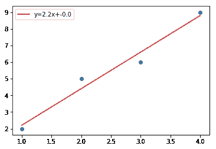
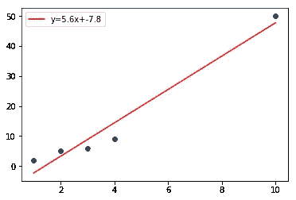
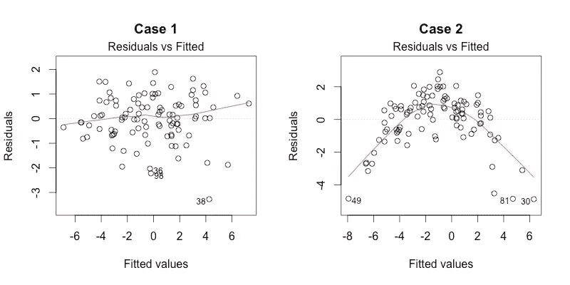
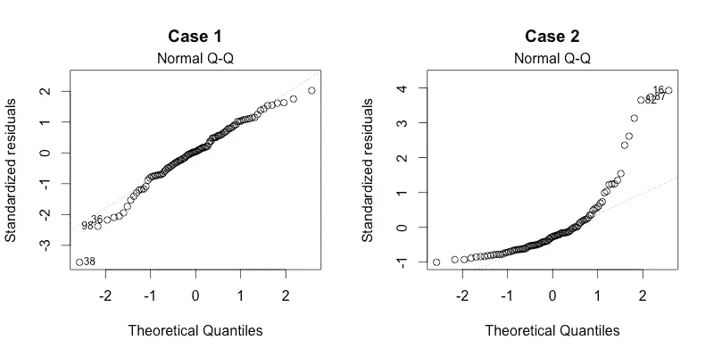
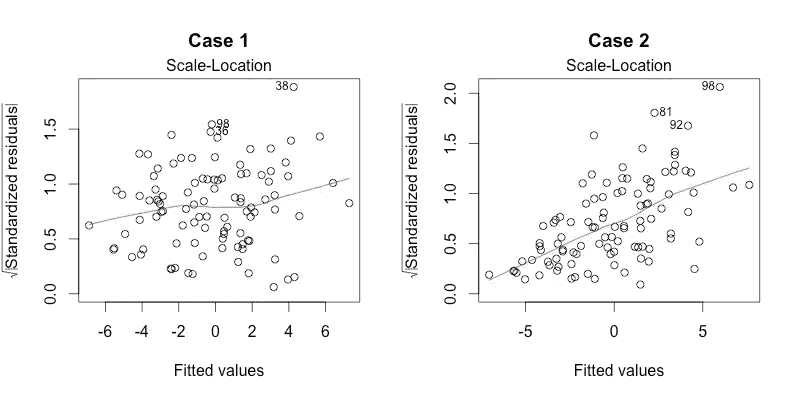
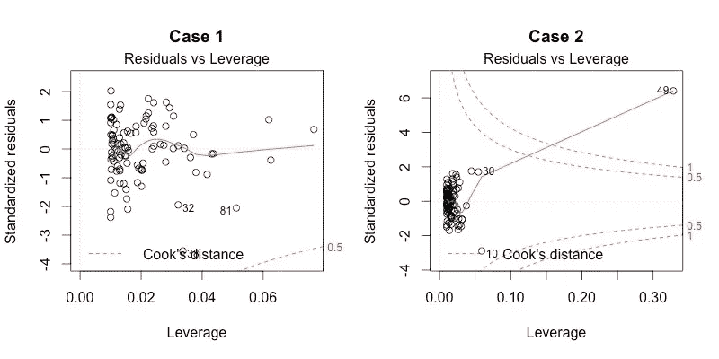
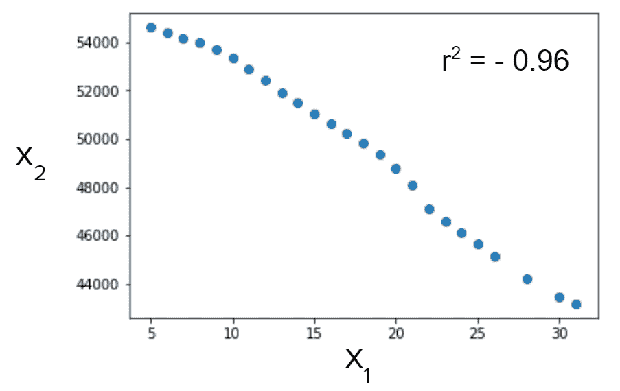

# 如何解决下一个回归问题

> 原文：<https://towardsdatascience.com/model-assumptions-for-regression-problems-e4591af44901?source=collection_archive---------19----------------------->

Photo by [Campaign Creators](https://unsplash.com/@campaign_creators?utm_source=unsplash&utm_medium=referral&utm_content=creditCopyText) on [Unsplash](https://unsplash.com/search/photos/graph?utm_source=unsplash&utm_medium=referral&utm_content=creditCopyText)

## 您的下一个回归模型要考虑的关键思想

汤姆·奥尔波特，杰米·王，杰克·斯塔尔福特

本文将介绍一些在构建回归模型时需要考虑的想法。为了生成适合您的数据的回归模型，您需要检查几个假设，并测试异常值和多重共线性。读完这篇文章后，你应该对如何实现一个合适的回归模型有一个更好的想法。

当在数据中寻找关系时，仅仅拟合回归并期望最好的结果是没有用的。为了使模型准确，线性回归有许多需要满足的假设。一些常见的假设是:

*   **线性**:因变量和预测变量之间存在线性关系。如果不存在线性关系，那么线性回归就是数据的不准确表示
*   **无多重共线性**:预测变量不在同一直线上，这意味着它们不高度相关
*   **无自相关**(时间上的序列相关):自相关是指一个变量在整个观测中与自身相关
*   **同方差**:残差中没有模式，意味着方差是常数
*   **正态分布**:残差、自变量和因变量必须正态分布
*   **残差平均值为零**，表示数据均匀分布在回归线上

# 数据集分布

线性回归模型的第一个假设是自变量或预测值(X)和因变量或结果(y)具有线性关系。

线性回归假设自变量和因变量是正态分布的，这可以用许多不同的方法来检验；最简单的方法是观察值的直方图。其他检验正态性的方法包括拟合优度检验、夏皮罗-维尔克检验，这些都是数值检验，或者生成 Q-Q 图来检验正态性。

有时，由于中心极限定理，30 或更大的**样本量**是确定正态性的阈值，该定理指出，当样本量至少为 30 时，添加独立且同分布的随机变量将导致正态分布，即使随机变量本身不是正态的。

然而，最小样本量没有真正正确的答案(许多人使用 50 + 8k，其中 k 是模型中参数的数量)。样本大小也是拟合度和时间/成本之间的权衡。没有足够的样本将导致回归线拟合不佳，但更多的样本需要投入时间和金钱来收集数据。

然而，预测变量和响应变量不一定是正态的。非正态分布的数据集可以通过对其应用变换来修复，以便使其正常。如果数据集由于异常值的存在而偏斜，那么这些点也必须被适当地处理以恢复正态性，这可以通过分布图来实现。

线性回归中的残差被假设为正态分布。非正态残差分布是数据集存在“错误”的主要统计指标，可能包括缺失变量或非正态自变量/因变量。

此外，还假设残差方差是同方差的；假设残差具有恒定的方差。这很重要，因为它证明了误差是均匀分布的，这意味着线性回归是数据集中所有点的“最佳”拟合。异常值会影响残差的正态性，因为每个数据点都会将直线移向异常值。因此，查看残差是线性回归线拟合程度的最佳指标，如果有任何正态性问题，我们应该做些什么来修复它。

# 极端值

离群值是数据集中不遵循该数据集预期趋势的点。异常值有能力改变回归的斜率。对于线性回归，斜率的这种变化会对输出产生影响，因为变量的影响已被点扭曲。

当考虑异常值时，我们需要考虑它们的影响，这是由点的杠杆和残差决定的。**杠杆**是该点离数据集中心的距离，该点离中心越远，杠杆越高，是一个介于 0 和 1 之间的数字。

Points with low leverage

Point on far right has high leverage

看上面的图，我们可以看到，图 1 中最右边的点比图 2 中最右边的点具有更小的杠杆作用，因为离这些点的中心的距离更大。

为了查看某个点是否是异常值，我们还检查了该点的残差值。**残差**被定义为数据集中每个点距离真实值的距离。

然而，这些值因数据而异，解释学生化(标准化)残差可能更容易。

**影响**是点对回归斜率的影响。具有高杠杆的点有可能对回归的斜率有更大的影响。考虑两个人坐在跷跷板上，这个人坐得离中心越远，就越容易在跷跷板上上下移动，但是这个人的质量也很重要。数据集的大小也会影响离群值的影响，数据集越大，离群值的影响就越小。计算点影响的常用方法是库克距离。

一旦你确定数据集中有异常值，有几种方法可以有效地处理它们。第一个选项是**从数据集中移除点**。这有利于完全消除该点的影响。但是，如果数据集很小或该点具有高杠杆作用，则应考虑替代方法，因为它也可能将偏差引入回归，并在数据中找到错误的关系。另一种方法是**给点分配一个新值**，比如相似值的平均值，这就是所谓的插补。这种方法通常在已知值不正确的情况下使用，在使用的数据集很小的情况下非常有用，因为它不会删除值。另一种方法是**转换整个数据集**，而不是使用记录的值。当已知异常值是该点的真实值并且该点具有高杠杆时，这可能是有用的。

# 诊断图

诊断图通常以 4 种不同的方式绘制残差趋势，对于验证是否满足线性回归的假设非常有用。在本节中，我们将介绍每个情节。

## 残差与拟合图

残差与拟合图主要用于检查自变量和因变量之间的关系确实是线性的。良好的残差与拟合图在水平线周围具有相当随机的残差散布，这表明该模型充分解释了线性关系。

在上图中，案例 1 是一个“好”模型的好例子，因为通过点的线接近水平。案例 2 显然是一个抛物线拱，这表明自变量和因变量之间还有一些其他的关系没有被探究。

## 正常 Q-Q 图

正态 Q-Q 图检查残差的正态性。假设一个好的线性回归模型的主要假设之一是残差的正态性，这个图可以告诉我们很多变量之间的关系，如前所述。一个“好的”线性回归模型会有接近虚线的残差，就像案例 1 一样。显然，情况 2 有明显的问题，因为残差不遵循线性模式，而是指数模式。

## 比例位置图

也称为分布位置图，比例位置图检查残差的同方差。如前所述，验证残差的方差保持不变可确保生成良好的线性回归模型。一个“好”的模型将在一条水平线周围随机散布，表明方差保持不变。情况 1 是一个很好的例子，而情况 2 表明，随着点慢慢变得更远，残差的方差逐渐增加。

## 残差与杠杆图

残差与杠杆图允许我们找到显著影响线性回归线的情况。为此，该图生成一条指示库克距离的线，库克距离被定义为当从回归模型中移除一个观察值时回归模型中所有变化的总和。库克距离之外的任何一点都被认为是有影响的。库克距离的一般临界值是 0.5。一个点的库克距离得分越大，对回归线的影响越大。这种方法非常善于识别异常值和杠杆点。

在查看该图时，我们只想删除位于库克距离之外的任何数据点。例如，在情况 1 中，在指示库克距离的虚线之外没有点，因此不需要移除任何异常值或利用点。然而，在情况 2 中，有一个数据点远在库克的距离阈值之外，表明它是一个高影响点，应该被处理。

# 多重共线性

关于线性回归模型的一个大假设是我们的预测变量是独立的。这意味着每个预测变量不依赖于任何其他自变量。只有响应变量会这样做，这就是为什么它也被称为因变量。

然而，假设我们有一个模型，我们绘制两个预测值的图表:

这些变量看起来并不独立，但我们假设它们是独立的。所以我们的假设没有实现。当两个或多个我们假设独立的变量实际上相互依赖时，我们就有多重共线性。

多重共线性主要有两种类型。一种叫做“结构多重共线性”。这是我们在旧的预测变量的基础上建立新的预测变量的时候。一个常见的例子是从 X 中得到一个预测变量 X，很明显 X 和 X 是相关的，那么我们如何解决这个问题呢？一种方法是从模型中去掉 X。但是有些二次模型需要这个平方分量。所以我们做了一件事叫做集中预测。为了确定预测值的中心，我们找到 X 的平均值，并从我们的观测值中减去它。这导致大约一半的观察值为负值，但是当我们对 X 求平方时，我们仍然会得到正值。所以现在 X 对 X 的图形是抛物线的形状，降低了两个预测值之间的 R。

多重共线性更常见的形式称为“基于数据的多重共线性”。当看似不相关的变量相关时，就会发生这种情况。在第一种形式的多重共线性中，X 与 X 相关，因为它是 X 的函数。但是，如果我们期望独立的变量(如脉搏和体表面积)相关，则我们有基于数据的多重共线性。这种类型是最常见和最有问题的，发生这种情况有两个主要原因。一种是当收集数据的人仅仅依赖观察数据，而不是混合观察数据和实验数据。另一种更广泛的情况发生在设计不良的实验中，这意味着研究人员收集数据的方式使得某些变量可能会相互影响。

我们知道什么是多重共线性，但是为什么这对我们的模型来说是个问题呢？假设我们试图用变量 X₁、X₂和 X₃.来预测 y

如果我们只基于 X₁和 X₂建立一个模型，我们得到 y = 4 + X₁+ 3X₂.相反，如果我们基于 X₁和 X₃建立一个模型，我们得到 y = 5–5x₁+7x₃.注意到系数是如何变化的吗？这些模型仍然准确地预测 y，但是它们以一种非常不同的方式进行。所以多重共线性给你的模型带来的主要缺陷是一个变量的影响不能被孤立。更确切地说，多重共线性不影响模型的准确性，它使得很难找到一个变量的影响。在我们的第一个模型中，X₁增加一个单位导致 y 增加一个单位，但是我们的第二个模型中，X₁增加一个单位导致 y 减少 5 个单位。因此，如果您的目标只是建立一个模型来预测某件事，多重共线性可以忽略不计。但是，如果您想要了解每个变量对因变量的影响，就需要解决多重共线性问题。

我们知道什么是多重共线性，以及它如何影响我们的模型，但是我们如何检测它呢？一种方法是绘制每个变量之间的相关系数图，并寻找高的相关系数。但是这种方法假设一个变量只能依赖于另一个变量。如果多个预测因子之间存在更复杂的关系，比如 X₁= 2X₂ + 3X₃，会怎么样？检测多重共线性的一种更好的方法是称为方差膨胀因子(VIFs)的方法。

如果存在多重共线性，每个模型之间的系数会有很大差异。如果一个模型只有一个自变量，那么该变量系数的方差最小，它被称为基线方差。如果我们将那个独立变量与所有其他独立变量进行回归，就可以创建另一个模型。这个模型会有一定的 R 值。可以看出，基线方差增加了一个因子，该因子由包含该大回归的 R 的方程给出。

这被称为 VIF，它可以针对每个独立变量进行计算。小于 4 的 VIF 被认为是好的:假设该变量没有多重共线性。介于 4 和 10 之间的 VIF 表明变量之间可能存在多重共线性，可能需要进行一些调查。高于 10 的 VIF 是模型中变量间多重共线性的强有力指标。

这些 Vif 可用于校正多重共线性。做到这一点的一个方法是去除一些具有高 VIF 的预测值。如果这些变量只是因为我们有科学理由让它们留在那里而不能被移除，我们仍然有一些选择。我们可以为高 VIF 的预测者收集更多的数据，然后根据这个新的更完整的数据集重建波动率指数。如果这仍然不能改变它，那么我们将不得不删除一些变量。

# 结论

现在，我们已经看到了在拟合回归模型时应该考虑的几种方法，它们将有助于提高模型的性能。

# 关键词汇

残差、拟合值、QQ 图、多重共线性、样本大小、杠杆、影响、异常值、库克距离、VIF