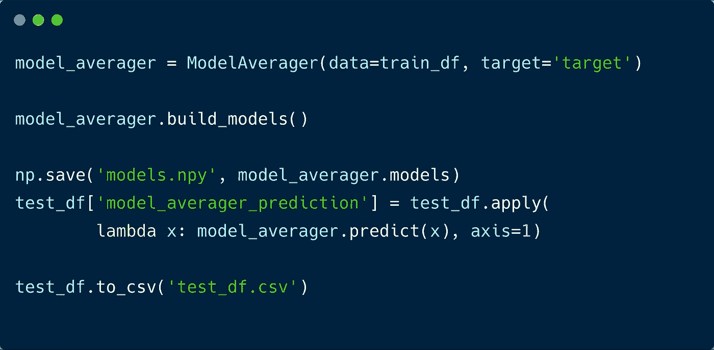
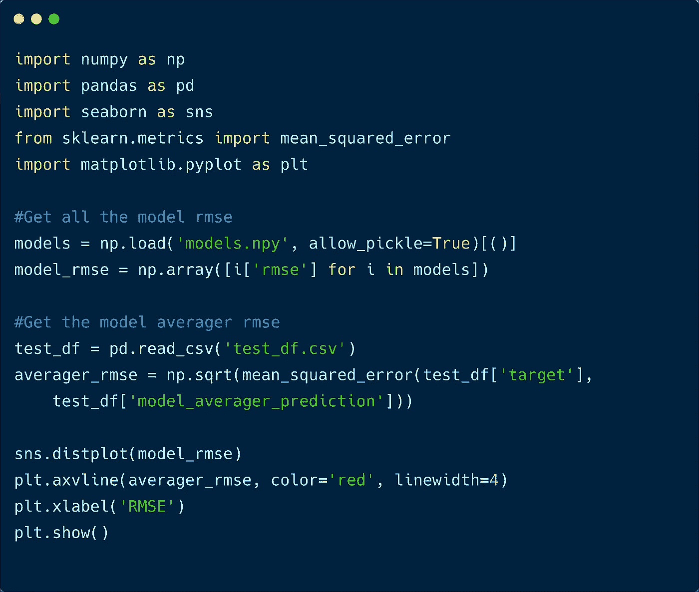

# 模型平均:一种处理模型不确定性的稳健方法

> 原文：<https://towardsdatascience.com/model-averaging-a-robust-way-to-deal-with-model-uncertainty-a604c4ab2050?source=collection_archive---------10----------------------->

## 模型平均的介绍，使机器学习预测对模型条件较差的数据不太敏感。

Everyone is working individually, then through consensus amongst them, they are coming up with better work. Photo by [You X Ventures](https://unsplash.com/@youxventures?utm_source=unsplash&utm_medium=referral&utm_content=creditCopyText) on [Unsplash](https://unsplash.com/s/photos/working-together?utm_source=unsplash&utm_medium=referral&utm_content=creditCopyText)

在我们的机器学习模型中，我们试图根据描述符值来映射预测器，以模拟生成该值的底层函数。然而，如果我们的数据不能很好地代表数据的真实分布，那么我们的模型将不会像我们希望的那样有效，这是由于对不良数据的限制。例如，一个简单的线性回归模型的参数(如斜率和截距)取决于我们用来拟合模型的数据。因此，我们的模型的通用性很差。

当模型的不确定性很高并且会干扰预测的质量时，如何建立稳健的预测模型？解决这个问题的一个方法是在许多模型之间达成共识。这个想法是，当我们试图建立预测模型时，一些模型将正好适合预测点，而一些将高估或低估。通过对所有模型进行平均，我们可以消除高估和低估。特别是在大量模型的限制下，我们可以应用中心趋势定律，该定律指出，随着数值越来越多，概率分布接近中心平均值。因此，如果我们可以建立许多模型，并对它们取平均值，我们可以预期最终的预测比单个的预测更稳健。在本练习中，我们将看到这种近似有多好。

> 整体大于各部分之和。

像往常一样，我们首先加载数据。在这个练习中，我们将使用 *sklearn.datasets.* 中的**波士顿住房数据**

Loading the Boston data and splitting it into training and testing dataframe

现在，为了实现模型平均，我们将使用 RMSE(均方根误差)作为模型拟合度。然后我们将使用以下公式对它们进行平均，

Model averaging formula

这里，我们将用模型 *i* 的平方 RMSE 的倒数来加权模型 *i* 的预测 y。现在，让我们写一个类来简化我们的工作，

Model averager class

在上面的代码中，我们可以使用任何估计器，比如 *KernelRidge* 等等，但是我使用了简单的 *LinearRegressor* ，因为它在计算上更便宜。此外，我使用样本方差来计算 RMSE，但如果我们想要近似总体方差，我们可以使用留一估计，这也是计算密集型的。现在，我们有一个代码来完成模型平均。让我们在数据上实现它，

Compiling model data and then making a prediction on test data

在这里，我们首先建立所有的模型，然后根据我们的测试数据进行预测。现在，让我们看看我们的模型平均性能有多好:

Script to plot the histogram of the RMSE value of different models

运行这个脚本将产生下面的图，

Histogram of all the model RMSE and model averager RMSE

我们可以看到，我们的模型平均性能，正如预期的那样，位于所有其他模型的中间。有不同的方法来提高模型平均器的性能，例如我使用的方案可以改进，我们可以对几个最好的模型进行平均，而不是对所有的模型进行平均(我打算在以后的文章中讨论这些)。虽然性能似乎不如我们所希望的那样令人兴奋，但是这种方案对于模型的不确定性将是非常鲁棒的(以可以忽略的精度为代价)。