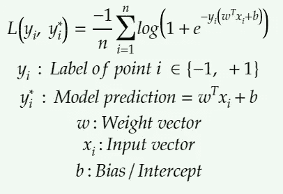
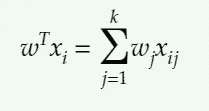
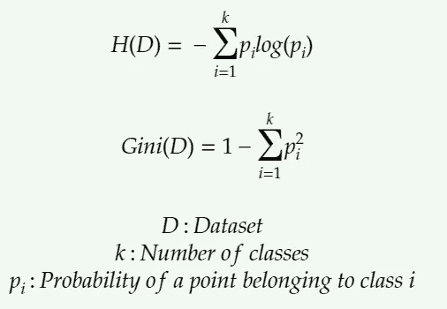
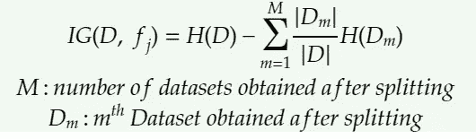
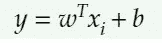
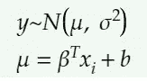
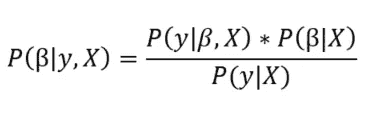

# 基于模型的特征重要性

> 原文：<https://towardsdatascience.com/model-based-feature-importance-d4f6fb2ad403?source=collection_archive---------6----------------------->

## 从模型参数中提取重要特征的技术

在之前的一篇文章中，我讨论了一种称为前向特征选择的模型不可知的特征选择技术，它基本上提取了所选 KPI 的最优值所需的最重要的特征。但是它有一个警告——很大的时间复杂度。为了避免这个问题，可以从被训练的模型中直接获得特征重要性。在这篇文章中，我将考虑 2 个分类和 1 个回归算法来详细解释基于模型的特征的重要性。

## 逻辑回归

这是一种固有的二进制分类算法，它试图在 k 维空间中找到分隔两个类别的最佳超平面，从而最小化逻辑损失。

Logistic loss expression

k 维权重向量可用于获得特征重要性。w_j 的大正值表示第 j 个特征在正类预测中的较高重要性。较大的负值表示负类预测的重要性较高。这从物流损耗的表述就可以看出来。SGD 通过为在预测数据点属于正类和负类时更重要的特征设置学习大的正权重来减少损失。

为了说明上述概念，让我们尝试从具有 9 个属性的[玻璃识别数据集](https://archive.ics.uci.edu/ml/datasets/Glass+Identification)中提取前 4 个特征，即

1.  折射率
2.  % Na 含量
3.  %毫克含量
4.  铝含量%
5.  硅含量%
6.  % K 含量
7.  %钙含量
8.  % Ba 含量
9.  铁含量%

都是实值的。完整的代码可以在[这里](https://github.com/vishu160196/Feature-importance)找到。

目标是根据上述特征，从 7 个类别中预测玻璃的类型。为了使事情简单易懂，只选择了属于 2 类的点。这给我们留下了一个二元分类问题，使得逻辑回归成为解决这个问题的理想选择。

最终数据集有 146 个点，每个点有 9 个属性。目的是预测给定的玻璃成分是浮法加工的还是非浮法加工的。EDA 揭示了特征之间的比例差异，因此最小-最大比例用于挤压区间[0，1]中的所有特征值。

接下来，使用 C 上的网格搜索来搜索最佳超参数(该术语乘以逻辑损失，在此处找到更多)。最好的超参数提供 0.54 的对数损失和大约 70%的准确度。考虑到我们仅有的少量数据，这还不错。

为了方便起见，这里列举了使用 SGD 学习的参数发现的最重要的特征。

## 随机森林分类器

随机森林是一个使用决策树作为基础学习器的集成模型。基础学习者是高方差、低偏差的模型。通过汇总所有基础学习者做出的决策来预测响应变量，减少了整个模型的方差。这个想法是为了确保每个基础学习者学习数据的不同方面。这是通过行和列采样实现的。在分类设置中，聚合是通过采取多数表决来完成的。

在决策树的每个节点，基于信息增益(例如)或计算成本更低的基尼系数杂质减少来决定用于分割数据集的特征。将 I.G .最大化(或 Gini 杂质减少)的特征被选择作为分裂特征。然后根据分割特征的值将数据分割到其子代中。如果要素是分类的，则属于分割要素的每个类别的数据都将归属于一个单独的子要素。在数字特征的情况下，该特征的最佳阈值(用于决定将该特征用作分割特征的阈值)用于将数据分割成两部分，每部分归一个子代。

f_j is chosen as splitting feature

由于某个特征在决策树的所有级别上相加而得到的信息增益决定了该特征的重要性。这也可以从这样的事实中看出，在每个节点上，在最大化信息增益的特征上进行分裂。

随机森林包括多个决策树，因此特征 j 的特征重要性是由特征 j 在所有树上产生的 I.G .的归一化和。让我们回到玻璃识别数据集，看看随机森林认为哪些特征是重要的。

在解决这个任务时，随机森林的表现明显优于逻辑回归。它给出了 90%以上的准确性和 0.22 对数损失。Scikit-learn 的随机森林模型有一个 feature_importance_ attribute，它给出了由每个特征在所有级别上导致的基尼系数杂质减少值，该值在所有树之间进行了标准化。这里唯一感兴趣的超参数是基础学习者的数量。执行网格搜索，给出 33 个基础学习者作为最佳值。随机森林很少过度适应，通常，它们会随着基础学习者数量的增加而饱和，增加计算开销而不降低性能。这里总结了结果。

## 贝叶斯线性模型

首先简单介绍一下贝叶斯模型，以及它们与常用的传统机器学习模型(也称为频繁模型)的区别，如 KNN、逻辑回归、SVM、决策树等。我们大多数人都习惯于这样

Inference using frequentist model

贝叶斯模型不是对给定的输入预测 1 个输出，而是给出一个分布，从中可以对输出进行采样。贝叶斯模型通过给出响应变量的概率分布来显示其不确定性。通常，响应变量被建模为高斯型。

Inference using Bayesian model

这里 **β** (模型参数或权重向量)也是从分布中采样的——每个参数一个。如这里的[所述](/bayesian-linear-regression-in-python-using-machine-learning-to-predict-student-grades-part-2-b72059a8ac7e)，目标是在给定输入 X 和输出 y 的情况下，确定模型参数的[后验概率分布](http://www.statisticshowto.com/posterior-distribution-probability/)

Courtesy: [Will Koehrsen](https://towardsdatascience.com/@williamkoehrsen?source=post_header_lockup)

后验概率分布是通过使用像[马尔可夫链蒙特卡罗](/markov-chain-monte-carlo-in-python-44f7e609be98) (MCMC)这样的采样方法进行采样来估计的。随着更多样本的抽取，估计值收敛到真实值。

从后验分布获得的模型参数的平均值可用于对它们进行点估计，进而对响应变量的正态分布的平均值进行点估计。响应变量本身可以用它的平均值来估计。这些估计的确定性取决于个体分布，并随着输入模型的数据量的增加而增加。模型权重可以用类似于线性回归或逻辑回归的方式来解释。特征权重的绝对值越高，其重要性越大。在两个或更多特征具有相似权重的情况下，其值如其分布所指示的那样更确定的特征应当被给予更高的重要性，因为模型对其值比对其他特征更有信心。

使用上述见解，让我们检查在给定一堆关于电子设备的信息的情况下，哪些特征对于预测电子设备的公布评级更重要。数据集可以在[这里](https://archive.ics.uci.edu/ml/datasets/Computer+Hardware)找到。使用 2 条链和 2000 次后验抽取，获得以下分布

由于数据非常少(167 个训练点),我们有一个高标准偏差，显示出高模型不确定性。随着数据的增加，也就是说，随着我们收集更多的证据，模型估计值会提高，并最终超过先验值，在这种情况下，假设先验值为高斯型。对于无限数据，贝叶斯模型收敛于 frequentist。平均权重值用于获取特征重要性。

这个帖子到此为止。请在评论区告诉我其他提高功能重要性的好方法。下次见…再见。

## 来源

1.  [https://towards data science . com/贝叶斯线性回归简介-e66e60791ea7](/introduction-to-bayesian-linear-regression-e66e60791ea7)
2.  [https://towards data science . com/Bayesian-linear-regression-in-python-using-machine-learning-to-predict-student-grades-part-2-b 72059 A8 ac7e](/bayesian-linear-regression-in-python-using-machine-learning-to-predict-student-grades-part-2-b72059a8ac7e)
3.  [https://github . com/WillKoehrsen/Data-Analysis/blob/master/Bayesian _ lr/Bayesian % 20 linear % 20 regression % 20 project . ipynb](https://github.com/WillKoehrsen/Data-Analysis/blob/master/bayesian_lr/Bayesian%20Linear%20Regression%20Project.ipynb)
4.  [https://wise odd . github . io/tech blog/2017/01/05/Bayesian-regression/](https://wiseodd.github.io/techblog/2017/01/05/bayesian-regression/)