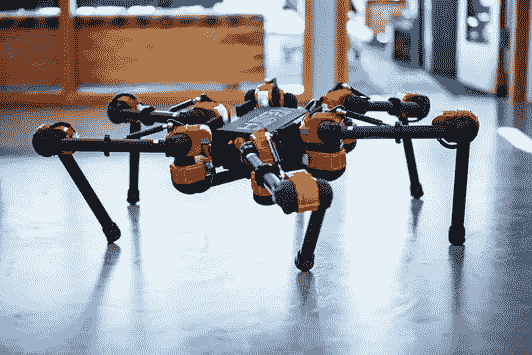
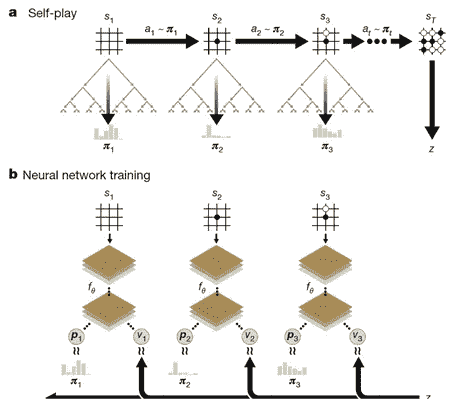
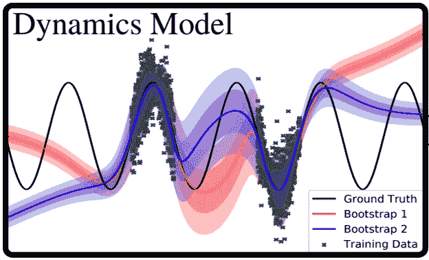

# 基于模型的策略优化

> 原文：<https://towardsdatascience.com/model-based-policy-optimization-d7e099c73d8?source=collection_archive---------9----------------------->

## 回顾基于模型的强化学习的最新进展。

[source](https://encrypted-tbn0.gstatic.com/images?q=tbn:ANd9GcTC7gvgcU-JJUWSjZBnBfZ-L8fLOGORnPHhAKOvJ_AqqadshQgk)

**简介**

由于在 Atari 等视频游戏、Mujoco 等模拟机器人控制环境以及象棋、围棋和扑克等游戏中取得了一些惊人的成功，深度强化学习近年来获得了很大的声誉。大多数 RL 成功案例的一个显著特征是使用模拟环境，通过反复试验实现高效的数据生成。这一点非常重要，因为大多数先进的 RL 算法需要大量数据来实现其出色的性能，通常需要与环境进行数亿次交互，有时甚至数十亿次。

这种样本低效的一个关键原因是，大多数最先进的 RL 算法属于**无模型**家族，这意味着它们是非常通用的学习算法，假设没有环境或奖励函数的知识，使它们完全依赖于直接交互。这显然与我们人类学习执行任务的方式非常不同，因为我们可以在尝试执行任务之前，使用我们的经验来想象我们的行动和计划的结果。例如，当一个人试图走过潮湿的地板时，他可能会在第一步滑倒，但会迅速调整他的内部模型，即脚的位置和移动方向如何影响稳定性，并很可能在接下来的步骤中表现得更好。与无模型算法不同，我们不只是尝试不同的行走方式，并使用反馈(我们是否摔倒)来最终找出正确的方式。

但是，如果那些通用的无模型算法在这些困难的任务上工作得如此之好，为什么还要费心去做其他的事情呢？这是因为并不是所有的事情都可以容易可靠地模拟，在许多真实世界的用例中，我们的模拟不够精确，以至于我们无法在目标环境中部署使用它们训练的模型。这种情况的一个明显的例子是机器人控制和规划，因为即使简单的机器人系统也无法精确模拟，更不用说复杂的机器人系统了。但是，即使我们能够创建精确的模拟，这也可能是一项重大的任务，并且只适用于特定的机器人模型。弥合模拟机器人和真实机器人之间的差距是一个活跃的研究领域，我之前已经[写过一些有趣的想法。](/reinforcement-learning-for-real-world-robotics-148c81dbdcff)

在这些环境中，我们没有可靠的模拟，或者运行模拟非常耗时或昂贵，我们不能希望使用需要与环境进行十亿次交互的学习算法，因为这将花费令人望而却步的时间量或不可接受的成本。看来我们可以从不同的范例中获益。

[source](https://media.wired.com/photos/5cdef8edc24878aa12b12536/master/w_2400,h_1600,c_limit/Facebook-Robots-03.jpg)

**基于模型的规划**

如果我们正在解决一个我们实际上知道模型或者有足够好的近似的问题呢？我们能利用这些知识做出更好的决定或学习更好的政策吗？这实际上是自动规划、组合优化和控制等领域中非常常见的情况。在许多控制应用中，由于特定问题的领域知识(通常以线性模型的形式)，我们可能有一个近似的动态分析模型，这允许我们使用模型预测控制(MPC)等技术提前进行规划。

在 MPC 中，我们提前计划一个固定的时间范围，使用我们的近似模型来“模拟”我们的系统由于我们采取的行动而转变到的状态。假设我们希望飞机遵循目标轨迹，我们可以使用我们使用我们的模型(具有可以随机选择的一些初始动作)推出的状态和目标轨迹中的状态之间的距离之和，并且获取成本函数关于动作的导数(因为成本函数和近似模型都是可微分的)，并且使用梯度下降最小化成本函数。在这种情况下，我们不是在学习一个策略(尽管如果我们愿意，我们可以尝试拟合一个模型来预测优化的操作)，而是使用我们的模型来计划。

另一种方法可以是使用我们已知的模型来学习策略，这种情况的一个非常著名的例子是 AlphaGo Zero (AGZ)。在 AlphaGo Zero 中，我们有一个完美的游戏模型；我们非常清楚给定一个动作时游戏棋盘的状态是如何变化的，并且可以在树搜索算法中使用这些知识，例如蒙特卡罗树搜索(MCTS)。

[source](https://louishenrifranc.github.io/img/2017-10-23-alphago/thumbnail.PNG)

在 AlphaGo Zero 中，我们试图学习 MCTS 算法中使用的策略和价值函数，而 MCTS 搜索结果又被用来改进策略。这是可能的，因为我们可以“向前看”,并在实际采取行动之前，对我们的政策可能产生的后果进行推理。这一过程被证明是非常有效的，由此产生的系统可以通过从与自己的比赛中学习，在与世界上最强的选手的比赛中获得超人的表现。

**基于模型的强化学习**

如果我们甚至在不知道模型的问题中也能实现上述好处，那会怎么样？毕竟，环境模型是从一个状态-行动到下一个状态和回报的转移概率的函数映射，因此，也许我们可以从与环境的交互中学习该函数，并将学习到的模型应用于提前计划或生成大量的“模拟推出”以改进我们的政策，从而减少与真实系统的交互(这是昂贵的)。我们的代理可以与环境交互以收集真实数据，并使用监督学习方法来拟合转换函数和报酬的模型。一旦我们有了一个好的模型，我们就可以在部署期间使用它来执行类似 MPC 的规划，或者生成大量的虚拟训练数据来改进将在部署中使用的学习策略(在硬件受限或时间关键的应用中，避免实时规划可能是可取的)。

虽然这个想法看起来很直观，也很强大，但事情并没有这么简单。当试图在强化学习的环境中学习环境的模型时，出现了几个问题，这些问题导致了被称为基于模型的强化学习的整个研究领域。

**复合误差**

不可避免的是，学习到的模型不会非常精确，随着我们在时间上进一步传播我们学习到的模型，小错误会复合并快速增长。这些复合误差使得我们通过类似 MPC 的计划制定的任何计划和我们生成的任何虚构数据都不可靠，给我们的计划和政策带来偏见。这是导致基于模型的 RL 方法往往比无模型方法实现更低渐近性能的因素之一。

一个常见的解决方法是使用一个非常有偏见的模型，如果明智地选择，它可能会概括得更好。例如，如果我们的环境动态可以用线性模型合理地近似，由于对模型类别的严格限制，我们可能实现良好的概括和极好的样本复杂性，但是这对于除了最简单的问题之外的所有问题显然是不现实的。高斯过程是在更实际的情况下使用的一种常见模型类，具有良好的效果，它可以从很少的例子中有效地学习，并且还可以在其预测中给出不确定性的度量。但是，高斯过程对于大型数据区域的净规模确实很好，并且在预测期间进行查询的成本可能很高。另一种引入偏见的方法是使用领域知识，我之前在 **的另一篇文章[中写过这个。](/robotic-control-with-graph-networks-f1b8d22b8c86)**

这突出了模型类选择中一个有趣的权衡；如果我们选择低容量模型，我们可能会在训练开始时出现的小数据体制中获得良好的性能，但无法利用较大的数据体制，这是后期阶段的典型特征，此时我们已经收集了足够的数据。另一方面，如果我们使用高容量模型，如深度神经网络，我们可能很容易在低数据状态下过度拟合，但可以利用更大的数据量来获得更准确的模型。

**模型开发**

当我们试图使用我们学习到的模型来优化轨迹或政策时，不完美模型的另一个结果就会出现。一种常见的情况是，在状态空间的一些近似较差的区域，我们的模型可能会错误地预测高回报，从而促使我们的策略或搜索算法“主动”搜索出这些区域，即使我们的模型基本上是准确的。由于这些误差是我们特定模型参数的随机产物，它们很难避免，特别是在高容量模型类中，如深度神经网络。如果我们能够对模型的不确定性有所了解，这个问题就有可能得到解决。在这种情况下，我们可以衡量“熟悉”的状态，从而在优化时谨慎地接近不熟悉的状态，而不是贪婪地寻找虚假的高回报。

有大量关于基于模型的强化学习的研究论文，这些论文使用技术来缓解我上面提到的问题，我现在将查看我喜欢的两篇最近的论文，并检查它们如何处理这些问题。

**PETS——带有轨迹采样的概率集合**

这份 2018 年的报告采取的路线是学习一个用于规划的模型，而不是学习一项政策。作者认识到必须处理两种不确定性:环境中固有的随机不确定性，以及反映模型对不同输入状态-动作的置信度的认知不确定性。

通常，神经网络被用作确定性模型，如在回归问题的情况下。在这些情况下，神经网络输出数字，并且它们被视为预测，而不给出任何关于置信度的信息。虽然可以将输出视为分布(如高斯分布)的平均值，但这并没有什么帮助，因为我们对输出分布的方差一无所知。在 PETS 的论文中，作者使用了一个概率神经网络，它的输出参数化了下一个状态和奖励的高斯分布。当在环境转变数据上训练这样的模型时，不使用均方误差作为损失，我们使用在由我们的模型预测的分布下的真实下一状态的负对数可能性。这使我们能够对环境中固有的随机性进行建模，因为我们希望区分这种类型和另一种类型，并避免尝试“探索”差异较大的过渡，而不像由于数据不足而无法确定 who 的过渡状态。

为了解决第二种类型的不确定性，作者用学习模型的集合取代了单一的学习模型，每个学习模型都在真实环境交互数据集的单独样本上进行训练。当聚合多个不同模型的预测时，我们可以消除它们各自的怪癖和错误，有点类似于随机森林如何通过聚合不同的模型来提高决策树的性能。使用模型的集合，优化算法很难利用未充分探索的状态，因为每个模型给出的预测往往具有高的方差和较小的偏差，并且集合技术将降低方差。

[source](https://arxiv.org/pdf/1805.12114.pdf)

在论文的上图中，我们可以看到，两个不同模型的集合有助于减少未探索状态中的误差，并有助于通过测量总体中的方差来了解不确定性。

在 PETS 算法中，通过使用相当复杂的采样方案，学习的模型集合被用于预先计划，在使用来自集合的交替模型预测转换时，被称为交叉熵方法(不是交叉熵损失函数…)的优化算法被用于改进计划中的动作。使用这种算法，作者可以在少量试验(大约 100K 时间步长)中获得与最先进的无模型 RL 算法(如近似策略优化和软因素批评)相当的性能。

**MBPO——基于模型的政策优化**

最近一篇名为“何时信任你的模型:基于模型的政策优化”的论文采用了不同的路线，它不是使用已知的环境模型来进行规划，而是使用它来收集虚拟数据来训练政策。本文详细介绍了 RL 中模型使用的一项非常有趣的理论研究，并使用神经网络泛化能力的经验评估来证明使用学习模型预测的合理性。

在 MBPO，作者采用了来自 PETS 论文的概率神经网络集成，但是介绍了一种使用该集成来生成训练数据的好的和简单的方法。正如我们之前所讨论的，复合模型误差使得长时间的学习任务非常困难，因为为了生成数据，我们从初始状态的分布中采样，并使用我们学习的模型向前传播，从而增加了误差。然而，在 MBPO，作者提出了一种解开任务范围和模型传播范围的方法，该方法从先前在与环境交互期间看到的随机状态开始，并向前传播短轨迹。这样，我们就可以用误差较大的几条长轨迹和误差较小的许多短轨迹进行交易。

MBPO 算法可以简要概括如下:

[source](https://arxiv.org/pdf/1906.08253.pdf)

为了使用集成对轨迹进行采样，作者建议在每个时间步统一选择一个模型，对于策略优化步骤，他们选择了 Soft Actor Critic，这是一种最先进的非策略 RL 算法。使用所有这些技术，作者获得了与最好的无模型算法相当的结果，并超过了其他基于模型的方法，如 PETS。

至少从样本复杂性的角度来看，这似乎是物理系统采用 RL 的一个有前途的方向。还有其他困难的挑战，如物理系统上的奖励规格和检测，以及安全问题，但将样本复杂性降低到合理的水平是重要的一步。