# 基于模型的强化学习

> 原文：<https://towardsdatascience.com/model-based-reinforcement-learning-cb9e41ff1f0d?source=collection_archive---------8----------------------->

## 基于模型的强化学习如何工作的俯视图。

Photo by [Sebastian Herrmann](https://unsplash.com/@herrherrmann?utm_source=medium&utm_medium=referral) on [Unsplash](https://unsplash.com?utm_source=medium&utm_medium=referral)

**更新**:学习和练习强化学习的最好方式是去 http://rl-lab.com

# 介绍

如果你玩过即时战略游戏(RTS ),比如《帝国时代》或其他游戏，你肯定知道你是从一个几乎黑屏开始的。你要做的第一件事是向各个方向派遣部队侦察地形，发现敌人的位置，以及战略位置和资源，如地雷，森林等…

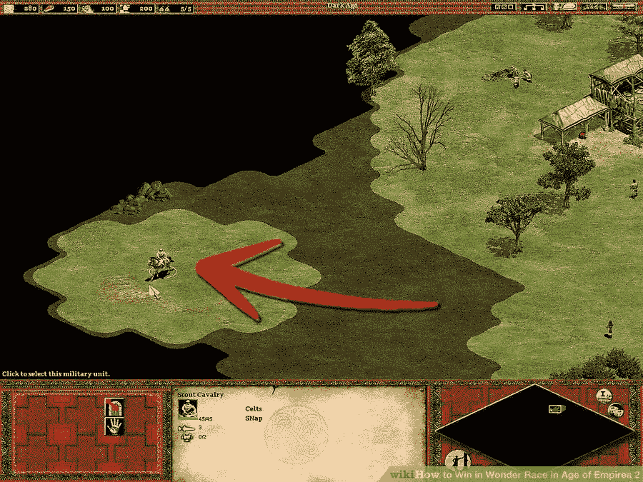

你实际上正在做的事情实际上是为你所处的世界建立一个地图(或模型)。
在创建了这张地图后，不管是部分还是全部，你都要开始计划你的行动，准备即将到来的战斗。

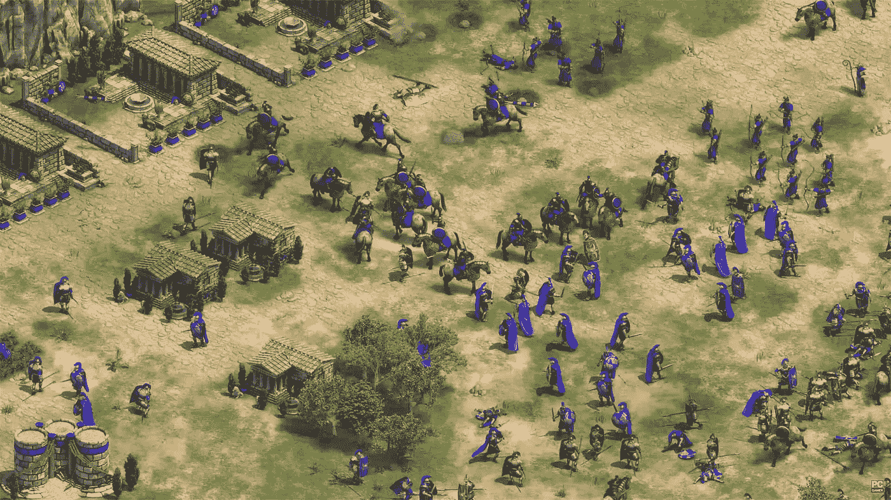

所谓计划，我们指的是在你的大脑中模拟动作，而不是在游戏环境中真正执行它们。这种模拟将节省您的时间，但是，它是基于您已经建立的模型。如果这个模型是不准确的和有偏见的，你的计划将土崩瓦解。

让我们考虑一个国际象棋游戏的例子:

假设你正在下一盘棋，你走了一步，然后你一直等到你的对手走了一步，然后你又走了一步，你的对手也跟着走了一步，然后你发现你的第一步还是不够好！通常，如果你正在学习，你的老师会让你后退，这样你就可以从错误中学习。然而，你已经损失了相当多的时间。

另一方面，如果你在头脑中模拟这些动作(每个人都是这样做的)，并告诉自己“如果我做这个动作，我的对手可以用这个动作反击，那么我就做这个动作，等等……”你会避免前面所有的场景。

你实际上正在做的是，根据你对国际象棋的了解，在你的头脑中展开一棵搜索树，从这棵树上，你将选择可能导致胜利的最佳走法。

现在用一个人工智能代理代替你自己，你得到了基于模型的强化学习。

您可以清楚地看到这将如何节省培训时间。当然，这在具有高反应性的小环境中(例如网格世界)不会很明显，但是对于更复杂的环境，例如任何 Atari 游戏，通过无模型 RL 方法学习是耗时的，而另一方面，通过减少一组动作来创建模型，然后使用该模型来模拟情节是更高效的。

# 什么是模型？

抽象地说，模型是你自己对现实或你所处环境的表现。
在 RL 中，这转化为具有对[MDP](https://medium.com/@zsalloum/basics-of-reinforcement-learning-the-easy-way-fb3a0a44f30e)【S，A，P，R】的表示 M。这意味着拥有一个真实的 [MDP](https://medium.com/@zsalloum/basics-of-reinforcement-learning-the-easy-way-fb3a0a44f30e) 的版本 *i* (最好尽可能准确)。

如果我们假设状态空间 S 和转移概率 A 是已知的，那么模型 M *i* 将变成[S，A，P *i* ，R *i* 。

因此，根据模型 M *i* 在执行动作 A 之后从状态 S 到 S ’,服从概率 P*I*(S' | S，A)，类似地，当在状态 S 时具有奖励 R '并且执行动作 A 服从关系 R *i ( r' | S，A)。*

# 基于模型和无模型的区别

无模型方法直接学习经验，这意味着它们或者在真实世界(例如:机器人)或者在计算机(例如:游戏)中执行动作。然后他们从环境中收集奖励，无论是积极的还是消极的，他们更新他们的价值函数。

这是**与基于模型的方法的关键区别**。无模型方法在真实环境中学习。

相反，基于模型的算法在学习阶段减少了与真实环境的交互次数。它旨在基于这些交互构建一个模型，然后使用该模型模拟进一步的情节，不是在真实环境中，而是通过将它们应用到**构建的模型**中，并获得该模型返回的结果。

如前所述，这具有加速学习的优点，因为不需要等待环境响应，也不需要将环境重置到某个状态来恢复学习。

然而，不利的一面是，如果模型不准确，我们可能会学到与现实完全不同的东西。

另一点值得注意的是，基于模型的算法仍然会使用无模型的方法来构建模型或进行规划/模拟。

# 学习模型

学习模型包括在真实环境中执行动作并收集反馈。我们称之为体验。

所以对于每个状态和动作，环境会提供一个新的状态和奖励。基于这些经验，我们试图推导出这个模型。正如人们所猜测的，这就是监督学习问题。

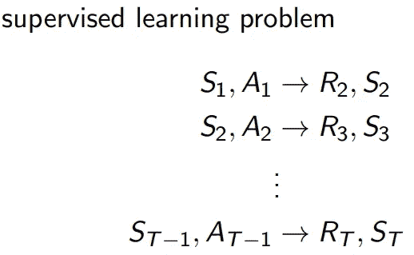

我们通过使用一种可用的监督学习技术来解决这个问题，它可以是回归或神经网络或其他东西。

根据监督学习技术，该模型将由查表、神经网络或其他方法来表示

# 具体例子

下面的例子描述了两个状态 A 和 B，从 A 到 B 以及从 B 到两个可能的终端状态的转换。我们假设没有贴现因子。

为了建立模型，我们在真实环境中运行几集，我们收集着陆状态和结果，然后我们推导出模型的[P，R],如下所示:

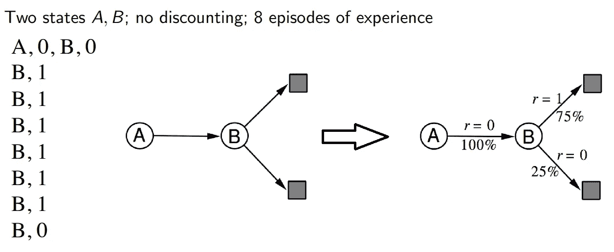

我们可以看到，根据我们的经验(我们运行的测试),从 A 到 be 的时间是 100%,奖励为 0，而从 B 到上终端状态的时间是 75%,奖励为 1，到下终端状态的时间是 25%,奖励为 0。

这表明，如果我们使用该模型(而非真实环境)进行模拟，并且每次在 A 处运行任意一组测试(采样),该模型将告诉我们，当 r =0 时，我们将 100%地移动到 B，并且每次在 be 处，我们可以在 r = 1 时上升 75%的时间，在 r = 0 时上升 25%的时间。

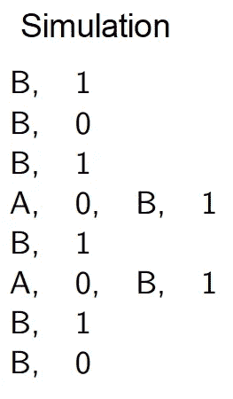

现在，我们可以使用蒙特卡罗等方法来计算价值函数，在我们的示例中，这将导致 V(A) = 1 和 V(B)= 0 . 75。
作为蒙特卡洛值计算的提醒:
g(s)= r+𝛄g(s’)其中 g 是每一集之后在状态 ***s*** 的返回。V(s) =所有剧集的平均 G(s)

V(B)=(6 * G1+2g 2)/8 =(6 * 1+2 * 0)/8 = . 75
V(A)=([G(A)+G(B)]+[G(A)+G(B)])/2 =((0+1)+(0+1))/2 = 1
PS。我们认为没有贴现，所以𝛄 = 1

# 主循环

总之，基于模型的 RL 的主循环如下:

*   我们在真实环境中行动，收集经验(状态和奖励)，
*   然后我们推导出一个模型，并用它来生成样本(规划)，
*   我们从样本中更新价值函数和策略，
*   使用这些价值函数和策略来选择要在真实环境中执行的动作，
*   然后重新开始循环。

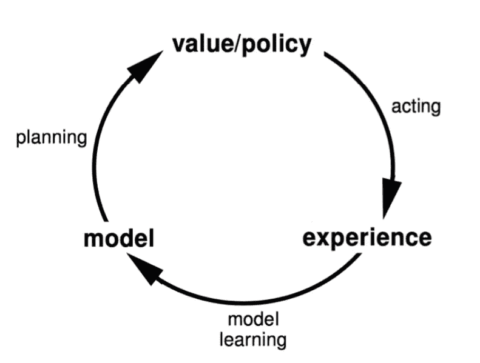

# Dyna 架构

基于模型的 RL 的变体，称为 Dyna Architecture。它不是使用真实的经验来构建模型，而是用来更新价值函数。

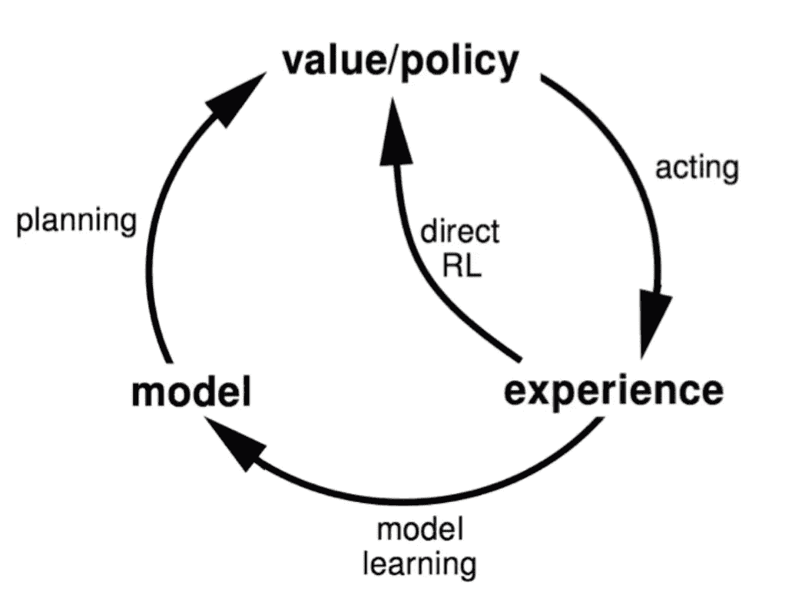

# Dyna-Q 算法

算法从初始化 Q 和模型开始，然后进入主循环。它从当前状态开始，根据策略选择一个动作，在真实环境中执行该动作，观察奖励 R 和新状态 S’。
随着 R 和 S’可用，它更新 Q(S，A)和模型。
注意，S’现在成为当前状态。
现在进入规划阶段。算法进入第二个循环，它迭代 *n* 次，在这个循环中，算法随机选择一个状态和一个相关联的动作，将它们应用到模型中，并从模型中获得奖励和新的状态，然后它像在外循环中一样更新 Q(S，A)。

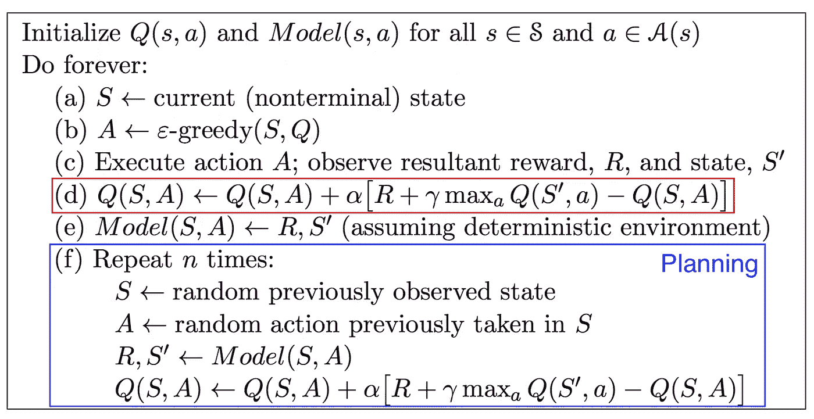

# 基于模拟的搜索

需要注意的是，如前所述，规划阶段从观察的状态空间中随机抽取状态样本，并不强调代理所处的当前状态。

基于模拟的搜索通过获取我们在真实环境和规划阶段中到达的当前状态 St 来改变这一过程。它从 St 开始运行多个模拟。请注意，这不再是 Dyna-Q 中的随机状态。

因此规划阶段现在变成了从当前状态 St 开始从模型 M 生成 K 集的循环

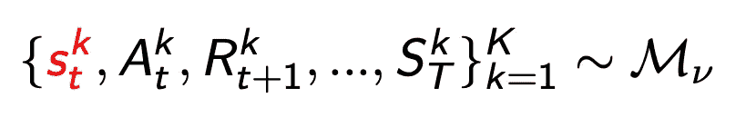

上标 K 是指该集的索引，其中 K 是总集数。

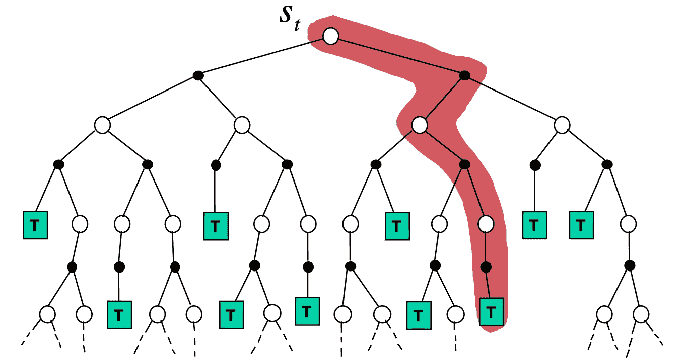

规划阶段基于模拟的搜索有多种实现方式，如简单的蒙特卡罗搜索、[蒙特卡罗树搜索(MCTS)](/monte-carlo-tree-search-in-reinforcement-learning-b97d3e743d0f) 。

# 简单蒙特卡罗搜索

简单的蒙特卡罗搜索由一个模型和一个模拟策略π(专用于规划阶段的策略)组成。
然后从真实的当前状态 St 开始，我们采取每个可能的动作 *a* 并且我们生成 K 个模拟开始 St 和动作 *a.*

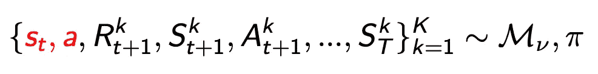

之后，通过将 Q(St，a)计算为模拟情节的所有回报的平均值来评估每个模拟

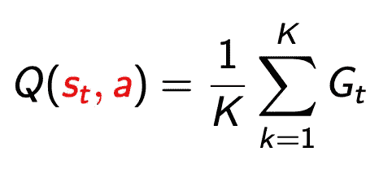

现在，通过选择在 St 处使 Q 值函数最大化的动作，来选择要在真实环境中执行的动作

# 蒙特卡罗树搜索

蒙特卡洛树搜索算法在文章[强化学习中的蒙特卡洛树搜索](/monte-carlo-tree-search-in-reinforcement-learning-b97d3e743d0f)中有详细讨论。
它被用作来自 Deep Mind 的 [Alpha Zero](https://en.wikipedia.org/wiki/AlphaZero) 的积木。

# 其他资源

你可能也会对下面的文章感兴趣:[基于模型和无模型的强化学习——py tennes 案例研究](https://neptune.ai/blog/model-based-and-model-free-reinforcement-learning-pytennis-case-study)