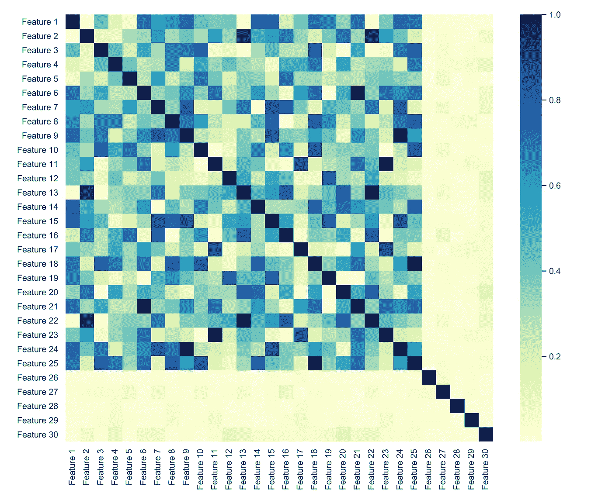
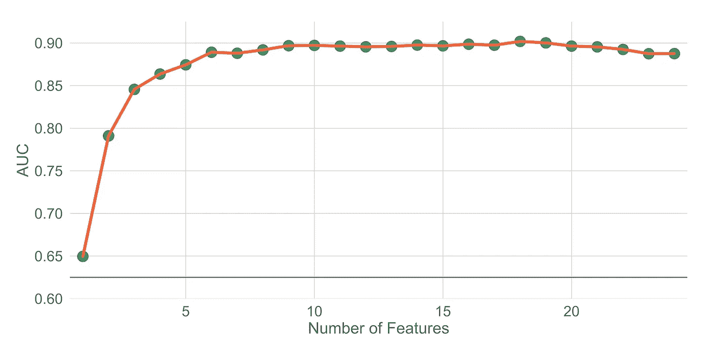
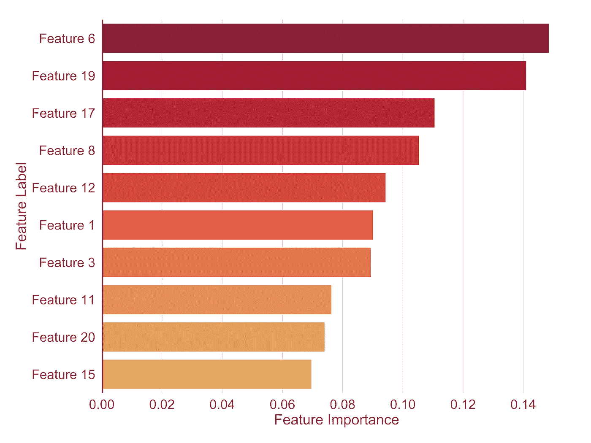
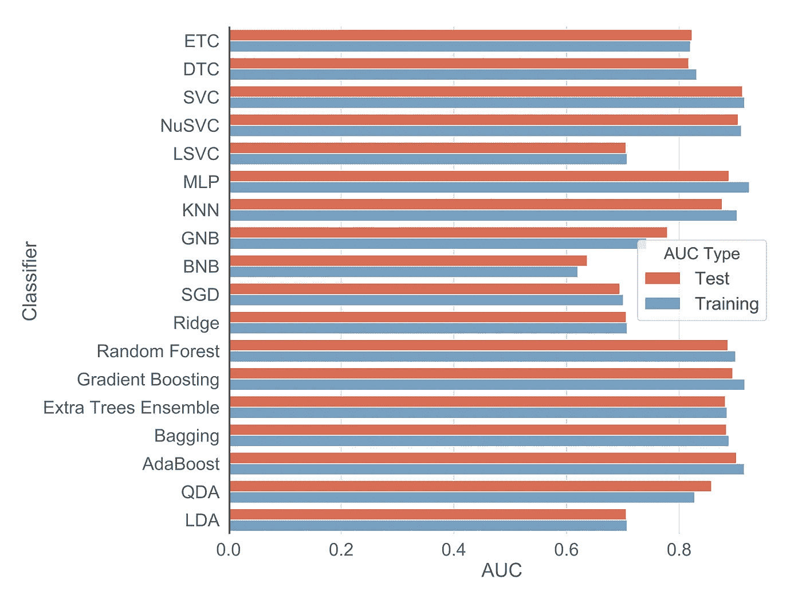

# 使用 Scikit-learn 进行模型设计和选择

> 原文：<https://towardsdatascience.com/model-design-and-selection-with-scikit-learn-18a29041d02a?source=collection_archive---------3----------------------->

## 使用 Scikit-learn 调整、训练和评估模型

Photo by [Alex wong](https://unsplash.com/@killerfvith?utm_source=unsplash&utm_medium=referral&utm_content=creditCopyText) on [Unsplash](https://unsplash.com/search/photos/architecture?utm_source=unsplash&utm_medium=referral&utm_content=creditCopyText)

**目的:**本文的目的是从头到尾建立一个管道，以便在一个合成数据集上访问 18 个机器学习模型的预测性能。

**材料和方法:**使用 Scikit-learn，我们为分类任务生成一个类似 Madelon 的数据集。我们的工作流程的主要组成部分可以概括如下:(1)创建训练集和测试集。(2)然后通过 Z 分数归一化来缩放特征。(3)应用特征选择算法来减少特征的数量。(4)训练和评估机器学习算法。将使用受试者操作曲线下面积(AUC)评估 18 个训练分类器的预测能力。

**硬件**:我们在配备英特尔酷睿 i7–8700 处理器、12 个 CPU、3.70 Ghz 和英伟达 GeForce RTX 2080 的工作站上训练和评估我们的模型。

**注意:**如果你是从零开始，我会建议你按照这篇[文章](https://medium.com/i-want-to-be-the-very-best/installing-keras-tensorflow-using-anaconda-for-machine-learning-44ab28ff39cb)安装所有必要的库。[欢迎你来 fork 我的储存库，里面包含了这篇文章的全部内容。](https://github.com/frank-ceballos/Model_Design-Selection)

# 数据集

我们将使用 Scikit-learn 为分类任务生成一个类似 Madelon 的合成数据集。Madelon 数据集是一个人工数据集，包含放置在边长为 1 的五维超立方体的顶点上的 32 个聚类。聚类被随机标记为 1 或-1 (2 类)。

我们将生成的数据集将包含 30 个特征，其中 5 个将提供信息，15 个将是冗余的(但提供信息)，5 个将重复，最后 5 个将是无用的，因为它们将被随机噪声填充。数据集的列将按如下顺序排列:

1.  **信息特征—第 1–5 列**:这些特征是您构建模型时真正需要的唯一特征。因此，一个五维的超立方体。
2.  **冗余特征—第 6–20 列:**这些特征是通过线性组合具有不同随机权重的信息特征而形成的。您可以将这些视为工程特性。
3.  **重复特征——第 21–25 列**:这些特征是从信息特征或冗余特征中随机抽取的。
4.  **无用特征——第 26–30 列:**这些特征充满了随机噪声。

让我们从导入库开始。

**Script 1** — Importing the libraries.

现在我们可以生成数据集了。

Script 2 — Getting the data: Notice that we set the random_state = 1000\. This is done simply to ensure that we will work with the same data . You can remove it if you want.

通过无替换的随机抽样，我们创建了我们的训练和测试集。

**Script 3** — Creating the training and test set. The size of the test set is set to be 20% of the data.

# 分类器

我们将训练和调整 18 个分类器，并使用受试者操作曲线下面积(AUC)评估它们的性能。讨论每个分类器的任何技术细节都超出了本文的范围；然而，对于感兴趣的读者，你可以点击下面列表中的链接。每个分类器都有一个标签，由括号中的字符串表示。

1.  [线性判别分析](https://sebastianraschka.com/Articles/2014_python_lda.html) (LDA)
2.  [二次判别分析](https://xavierbourretsicotte.github.io/LDA_QDA.html) (QDA)
3.  [Adaboost 分类器](/boosting-and-adaboost-clearly-explained-856e21152d3e) (AdaBoost)
4.  [装袋分级机](/using-bagging-and-boosting-to-improve-classification-tree-accuracy-6d3bb6c95e5b)(装袋)
5.  [额外树分类器](https://www.quora.com/What-is-the-extra-trees-algorithm-in-machine-learning)(额外树集合)
6.  [梯度增强分类器](https://medium.com/all-things-ai/in-depth-parameter-tuning-for-gradient-boosting-3363992e9bae)(梯度增强)
7.  [随机森林](https://medium.com/@taplapinger/tuning-a-random-forest-classifier-1b252d1dde92)分类器(随机森林)
8.  [山脊分级机](https://scikit-learn.org/stable/modules/generated/sklearn.linear_model.RidgeClassifier.html)(山脊)
9.  [SGD 分类器](/how-to-make-sgd-classifier-perform-as-well-as-logistic-regression-using-parfit-cc10bca2d3c4) (SGD)
10.  [伯努利 NB](https://hub.packtpub.com/implementing-3-naive-bayes-classifiers-in-scikit-learn/) 分类器(BNB)
11.  [高斯 NB](https://hub.packtpub.com/implementing-3-naive-bayes-classifiers-in-scikit-learn/) 分类器(GNB)
12.  [K 最近邻分类器](https://medium.com/@mohtedibf/in-depth-parameter-tuning-for-knn-4c0de485baf6) (KNN)
13.  [MLP 分类器](https://medium.com/@annishared/build-your-first-neural-network-in-python-c80c1afa464) (MLP)
14.  [线性 SVC](https://scikit-learn.org/stable/modules/generated/sklearn.svm.LinearSVC.html) (LSVC)
15.  [Nu SVC](https://scikit-learn.org/stable/modules/generated/sklearn.svm.NuSVC.html) (NuSVC)
16.  [SVC](https://medium.com/all-things-ai/in-depth-parameter-tuning-for-svc-758215394769) (SVC)
17.  [决策树分类器](/scikit-learn-decision-trees-explained-803f3812290d) (DTC)
18.  [额外的树分类器](/scikit-learn-decision-trees-explained-803f3812290d)(等等)

**Script 4** — Initializing the classifiers. This list was obtained from a [Kaggle notebook](https://www.kaggle.com/danielgrimshaw/sklearn-model-exploration).

# 分类器超参数

这里我们将创建一个字典，它的键-值对包括

*   **键**:表示分类器的字符串
*   **值**:对应分类器的超参数字典

这里使用的超参数决不代表每个分类器的最佳超参数网格。欢迎您随意更改超参数网格。

**Script 5** — Defining the hyper-parameter grid for each classifier.

# **特征选择方法**

机器学习可能涉及每个训练实例的数千个特征的问题。从一大群特征中确定最优特征子集是机器学习中的一项常见任务。这样做的好处是很多的。例如，找到最具描述性的特征可以降低模型的复杂性，使找到最佳解决方案变得更容易，最重要的是，它减少了训练模型所需的时间。在某些情况下，可以获得轻微的性能提升。

幸运的是，使用成熟的方法通常可以大大减少特征的数量。然而，必须注意的是，通过删除特性，您的系统性能可能会稍差(因为您试图用较少的信息进行预测)。

有三种选择特征的常用方法。即过滤器、包装器和嵌入式方法。全面解释它们超出了本文的范围。因此，如果你不熟悉这些方法，我会建议你阅读这篇[文章](https://www.analyticsvidhya.com/blog/2016/12/introduction-to-feature-selection-methods-with-an-example-or-how-to-select-the-right-variables/)，还有这篇[文章](/intro-to-feature-selection-methods-for-data-science-4cae2178a00a)。

在我们的工作流程中，我们将首先应用过滤方法来快速减少特征的数量，然后应用包装方法来确定最大化分类器性能所需的最小特征数量。

## 1.过滤方法:基于相关性的特征选择

让我们假设，如果两个或更多的特征高度相关，我们可以随机选择其中一个，丢弃其余的，而不会丢失任何信息。为了衡量特征之间的相关性，我们将使用 [Spearman 的相关系数](https://en.wikipedia.org/wiki/Spearman%27s_rank_correlation_coefficient)。如果两个要素的 Spearman 相关值为 1，则表示它们完全相关，0 表示不相关，而-1 表示高度相关但方向相反(一个要素增加，而另一个要素减少)。

在特征选择算法的这一步，我们首先使用所有特征计算系数矩阵的绝对值，参见**图 1** 。然后，我们确定一组相关系数大于 0.95 的特征。从每组相关的特征中，我们将选择其中的一个并丢弃其余的。你可以随意改变我设定的门槛。

**Script 6** — Removing highly correlated features. To use a threshold of 0.90, change 0.95 to 0.90 in line 19.

**Figure 1** — Spearman’s correlation matrix. Notice that the last 5 features don’t correlate with any other feature since they are filled with random noise.

这将从数据集中移除 6 个要素，数量并不多，即要素 13 和要素 21–25。然而，在我处理过的真实数据集中，这一步减少了高达 50 %的特征数量。请注意，如果您有数千个特征，这可能会在计算上很昂贵。

## 2.包装器方法:带交叉验证的递归特征消除

在移除高度相关的特征之后，我们将通过应用递归特征消除算法来进一步减少特征的数量。Scikit-learn 带交叉验证的递归特征消除( [RFECV](https://scikit-learn.org/stable/modules/generated/sklearn.feature_selection.RFE.html) )对象只允许您使用具有`feature_importances_`或`coef_`属性的估计器/分类器。根据经验，我注意到 RFECV 经常高估您真正需要的特性的数量。

**2.a .调整基本估计值**

首先，您需要选择用于 RFECV 的基本估计量。为了便于说明，我将选择一个随机的森林分类器作为基础。欢迎您选择以下任一项作为基本估计值。

This is executed in the **Classifiers** section.

一旦确定了基本估计量，我们将调整它的超参数。这样做的原因是为了减少过度拟合的风险和最大化估计器的性能。为此，我们将创建一个 [Scikit-learn 管道对象](https://scikit-learn.org/stable/modules/generated/sklearn.pipeline.Pipeline.html)，它将与 [Scikit-learn GridSearchCV 对象](https://scikit-learn.org/stable/modules/generated/sklearn.model_selection.GridSearchCV.html)一起使用。

GridSearchCV 将在超参数网格上执行详尽的搜索，并将报告将最大化交叉验证分类器性能的超参数。[这里有一篇很好的中间文章，展示了更详细的解释](https://medium.com/datadriveninvestor/an-introduction-to-grid-search-ff57adcc0998)。我们将设置折叠数为 5。

以下是我们管道中的步骤。

**第一步——特征缩放:**在你的算法中使用它们之前，缩放你的特征是一项常见的任务。这样做是为了确保数据集中的所有要素都具有相同的比例。因此，值较大的要素不会优先于值较小的要素。你可以参考这篇[文章](https://www.codecademy.com/articles/normalization)获得更详尽的解释。我们将使用训练集中的样本通过 Z 分数归一化来缩放数据(训练和测试)*。所有要素都以零为中心，标准偏差为 1。*

**步骤 2 —分类器:**定义在管道中使用的分类器对象。

**Script 7** — Tuning the classifier. To change the base estimator, change the classifier label in line 5\. See the **Classifiers** section to see the list of available labels. To change the number of folds that GridSearchCV uses to 10, set cv = 10, in line 23\. Similarly, you can also change the scoring.

调整随机森林分类器的处理时间为 4.8 分钟。

**2.b .使用调整后的估计器递归选择特性**

一旦我们调优了我们的基本估计器，我们将创建另一个类似于第一个的管道，但是这个管道将在第二步中具有调优的分类器。现在出现了一个技术性问题。因为 Scikit-learn 管道对象没有`feature_importances_`或`coef_`属性，所以如果我们想在 RFECV 中使用它，我们必须创建自己的管道对象。约翰·雷米向我们展示了如何做到这一点。谢谢你，约翰！

**Script 8** — Defining a custom Pipeline object that is compatible with RFECV and RFE.

最后，我们可以在新管道中使用 RFECV。唷！去拿瓶啤酒，伙计。

**Script 9** — Selecting features using a recursive feature elimination with cross-validation (RFECV).

现在让我们来想象一下结果。用 python 绘图有点疯狂，但不管怎样。

**Script 10** — Visualizing the results of RFECV. All this code to make a Figure 2, yuck! You might need to adjust the xlim(), ylim(), and ax.axhline() if you change the data set or base estimator.

**Figure 2** — Area under receiver operator curve (AUC) as a function of number of features. The classifier’s performance peaks around 10 features.

多美的身材啊！在**图 2** 中，我们可以看到分类器的性能是许多特征的函数。如您所见，性能峰值约为 10 个特性，AUC 约为 0.89；但是，如果您检查 selected_features 列表的长度，您会注意到 RFECV 确定您需要超过 18 个特性才能达到最高性能。

有问题的是，我们从 30 个特征开始，知道其中只有 5 个是真正必要的，在我们的特征选择算法之后，我们以超过 18 个代表性特征结束。为了解决这个问题，看一下**图 2** ，直观地确定你想要使用多少个特性(例如 10 个)，并使用 [Scikit-learn RFE 对象](https://scikit-learn.org/stable/modules/generated/sklearn.feature_selection.RFE.html)，其中`n_features_to_select`参数设置为 10。请注意，在添加了 7 个特性之后，随着特性的增加，性能的提升是最小的。你可以用这个作为你的阈值，但我喜欢包含一点冗余，因为我不知道其他 17 个分类器的最佳特征数。从 sci kit-了解 RFE 文档:

> 给定给特征分配权重的外部估计器(例如，线性模型的系数)，递归特征消除(RFE)的目标是通过递归地考虑越来越小的特征集来选择特征……该过程在修剪集上递归地重复，直到最终达到要选择的特征的期望数量。

**Script 11** — Using recursive feature elimination (RFE) to select a given number of features. To change the size of the selected features to 12, set n_features_to_select =12 in line 9.

现在你可能想知道为什么我们不从 RFE 开始，而不是 RFECV。嗯，在现实生活场景中，你不会预先知道你真正需要多少特性。通过使用 RFECV，我们能够获得最佳的特征子集；然而，根据我的经验，它经常被高估。然而，从 RFECV 中我们获得了性能曲线，从中我们可以做出我们需要多少特性的明智决定。使用 RFE 的一个缺点是结果没有交叉验证。

# 特征重要性

一旦我们确定了所选的特征，我们就可以根据分类器来研究它们的重要性。我推测，对于分类器来说，一些冗余特征实际上比真实特征更能提供信息。让我们看看这是不是真的。

我们将首先使用所选的特征来训练调整后的随机森林分类器。然后我们将使用`feature_importances_`属性并用它创建一个条形图。**请注意，只有当您选择作为基础的分类器包含一个** `feature_importances_` **属性时，下面的代码才会起作用。**

**Script 12** — Visualizing the feature importances.

**Figure 3** — Random Forest feature importance. Large values imply a greater importance.

最重要的特征是特征 6 和 19，它们属于冗余特征类。冗余功能似乎比信息功能(功能 1-5)更重要，这似乎有悖常理。话又说回来，在 [Kaggle](https://www.kaggle.com/) 比赛中经常可以看到，特色工程可以给你一个助力。重要的是要注意，由机器学习分类器分配的特征重要性本质上是随机的，是不健壮的。例如，如果您要重新运行 RFE，您可能会获得稍微不同的结果，因为我们没有修复随机森林中的种子。这就是为什么如果你的计划是从你的特性重要性中得出一些结论，你需要交叉验证你的结果。[这里有一篇关于机器学习随机性的优秀文章。](https://machinelearningmastery.com/randomness-in-machine-learning/)另外，如果你的分类器没有调优，不要相信特征的重要性。这里有一篇关于如何更稳健地确定特征重要性的精彩文章。

# 迭代分类器调整和评估

既然我们已经确定了代表性特征的子集，我们将调整和训练 18 个模型，以调查其中性能最高的模型。为此，我们将迭代**脚本 4** 中定义的分类器，并使用**脚本 7** 使用**脚本 5** 中定义的超参数来调整它们。我们将对**脚本 7** 做一些小的修改，并添加几行额外的代码来评估测试集上调优的分类器性能，并保存结果。

**Script 13** — Tuning classifiers on training set and evaluating on test set.

脚本 13 在我的工作站上运行了大约 30 分钟。我估计在阿朵核心 CPU 这将需要大约 3 个小时。所有结果都将存储在名为`results` *的字典对象中。*字典`results`的内容可以通过分类器 _ 标签访问(参见**分类器**部分)。对于每个分类器，我们存储以下对象:

*   **分类器**:经过训练的分类器流水线对象。你可以用它来预测新的样本。
*   **最佳参数**:包含在训练集中获得最佳性能的参数的字典。
*   **训练 AUC** :在训练集中得到的交叉验证的 AUC。
*   **测试 AUC** :测试集中得到的 AUC。

让我们来看看结果:

**Script 14** — Visualizing the results of **Script 13**.

**Figure 4** — Bar plot of classifier performance on training and test set.

从图 4 中，我们可以直观地确定 SVC、NuSVC、梯度增强和 AdaBoost 分类器在测试集中获得了最高的性能。查看 pandas dataframe 对象`auc_scores`的内容以查看数字结果。

# 结束语

如果你读到了这篇文章的结尾，那么恭喜你！我们实际上浏览了很多材料。我希望这能对你有所帮助。[您可以在我的 GitHub 资源库中找到本文的所有代码。](https://github.com/frank-ceballos/Model_Design-Selection)不客气叉吧。如果您想使用它，只需修改**脚本 2** 并确保以下内容:

*   加载数据并对所有分类变量进行编码。
*   注意任何缺失值或异常值。
*   平衡您的数据集(如果需要)。
*   将特征矩阵 **X** 存储到熊猫数据帧对象中。对 **y** 中的目标进行同样的操作。

如果您的数据集包含大约 1000 个样本和 30 个特征，那么执行整个过程大约需要 30-45 分钟——假设您的硬件与我的相似。

现在给出一些建议，以确定下一步如何进一步提高这些分类器的性能。

最简单的方法是选择五个性能最好的分类器，用不同的参数进行网格搜索。一旦对最佳参数的位置有了感觉，就可以在参数空间中对该点进行更精细的网格搜索。在您进一步调优这些分类器之后，从五个分类器中选择最好的三个，并在 Scikit-learn 的 [VotingClassifier](https://scikit-learn.org/stable/modules/generated/sklearn.ensemble.VotingClassifier.html) 中使用它们。这很可能会提高性能，但会增加建模的复杂性。您也可以考虑堆叠—要了解更多信息，请单击[此处](/stacking-classifiers-for-higher-predictive-performance-566f963e4840)。

你也可以研究特征工程。这会给你带来最大的回报。我正计划写一篇关于这个主题的文章。

在 [LinkedIn](https://www.linkedin.com/in/frank-ceballos/) 找到我。下次见！