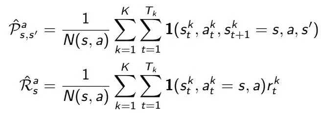

# 无模型预测:强化学习

> 原文：<https://towardsdatascience.com/model-free-prediction-reinforcement-learning-507297e8e2ad?source=collection_archive---------11----------------------->

## 第 4 部分:利用蒙特卡罗学习、时间差学习和 TD( **λ)** 的无模型预测

之前，我们研究了通过动态规划来解决已知的 *MDP* 的规划。在本帖中，我们将使用无模型预测来估计未知 MDP 的价值函数。也就是说，我们将着眼于一个未知的 MDP 的政策评估。这一系列的博客文章包含了大卫·西尔弗在[关于强化学习的介绍](http://www0.cs.ucl.ac.uk/staff/d.silver/web/Teaching.html)中解释的概念总结。

零件:[1](/reinforcement-learning-an-introduction-to-the-concepts-applications-and-code-ced6fbfd882d)[2](/getting-started-with-markov-decision-processes-reinforcement-learning-ada7b4572ffb)[3【…](/planning-by-dynamic-programming-reinforcement-learning-ed4924bbaa4c)

将对无模型预测的三种主要方法进行说明:

*   蒙特卡罗学习
*   时差学习
*   TD(λ)

这篇文章主要着眼于在未知的 MDP 中评估一个给定的政策，而不是寻找最优政策。

# 蒙特卡罗学习

***蒙特卡洛*** 方法都是直接从剧集经验中学习的 ***无模型*** 。蒙特卡洛从*全集*中学习*无引导。MC 的一个缺点是它只能应用于所有情节都必须终止的情节马尔可夫决策过程。*

> ***无模型:*** 对 MDP 转场/奖励一无所知
> ***自举*** *:* 更新涉及到一个估计

## 蒙特卡洛政策评估

***目标*** :给定一个策略 *π，*从几集经验中学习 *v_π(策略值)*。

Given policy *π with each state, action and associated reward for taking that action*

Recall: return is the total discounted reward

Recall: value function is the expected return

***蒙特卡罗策略评估*** 用*经验均值收益*代替预期收益。评估一个状态下策略的价值函数的两种方法是使用 ***首次访问蒙特卡罗策略评估*** 或 ***每次访问蒙特卡罗策略评估。***

***首次访问蒙特卡洛政策评估***

1.  评估给定策略的状态值
2.  第一个*时步( *t)* 那个状态( *s)* 在一集里被访问*
3.  *增量计数器: *N(s) ← N(s) + 1**
4.  *增量总回报: *S(s) ← S(s) + Gₜ**
5.  *价值由平均收益估计: *V(s) = S(s)/N(s)**
6.  **V(s) → v_π(s)* 为 *N(s) → ∞**

**蒙地卡罗政策评估**

1.  **评估给定策略的状态值**
2.  *****每一个****t)*那个状态( *s)* 都是在一个情节中被访问**
3.  **增量计数器: *N(s) ← N(s) + 1***
4.  **增量总回报: *S(s) ← S(s) + Gₜ***
5.  **价值由平均收益估计: *V(s) = S(s)/N(s)***
6.  ***V(s) → v_π(s)* 为 *N(s) → ∞***

**在上述两种评估方法中，我们必须跟踪算法的统计数据。也就是说，我们只能在完成所有剧集后计算其价值。为了解决这个问题，我们可以使用 ***增量均值*** 等式来增量更新该值。**

> ****增量均值** 一个序列的均值₁，₂，…x₁，x₂，…可以增量计算。**

****

**Incremental Mean**

*****增量蒙特卡罗更新*** 更新 *V(s)* 增量后集 *S₁，A₁，R₂，…，Sₜ.*为每个状态 *Sₜ* 带回车 *Gₜ :***

****

**Replace step 3–5 with the above. **(G*ₜ* − V(S*ₜ*))** can be viewed as the error between the return and the mean at time step *t***

**在非平稳问题中(事物四处漂移，你不需要记住很久以前发生的事情)，我们可以使用移动平均方法，即忘记旧的情节。**

****

**Incremental Monte-Carlo updates**

# **时差学习**

*****时间差*** 是*无模型的。*时间差分法直接从经验/与环境的相互作用中学习。时态差从不完整的剧集中学习，通过 ***自举*** (更新值函数的猜测)**。****

**在 MC 和 TD 中，目标都是从政策 *π* 下的经验中在线学习 *v_π* 。
如果我们要应用 ***增量每次访问蒙特卡罗*** 我们就朝着**实际**返回 ***Gₜ*** 更新值 *V(Sₜ】***

****

**最简单的时差学习算法，***TD(0)****随着我们更新值 *V(Sₜ)* 趋向于一个**估计值**返回***rₜ₊₁+γv(sₜ₊₁)******

****

***【rₜ₊₁+γv(sₜ₊₁】)*是***TD 目标****【δₜ=rₜ₊₁+γv(sₜ₊₁)-v(sₜ】)*是***TD 误差*** *。***

**TD 学习*立即更新值函数*，这允许它在知道每一步之后的最终结果 之前学习 ***，不像 MC 必须等到剧集结束之后才知道返回。TD 工作在 ***持续(非终止)环境*** 中，而 MC 只工作在阶段性(终止)环境/完整序列中。*****

*举例说明 TD 和 MC 之间的区别，如果我们试图预测在沿途的每个州开车回家需要多长时间。在 **MC** 中，我们会给每个状态分配我们在旅程结束时得到的值(实际结果)。
在 **TD** 中，我们将使用下一个状态对当前状态的影响(估计结果)来更新每个状态的值。*

*在偏差和方差之间有一个权衡。 **MC** 使用**返回 *Gₜ*** 时有*高方差*和*零偏*，这依赖于*的许多随机动作*、*过渡*和*奖励*。因此，即使在函数逼近的情况下，它也具有良好的收敛性，并且对初值不敏感。*

***TD** 有*低方差*和*部分偏差为****TD 目标*** 取决于*一个随机动作，跃迁*和*奖励。*通常比 MC 更有效率。 *TD(0)* 收敛于 *v_π(s)* 但不总是用函数逼近。与 MC 不同，它对初始值更敏感。*

## ****批量 MC 和*TD***

*所以我们看到 MC 和 TD 收敛: *V(s) → v_π(s)* 作为经验 *→ ∞* 但是实际上我们不可能永远进行下去，那么这些算法对于有限经验的批量求解是如何收敛的呢？*

*假设我们有两个状态 *A，B* 有*无贴现*和 *8* 集经验。*

**

*AB Example*

*状态 *A* 的值是多少。 *V(一)* *？* **MC** 收敛于*以最小均方误差最佳拟合观察回报*的解。*

**

*因此 *V(A)=0。*因为状态 *A* 唯一一次出现在一集里是在 return 为 0 的时候。*

***TD(0)** 收敛到*最大似然马尔可夫模型的解。*这是最符合数据的 MDP 解决方案。*

**

*因此 *V(A)=0.75* 。因为我们在 8 集里得到了 6 集的奖励。与 MC 不同，TD 利用了马尔可夫特性。*

## *备份方法之间的比较*

****蒙特卡罗备份:*** 状态的值 *Sₜ* 只能在到达终端状态时计算*

**

****时间差 TD(0)备份:***
仅使用一步前瞻来计算状态值 *Sₜ* 。*

**

****动态编程备份:*** 在 *Sₜ* 处的值通过一步查看每个可能的状态来计算，并计算出期望值。*

**

****n 步返回*** 一种介于 TD(0)和 MC 之间的方法，这里我们有 n 步时差学习。因此，该值将通过向前看 n 步并应用时间差学习方法来计算。*

**

# *TD(λ)*

*我们可以不用查看每个 n 步回报 *Gₜ⁽ⁿ⁾* ，而是使用一个衰减加权和来组合所有 n 步回报，称为***λ-回报*** 。*

**

## ****前视 TD(λ)****

*现在可以使用 ***前视 TD(λ)*** 计算状态下的值*

**

*前视着眼于未来以计算λ回报，并向其更新价值函数，并且只能从完整的剧集中计算。*

## *后视 TD(λ)*

*后向视图提供了从不完整序列在线更新每一步值的机制。我们为每个状态 s 保留一个 ***合格轨迹*** ，并与 *TD 误差* *δₜ* 和*合格轨迹 eₜ(s】*成比例地为每个状态 *s* 更新 *V(s)* 。*

**

> ***合格追踪**
> 合格追踪结合了**频率启发式**和**新近启发式**。
> - **频率启发式**:将信用分配给最频繁的状态
> - **最近启发式**:将信用分配给最近的状态*

**

*Eligibility Trace Equations*

# *摘要*

*我们已经研究了各种用于无模型预测的方法，例如蒙特卡罗学习、时间差学习和 TD(λ)。当给定一个策略时，这些方法允许我们找到一个状态的值。在下一篇文章中，我们将使用无模型方法寻找最优策略。*

# *参考*

*   *[关于 RL 的 UCL 课程——第 4 讲](http://www0.cs.ucl.ac.uk/staff/d.silver/web/Teaching_files/MC-TD.pdf)*
*   *《强化学习导论》，萨顿和巴尔托，1998 年*

*如果你喜欢这篇文章，并想看到更多，不要忘记关注和/或留下掌声。*