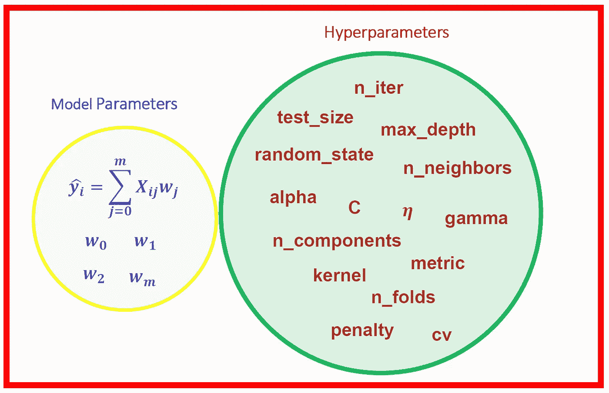
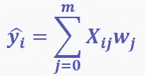
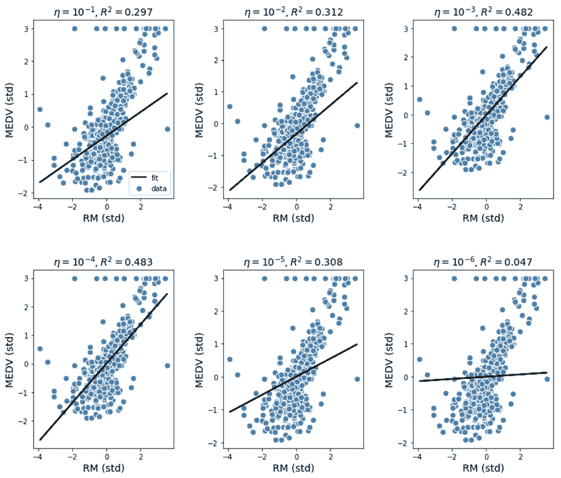

# 机器学习中的模型参数和超参数—有什么区别？

> 原文：<https://towardsdatascience.com/model-parameters-and-hyperparameters-in-machine-learning-what-is-the-difference-702d30970f6?source=collection_archive---------6----------------------->

## 分析影响模型质量的参数



在机器学习模型中，有两种类型的参数:

1.  **模型参数:**这些是模型中必须使用训练数据集确定的参数。这些是拟合参数。
2.  **超参数:**这些是可调整的参数，为了获得具有最佳性能的模型，必须对其进行调整。

例如，假设您想要使用 m 维训练数据集构建一个简单的线性回归模型。那么你的模型可以写成:



其中 **X** 是预测矩阵，而 **w** 是权重。这里 w_0，w_1，w_2，…，w_m 是**模型参数**。如果模型为了确定权重 w_0，w_1，w_2，…，w_m，使用梯度下降算法最小化目标函数，那么我们可以有一个优化器，比如 GradientDescent(eta，n_iter)。这里，eta(学习速率)和 n_iter(迭代次数)是**超参数**，为了获得模型参数 w_0，w_1，w_2，…，w_m 的最佳值，必须对其进行调整。有关这方面的更多信息，请参见以下示例: [**机器学习:使用梯度下降的 Python 线性回归估计器。**](https://medium.com/towards-artificial-intelligence/machine-leaning-python-linear-regression-estimator-using-gradient-descent-b0b2c496e463)

## scikit-learn 软件包中使用的超参数示例

1.  **感知器分类器**

```
Perceptron(n_iter=40, eta0=0.1, random_state=0)
```

这里，n_iter 是迭代次数，eta0 是学习速率，random_state 是混洗数据时使用的伪随机数生成器的种子。

**2。训练、测试分割估计器**

```
train_test_split( X, y, test_size=0.4, random_state=0)
```

这里，test_size 表示要包含在测试分割中的数据集的比例，random_state 是随机数生成器使用的种子。

**3。逻辑回归分类器**

```
LogisticRegression(C=1000.0, random_state=0)
```

这里，C 是正则化强度的倒数，random_state 是混洗数据时使用的伪随机数生成器的种子。

**4。KNN (k 近邻)分类器**

```
KNeighborsClassifier(n_neighbors=5, p=2, metric='minkowski')
```

这里，n_neighbors 是要使用的邻居数量，p 是闵可夫斯基度量的幂参数。当 p = 1 时，这相当于对 p = 2 使用 manhattan_distance 和 euclidean_distance。

**5。支持向量机分类器**

```
SVC(kernel='linear', C=1.0, random_state=0)
```

这里，kernel 指定了算法中使用的核类型，例如 kernel = 'linear '表示线性分类，kernel = 'rbf '表示非线性分类。c 是误差项的惩罚参数，random_state 是在混洗数据以进行概率估计时使用的伪随机数发生器的种子。

**6。决策树分类器**

```
DecisionTreeClassifier(criterion='entropy', 
                       max_depth=3, random_state=0)
```

在这里，criterion 是衡量分割质量的函数，max_depth 是树的最大深度，random_state 是随机数生成器使用的种子。

**7。套索回归**

```
Lasso(alpha = 0.1)
```

这里，α是正则化参数。

**8。主成分分析**

```
PCA(n_components = 4)
```

这里，n_components 是要保留的组件数。如果未设置 n_components，则保留所有组件。

重要的是，在模型建立期间，这些超参数被微调，以便获得具有最高质量的模型。一个模型的预测能力如何依赖于超参数的很好的例子可以从下图中找到(来源: [**好坏回归分析**](https://medium.com/towards-artificial-intelligence/bad-and-good-regression-analysis-700ca9b506ff) )。



**Regression analysis using different values of the learning rate parameter. Source:** [**Bad and Good Regression Analysis**](https://medium.com/towards-artificial-intelligence/bad-and-good-regression-analysis-700ca9b506ff)**, Published in Towards AI, February 2019, by Benjamin O. Tayo.**

从上图可以看出，我们模型的可靠性取决于超参数调整。如果我们只是为学习率选择一个随机值，比如 eta = 0.1，这将导致一个糟糕的模型。为 eta 选择一个太小的值，比如 eta = 0.00001，也会产生一个不好的模型。我们的分析表明，最佳选择是当 eta = 0.0001 时，从 R 平方值可以看出。

好的和坏的机器学习模型之间的区别取决于一个人理解模型的所有细节的能力，包括关于不同超参数的知识以及如何调整这些参数以获得具有最佳性能的模型。在没有完全理解模型的错综复杂的情况下，将任何机器学习模型作为黑箱，都会导致模型被证伪。

## 参考

1.  《Python 机器学习》，第二版，塞巴斯蒂安·拉什卡。
2.  [**机器学习:使用梯度下降的 Python 线性回归估计器**](https://medium.com/towards-artificial-intelligence/machine-leaning-python-linear-regression-estimator-using-gradient-descent-b0b2c496e463) **。**
3.  [**坏与好的回归分析**](https://medium.com/towards-artificial-intelligence/bad-and-good-regression-analysis-700ca9b506ff) 。