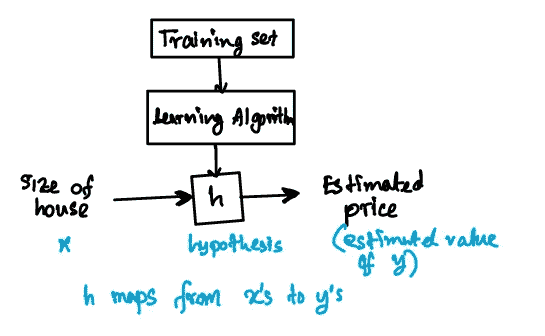
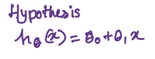
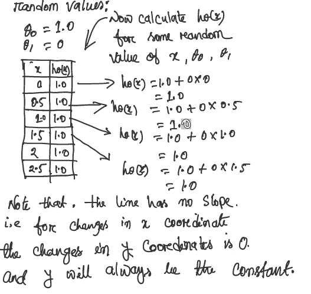
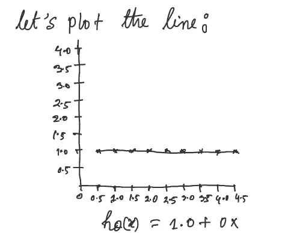
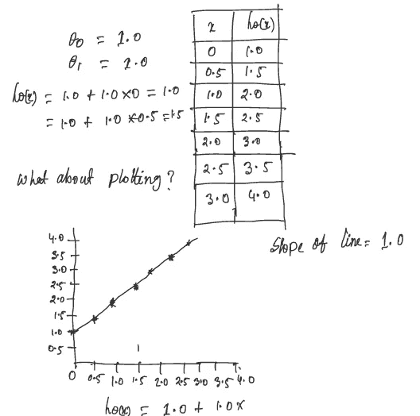
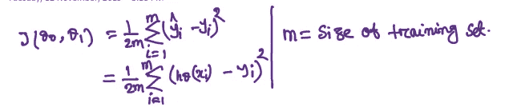
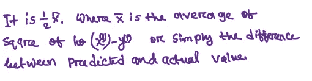
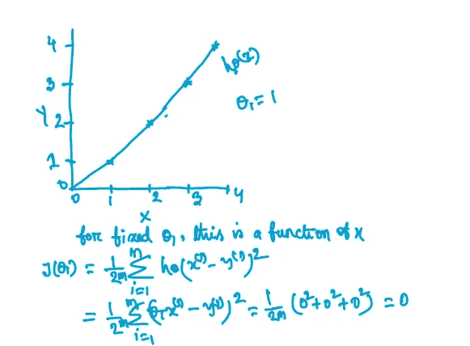
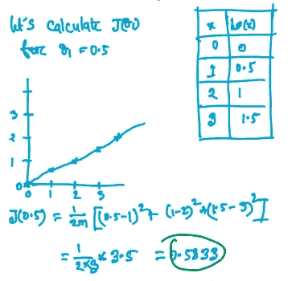
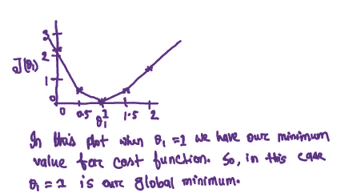

# 理解机器学习中的成本函数

> 原文：<https://towardsdatascience.com/model-representation-and-cost-function-machine-learning-5f126c614948?source=collection_archive---------25----------------------->

## “计算机能够看、听和学习。欢迎来到未来。”戴夫·沃特斯

所以，我已经开始学习 Coursera 上流行的机器学习课程。我想，为什么不分享我正在学习的东西呢？所以，今天我要谈谈机器学习的两个基本话题。

1.  模型表示
2.  价值函数

**模型表示:**

大多数机器学习算法的主要目标是构建模型。我们可以把这个模型称为`hypothesis`。`hypothesis`基本上将`input`映射到`output`。`input`变量指特性，`output`变量指目标。我们将用来学习的数据集称为`training`集。我们的目标是，给定一个训练集，学习一个函数 h : X → Y，使得 h(x)是 Y 的相应值的一个“好的”预测器。

当我们试图预测的目标变量 y 是连续的，比如房子的价格，我们称学习问题为`regression`问题。当 y 只能取少量的离散值时(例如，如果给定居住面积，我们想预测一个住所是房子还是公寓)，我们称之为`classification`问题。

假设通常被提出

这里θ1 和θ2 是参数。

让我们用θ1、θ2 和 x 的随机值的一些例子来形象化我们的假设:

让我们看另一个例子:

创建模型的目标是选择参数或θ值，以使训练数据 x 的 h(x)接近 y。

**成本函数:**

成本函数将帮助我们找出“如何将最佳直线拟合到我们的数据”，即:我们可以通过使用`cost function`来测量我们假设的`accuracy`。用作`cost function`的一个常见功能是`[mean squared error](https://en.wikipedia.org/wiki/Mean_squared_error)`。它测量`predicted value`和`actual value`之间的差异。

> 注:平均值减半(1/2)是为了便于计算梯度下降，因为平方函数的导数项将抵消(1/2)项。

我们想得到最好的线路。当分散的点与直线的平均垂直距离平方最小时，我们将得到最好的直线。让我们看一个例子，其中我们的成本函数将为 0，我们将有最好的可能线:

当θ1 = 1 时，我们得到的斜率为 1，我们的成本函数为 0。

现在让我们假设θ1 = 0.5

我们可以看到，这将我们的成本函数增加到 0.5833

现在我们将绘制更多的 J(θ1)值:

我们可以看到，当θ1 = 1 时，成本函数处于最小值。这是符合逻辑的，因为我们的初始数据是一条斜率为 1 的直线，它穿过我们模型中的每个数据点。

**免责声明**:我只是分享我从吴恩达著名的机器学习课程中学到的东西。在下一篇文章中，我将谈论梯度下降。

***为我最糟糕的事求情(！)笔迹。***