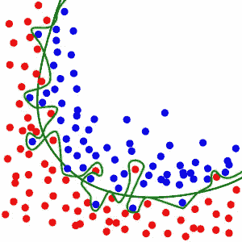
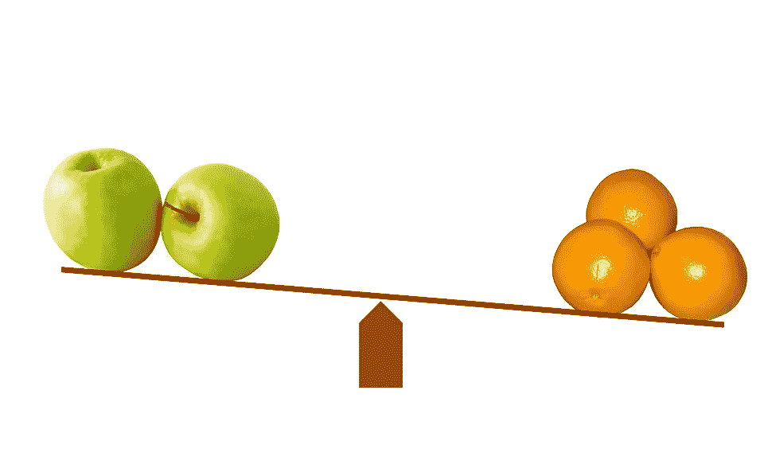
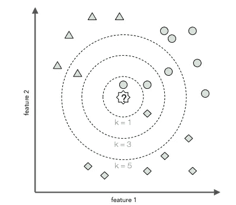
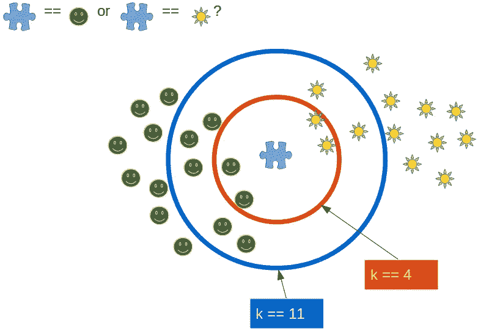
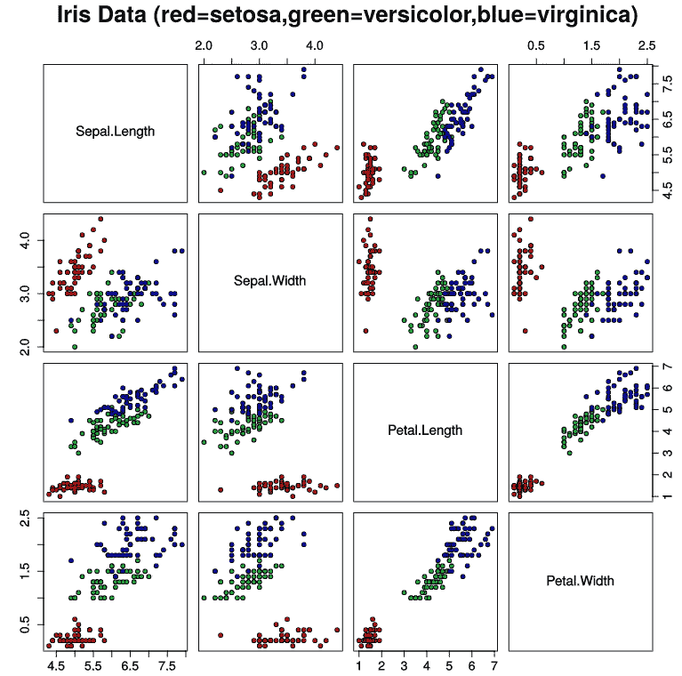
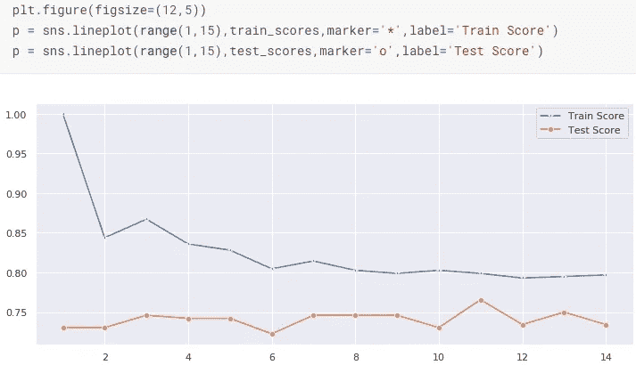

# K 近邻模型的选择、调整和评估

> 原文：<https://towardsdatascience.com/model-selection-tuning-and-evaluation-in-k-nearest-neighbors-6d3024d78745?source=collection_archive---------9----------------------->

It’s a beautiful day in the neighborhood

数据科学生命周期的核心是模型构建。虽然相对不复杂，但一个被称为 K-最近邻或 KNN 的模型是一种展示模型制作过程基础的可靠方法……从选择，到超参数优化，最后是准确度和精确度的评估(然而，对[准确度](https://stats.stackexchange.com/questions/312780/why-is-accuracy-not-the-best-measure-for-assessing-classification-models)的重要性要有所保留)。如果奥卡姆剃刀教会了我们什么，那就是简单不是一件坏事，所以让我们深入了解一种算法，这种算法通常是构建机器学习中其他非常复杂的模型的一个组件。

# 一、型号选择

对于本演练，我已经选择了模型为 KNN。在选择模型时，先做最好的科学家通常会做的事情:查看数据。你有一点还是很多？

最佳的模型选择将在偏差和方差之间有一个良好的平衡，并且理想地将两者都最小化。因为我已经提到了机器学习这个术语，所以重要的是要区分我这里指的不是算法偏差，而是统计偏差。算法偏差是一个非常重要和活跃的讨论话题，但它超出了我的博客文章的范围。统计偏差涉及参数的预期值和真实值之间的差异，方差指的是在对被研究的数据子集(称为训练集)多次重复学习过程后，模型预测的波动程度。

这就把我们带入了关于拟合优度的讨论。在深入了解 KNN 工作原理的细节之前，如果我们查看下图，黑线是一个模型示例，它与 tje 数据非常吻合，可以从红点中识别蓝点。尽管没有画出来，欠拟合模型应该是一条从左上到右下的完美对角线(欠拟合意味着高偏差)。绿线可以说是完美的，它将所有蓝点归类在一起，红点也是如此。然而，它代表了过度拟合的定义，并且不能很好地推广到新的数据(在第三节中对此有更多介绍)。

本质上，偏差和方差合在一起将构成给定模型中可以减少的误差量:

`Reducible Error = Squared Bias + Variance`

无论一个模型能够多么完美地最小化偏差和方差，在我们的熵宇宙中总会存在一定程度的不可避免的误差或噪声。这就是所谓的不可约误差。

在其核心，K-最近邻算法是非常直观的。空间中与两个苹果和三个橘子距离相等的点将如何分类？柑橘打破了平衡，现在我们有四个柑橘。

# **二。模型调整**

通常在建模中，参数和超参数调整都是需要的。区别在于它们是在模型拟合之前(超参数)还是之后(参数)。

KNN 是一个相对简单的分类工具，但它在很多时候也非常有效。据说在大约三分之一的分组案例中**，它是最有效的分类器。三分之一！这个模型可能很小，但也很强大。**

**该算法在各种编程语言中有不同的迭代，但我将在这里讨论 scikit-learn，它是用 Python 编写的。基本算法使用欧几里德距离为测试集中的每一行找到最近的 K(K 是我们的超参数)训练集向量，或“邻居”。多数投票决定分类是什么，如果碰巧出现平局，则决定由碰巧在训练数据中首先列出的邻居做出。**

**对我来说，这是可视化超参数实际作用的最佳算法。**突击测验！**在图中的每个 K 值处，中间的问号将被归类为蓝色圆圈。但是当 K 不断增加时呢？在下面的评论中留下你的答案，有机会赢得最有价值的奖品，*知识*！**

****

**下图提出了一个有趣的问题。显然，当 K 等于 11 时，拼图块就是一个笑脸。但是当 k 是四的时候呢？根据文档，如果两组邻居具有相同的距离但不同的标签，则结果将取决于训练数据的排序。**

****

**What is the optimal K for solving how this piece of the puzzle should be classified?**

**请注意，在算法的不同迭代中，这可能会有所不同。例如，在 R 的 KNN 分类系统中，平局是随机打破的。**

**著名的(读起来:臭名昭著的)Iris 数据集是统计学经典中的经典，它恰当地展示了这种算法工具是如何投入使用的。分析的四个特征的散点图可视化应该清楚地表明，KNN 将能够在四个比较中的三个中容易地区分这三个单独的物种。至少在两个被比较的物种之间，一个特征匹配稍微有点复杂，但是即使在比较萼片长度和萼片宽度的情况下，KNN 也能够以不同程度的成功区分三个物种，这取决于我们将 K 设置为什么。**

****

**如果您想用沙箱保护这里讨论的内容，甚至想将一些方法集成在一起，也可以随时使用它。你可能会在不知不觉中赢得卡格尔比赛！**

**既然我们已经挑选出了模型，并且对最近邻上下文中超参数的含义有了更好的理解，那么我们如何优化 K 呢？学习曲线。**

****

**Seaborn Visualization of a KNN learning curve**

**上图中我们看到了一条学习曲线，它来自一个优秀的 Kaggle 页面，该页面以皮马印第安人的糖尿病流行为背景研究了 KNN。我们可以清楚地看到，测试分数 11 的*最大值*表示算法的最佳值，K = 11。这又回到了我们关于偏差和方差的讨论。第一个门(偏差)太多，你会看到一个学习曲线，表明一个简单的模型:低测试和低训练分数，它们在价值上也非常相似。超过第二个门数(方差),培训和测试分数之间将有显著差异。两者的良好平衡意味着模型既准确又精确。一个模型甚至可以用第四种可能性来描述:既不准确也不精确。在高偏差、高方差的情况下就是这种情况。自己回答:四个类别中哪一个最能描述这种可视化的学习曲线？**

# **三。模型评估**

**在科学中，评估一个模型基本上意味着看它处理新数据的能力。当我们看拟合优度时，这是在一般意义上偶然发现的(记住我们的红点和蓝点)。**

**为了在机器学习模型的背景下评估 K-最近邻，我们需要权衡它的一些优点和缺点。KNN 被用作许多其他更高级算法的构建模块，这种现象我之前简单提到过，被称为集成或混合。您还可以使用 ML 其他领域常见的一些变化来微调算法。**

**无监督的和有监督的 K-最近邻的区别在于它的用途——前者用于聚类，后者用于分类。如果我们谈论的是无监督的 KNN，你可以在一种*蛮力*方法、*球树*、 *KD 树*之间切换，或者甚至让算法本身来确定聚类的最佳方式(*自动*)。我认为这种可定制性是支持 KNN 的一点，因为它允许您灵活地处理大小数据集。除法通常发生在接近 30 的样本数上:低于这个数，粗略地说，一个*蛮力*策略更好。在此之上，基于*树*的方法是可行的。但是，太远了，并且所涉及的时间复杂性不再成立。也就是说，随着 N(样本数量)的上升，KNN 的计算时间呈指数增长，迅速偏离可以被认为有用的东西。**

**这里另一个值得注意的缺点与您想要处理的数据的结构有关，它被称为维数灾难，尽管这种疾病可以通过使用 scikit-learn 的邻域成分分析(简称 NCA)来解决。这也是一种监督(学习)距离度量算法，旨在与使用默认度量(欧几里德距离)相比，提高 KNN 分类的准确性。它源于一种更广泛的算法策略，用于处理被称为主成分分析(PCA)的维度问题。当 NCA 与 K-邻居分类器结合使用时，它是优雅、简单和强大的；没有需要微调的额外参数的复杂性。还有一个巨大的好处是能够处理多类问题，而不增加模型的大小。**

**进一步的改进，如最近质心分类器(这种模型的另一个监督应用)，只能证明这一系列算法是最大似然法的基础。我们正在向越来越先进的领域推进，我建议你参考下面链接的 sk-learn 的文档来深入研究。**

****引用作品:****

**[糖尿病分步分类-KNN-详细](https://www.kaggle.com/shrutimechlearn/step-by-step-diabetes-classification-knn-detailed)，Shruti Iyyer。**

**[机器学习中的模型评估、模型选择、算法选择](https://sebastianraschka.com/pdf/manuscripts/model-eval.pdf)，塞巴斯蒂安·拉什卡。**

**[型号选择的“简短”介绍](/a-short-introduction-to-model-selection-bb1bb9c73376)，David schnleber。**

**K-最近邻完全指南及其在 Python 和 R 中的应用。**

**[Scikit-Learn 的 K 近邻算法](https://scikit-learn.org/stable/modules/neighbors.html#nearest-neighbor-algorithms)**

**[http://www . arc 2020 . eu/counting-apple-or-oranges-climate-change-stats-vs-food-systems-thinking/](http://www.arc2020.eu/counting-apples-or-oranges-climate-change-stats-vs-food-systems-thinking/)**

**[https://www . python-course . eu/k _ nearest _ neighbor _ classifier . PHP](https://www.python-course.eu/k_nearest_neighbor_classifier.php)**

**[https://ionds . com/WP-content/uploads/2016/10/over fitting-image-model-case-300 x300 . png](https://ionds.com/wp-content/uploads/2016/10/Overfitting-image-model-case-300x300.png)**