# 流体力学遇上数据科学

> 原文：<https://towardsdatascience.com/model-selection-yacht-hydrodynamics-data-set-ec0f8591e8e8?source=collection_archive---------27----------------------->

## 流体力学、数据科学、统计学

## UCI 游艇水动力学知识库的统计分析

Yacht Hydrodynamics

一切都始于一个浪漫的故事，当流体力学遇到统计学……他们一见钟情……(呃)……

好吧，别走开，让我们进入我们的科学。本研究的主要目的是实践关于模型选择的统计分析，并将其应用于实际问题。我正在使用的数据集来自 [**UCI 机器学习库**](http://archive.ics.uci.edu/ml/datasets/yacht+hydrodynamics) **。**这个数据集在机器学习研究中非常有名，它已经存在很长时间了。您可以很容易地从这个存储库中找到许多关于数据集的研究论文。我将介绍我的近似模型，以及我用来评估不同模型的方法。我在这篇文章中只使用了统计方法，所以没有花哨的机器学习或深度学习术语。此外，感谢队友们的帮助:**拉宾杜兰庞斯**、**辛西娅兴**、**韦德梁**、**陈子鸿**(校对用)。( [**Github Repo**](https://github.com/DanielTongAwesome/Yacht_Hydrodynamics_Model/tree/master) 针对本项目)

在建模之前，让我们检查一下数据集:

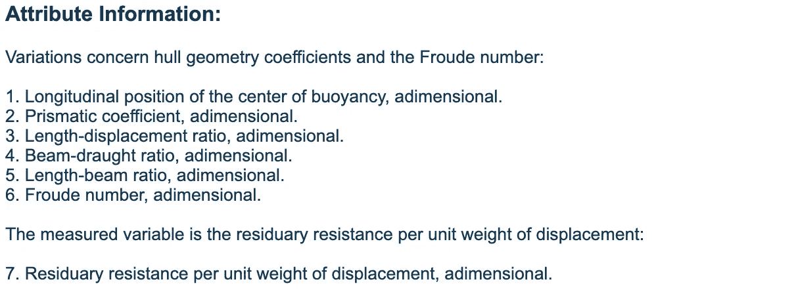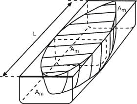

**Left-**Dataset Information **Right-**Prismatic Coefficient of A Ship(Variable 2)

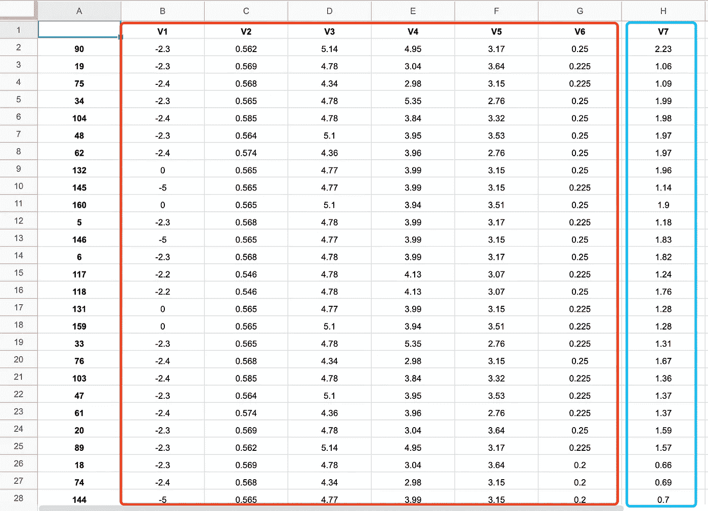

Dataset Examples

因此，我们需要使用前 6 个变量来预测 V7 的值，V7 代表每单位重量位移的剩余阻力。

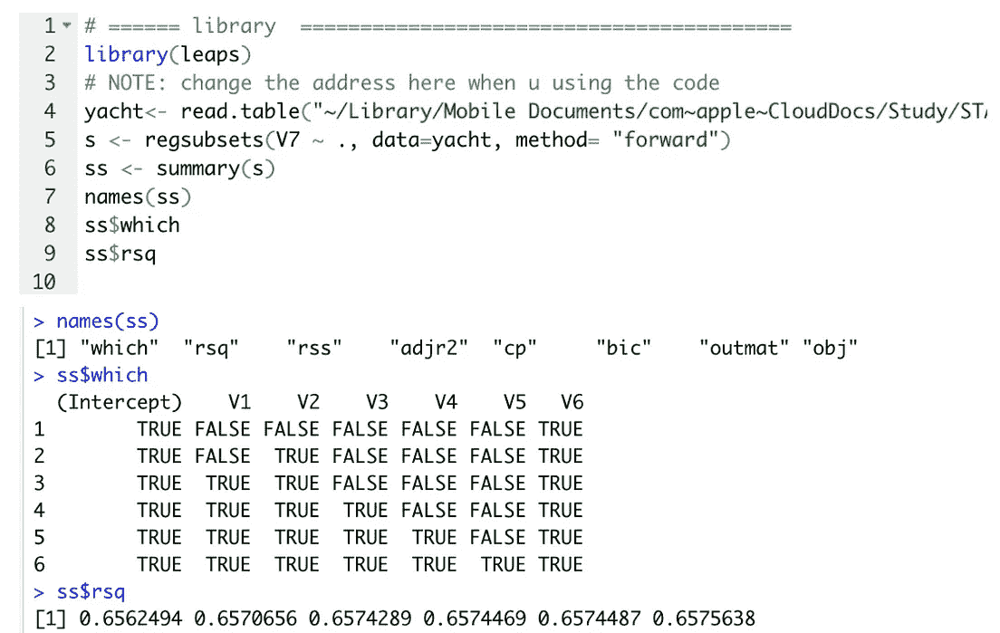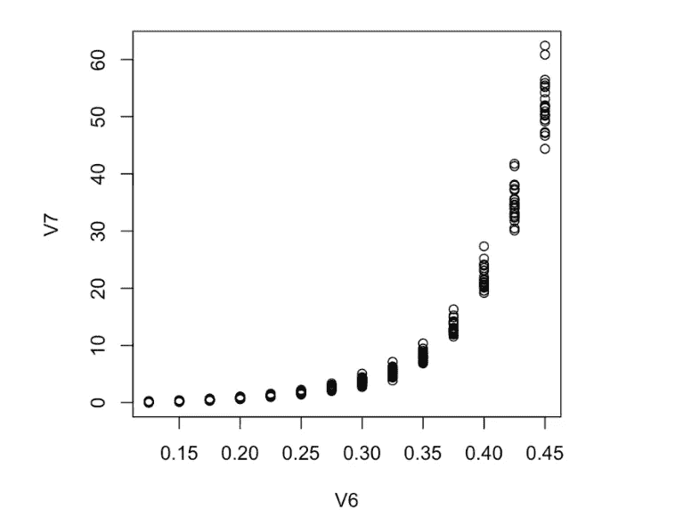

**Left** — Import Library and Implement Forward Selection **Right** — V6 against V7 (exponential growth)

**首先**，将库导入 R studio 并使用正向选择对各个变量的影响力进行排名，你很容易发现 V6 排名第一，然后是 V2。

然后下一步，让我们绘制 V7 和 V6 的对比图。输出图显示 V6 和 V7 之间的正相关**(指数增长)**。

**在我们进行回归**之前，我先陈述一下我的假设:零假设是我的回归方程中每个系数都等于 0；换句话说，V1 到 V6 对我们的响应变量 V7 没有影响。

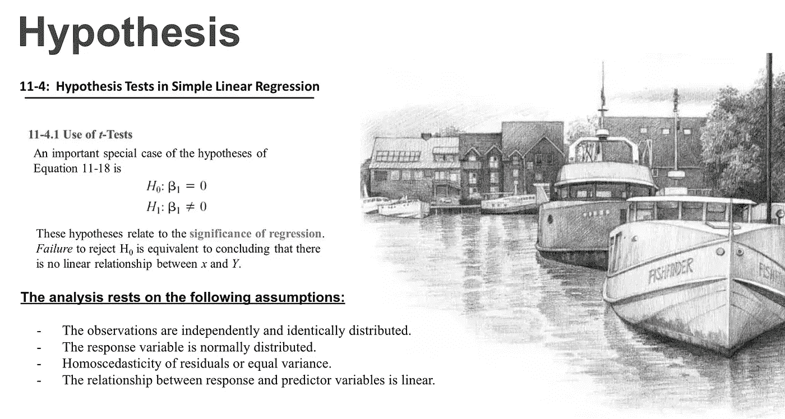

Null Hypothesis — Beta 0 to 7 all equal to 0

**第一款测试车型(1 号车型)，V7 ~ V6 + V2 :**

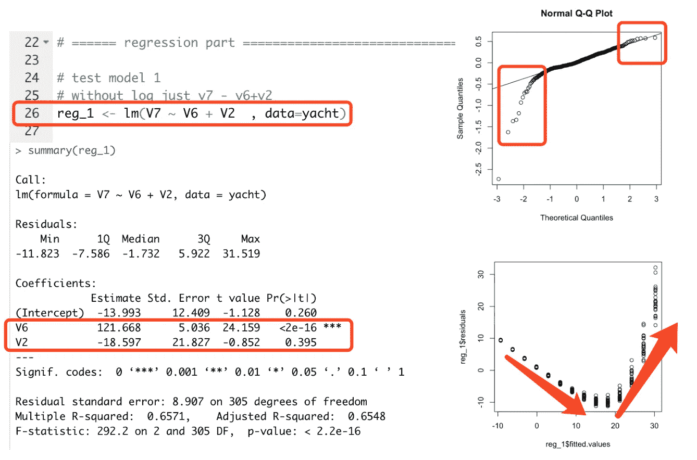

**Model #1**: V7 = b0 + b1*V6 + b2*V2

从汇总输出中，你可以发现 V2 系数的 **Pr( > |t|)大约比 0.025 或 0.05 大 0.395，这意味着**不显著**，所以我们不能拒绝我们的零假设。但是 V6 的系数非常重要，所以我们应该**保留 V6** 和**从我们的预测模型中移除 V2** 。此外，正常的 Q-Q 图显示数据集不完全符合我们的 Q-Q 线，残差图显示一种模式，这是不好的。也许我们需要**对 y** 应用对数变换，在 y 大的时候降低 y 的值。因此，我们使用 log(V7)作为新的响应变量。**

**第二个模型的结果—从模型#1 推导而来:**

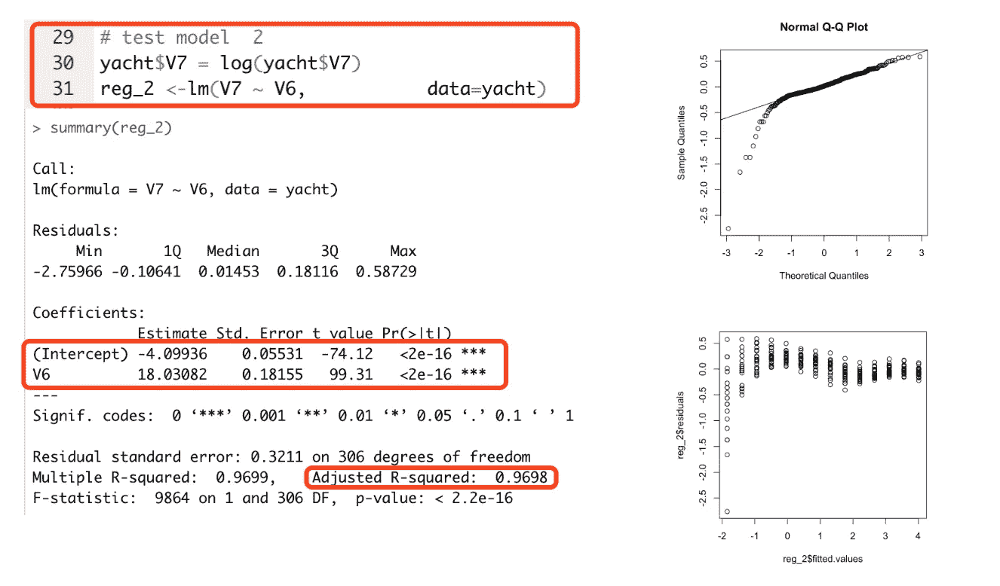

**Model #2**: log(V7) = b0 + b1*V6

**哇！我们在正确的轨道上！**

*   残差图并不完美，但看起来比模型#1 更好
*   所有变量都很重要
*   Adj R 从 0.65 到 0.9698 提升了不少

从残差图中，我有一种感觉，多项式的阶数越高，图就越好看。所以让我试试我的 3 号模型。

**第三个模型的结果——从模型#2 推导而来:**

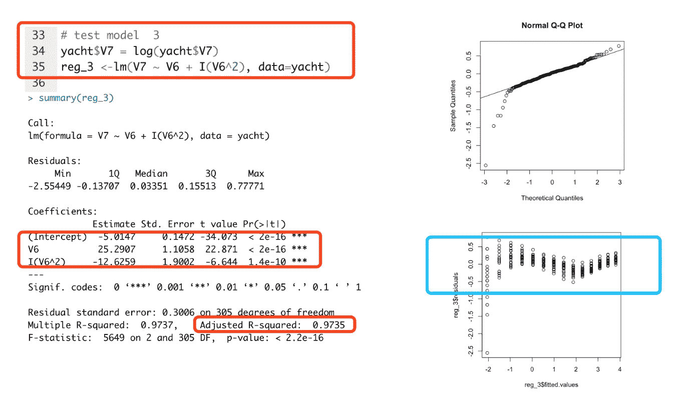

**Model #3**: log(V7) = b0 + b1*V6 + b2*(V6)²

Emmmm…..残差图仍然有一个模式

*   这个模型比 2 号模型好
*   添加更多术语肯定会增加 R ，考虑改用 AIC 或 Adj R

从汇总输出来看，V⁶之前的系数也很重要，所以让我尝试更高的多项式阶。

**第四个模型的结果—从模型#3 推导而来:**

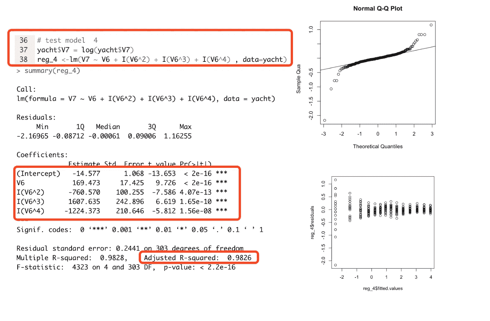

**Model #4**: log(V7) = b0 + b1*V6 + b2*(V6)² + b3*(V6)³ + b4*(V6)⁴

**爽！**这是迄今为止**最好的**型号，波浪外观的残留剧情已经被成功取消。型号#4 的 Adj R 约为 0.9826。

**结论:**

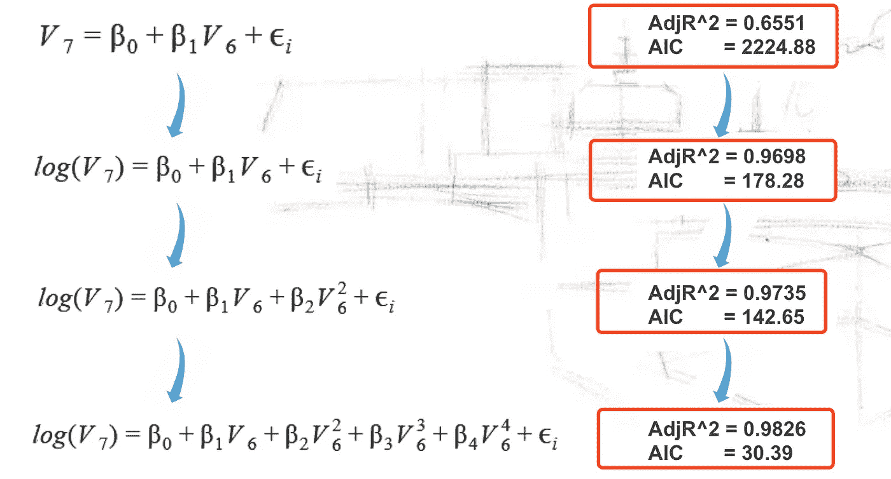

**Conclusion:** from model #1 to model #4

从上到下我们可以发现，AIC **从最初的 2224 降到了 30。**

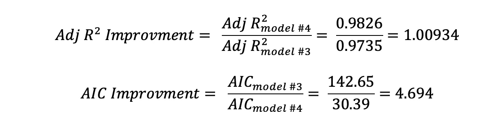

**Adj R²** and **AIC** Improvement Calculation

**关于模型#4** 的一个有趣的事情，没有提供 AIC 值，Adj R 只增加了 **0.9%** 。有些人可能认为从模型#3 到模型#4 是不必要的，因为改进是如此之小，但增加一项会增加复杂性。然而，重要的是 4 号模型的 AIC 比 3 号模型的 AIC 小得多。

**选型提示:**

1.  如果每个型号的 Adj R 相似，请考虑使用 AIC 或 Cp，它们可能会有显著差异。
2.  使用**正向选择**或**反向选择**可以帮助计算出重要变量。

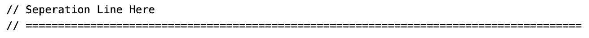

> 感谢您停留在此页面！
> 
> 如果你也对**计算机架构、**数据科学、**文学、**感兴趣，欢迎你来看看！