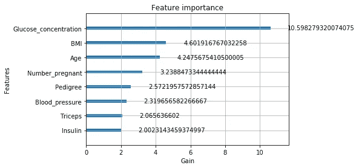

# 使用 XGBoost 进行模型调整和特征工程

> 原文：<https://towardsdatascience.com/model-tuning-feature-engineering-using-xgboost-ef819bccc82e?source=collection_archive---------18----------------------->

在这篇文章中，我将讨论数据预处理技术，这是我之前为初学者发布的系列文章 [Tensorflow](https://medium.com/themlblog) 的延伸。

构建人工智能或机器学习模型的第一步是预处理数据，以确保模型的正确表示。这个阶段是最关键的部分，最终决定了模型的健壮性和生产力。一个机器学习模型作为一个行业级应用的产品发布时，必须灌输一些核心功能:

1.  概括:模型应该能够跨应用程序对有噪声的数据执行优化和准确的操作，即输入数据的变化仍然应该产生有效的输出。
2.  正则化:在给定有偏数据的情况下，模型应该产生准确的输出，即行业级应用中的数据仓库在简单训练的基础上产生不稳定的模型，因为数据分布混乱，要么欠拟合，要么过拟合。
3.  可再现性:模型在两个不同的时间阶段或应用中对相同的输入产生相同的输出。

在本文中，我们将介绍两个预处理任务，即超参数优化和特征工程，这是两个最重要的模型调整方法，可以提高模型的性能，使其符合行业标准。

本文中使用的 python 库称为 XGBoost，是一个跨 Kaggle、Topcoder 和 Tunedit 等平台的常用渐变增强库。使用 XGBoost 的优势来自于这样一个事实，即该库通过创建弱分类器树来实现调整模型的正则化方法。(它与 scikit-learn 和 Tensorflow 兼容，这是目前使用最广泛的两个机器学习库。)

本文中使用的数据集是由 10 个参数组成的 [pima-indian-diabetes](https://www.kaggle.com/uciml/pima-indians-diabetes-database) 数据集。我们从导入必要的库开始

下一步是导入数据集并准备我们的训练和测试样本。此外，我们还创建了两个新变量，称为*变量 _ 参数和静态 _ 参数，*，它们将分别存储要调整的参数和保持不变的参数。

下一步是将这两个变量传递到我们的网格搜索函数中，并使模型符合我们的数据。

这种简单的实现可以扩展到更大的应用程序。fit()方法。

我们将使用的下一种方法叫做特征工程或分析。本文不包括自动化特征工程工具，如 FeatureTools 等。而是简单地使用 XGBoost 深入分析数据集特性的意义和重要性。

我们使用相同的数据集，但这次我们创建了一个名为 *dtrain* 的变量，它的类型为“xgboost.core.DMatrix ”,这是 xgboost 培训中使用的多维矩阵表示。

XGBoost 有一个非常好的属性叫做。get_dump()，它提供了关于创建的每棵树的详细信息，以及树在某个参数上的划分方式。我们使用这个属性来标出所有参数的重要性，并对它们进行比较。记得在你的工作目录*中创建一个名为 *featmap.txt* 的空文本文件。*

我们获得的图显示了参数-葡萄糖浓度的显著高值，这使其成为最重要的特征，因此可以进一步研究。

本文末尾提供了完整的代码。点击横幅！

要更深入地了解超参数调优是如何工作的，以及如何利用 sklearn 之外的库，请查看 neptune.ai 博客提供的这篇文章[。](https://neptune.ai/blog/hyperparameter-tuning-in-python-a-complete-guide-2020)

本文到此为止。在下一篇文章中，我将讨论数据可视化以及如何创建专业报告。干杯！

