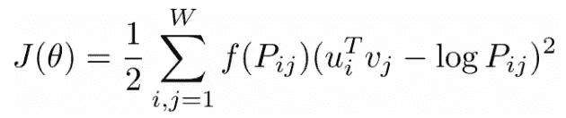
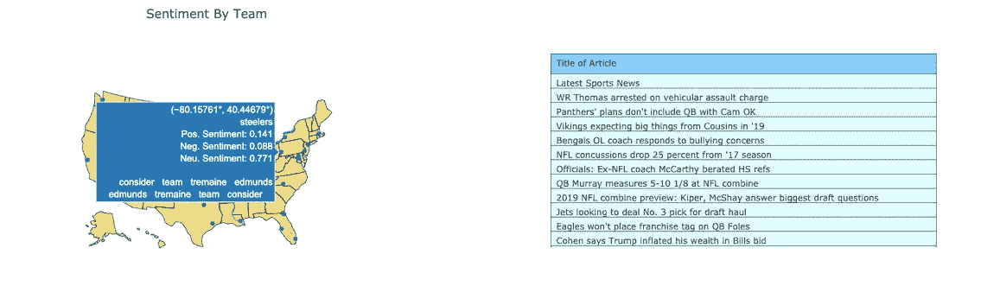
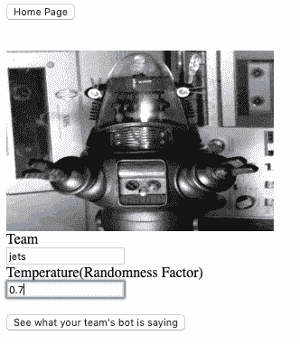

# GPT-2 生成的 NFL 子编辑评论

> 原文：<https://towardsdatascience.com/modeling-and-generating-nfl-subreddit-comments-99c8cfc35bf2?source=collection_archive---------24----------------------->

几周前，一个朋友告诉我关于 pushshift reddit 评论数据库的事情，这是一个包罗万象的 reddit 评论数据集，可以追溯到 2005 年。作为一个狂热的体育迷，我对研究不同美国运动队的子评论活动的差异有着浓厚的兴趣。

# **项目范围**

随着 NFL 赛季的快速临近，我专注于 NFL 球队的 subreddits，因为我认为在这个激动人心的时刻，球迷们会特别感兴趣。特别是，我想制作一个交互式地图，让球迷可以随时查看情绪和话题，并查看在此期间发布的与他们球队相关的新闻故事。我还开始为每支 NFL 球队独立训练 32 个 GPT-2 模型，这些模型会产生 subreddit 风格的评论。该项目的 GPT-2 部分的目标只是看看该模型是否可以复制代表给定团队粉丝群的刻板态度和文化的幽默镜头。

# 数据采集

[pushshift 评论数据库](https://files.pushshift.io/reddit/comments/)是一个不可思议的资源，但是每个月解压缩的 reddit 评论可能高达 100GB JSON 文件，所以我写了一个小的[脚本](https://github.com/sethweiland/reddit_nfl_comments/blob/master/download_clean.py)来帮助解析每个解压缩的文件。该脚本一次下载一个月的评论，使用“grep”只保留所需子编辑的评论，将评论写入 mongoDB，删除 100GB 的 JSON 文件，然后下载下个月的 reddit 评论。如果您决定使用该数据集，希望它可以成为访问该数据集的良好起点。

有了数据集，我就可以开始主题建模、情感分析和 GPT 2 文本生成了。

# **情感分析**

我使用了一个预先训练好的手套情绪分析器，因为它非常强大，简化了项目的情绪分析部分。GloVe 是给定语料库中所有单词的共现矩阵，它通过“最小化单词向量 I 和 j 的点积之差与 I 和 j 共现次数的对数之差的平方”(Trailhead)来训练其单词向量。参见下面的目标函数:



函数 f(Pij)对非常常见和不常见的单词进行加权，以确保非常常见的单词不会对单词向量产生不适当的影响。在将我的评论数据按团队和月份分类后，多亏了 GloVe，很容易就能获得情绪。

# 主题建模

在尝试了几种不同的主题建模技术之后，包括 LDA、LSA 和 NMF。最后，我选择了 LDA，因为它始终如一地提供最好的话题，通过了测试。在将一长串停用词传递给模型后，该模型持续产生与给定时间段内 NFL 中值得注意的事件一致的主题。

## 情感和主题地图



对于给定的一个月，球迷可以悬停在他们球队体育场的位置上，并查看该月的话题和情绪以及该月发表的 ESPN NFL 文章(见上文)。在 flask 应用程序中生成如上图所示的 plotly 地图的代码:

```
import plotly.graph_objs as go
import plotly
import pandas as pd
import jsondef create_map(df):
    data = [
        go.Scattergeo(
            lon = df['long'],
            lat = df['lat'],           
            mode="markers" ,           
            locationmode="USA-states",           
            hovertext = df['text']
        )
    ]
    graphJSON = json.dumps(data,cls=plotly.utils.PlotlyJSONEncoder)
    return graphJSON
```

中间步骤是在 flask route 函数中将 JSON 对象传递给 html，使用:

```
return flask.render_template("map.html",plot=graphJSON)
```

# **GPT 新协议评论生成**

Max Woolf 为 OpenAI 的 GPT-2 的 Tensorflow 实现制作了一个真正[好的包装器。他的软件包可以选择使用 117、124 或 355 百万参数模型。这个包使得定制您自己的语言生成模型变得非常容易:](https://github.com/minimaxir/gpt-2-simple)

```
import gpt_2_simple as gpt2model_name = "124M"
gpt2.download_gpt2(model_name=model_name)   # model is saved into current directory under /models/124M/

sess = gpt2.start_tf_sess()
gpt2.finetune(sess,
              'corpus.file_extension',
              model_name=model_name,
              steps=1000)   # steps is max number of training steps

gpt2.generate(sess)
```

注意，无论您在哪个目录中训练模块，都会有一个新形成的 checkpoint/run1 文件夹。如果您想要定制训练几个模型，将参数 run_name 插入到 gpt2.finetune()步骤中，如下所示:

```
import gpt_2_simple as gpt2sess = gpt2.start_tf_sess()
gpt2.finetune(sess,
             'corpus.file_extension',
              model_name=model_name, 
              run_name="your_custom_run_name",             
              steps=1000)
```

在设置此变量并训练模型之后，权重/模型将位于名为/check point/your _ custom _ run _ name/的新目录中。如果您将一列 CSV 传递给 finetune 函数，gpt-2-simple 模块将为您预处理文本，并且几乎不需要准备数据。如果您对自定义语料库的文本生成感兴趣，我强烈推荐使用 gpt-2-simple。

# 网站

我用 flask 做了这个网站，并在 AWS 的 [uWSGI 服务器上托管。当有人选择“看看机器人在说什么”时，他们可以输入他们团队的名字，并设置温度，以控制波尔兹曼分布的随机性。温度越高，产生的输出越随机，越不像训练集。](https://www.digitalocean.com/community/tutorials/how-to-serve-flask-applications-with-uswgi-and-nginx-on-ubuntu-18-04)



用户可以输入一个团队的名称(只能做 22 个左右，因为我没有在每个团队中训练)，并设置所需的温度(建议 0.7-0.9)。请随意点击查看网站[。](http://ec2-3-14-250-144.us-east-2.compute.amazonaws.com:5000)

# 结论

这个项目在主题建模、情感分析和文本生成方面是一个很好的练习。我训练的一些初始团队进行了更多的迭代，所以如果你最终尝试了这个应用程序，这个模型对 Jets，Bears 和其他几个团队有更好的输出。gpt-2-simple 包是一个非常有趣的包，希望上面的启动代码对你有所帮助。感谢阅读！


## 来源

Trailhead，[https://trail head . sales force . com/en/content/learn/modules/glove-and-word-vectors-for-sensation-analysis/use-glove-for-natural-language-processing](https://trailhead.salesforce.com/en/content/learn/modules/glove-and-word-vectors-for-sentiment-analysis/use-glove-for-natural-language-processing)

GPT-2-简单，【https://github.com/minimaxir/gpt-2-simple 

项目源代码，【https://github.com/sethweiland/reddit_nfl_comments 