# BiDAF 中的建模和输出层——带 Minions 的图解指南

> 原文：<https://towardsdatascience.com/modeling-and-output-layers-in-bidaf-an-illustrated-guide-with-minions-f2e101a10d83?source=collection_archive---------14----------------------->

## BiDAF 的权威指南——第 4 部分，共 4 部分

## BiDAF 是一个流行的机器学习模型，用于问答任务。本文借助一些可爱的小喽啰来解释 BiDAF 的建模层。

Source: [Unsplash](https://unsplash.com/photos/ltR0yi_YwFI)

他的文章是一系列四篇文章中的最后一篇，旨在说明 [**【双向注意力流】**](https://arxiv.org/abs/1611.01603)**一种流行的问答机器学习模型(Q & A)的工作原理。**

**概括地说，BiDAF 是一个*封闭领域，抽取的* Q & A 模型。这意味着为了能够回答一个**查询**，BiDAF 需要查阅一个附带的文本，该文本包含回答查询所需的信息。这个附带的文本被称为**上下文。** BiDAF 的工作方式是提取上下文中最能回答查询的子串——这就是我们所说的对查询的**回答** 。我有意将“查询”、“上下文”和“回答”这几个词大写，以表明我是在用它们的专业技术能力来使用它们。**

**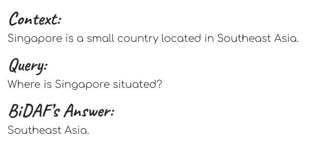**

**An example of Context, Query and Answer**

**对前面三篇文章的简要总结如下:**

*   **[本系列的第 1 部分](https://medium.com/@meraldo.antonio/the-definitive-guide-to-bi-directional-attention-flow-d0e96e9e666b)提供了 BiDAF 的高级概述。**
*   **第 2 部分解释了 BiDAF 如何使用 3 种嵌入算法来获得上下文和查询中单词的向量表示。**
*   **[第 3 部分](/the-definitive-guide-to-bidaf-part-3-attention-92352bbdcb07)探讨了 BiDAF 的注意力机制，它结合了来自上下文和查询的信息。**

**前述注意步骤的输出是一个名为 **G** 的巨型矩阵。 **G** 是一个 **8d** -by- **T** 矩阵，它对上下文单词的查询感知表示进行编码。G 是建模层的输入，这将是本文的重点。**

# **我们一直在做什么？G 实际上代表什么？*喽啰来救援了！***

**好的，我知道在过去的三篇文章中我们已经经历了很多步骤。人们很容易迷失在无数的符号和方程式中，尤其是考虑到 BiDAF 论文中的符号选择并不是那么“用户友好”我的意思是，你还记得 **H，u，ĥ**和**ũ**分别代表什么吗？**

**因此，现在让我们后退一步，试着得到我们到目前为止所做的所有这些矩阵运算背后的直觉。**

> ***实际上，前面所有的步骤都可以分解为两个步骤集合:* ***嵌入步骤*** *和* ***注意步骤*** *。如上所述，所有这些步骤的结果是一个名为 **G** 的 **8d** -by- **T** 矩阵。***

**下面可以看到一个 **G** 的例子。 **G** 的每一列都是一个单词在上下文中的**8d**by-**1**向量表示。**

**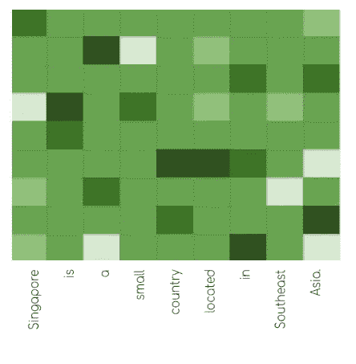**

**An example of **G**. The length of the matrix, **T**, equals the number of words in the Context (9 in this example). Its height is **8d**; **d** is a number that we preset in the word embedding and character embedding steps.**

**现在让我们玩一个小游戏，(希望)能帮助你理解之前文章中所有的数学术语。具体来说，**让我们把上下文中的单词想象成一群有序的奴才。****

**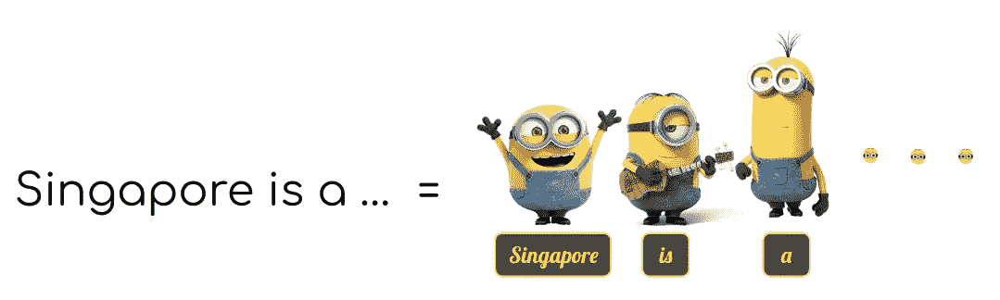**

**Think of our Context as a bunch of Minions, with each Context word corresponding to one Minion**

**我们的每个小喽啰都有一个大脑，可以储存一些信息。现在，我们的奴才们的大脑已经很拥挤了。**每个 Minion 的当前脑内容相当于 Minion 所代表的上下文单词的 8d 乘 1 列向量。在这里，我展示了“新加坡”奴才的大脑扫描图:****

**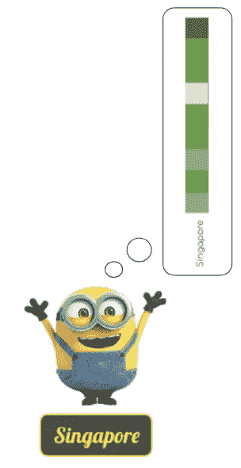**

**奴才们的脑子可不是一直这么满的！事实上，当它们出现时，它们的大脑几乎是空的。现在让我们回到过去，想想那些奴才们为了获得他们当前的知识状态而经历了什么样的“课程”。**

**小黄人上的前两节课是“单词嵌入”和“字符嵌入”在这些课程中，奴才们了解了自己的身份。“单词嵌入”课的老师 GloVe 教授教小喽啰们关于他们身份的基本信息。另一方面，“角色嵌入”课程是一门解剖学课程，在这门课程中，小喽啰们通过反复扫描来了解自己的身体结构。**

****

**Minions in the “Character Embedding” class**

**这是这两节课后“新加坡”奴才的脑部扫描。**

****

**The “Singapore” Minion understands his identity after attending the “Word Embedding” and “Character Embedding” lessons**

**紧接着，小喽啰们继续前进，参加了“情境嵌入”课程。本课是一堂会话课，在课上，小喽啰们必须通过一款名为 bi-LS 的 messenger 应用程序相互交流。bi-LS 协助的 convo 允许奴才们了解彼此的身份**——这是他们在前两节课中学到的。很整洁，是吧？****

********

****Two Minions having a fun conversation through bi-LS™, sharing information about themselves. Source: Giphy****

****我在“情境嵌入”课结束后，对“新加坡”的小跟班进行了另一次核磁共振扫描。如你所见，现在我们的小家伙知道更多的东西了！****

********

****Now “Singapore” knows both his and his neighbors’ identities!****

****我们的奴才们正在愉快地学习，突然一个人闯进了他们的学校😱原来他的名字是**提问先生**，他是一名记者。他在这里:****

********

****The inquisitive Mr. Query. He has an urgent question **—***”Where is Singapore situated”* — and he knows some of our Minions hold relevant information for this question.****

****Query 先生急需为他正在写的一篇文章收集一些信息。具体来说，他想知道"*新加坡位于哪里【Query 先生知道*我们的一些奴才*在大脑中保存着这些信息。*****

****我们的奴才们虽然乐于助人，但还是想帮 Query 先生一把。为此，他们需要选择几名团队成员与 Query 先生会面，并提供他所寻求的信息。**这一群拥有查询先生相关信息并将被派遣给他的爪牙被称为回答帮。******

****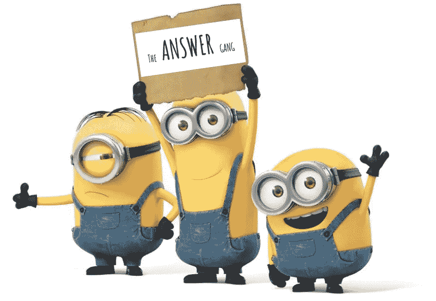****

****The Answer Gang, which collectively holds the answer to Mr. Query’s question. Only relevant Minions can join the Answer Gang!****

******现在，我们的跟班们有一项任务要做——他们需要集体决定谁应该、谁不应该加入回答帮。**他们这样做时需要小心！如果他们从答案帮中漏掉了太多本应包括在内的爪牙，查询先生就不会得到他需要的所有信息。这种情况被称为*低回忆*，Query 先生对此深恶痛绝。****

****另一方面，如果太多不必要的爪牙加入回答帮，查询先生就会被多余的信息淹没。他称这种情况为低精度，他也不喜欢这样！众所周知，Query 先生有一些愤怒管理问题👺所以给查询先生提供适量的信息对我们的下属最有利。****

*****那么喽啰们怎么知道他们中的哪一个应该加入答题帮呢？*****

****解决这个问题的方法是组织几次会面，统称为“关注”在这些会议中，每个仆人都可以单独与查询先生交谈，了解他的需求。换句话说，注意力会议允许下属衡量他们对提问者的问题的重要性。****

****这是“新加坡”奴才在注意力会议上闲逛时大脑的核磁共振扫描。这相当于我展示的第一张大脑扫描图像。****

****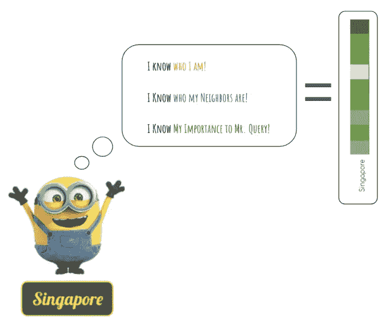****

****Singapore’s current brain content. He knows quite a bit— but he is still missing one thing!****

****正如我们所看到的，我们的奴才们的大脑现在已经很满了。以奴才们目前的知识水平，他们现在可以开始选择答案帮的成员了吗？不，不完全是！他们仍然缺少一条关键信息。我们的每个爪牙都知道他对查询先生的重要性。然而，在做出这个重要的决定之前，他们还需要意识到对方对 Query 先生的重要性。****

****正如你可能已经猜到的，这意味着奴才们必须第二次互相交谈！现在你知道这个对话是通过 bi-LS 应用**完成的。******

********

****The Minions during the **modeling step** meeting. Here, they talk to each other through bi-LS™ and share their relative importance to Mr. Query. Source: [Free PNG Logo](https://www.freepnglogos.com/images/minions-9701.html)****

******这种由 bi-LS 促成的对话也被称为“建模步骤”,是我们当前文章的重点。**现在让我们详细了解这一步骤！****

# ******第十步。建模层******

****好吧，让我们暂时离开我们的奴才，回到符号和方程上来，好吗？没有*那么*复杂，我保证！****

****建模层相对简单。它由两层双 LSTM 组成。如上所述，建模层的输入是**G。**第一个双 LSTM 层将 **G** 转换为 **2d** -by- **T** 矩阵，称为 **M1** 。****

******M1** 然后作为第二个双 LSTM 层的输入，第二个双层将其转换为另一个 **2d** -by- **T** 矩阵，称为 **M2** 。****

****从 **G** 到 **M1** 和 **M2** 的形成如下图所示。****

****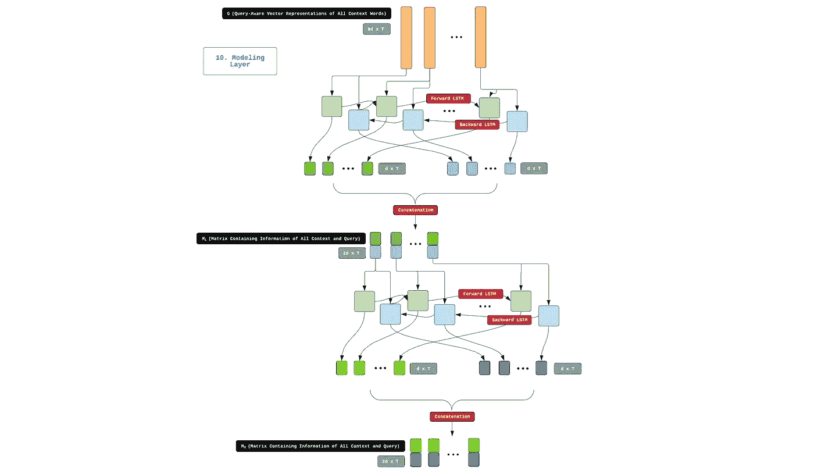****

****Step 10\. In the modeling layer, **G** is passed through two bi-LSTM layers to form **M1** and **M2******

******M1** 和 **M2** 是上下文单词的另一种矩阵表示。 **M1** 和 **M2** 与之前的语境词表示的区别在于 **M1** 和 **M2** 在其中嵌入了关于整个语境段落以及查询的信息。****

****用奴才的话来说，这意味着我们的奴才现在拥有了所有他们需要的信息来决定谁应该加入回答帮。****

********

****The “Singapore” guy now has all he needs to decide if he should join the Answer Gang.****

# ******第十一步。输出层******

****好了，现在我们到了终曲！只要再走一步，我们就完成了！****

****对于上下文中的每个单词，我们都有两个数值向量来编码单词与查询的相关性。太棒了。我们需要做的最后一件事是**将这些数字向量转换成两个概率值，这样我们就可以比较所有上下文单词的查询相关性**。这正是输出层所做的。****

****在输出层中， **M1** 和 **M2** 先与 **G** 纵向串接形成**G**； **M1** 和**克**； **M2** 。两者都[**G**； **M1** 和**克**； **M2** 的尺寸为 **10d** -by- **T** 。****

****然后，我们通过以下步骤获得 **p1** ，即整个上下文中开始索引的概率分布:****

****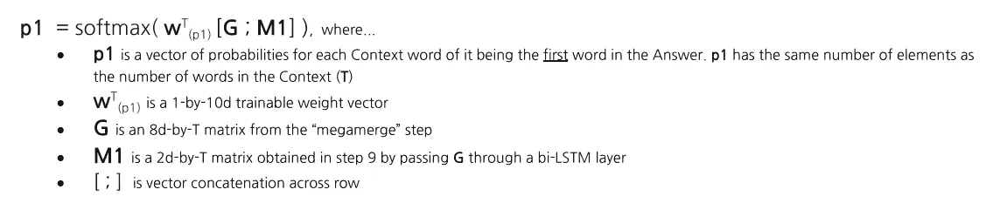****

****类似地，我们通过以下步骤获得最终指数的概率分布 **p2** :****

****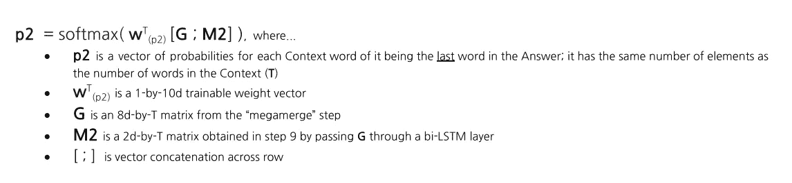****

****获取 **p1** 和 **p2** 的步骤如下图所示:****

****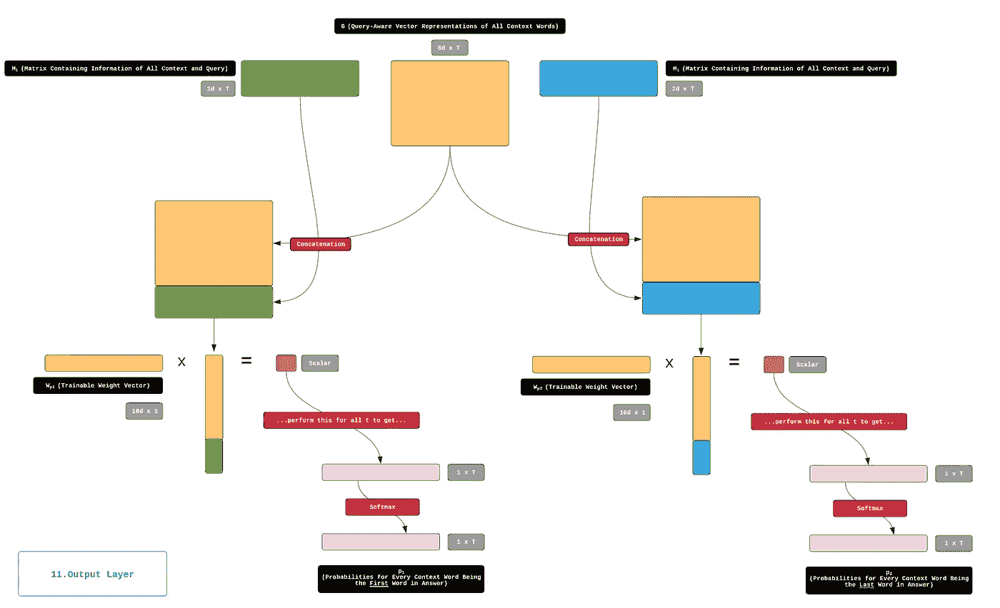****

****Step 11\. The output layer, which converts **M1** and **M2** to two vector of probabilities, **p1** and **p2**.****

******p1** 和 **p2** 然后被用来寻找最佳答案跨度。最佳答案跨度只是具有最高*跨度分数*的上下文的子串。依次，跨度分数是该跨度中第一个单词的 **p1** 分数和该跨度中最后一个单词的 **p2** 分数的简单乘积。然后，我们返回具有最高 span 分数的 span 作为我们的答案。****

****举个例子就能说明这一点。如您所知，我们目前正在处理以下查询/上下文对:****

*   ******语境** : *“新加坡是位于东南亚的一个小国。”* ( **T** = 9)****
*   ******提问** : *“新加坡位于哪里？”* ( **J** = 4)****

****在通过 BiDAF 运行这个查询/上下文对之后，我们获得了两个概率向量— **p1** 和 **p2。******

****上下文中的每个单词都与一个 **p1** 值和一个 **p2** 值相关联。 **p1** 值表示单词成为答案范围开始单词的概率。以下是我们示例中的 **p1** 值:****

********

****我们看到模型认为我们的答案跨度最有可能的起始词是“东南”****

******p2** 值表示单词成为答案范围的最后一个单词的概率。以下是我们示例中的 **p2** 值:****

****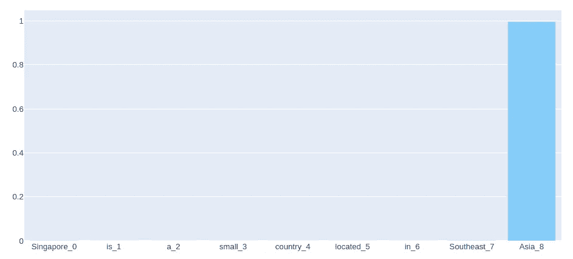****

****我们看到我们的模型非常确定，几乎 100%确定，我们的答案跨度最有可能的结尾词是“亚洲”****

****如果在原始上下文中，具有最高 **p1** 的单词在具有最高 **p2** 的单词之前出现*，那么我们已经有了我们的最佳答案范围——它将简单地以前者开始，以后者结束。这就是我们例子中的情况。因此，模型返回的答案将简单地是“东南亚”*****

****就这样，女士们先生们——经过 11 个漫长的步骤，我们终于得到了我们问题的答案！****

****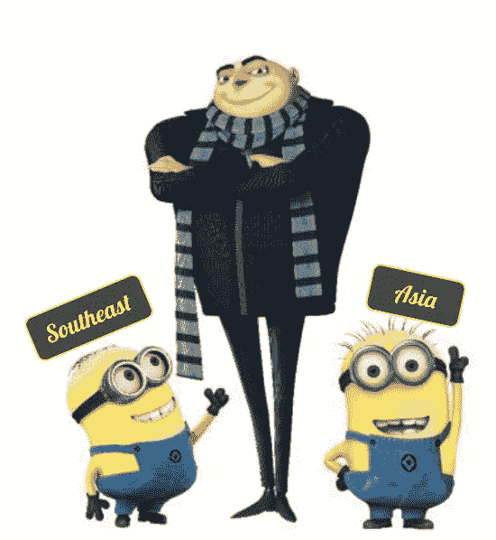****

****Here is Mr. Query with “Southeast” and “Asia”, both of whom have been selected to join the Answer Gang. It turns out that the information provided by “Southeast” and “Asia” is just what Mr. Query needs! Mr. Query is happy🎊****

****好吧，在我们结束这个系列之前有一个警告。假设具有最高 **p1** 的上下文单词在具有最高 **p2** 的上下文单词之后出现*，我们还有一点工作要做。在这种情况下，我们需要生成*所有*可能的答案范围，并计算每个答案的范围分数。以下是我们的查询/上下文对的可能答案范围的一些示例:*****

*   ******可能答案跨度:“**新加坡”；**跨度分数** : 0.0000031****
*   ******可能答案跨度:“**新加波是”；**跨度分数** : 0.00000006****
*   ******可能答案跨度:“**新加坡是 a”；**跨度分数** : 0.0000000026****
*   ******可能答案跨度:“**新加坡是个小”；**跨度分数** : 0.0000316****

****然后，我们将具有最高跨度分数的跨度作为我们的答案。****

****这就是它 BiDAF 中每一步的详细说明，从开始到结束(撒上健康剂量的 Minion-joy)。我希望这个系列能帮助你理解这个迷人的 NLP 模型！****

********

****Source: [Giphy](https://giphy.com/gifs/minions-iUOzkJmvnFfqM)****

****如果你对这篇文章有任何问题/评论，或者想联系我，请随时通过 LinkedIn 或 gmail DOT com 发送电子邮件至 meraldo.antonio。****

# ****词汇表****

*   ******上下文:**包含查询答案的查询附带文本。****
*   ******查询:**模型应该给出答案的问题。****
*   ******答案:**包含可以回答查询的信息的上下文的子字符串。这个子串将由模型提取出来。****
*   ******跨度得分:**一个答案跨度中第一个单词的 **p1 值**与该答案跨度中最后一个单词的 **p2 值**的乘积。****
*   ******T** :上下文中的字数。****
*   ******J** :查询的字数。****
*   ******G** :一个大的、 **8d** -by- **T** 矩阵，包含查询感知的上下文表示。G 是建模层的输入。****
*   ******M1:** 将 **G** 通过双 LSTM 得到的一个 **2d** -by- **T** 矩阵。 **M1** 包含上下文单词的向量表示，其具有关于整个上下文段落以及查询的信息。****
*   ******M2:** 一个 **2d** -by- **T** 矩阵，通过一个 bi-LSTM 传递 **M1** 得到。 **M2** ，就像 **M1 一样，**包含上下文单词的向量表示，其具有关于整个上下文段落以及查询的信息。****
*   ******p1:** 一个长度为 **T** 的概率向量。每个上下文单词都有自己的 **p1 值。**该 **p1 值**表示该单词成为答案区间中**第一个单词**的概率。****
*   ******p2:** 一个长度为 **T** 的概率向量。每个上下文单词都有自己的 **p2 值。**该 **p2 值**表示该单词成为答案区间中最后一个单词**单词**的概率。****

# ****参考****

****[1] [机器理解的双向注意力流(闵俊 Seo *et。艾尔*，2017)](https://arxiv.org/abs/1611.01603)****

****如果你对这篇文章有任何意见或者想联系我，请随时通过 LinkedIn 给我发一个联系方式。此外，如果你能通过我的推荐链接支持我成为一名中级会员，我将非常感激。作为一名会员，你可以阅读我所有关于数据科学和个人发展的文章，并可以完全访问所有媒体上的故事。****